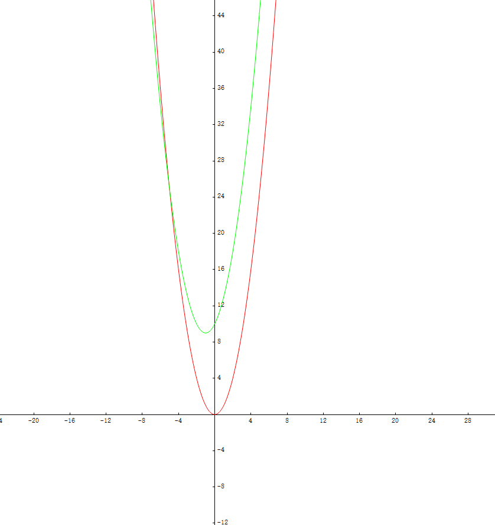
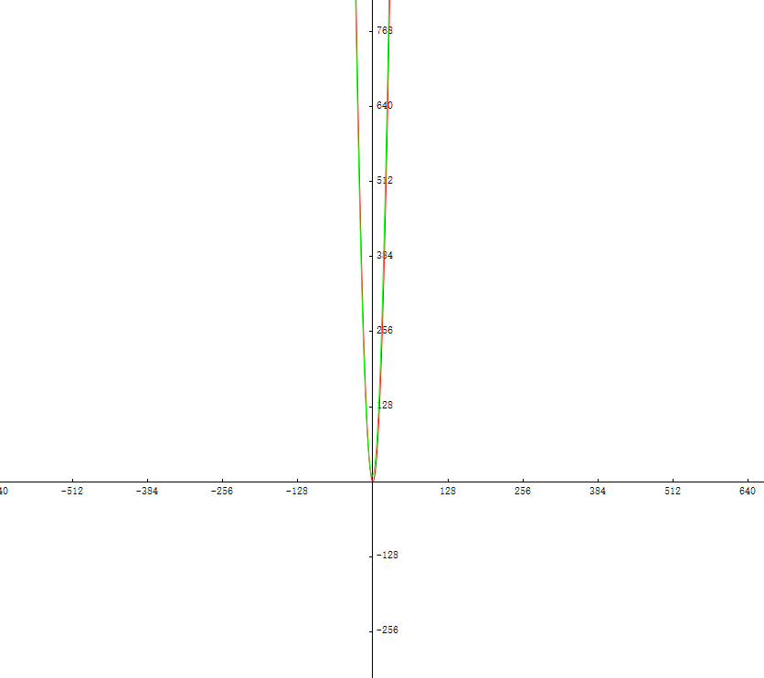
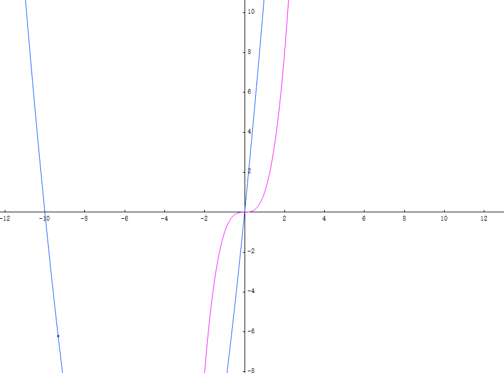
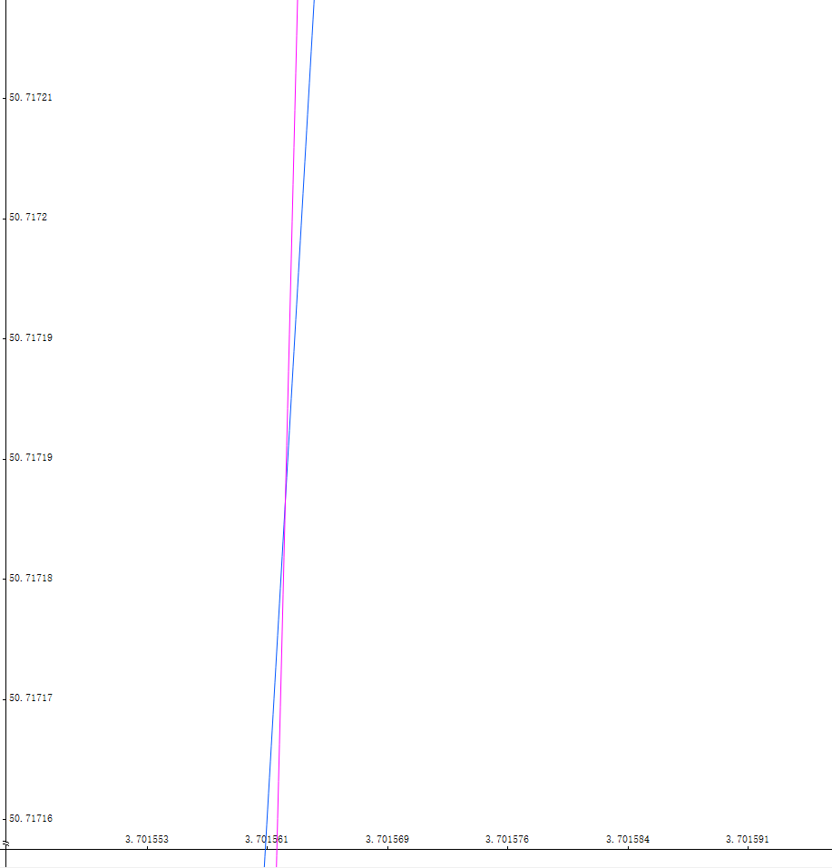
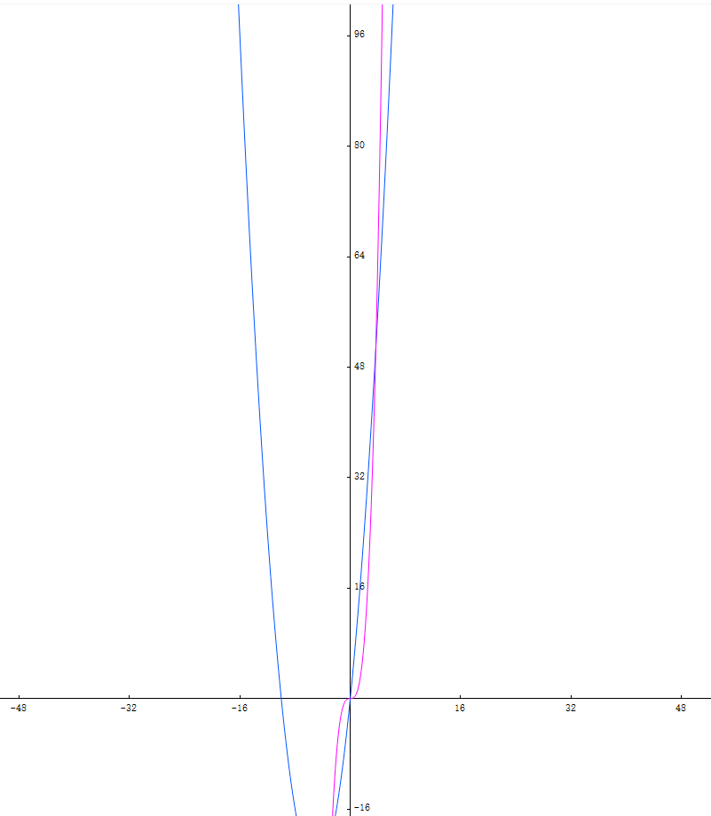

# 常数时间的操作

## 常数时间操作的的定义

常数时间操作就是指计算机中的某一个操作花费的时间, 不会随着数量级的增大而增大.

最常见的就是`+` `-` `*` `/` `%`  `=`, 还有所有的位运算以及逻辑运算都是常数时间的操作.

举个例子:

`1+1` 和 `2147483646+1` 两个操作所花费的时间是一样的.

**在分析算法复杂度时, 一定分析到常数时间的操作才能正确的分析出复杂度**

# 算法复杂度 O

## 时间复杂度的定义

在程序中通常使用Big O, 来表示一个算法的时间复杂度和空间复杂度, 对于任意一个 数量级为N的 `O()` , 其中N都趋于无限大

我们将常数时间的操作表示为 `O(1)` 

现在拿冒泡排序举个例子

```java
public class BubbleSort {
    public static void bubbleSort(int[] arr){
        //在这一层循环中, 循环次数会随着数量级N增长,执行N次(N-1就不要杠精了,可以忽略后面会讲到), 可以表示为O(N)
        for (int i = 0; i < arr.length-1; i++) {
            //条件j > i, 而i每次都会自增1,第一次会循环(N-1)次, 第二次(N-2)次 ...... 直到循环1次结束
            //所以这层循环实际上就是(N-1)+(N-2)+(N-3)+(N-4).... + 1  
            //最后就是一个等差数列, 利用等差数列求和公式, an^2+bn+c , a,b,c为常数
            for (int j = arr.length-1; j > i; j--) {
                //无论N为多大, 这个if只执行一次, 所有他是O(1)操作
                if(arr[j] < arr[j-1]) SortUtil.swap(arr,j,j-1);
            }
        }
    }

    public static void main(String[] args) {
        int[] arr = {8,7,6,5,4,3};
        bubbleSort(arr);
        System.out.println(Arrays.toString(arr));
    }
}
```

**在使用BIg O 表示算法复杂度时, 我们会忽略常数项, 和低次项**

第二个循环执行次数是 `an^2+bn+c` 我们忽略地次项 `bn` 和 常数项 `c, a`, 最后得到 `n^2`

## 为什么可以忽略常数项和低次项

这里拿 `x^2` `x^+2x`举例

红色是x^2

绿色是x^2+2x+10


可以发现在数量级较小的时候两个函数之间还有差异, 但如果数量级开始增大



在数量级逐渐增大, 两个函数之间的差异就会变得很小了



再举个例子

蓝色是x^2+10x

紫色是x^3



在数量级达到一定时, 函数`x^3` (紫色)的增长会超过 `x^2+10x` (蓝色)

**这时我们说函数 `x^3` 的渐进增长是大于 函数 `x^2+10x` 的**





**最后可以得到bubbleSort这个函数的时间复杂度就是 `O(N^2)`**

## 看似特殊的时间复杂度

我们要找到一个数组中的, 是否存在某个值

最简单的实现就是遍历数组:

```java
public static int findNum(int[] arr, int target){
    int ans = -1;//赋值操作为常数时间操作, 即是O(1)
    if(arr.length < 1) return ans;
    for(int i = 0; i < arr.length; i++){
        if(arr[i] == target) {
            ans = i;
            break;
        }
    }
    return ans;
}
```

在这个算法中他的时间复杂度非常简单 外层循环遍历了N次, 里面的if执行了一次O(1)

所以findNum的时间复杂就是 `O(N)` ?

你可能已经发现, if语句中判断了, 如果找到目标就会直接停止循环, 有可能没有执行N次, 这样不就无法估计该算法的时间复杂度了

实际上我们所说的 **BIg O表示的就是最差时间复杂度**, 因此我们不考虑中途是否找到, 默认就是整个循环执行完成, 才找到信息.

## 空间复杂度同上类推