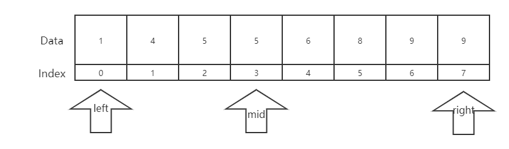
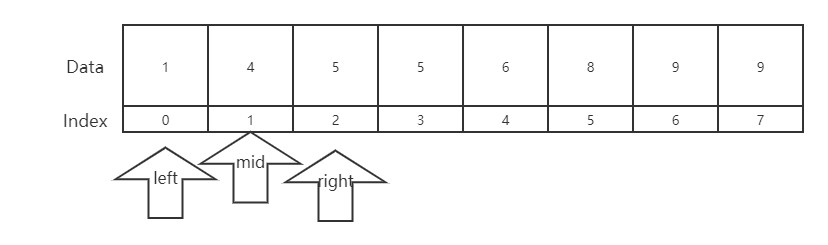
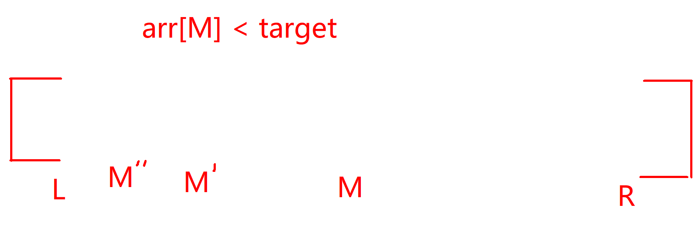
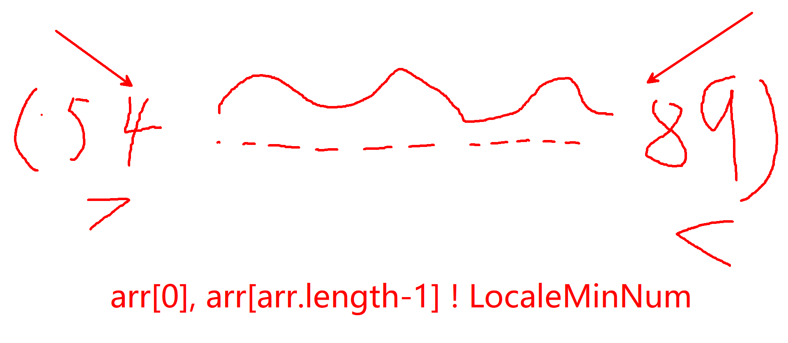

# 二分法

### 1. 现在需要找到一个有序数组中, 某个数是否存在, 返回它的下标

我们可以使用最常见的遍历数组的方式:

```java
public int findNum(int[] arr, int target){
    int ans = -1;
    if(arr.length < 1) return ans;
    for(int i = 0; i < arr.length; i++){
        if(arr[i] == target) {
            ans = i;
            break;
        }
    }
    return ans;
}
```

这个算法的时间复杂度是 O(N)

是否有优化空间 ?

题目中给出的是一个有序数组, 因此其实可以将算法优化, 这里就要使用二分法

我们可以先找到一个数组中间的数, 判断是否是我们要找的数

1. 如果>要找的数就去找右边的区域,  从右边区域中找到中间数, 重复同样的操作
2. 如果<要找的数就去找左边的区域,  从左边区域中找到中间数, 重复同样的操作
3. ==则直接返回

**假设要找的数为4**

第一次Mid为3



arr[3] 为 5, 5 > 4所以在左边区域继续找



arr[1] 为 4, 4 == 4返回要找的结果

#### 1.1程序实现

```java
public int findNum(int[] arr, int target){
    if(arr.length < 1) return -1;
    //定义左指针
    int left = 0;
    //定义右指针
    int right = arr.length-1;
    //只要中间还有数就继续
    while(left <= right){
        //这里相当于int mid = (left + right)/2
        //但是left+right有可能溢出int范围
        //所以所以写成left + (right - left) / 2;
        //这样一来只要left和right是合理的数据, 计算mid时就不会溢出了
        int mid = left + ((right - left) >> 1);
        //中间值小于目标值, 到右边去找
        if(arr[mid] < target){
            left = mid + 1;
        //中间值小于目标值, 到右边去找
        }else if(arr[mid] > target) {
            right = mid - 1;
        //相等直接返回
        }else {
            return mid;
        }
    }
    //没有找到返回-1
    return -1;
}
```

假设arr[M] < target



第一次找到M

第二次找到`M'`

第三次找到`M''`

....

每次M都是折半然后比较,  因此最后时间复杂度是O(logn) , 在算法复杂度中log默认就是以2为底

### 2.在一个有序数组中, 找出<=某个数最右侧的位置

```java
public int findNum(int[] arr, int target){
    int left = 0;
    int right = arr.length-1;
    int mid;
    int index = -1;
    while(left <= right){
        mid = left+((right-left)>>1);
        //在两个值相等时, 将index记录为mid, 将right指针移动到mid左边, 
        if(arr[mid] == target) {
            index = mid;
            right = mid - 1;
        }
        //如果小于target, 但是题目<=target 最右边的位置, 因此还要向右边继续查询
        else if(arr[mid] < target) {
            index = mid;
            left = mid + 1;
        }
        else {
            right = mid - 1;
        }
    }
    return index;
}
```

### 3.局部最小值 有一个无序数组且相邻两数不相等, 找到局部最小值(小于两边数的数), 返回它的位置

> 数组两边临近值只需要分别小于右边或左边的数就是局部最小值

首先如果arr.length == 1只有一个数直接返回

当arr[0] < arr[arr.length-1]时返回0

当arr[arr.length-2] > arr[arr.length-1]时返回arr.length-1



如果前面的条件都没有命中

那么现在可以确定

1. 数组第一个位置上的数不是局部最小值  +
2. 数组最后一个位置上的数不是局部最小值

如图中所示, **开头的趋势是下降**, 而**结尾的趋势是上升**, 题目中又告诉我们 **数组相邻两数不相等!!!**

**数组相邻两数不相等!!!**  因此无论在数组中间如何变化, 一定至少有一个点让变化趋势变成了上升趋势, 而趋势变化的那个点就是我们要找的局部最小值

```java
public int findLocaleMinNum(int[] arr){
    if(arr.length == 1) return arr[0];
    if(arr[0] < arr[arr.length-1]) return arr[0];
    if(arr[arr.length-2] > arr[arr.length-1]) return arr[arr.length];
    int mid = -1;
    int left = 0;
    int right = arr.length-1;
    while(left <= right){
        mid = left + ((right - left) >> 1);
        //中间值大于左边的值, 说明左半边必有局部最小值
        if(arr[mid] > arr[mid-1]){
            right = mid - 1;
        //中间值大于右边的值, 说明右半边必有局部最小值
        }else if(arr[mid] > arr[mid+1]){
            left = mid + 1;
        //中间值为局部最小值
        }else {
            return mid;
        }
    }
    return mid;
}
```


