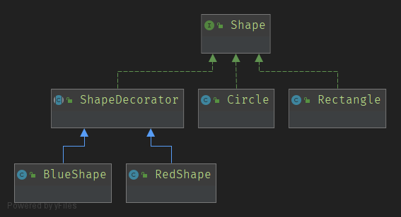

# Decorator

> 装饰器模式一般是为了扩展类而诞生的, 类只能单继承, 并且如果关系复杂, 继承会越来越复杂
>
> 因此引入装饰器, 装饰器与需要装饰的类, 实现同一接口, 通过添加装饰器的子类, 在子类中添加装饰操作
>
> 装饰器拥有一个顶级接口属性, 当需要装饰对象是, 只需要把需要装饰的对象传到该接口, 然后再在子类中进行详细操作即可

```java
interface Shape {
    void draw();
}

class Circle implements Shape{
    @Override
    public void draw() {
        System.out.println("draw circle");
    }
}

class Rectangle implements Shape{
    @Override
    public void draw() {
        System.out.println("draw rectangle");
    }
}

abstract class ShapeDecorator implements Shape{
    protected Shape shape;

    public ShapeDecorator() {
    }

    public ShapeDecorator(Shape shape) {
        this.shape = shape;
    }

    @Override
    public void draw() {
        shape.draw();
    }
}

class BlueShape extends ShapeDecorator{
    public BlueShape(Shape shape) {
        super(shape);
    }

    @Override
    public void draw() {
        setColorBlue();
        shape.draw();
    }

    private void setColorBlue(){
        System.out.println("set color to blue");
    }
}

class RedShape extends ShapeDecorator{
    public RedShape(Shape shape) {
        super(shape);
    }

    @Override
    public void draw() {
        setColorRed();
        shape.draw();
    }

    private void setColorRed(){
        System.out.println("set color to red");
    }
}
```



```java
class Main {
    public static void main(String[] args) {
        Circle circle = new Circle();
        new BlueShape(new RedShape(circle)).draw();
    }
}
```

