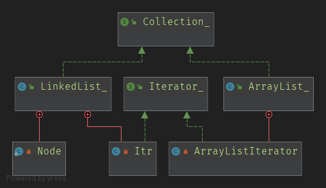

# Iterator

> 迭代器模式用来遍历容器集合, 为各种容器定义统一的API



```java
public interface Collection_<E> {
    void add(E e);
    int size();
    Iterator_<E> iterator();
}
```

```java
public interface Iterator_<E> {
    boolean hashNext();
    E next();
}
```

```java
public class LinkedList_<E> implements Collection_<E>{
    private Node<E> first;

    private Node<E> last;

    private int size;

    public LinkedList_() {
    }

    public void add(E e){
        linkLast(e);
    }

    public void linkFirst(E e){
        Node<E> f = first;
        Node<E> newNode = new Node<E>(null, e, f);
        first = newNode;
        if(f == null){
            last = newNode;
        }else {
            f.prev = newNode;
        }
        size++;
    }

    public void linkLast(E e){
        Node<E> l = last;
        Node<E> newNode = new Node<E>(l, e, null);
        last = newNode;
        if(l == null){
            first = newNode;
        }else {
            l.next = newNode;
        }
        size++;
    }

    @Override
    public int size() {
        return size;
    }

    private static class Node<E>{
        E item;
        Node<E> prev;
        Node<E> next;

        public Node(Node<E> prev, E item, Node<E> next) {
            this.prev = prev;
            this.item = item;
            this.next = next;
        }
    }

    private class Itr implements Iterator_<E> {

        private Node<E> lastReturned;
        private Node<E> next = first;
        private int nextIndex;

        @Override
        public boolean hashNext() {
            return nextIndex < size;
        }

        @Override
        public E next() {
            lastReturned = next;
            next = next.next;
            nextIndex++;
            return lastReturned.item;
        }
    }

    @Override
    public Iterator_<E> iterator() {
        return new Itr();
    }
}
```


```java
public class ArrayList_<T> implements Collection_<T>{
    private Object[] elements;

    private int index;

    private int size;

    public ArrayList_() {
        elements = new Object[10];
    }

    public ArrayList_(int capacity){
        elements = new Object[capacity];
    }

    public void add(T t){
        if(index == elements.length){
            Object[] newElements = new Object[elements.length<<1];
            System.arraycopy(elements, 0, newElements, 0, elements.length);
            elements = newElements;
        }
        elements[index++] = t;
        size++;
    }

    public int size(){
        return size;
    }

    private class ArrayListIterator implements Iterator_<T>{

        private int curIndex;

        @Override
        public boolean hashNext() {
            return curIndex < index;
        }

        @Override
        public T next() {
            return (T) elements[curIndex++];
        }
    }

    @Override
    public Iterator_<T> iterator() {
        return new ArrayListIterator();
    }
}
```

```java
public class Main {
    public static void main(String[] args) {
        ArrayList_<Integer> list = new ArrayList_<>();
        list.add(1);
        list.add(2);
        list.add(3);
        Iterator_<Integer> it = list.iterator();
        while(it.hashNext()){
            System.out.println(it.next());
        }

        LinkedList_<Integer> linkList = new LinkedList_<>();
        linkList.add(3);
        linkList.add(2);
        linkList.add(1);
        Iterator_<Integer> it2 = linkList.iterator();
        while(it2.hashNext()){
            System.out.println(it2.next());
        }
    }
}
```