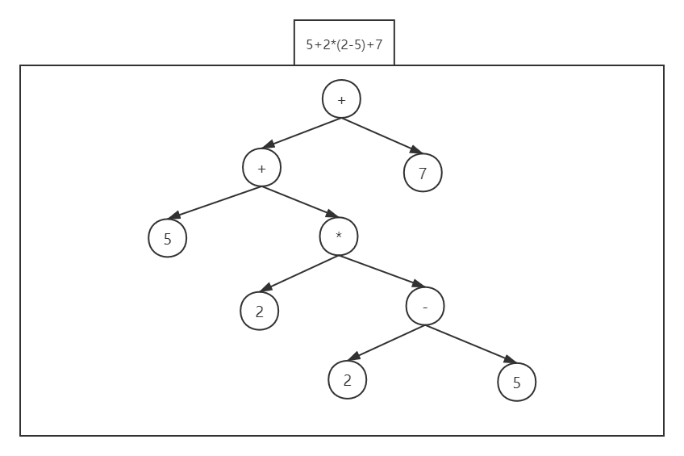
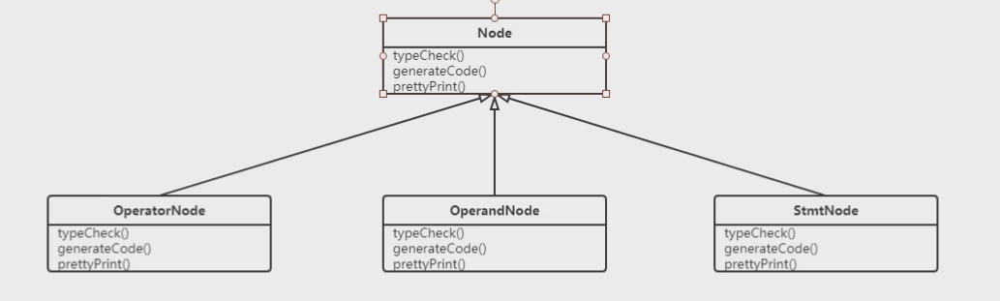
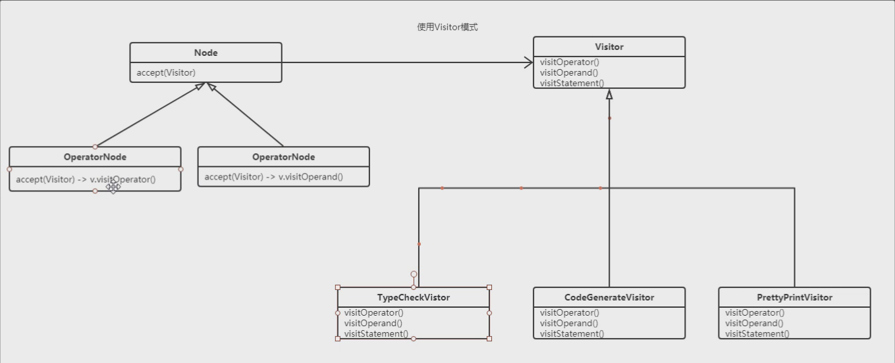

# Visitor

> 访问者模式, 主要应用于在不改变定义好的内部结构的情况下, 实现不同的业务(类似于Strategy的应用), 根据不同的访问者实现不同的效果

## Computer不同Visitor打折

```java
//computer组件接口
public abstract class ComputerPart {
    abstract void accept(Visitor v);

    abstract double getPrice();
}
```

```java
public interface Visitor {
    void visitCpu(CPU cpu);
    void visitMemory(Memory memory);
    void visitBoard(Board board);
}
```

```java
public class DefaultVisitor implements Visitor {
    double totalPrice;

    @Override
    public void visitCpu(CPU cpu) {
        totalPrice+=cpu.getPrice()*.9;
    }

    @Override
    public void visitMemory(Memory memory) {
        totalPrice+=memory.getPrice()*.9;
    }

    @Override
    public void visitBoard(Board board) {
        totalPrice+=board.getPrice()*.85;
    }
}
```

```java
public class Computer {
    ComputerPart cpu = new CPU();
    ComputerPart memory = new Memory();
    ComputerPart board = new Board();
    Double totalPrice = .0;

    public void accept(Visitor v){
        cpu.accept(v);
        memory.accept(v);
        board.accept(v);
    }
}
```

```java
class CPU extends ComputerPart{
    @Override
    double getPrice() {
        return 500;
    }

    @Override
    void accept(Visitor v) {
        v.visitCpu(this);
    }
}

class Board extends ComputerPart{

    @Override
    void accept(Visitor v) {
        v.visitBoard(this);
    }

    @Override
    double getPrice() {
        return 400;
    }
}

class Memory extends ComputerPart{
    @Override
    void accept(Visitor v) {
        v.visitMemory(this);
    }

    @Override
    double getPrice() {
        return 200;
    }
}
```

## Visitor在编译器中的应用

> Visitor模式在编译器中的应用最多
>
> 在编译器制作中, 通常会有将程序语法解析为AST(Abstract Syntax Tree)抽象语法树, 这些抽象语法树节点, 对应程序语法的不同结构
>
> 例如 `+` `- ` `*` `/` `=`
>
> 利用Visitor模式不需要再每个节点中都添加检查语法的方法, 只需要让节点accept(Visitor v)
>
> 具体的执行交给Visitor的实现类完成后



> 直接在Node中定义方法, 难以维护, 每个Node中都要定义check



> 使用Visitor后Node只需要accept(Visitor v)
>
> 具体实现交给Visitor的实现类去完成, 不同的Visitor实现类, 类似不同的Strategy

