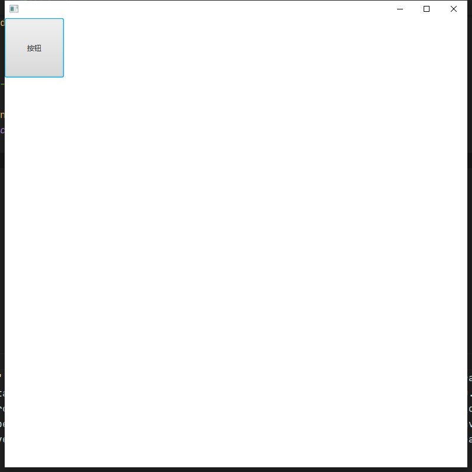

# Maven构建JavaFX应用

## pom.xml

```xml
<?xml version="1.0" encoding="UTF-8"?>
<project xmlns="http://maven.apache.org/POM/4.0.0"
         xmlns:xsi="http://www.w3.org/2001/XMLSchema-instance"
         xsi:schemaLocation="http://maven.apache.org/POM/4.0.0 http://maven.apache.org/xsd/maven-4.0.0.xsd">
    <modelVersion>4.0.0</modelVersion>

    <groupId>org.example</groupId>
    <artifactId>FxLearn</artifactId>
    <version>1.0-SNAPSHOT</version>

    <properties>
        <!--指定编译所用的Java版本-->
        <maven.compiler.source>11</maven.compiler.source>
        <maven.compiler.target>11</maven.compiler.target>
    </properties>

    <dependencies>
        <!--openjfx依赖(不包含FXML)-->
        <dependency>
            <groupId>org.openjfx</groupId>
            <artifactId>javafx-controls</artifactId>
            <version>15.0.1</version>
        </dependency>
    </dependencies>

    <build>
        <!--jar包名称-->
        <finalName>JavaFx</finalName>
        <plugins>
            <plugin>
                <!--管理jar包插件-->
                <groupId>org.apache.maven.plugins</groupId>
                <artifactId>maven-shade-plugin</artifactId>
                <version>3.2.0</version>
                <executions>
                    <execution>
                        <phase>package</phase>
                        <goals>
                            <goal>shade</goal>
                        </goals>
                        <configuration>
                            <transformers>
                                <transformer implementation="org.apache.maven.plugins.shade.resource.ManifestResourceTransformer">
                                    <!--设置你的Main方法类-->
                                    <!--注意JavaFX程序在java8以后,不能直接指定为Application类,需要额外创建一个类用来启动程序,
                                    不然可能会报[没有JavaFX运行时]
                                    -->
                                    <mainClass>com.lcw.day01.Main</mainClass>
                                </transformer>
                            </transformers>
                        </configuration>
                    </execution>
                </executions>
            </plugin>
        </plugins>
    </build>
</project>
```

## 测试类

```java
package com.lcw.day01;

import javafx.application.Application;
import javafx.scene.Cursor;
import javafx.scene.Group;
import javafx.scene.Scene;
import javafx.scene.control.Button;
import javafx.stage.Stage;

import java.io.File;
import java.net.URL;

public class Test extends Application {
    public static void main(String[] args) {
        launch(args);
    }

    @Override
    public void start(Stage primaryStage) throws Exception {
        Button button = new Button("按钮");
        button.setPrefWidth(100);
        button.setPrefHeight(100);
        Scene scene = new Scene(new Group(button));
        System.out.println(getClass().getClassLoader().getResource(""));
        URL url = getClass().getClassLoader().getResource("icon/m.png");
        System.out.println(url);
        File file = new File("src/main/java/com/lcw/icon/m.png");
        System.out.println(file.length());
        System.out.println(file);
        scene.setCursor(Cursor.cursor(file.toURI().toURL().toExternalForm()));
        primaryStage.setScene(scene);
        primaryStage.setWidth(800);
        primaryStage.setHeight(800);
        primaryStage.show();
    }
}
```

```java
package com.lcw.day01;

public class Main {
    public static void main(String[] args) {
        Test.main(args);
    }
}
```

## 运行截图

