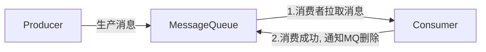
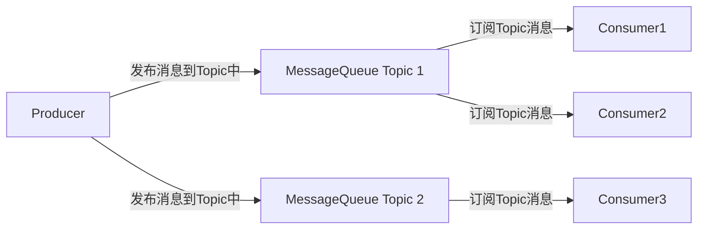

# Kafka

## 概述

传统的消息队列的主要应用场景包括：流量消峰、解耦和异步通信。

### MQ常见的两种消息模式

#### 点对点

消费者主动拉取消息，消息被消费后从MQ中删除。



#### 发布/订阅

1. 拥有多个Topic主题（订单、评论、邮件）。
2. 消费者消费消息后，不会删除消息，其他消费者可以继续消费。
3. 每个消费者互相独立，都可以单独消费消息，它们的消费进度互不相干。




## 搭建

>  kafka2.8之前需要依赖于zookeeper，2.8之后的版本kafka开发了自己的kraft共识算法，可以不再依赖于zookeeper，但是该功能目前（kafka3.0）仍处于预览状态。

官方下载地址：[kafka](https://kafka.apache.org/downloads.html)

### 配置文件

`$KAFKA_HOME/config/server.properties`

```properties
#broker 的全局唯一编号，不能重复，只能是数字。
broker.id=0
#处理网络请求的线程数量
num.network.threads=3
#用来处理磁盘 IO 的线程数量
num.io.threads=8
#发送套接字的缓冲区大小
socket.send.buffer.bytes=102400
#接收套接字的缓冲区大小
socket.receive.buffer.bytes=102400
#请求套接字的缓冲区大小
socket.request.max.bytes=104857600
#kafka 运行日志(数据)存放的路径，路径不需要提前创建，kafka 自动帮你创建，可以
配置多个磁盘路径，路径与路径之间可以用"，"分隔
log.dirs=/opt/module/kafka/datas
#topic 在当前 broker 上的分区个数
num.partitions=1
#用来恢复和清理 data 下数据的线程数量
num.recovery.threads.per.data.dir=1
# 每个 topic 创建时的副本数，默认时 1 个副本
offsets.topic.replication.factor=1
#segment 文件保留的最长时间，超时将被删除
log.retention.hours=168
#每个 segment 文件的大小，默认最大 1G
log.segment.bytes=1073741824
# 检查过期数据的时间，默认 5 分钟检查一次是否数据过期
log.retention.check.interval.ms=300000
#配置连接 Zookeeper 集群地址（在 zk 根目录下创建/kafka，方便管理）
zookeeper.connect=hadoop102:2181,hadoop103:2181,hadoop104:2181/kafka
```