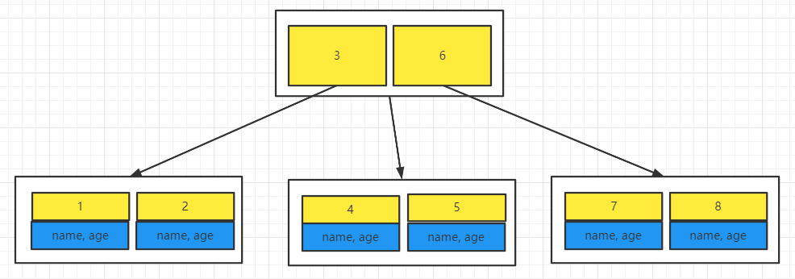
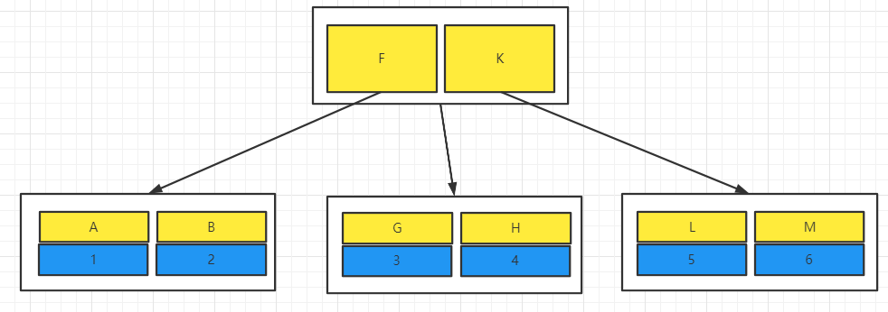
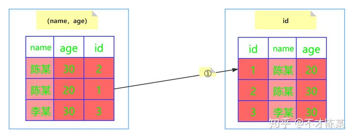
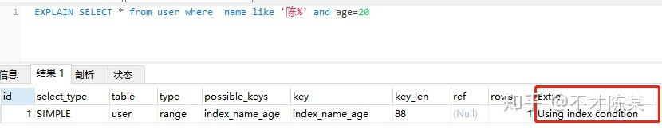

# Mysql调优

## 覆盖索引与回表

`select * from user where id = 1`

id为主键，mysql默认会为主键建立索引。

且主键索引的B+树中，叶子结点存储的是整行信息，即具体数据。不会发生回表。



`select * from user where name = '1'`

其中name为普通唯一索引列，非主键列，查询时会发生回表。

非主键索引的B+数中存储的是主键信息，想要获取除主键以外的其他信息，必须再次在主键B+数中查询。



不想回表那查询的列就必须只有主键列，即sql是`select id from user where name = '1'`

mysql判断只需要id主键，不需要其他信息当然就不需要回表了，这就是所谓的索引覆盖。

## 最左匹配原则

当建立联合索引`(a, b, c)`时，索引只会从最左边也就是a开始匹配，且必须是连续的，即`where a = 1 and b = 2 and c = 3`。当遇到非等值判断是就会停止匹配，列如`(>、<、between、like)`。

## 索引下推

文章摘自：https://zhuanlan.zhihu.com/p/121084592

- 索引下推（index condition pushdown ）简称ICP，在Mysql5.6的版本上推出，用于优化查询。
- 在不使用ICP的情况下，在使用非主键索引（又叫普通索引或者二级索引）进行查询时，存储引擎通过索引检索到数据，然后返回给MySQL服务器，服务器然后判断数据是否符合条件 。
- 在使用ICP的情况下，如果存在某些被索引的列的判断条件时，MySQL服务器将这一部分判断条件传递给存储引擎，然后由存储引擎通过判断索引是否符合MySQL服务器传递的条件，只有当索引符合条件时才会将数据检索出来返回给MySQL服务器 。
- 索引条件下推优化可以减少存储引擎查询基础表的次数，也可以减少MySQL服务器从存储引擎接收数据的次数。

---


- 在开始之前先先准备一张用户表(user)，其中主要几个字段有：id、name、age、address。建立联合索引（name，age）。
- 假设有一个需求，要求匹配姓名第一个为陈的所有用户，sql语句如下：

```sql
SELECT * from user where  name like '陈%'
```

- 根据 "最佳左前缀" 的原则，这里使用了联合索引（name，age）进行了查询，性能要比全表扫描肯定要高。
- 问题来了，如果有其他的条件呢？假设又有一个需求，要求匹配姓名第一个字为陈，年龄为20岁的用户，此时的sql语句如下：

```sql
SELECT * from user where  name like '陈%' and age=20
```

- 这条sql语句应该如何执行呢？下面对Mysql5.6之前版本和之后版本进行分析。

### **Mysql5.6之前的版本**

- 5.6之前的版本是没有索引下推这个优化的，因此执行的过程如下图：


- 会忽略age这个字段，直接通过name进行查询，在(name,age)这课树上查找到了两个结果，id分别为2,1，然后拿着取到的id值一次次的回表查询，因此这个过程需要**回表两次**。


### **Mysql5.6及之后版本**

- 5.6版本添加了索引下推这个优化，执行的过程如下图：





- InnoDB并没有忽略age这个字段，而是在索引内部就判断了age是否等于20，对于不等于20的记录直接跳过，因此在(name,age)这棵索引树中只匹配到了一个记录，此时拿着这个id去主键索引树中回表查询全部数据，这个过程只需要回表一次。


### **实践**

- 当然上述的分析只是原理上的，我们可以实战分析一下，因此陈某装了Mysql5.6版本的Mysql，解析了上述的语句，如下图：





- 根据explain解析结果可以看出Extra的值为**Using index condition**，表示已经使用了索引下推。

- 索引下推在**非主键索引**上的优化，可以有效减少回表的次数，大大提升了查询的效率。
- 关闭索引下推可以使用如下命令，配置文件的修改不再讲述了，毕竟这么优秀的功能干嘛关闭呢：

```sql
set optimizer_switch='index_condition_pushdown=off';
```

## 总结

一句话概括：`索引覆盖（只查询索引列）、最左匹配（联合索引必须从左开始一次匹配）、索引下推（在有联合索引时，自动优化减少回表次数（本质就是提前过滤了联合索引中的字段，不需要一个一个匹配然后回表））`