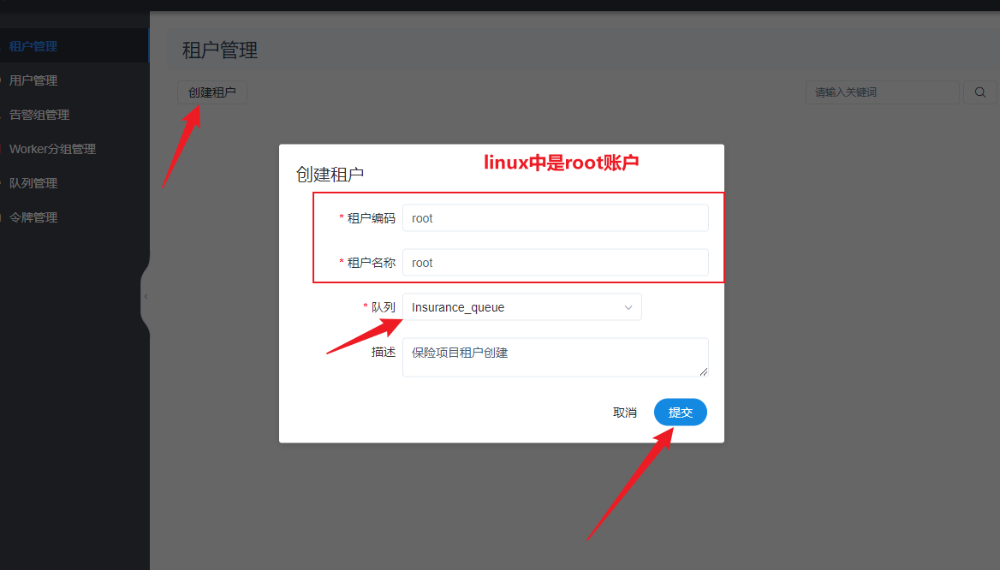
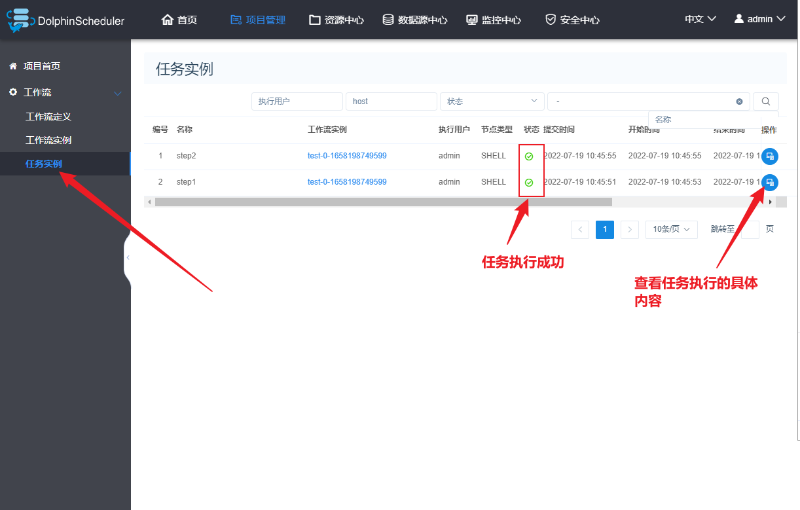

## DolphinSchduler

> DolphinScheduler是apache旗下一款顶级的工作流调度系统, 早期是由国内易观公司开发, 在2019年贡献给apache, 并成为apache旗下顶级项目, 主要作用: 实现工作流的调度操作 与 oozie是同类型的软件, 只不过比ooize提供了更加友好的操作界面, 可以直接通过界面对工作流进行完整的配置 启动 监控等相关的工作
>
> 
>
> https://dolphinscheduler.apache.org/

### 3-1 上传文件


### 3-2 解压文件到/export/server

```sh
cd /root/insurance/4_sofrware
tar zxf apache-dolphinscheduler-incubating-1.3.5-dolphinscheduler-bin.tar.gz -C /export/server/

cd /export/server
```


### 3-3 修改安装包名

```sh
mv apache-dolphinscheduler-incubating-1.3.5-dolphinscheduler-bin/ dolphinscheduler
```


### 3-4 将ds的安装包位置添系统变量

```sh
#添加ds位置
export DOLPHINSCHEDULER_HOME=/export/server/dolphinscheduler
```


```sh
source  /etc/profile 
```


### 3-5 mysql中创建ds的存储库

> 任务信息需要存储到mysql中

* 登录mysql

```sh
mysql -uroot -p123456
```

* 在mysql界面设置数据库

```sql
CREATE DATABASE dolphinscheduler DEFAULT CHARACTER SET utf8 DEFAULT COLLATE utf8_general_ci;


GRANT ALL PRIVILEGES ON dolphinscheduler.* TO 'root'@'%' IDENTIFIED BY '123456';

flush privileges;
```

* 修改ds的数据库配置信息

```sh
spring.datasource.driver-class-name=com.mysql.jdbc.Driver
spring.datasource.url=jdbc:mysql://192.168.88.161:3306/dolphinscheduler?characterEncoding=UTF-8&allowMultiQueries=true
spring.datasource.username=root
spring.datasource.password=123456
```


* ds要连接mysql需要用到mysql驱动
  * 拷贝mysql连接驱动

```sh
cp /export/server/apache-hive-3.1.2-bin/lib/mysql-connector-java-5.1.32.jar /export/server/dolphinscheduler/lib/
```

* 数据库信息初始化

```sh
cd /export/server/dolphinscheduler/script
sh create-dolphinscheduler.sh
```


>  成功后在mysql中会看到38张表

### 3-6 ds的配置文件修改(环境变量配置文件)

```sh
export HADOOP_HOME=/export/server/hadoop-3.3.0
export HADOOP_CONF_DIR=/export/server/hadoop-3.3.0/etc/hadoop
export SPARK_HOME1=/export/server/spark
#export SPARK_HOME2=/opt/soft/spark2
export PYTHON_HOME=/root/anaconda3
export JAVA_HOME=/export/server/jdk1.8.0_65
export HIVE_HOME=/export/server/apache-hive-3.1.2-bin
#export FLINK_HOME=/opt/soft/flink
#export DATAX_HOME=/opt/soft/datax/bin/datax.py
export SQOOP_HOME=/export/server/sqoop

export PATH=$HADOOP_HOME/bin:$SPARK_HOME1/bin:$SPARK_HOME2/bin:$PYTHON_HOME/bin:$JAVA_HOME/bin:$HIVE_HOME/bin:$PATH:$FLINK_HOME/bin:$DATAX_HOME:$PATH

```


### 3-7 服务配置

```sql
#
# Licensed to the Apache Software Foundation (ASF) under one or more
# contributor license agreements.  See the NOTICE file distributed with
# this work for additional information regarding copyright ownership.
# The ASF licenses this file to You under the Apache License, Version 2.0
# (the "License"); you may not use this file except in compliance with
# the License.  You may obtain a copy of the License at
#
#     http://www.apache.org/licenses/LICENSE-2.0
#
# Unless required by applicable law or agreed to in writing, software
# distributed under the License is distributed on an "AS IS" BASIS,
# WITHOUT WARRANTIES OR CONDITIONS OF ANY KIND, either express or implied.
# See the License for the specific language governing permissions and
# limitations under the License.
#


# NOTICE :  If the following config has special characters in the variable `.*[]^${}\+?|()@#&`, Please escape, for example, `[` escape to `\[`
# postgresql or mysql
dbtype="mysql"

# db config
# db address and port
dbhost="192.168.88.161:3306"

# db username
username="root"

# database name
dbname="dolphinscheduler"

# db passwprd
# NOTICE: if there are special characters, please use the \ to escape, for example, `[` escape to `\[`
password="123456"

# zk cluster
zkQuorum="192.168.88.161:2181,192.168.88.162:2181,192.168.88.163:2181"

# Note: the target installation path for dolphinscheduler, please not config as the same as the current path (pwd)
installPath="/export/server/dolphinscheduler_install"

# deployment user
# Note: the deployment user needs to have sudo privileges and permissions to operate hdfs. If hdfs is enabled, the root directory needs to be created by itself
deployUser="root"


# alert config
# mail server host
# mailServerHost="smtp.exmail.qq.com"

# mail server port
# note: Different protocols and encryption methods correspond to different ports, when SSL/TLS is enabled, make sure the port is correct.
# mailServerPort="25"

# sender
# mailSender="xxxxxxxxxx"

# user
# mailUser="xxxxxxxxxx"

# sender password
# note: The mail.passwd is email service authorization code, not the email login password.
# mailPassword="xxxxxxxxxx"

# TLS mail protocol support
# starttlsEnable="true"

# SSL mail protocol support
# only one of TLS and SSL can be in the true state.
# sslEnable="false"

#note: sslTrust is the same as mailServerHost
# sslTrust="smtp.exmail.qq.com"


# resource storage type：HDFS,S3,NONE
resourceStorageType="HDFS"

# if resourceStorageType is HDFS，defaultFS write namenode address，HA you need to put core-site.xml and hdfs-site.xml in the conf directory.
# if S3，write S3 address，HA，for example ：s3a://dolphinscheduler，
# Note，s3 be sure to create the root directory /dolphinscheduler
defaultFS="hdfs://node1:8020"

# if resourceStorageType is S3, the following three configuration is required, otherwise please ignore
# s3Endpoint="http://192.168.xx.xx:9010"
# s3AccessKey="xxxxxxxxxx"
# s3SecretKey="xxxxxxxxxx"

# if resourcemanager HA enable, please type the HA ips ; if resourcemanager is single, make this value empty
# yarnHaIps="192.168.xx.xx,192.168.xx.xx"

# if resourcemanager HA enable or not use resourcemanager, please skip this value setting; If resourcemanager is single, you only need to replace yarnIp1 to actual resourcemanager hostname.
singleYarnIp="node1"

# resource store on HDFS/S3 path, resource file will store to this hadoop hdfs path, self configuration, please make sure the directory exists on hdfs and have read write permissions。/dolphinscheduler is recommended
resourceUploadPath="/dolphinscheduler"

# who have permissions to create directory under HDFS/S3 root path
# Note: if kerberos is enabled, please config hdfsRootUser=
# hdfsRootUser="hdfs"

# kerberos config
# whether kerberos starts, if kerberos starts, following four items need to config, otherwise please ignore
kerberosStartUp="false"
# kdc krb5 config file path
krb5ConfPath="$installPath/conf/krb5.conf"
# keytab username
keytabUserName="hdfs-mycluster@ESZ.COM"
# username keytab path
keytabPath="$installPath/conf/hdfs.headless.keytab"


# api server port
apiServerPort="12345"


# install hosts
# Note: install the scheduled hostname list. If it is pseudo-distributed, just write a pseudo-distributed hostname
ips="node1,node2,node3"

# ssh port, default 22
# Note: if ssh port is not default, modify here
sshPort="22"

# run master machine
# Note: list of hosts hostname for deploying master
masters="node1,node2"

# run worker machine
# note: need to write the worker group name of each worker, the default value is "default"
workers="node1,node2,node3"

# run alert machine
# note: list of machine hostnames for deploying alert server
alertServer="node3"

# run api machine
# note: list of machine hostnames for deploying api server
apiServers="node1"
```


### 3-8 服务启动

* 先启动zookeeper服务  三台启动
  * /export/server/zookeeper/bin/zkServer.sh  start

```sql
# 在node1远程n启动node2和node3
ssh node2 /export/server/zookeeper/bin/zkServer.sh  start
ssh node3 /export/server/zookeeper/bin/zkServer.sh  start

# 查看服务状态
/export/server/zookeeper/bin/zkServer.sh  status
```


* 启动hadoop服务
  * start-all.sh

* 首次启动ds服务

```sh
cd /export/server/dolphinscheduler
sh install.sh
```


### 3-9 访问服务

http://192.168.88.161:12345/dolphinscheduler

```sh
账户：admin
密码： dolphinscheduler123
```


### 3-10 后续在进行停止启动

```sh
cd /export/server/dolphinscheduler_install/bin/
# 停止
./stop-all.sh
# 启动
./start-all.sh
```

## 四、DS的基本使用

### 4-1 功能介绍


* 租户

  * 就是执行脚本的用户

    * 脚本就是linux上的执行文件，linux上文件是有用户权限，如果要取执行调用文件就需要指定执行文件的用户

    

  * 租户要创建为linux上的用户

* 用户

  * 登录ds的账户
  * 有个默认用户  admin

* 告警组管理

  * 如果配置了告警服务（邮箱告警），需要用到邮箱服务器。当前没有配置
  * 作用：当执行任务是发生了错误会通知告警组中的用户，给这些用右键

* worker组管理

  * 将多个worek服务划分成多个组，在执行任务时，可以指定交个哪个组内的worker执行

* 队列管理

  * 就是分发任务，会将任务分发给不同的worker执行
  * 队列可以创建多个，每个不同项目可以使用不同的队列

* 项目管理

  * 针对不同的项目定义不同执行任务

  

### 4-2 使用流程 

#### 4-2-1 创建队列


#### 4-2-2创键租户



#### 4-2-3 创建项目


#### 4-2-4 进入项目指定任务


#### 4-2-5 任务的指定


#### 4-2-6 shell的任务配置


#### 4-2-7 多个任务的执行顺序指定


#### 4-2-8 定义job任务名


#### 4-2-9 上线执行


#### 4-2-10 查看运行信息



## 五、DS任务调度

### 5-1 统一服务器环境

### 5-2 脚本编写

* sql脚本
* sqoop脚本
* Python脚本


​	