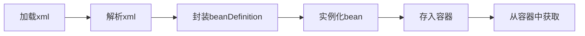
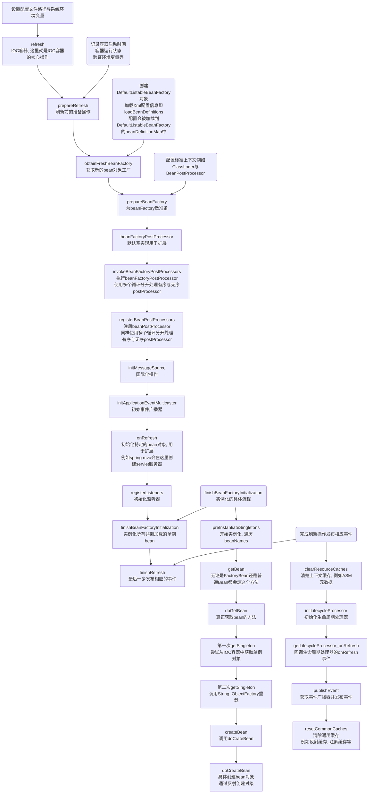
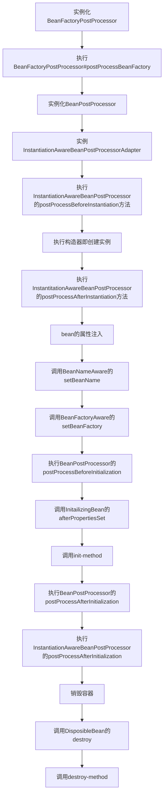
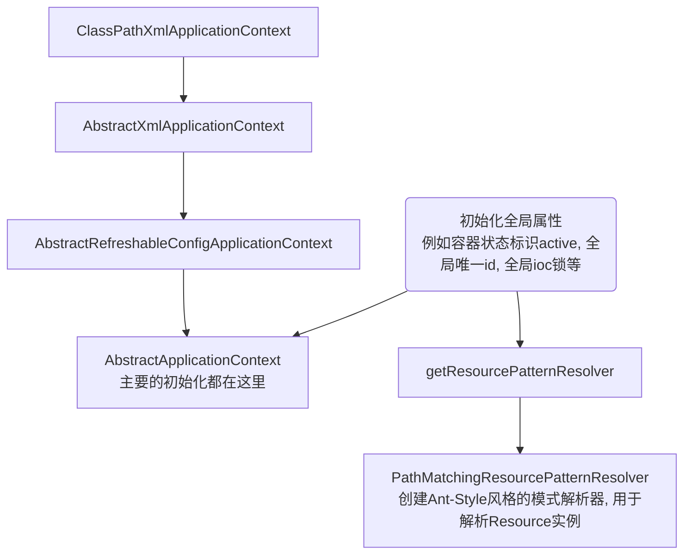
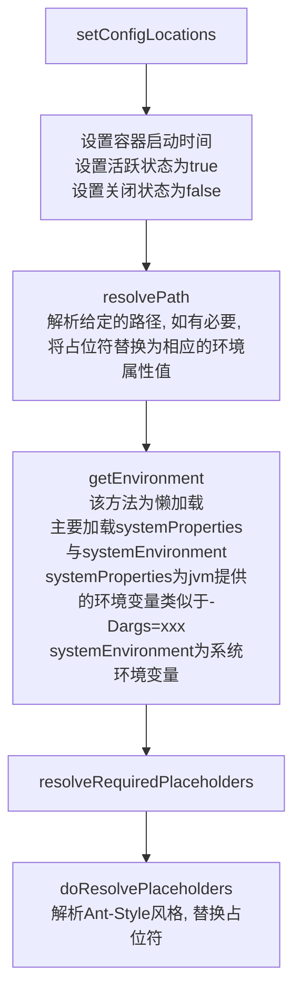
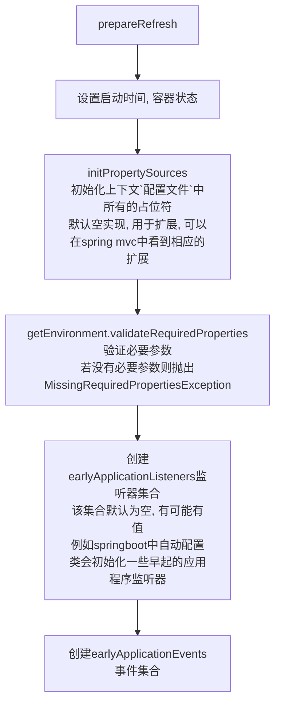
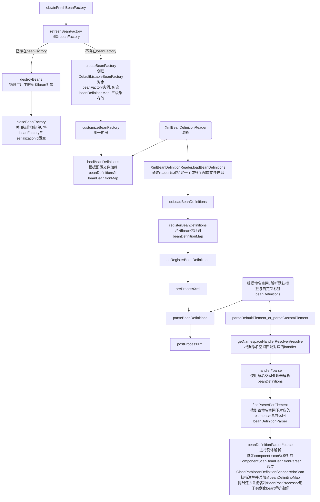
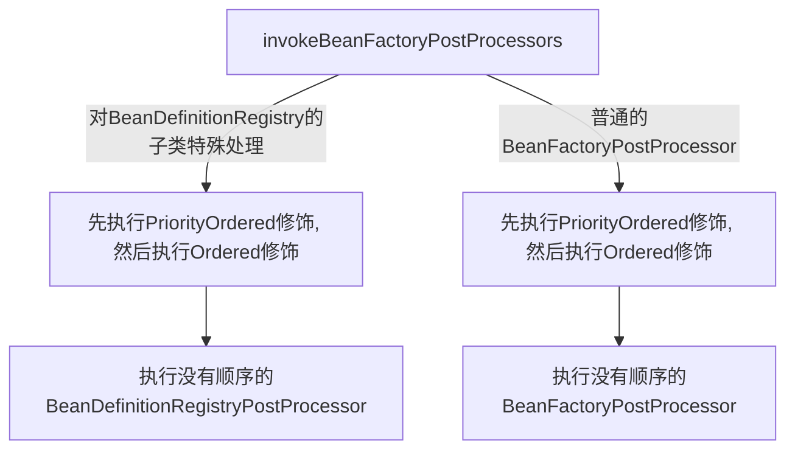

# Spring源码

## IOC

### IOC源码概览

#### 从简单Demo理解spring的流程

使用spring框架时我们会配置xml, spring从xml加载bean对象, 这是最简单的demo

将上述操作在源码中可以简述为:



#### 源码流程图

> 核心逻辑就是refresh方法



### SpringBean生命周期




### Spring 源码流程

> 以ClassPathXmlApplicationContext为列

```java
public ClassPathXmlApplicationContext(
    String[] configLocations, boolean refresh, @Nullable ApplicationContext parent)
    throws BeansException {
	// 调用父类构造器, 初始化全局属性.
    // 例如容器状态标识active, 全局唯一id, 全局ioc锁等
    super(parent);
    // 设置配置文件路径, 初始化Enviroment对象(存储环境变量, 系统环境变量与用户给定的环境变量)
    setConfigLocations(configLocations);
    if (refresh) {
        // IOC核心逻辑
        refresh();
    }
}
```

#### super

调用父类构造器, 创建全局属性, 全局唯一id, 初始化资源解析器(解析Ant-Style风格的模式), 并设置父容器



#### setConfigLocations

> 设置配置文件路径, 初始化Enviroment对象(存储环境变量, 系统环境变量与用户给定的环境变量)



#### refresh

> IOC核心方法, 根据配置刷新整个IOC容器

##### prepareRefresh

> 为刷新上下文做准备



##### obtainFreshBeanFactory

> 刷新并获取内部的beanFactory
>
> 加载所有beanDefinition信息, Component, Service, Repository等注解也是在这里解析的
>
> 解析出来的beanDefinition包含各种定义信息, 例如AnnotatedBeanDefinition加了注解的bean,  ScannedGenericBeanDefinition同样是加了注解的bean是AnnotatedBeanDefinition的子类, AbstractBeanDefinition普通的没有其他Spring注解修饰列如@ComponentScan



##### prepareBeanFactory

> 准备beanFactory

* 设置BeanClassLoader
* bean spring el表达式解析器
* 设置PropertyEditorRegistrar, 属性处理器, 列如将字符串`A省_B市_C区`解析为Address对象
* 添加ApplicationContextAwareProcessor
* ignoreDependencyInterface忽略各种Aware生命周期接口, 后续实例化bean后会在invokeAwareMethods里执行, 这里不需要执行
* registerResolvableDependency预装配各种对象, 例如BeanFactory, ApplicationContext, ResourceLoader
* 添加ApplicationListenerDetector应用程序事件监听器BeanPostProcessor
* 初始化各种Environment, 注册到beanFactory中

##### postProcessBeanFactory

>扩展方法

##### invokeBeanFactoryPostProcessors

> 执行beanFactoryPostProcessors, 优先执行有顺序的即被Ordered或PriorityOrdered标记的, 最后执行没有顺序的
>
> 如果beanFactory instanceof BeanDefinitionRegistry, 那么会先执行BeanDefinitionRegistryPostProcessor, 仍然是优先执行Ordered或PriorityOrdered, 最后执行没有顺序的
>
> 执行流程中主要有三类BeanFactoryPostProcessor:
>
> * 用户手动加入的BeanFactoryPostProcessor
>     * 配置文件中定义的
>     * 调用addBeanFactoryPostProcessor
> * 实现了BeanDefinitionRegistryPostProcessor接口
> * 实现了BeanFactoryPostProcessor接口



###### ConfigurationClassPostProcessor

> 在开启compoent-scan时, 该方法会注册一个ConfigurationClassPostProcessor实现了BeanDefinitionRegistryPostProcessor接口
>
> 用于处理@Compoent以及子注解修饰的类的其他注解信息, @Import, @CompoentScan, @ImportResource等

## AOP

没有依赖的AOP:

1. A对象需要被代理
    - 普通bean对象aop, 是在bean对象被实例化且属性填充完成后, 通过BeanPostProcessor子类InstantiationAwareBeanPostProcessor子类AnnotationAwareAspectJAutoProxyCreator#postProcessAfterInitialization来处理, 返回代理bean对象

有依赖的AOP, 以有依赖循环为例(这种情况最复杂), 有三种情况:

1. A依赖B, A是非代理bean B是需要代理的bean

    - 先创建A, A被加入singeltonFactories
    - 在populate属性填充时, 依赖B, 则创建B对象
    - B对象是代理对象, 依赖于A, getSingelton(A), 从singletonFactories获取A对象的早期引用即AbstractAutowireCapableBeanFactory#getEarlyBeanReference, 由于A对象无需代理, 直接返回之前创建好的A对象(此时属性还未填充完毕), 并将A对象存入earlySingletonObjects. 此时A对象属性还未填充, 需要等待B对象创建完成
    - B属性填充后, 走普通Bean对象代理流程
    - 返回被代理的B对象, 填充A
    - 最后A对象被创建完毕

2. A依赖B, A是需要代理的bean, B是非代理bean

    - 先创建A, A被加入singeltonFactories

    - 在populate属性填充时, 依赖B, 则创建B对象

    - B对象依赖于A, getSingleton(A), 从singletonFactories获取A对象的早期引用即AbstractAutowireCapableBeanFactory#getEarlyBeanReference, 由于A对象需要被代理, 会由AnnotationAwareAspectJAutoProxyCreator创建代理对象, 存入earlySingletonObjects, 然后返回给B对象

        - ```java
            protected Object getEarlyBeanReference(String beanName, RootBeanDefinition mbd, Object bean) {
               Object exposedObject = bean;
               if (!mbd.isSynthetic() && hasInstantiationAwareBeanPostProcessors()) {
                  for (SmartInstantiationAwareBeanPostProcessor bp : getBeanPostProcessorCache().smartInstantiationAware) {
                     exposedObject = bp.getEarlyBeanReference(exposedObject, beanName);
                  }
               }
               return exposedObject;
            }
            ```

    - B对象属性填充完毕, 返回给A

    - A对象属性填充完毕, 走普通Bean对象代理流程, 但是由于之前生成了A对象向的代理, 此时应该在earlySingletonObjects中, 所以这里不会再次创建代理对象了

    - A对象会在执行玩initializeBean(即执行awre方法与beanPostProcessor后), 再次getSingleton, 获取earlySingletonObjects存储的代理A对象, 将代理A对象返回

        - ```java
            // class AbstractAutowireCapableBeanFactory
            protected Object doCreateBean(String beanName, RootBeanDefinition mbd, @Nullable Object[] args)
                  throws BeanCreationException {
                
               // 省略...
              
               // 填充属性与执行声明周期接口和BeanPostProcessor
            
               // 允许早期引用
               if (earlySingletonExposure) {
                   // 由于A对象在B依赖A时, 被创建且是代理bean
                  Object earlySingletonReference = getSingleton(beanName, false);
                   // 能从earlySingletonObjects中获取到代理A对象
                  if (earlySingletonReference != null) {
                     if (exposedObject == bean) {
                         // 将返回的对象设为代理A对象
                        exposedObject = earlySingletonReference;
                     }
                     else if (!this.allowRawInjectionDespiteWrapping && hasDependentBean(beanName)) {
                        // 省略...
                     }
                  }
               }
               // 省略...
               return exposedObject;
            }
            ```
        
    - 最后A对象创建完毕
    
3. A依赖B, AB都是需要代理的bean

    - 同上
