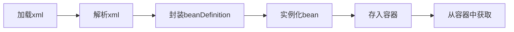
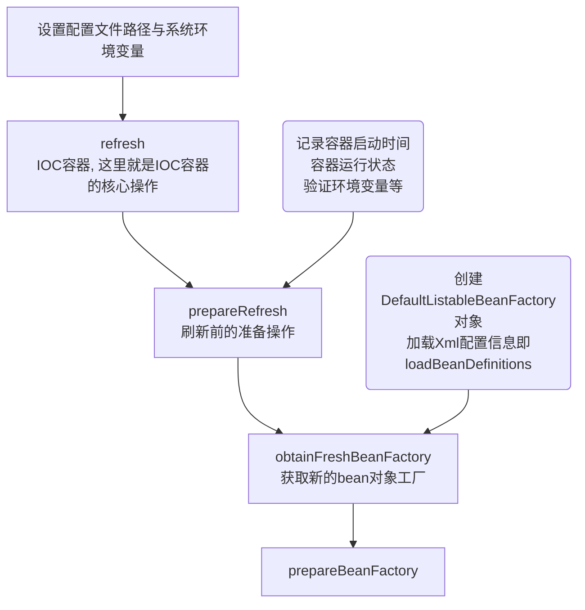

# Spring源码

## IOC

### IOC源码概览

#### 从简单Demo理解spring的流程

使用spring框架时我们会配置xml, spring从xml加载bean对象, 这是最简单的demo

将上述操作在源码中可以简述为:

```mermaid
graph LR
loadXml[加载xml] --> resolveXml[解析xml]
				--> beanDefinition[封装beanDefinition]
				--> instantiate[实例化bean]
				--> addToIoc[存入容器]
				--> getFromIoc[从容器中获取]	
```

#### 源码流程图

```mermaid
graph TB
设置配置文件路径与系统环境变量 --> refresh[refresh<br>IOC容器, 这里就是IOC容器的核心操作]
	--> prepareRefresh[prepareRefresh<br>刷新前的准备操作]
	--> obtainFreshBeanFactory[obtainFreshBeanFactory<br>获取新的bean对象工厂]
	--> prepareBeanFactory
obtainFreshBeanFactory__INFO(创建DefaultListableBeanFactory对象<br>加载Xml配置信息即loadBeanDefinitions) --> obtainFreshBeanFactory
prepareRefresh__INFO(记录容器启动时间<br>容器运行状态<br>验证环境变量等) --> prepareRefresh
```

## AOP