# Spring源码

> Spring版本5.3.16

## IOC

### IOC源码概览

#### 从简单Demo理解spring的流程

使用spring框架时我们会配置xml, spring从xml加载bean对象, 这是最简单的demo

将上述操作在源码中可以简述为:

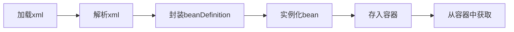

#### 源码流程图

> 核心逻辑就是refresh方法

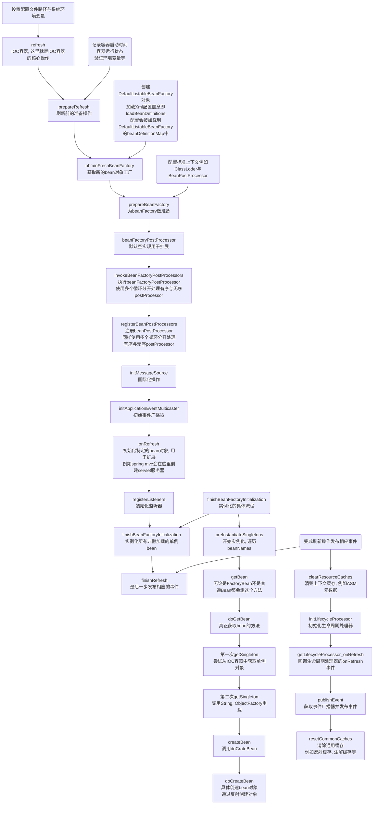

### SpringBean生命周期

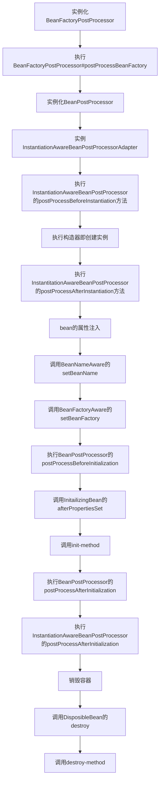

精简版

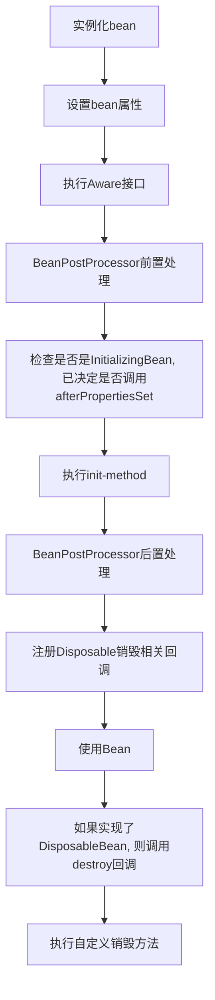


### Spring 源码流程

> 以ClassPathXmlApplicationContext为列

```java
public ClassPathXmlApplicationContext(
    String[] configLocations, boolean refresh, @Nullable ApplicationContext parent)
    throws BeansException {
	// 调用父类构造器, 初始化全局属性.
    // 例如容器状态标识active, 全局唯一id, 全局ioc锁等
    super(parent);
    // 设置配置文件路径, 初始化Enviroment对象(存储环境变量, 系统环境变量与用户给定的环境变量)
    setConfigLocations(configLocations);
    if (refresh) {
        // IOC核心逻辑
        refresh();
    }
}
```

#### super

调用父类构造器, 创建全局属性, 全局唯一id, 初始化资源解析器(解析Ant-Style风格的模式), 并设置父容器

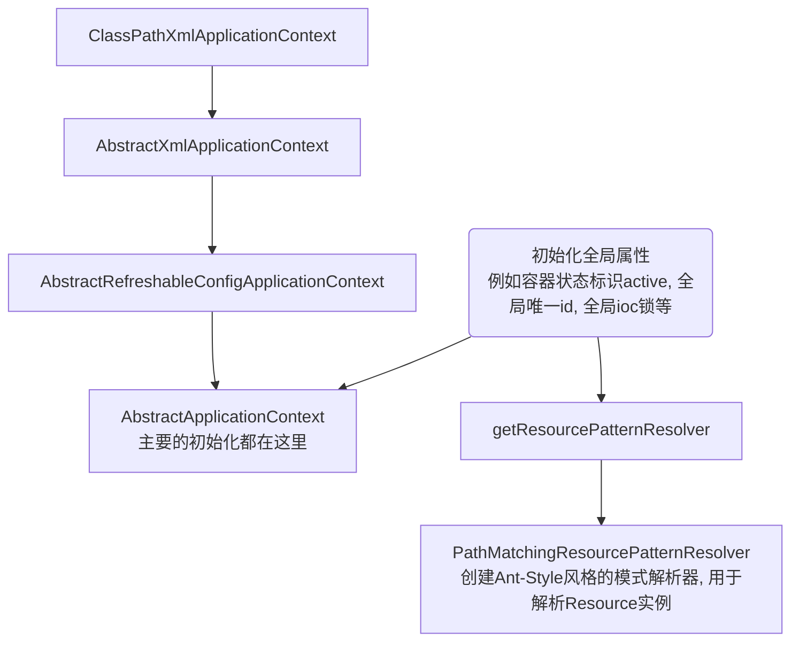

#### setConfigLocations

> 设置配置文件路径, 初始化Enviroment对象(存储环境变量, 系统环境变量与用户给定的环境变量)

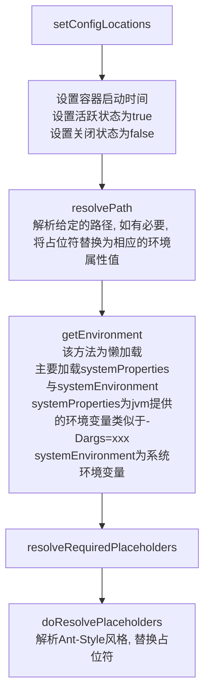

#### refresh

> IOC核心方法, 根据配置刷新整个IOC容器

##### prepareRefresh

> 为刷新上下文做准备

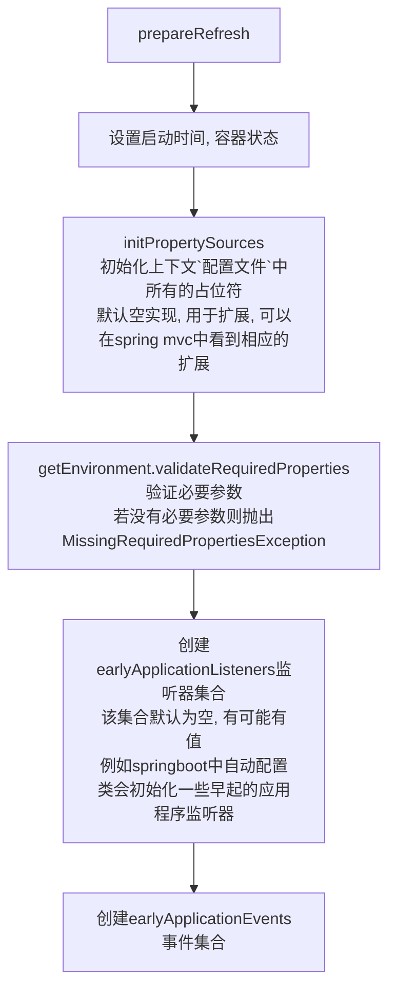

##### obtainFreshBeanFactory

> 刷新并获取内部的beanFactory
>
> 加载所有beanDefinition信息, 同时会加载@Component, @Service, @Repository, @Configuration等注解修饰的类的beanDefinition. 这里实惠加载beanDefinition, 详细的注解解析, 如方法上的@Bean, 是在invokeBeanFactoryPostProcessor中由ConfigurationClassPostProcessor处理
>
> 解析出来的beanDefinition包含各种定义信息, 例如AnnotatedBeanDefinition加了注解的bean,  ScannedGenericBeanDefinition同样是加了注解的bean是AnnotatedBeanDefinition的子类, AbstractBeanDefinition普通的没有其他Spring注解修饰列如@ComponentScan

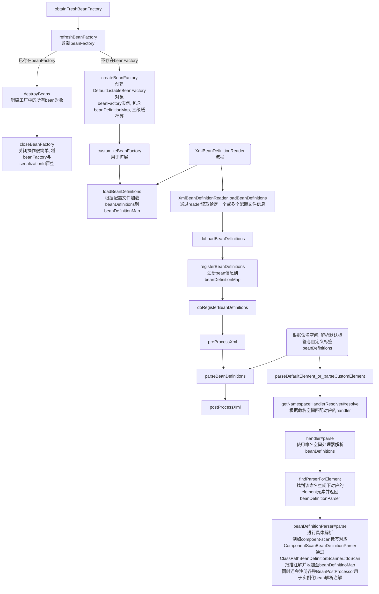

##### prepareBeanFactory

> 准备beanFactory

* 设置BeanClassLoader
* bean spring el表达式解析器
* 设置PropertyEditorRegistrar, 属性处理器, 列如将字符串`A省_B市_C区`解析为Address对象
* 添加ApplicationContextAwareProcessor
* ignoreDependencyInterface忽略各种Aware生命周期接口, 后续实例化bean后会在invokeAwareMethods里执行, 这里不需要执行
* registerResolvableDependency预装配各种对象, 例如BeanFactory, ApplicationContext, ResourceLoader
* 添加ApplicationListenerDetector应用程序事件监听器BeanPostProcessor
* 初始化各种Environment, 注册到beanFactory中

##### postProcessBeanFactory

>扩展方法

##### invokeBeanFactoryPostProcessors

> 执行beanFactoryPostProcessors, 优先执行有顺序的即被Ordered或PriorityOrdered标记的, 最后执行没有顺序的
>
> 如果beanFactory instanceof BeanDefinitionRegistry, 那么会先执行BeanDefinitionRegistryPostProcessor, 仍然是优先执行Ordered或PriorityOrdered, 最后执行没有顺序的
>
> 执行流程中主要有三类BeanFactoryPostProcessor:
>
> * 用户手动加入的BeanFactoryPostProcessor
>     * 配置文件中定义的
>     * 调用addBeanFactoryPostProcessor
> * 实现了BeanDefinitionRegistryPostProcessor接口
> * 实现了BeanFactoryPostProcessor接口

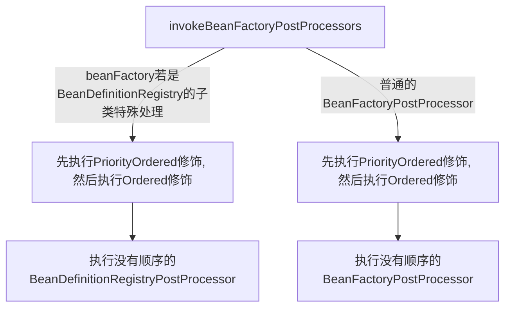

```java
// class AbstractApplicationContext
protected void invokeBeanFactoryPostProcessors(ConfigurableListableBeanFactory beanFactory) {
    	// 执行所有BeanFactoryPostProcessor
		PostProcessorRegistrationDelegate.invokeBeanFactoryPostProcessors(beanFactory, getBeanFactoryPostProcessors());

		// Detect a LoadTimeWeaver and prepare for weaving, if found in the meantime
		// (e.g. through an @Bean method registered by ConfigurationClassPostProcessor)
		if (!NativeDetector.inNativeImage() && beanFactory.getTempClassLoader() == null && beanFactory.containsBean(LOAD_TIME_WEAVER_BEAN_NAME)) {
			beanFactory.addBeanPostProcessor(new LoadTimeWeaverAwareProcessor(beanFactory));
			beanFactory.setTempClassLoader(new ContextTypeMatchClassLoader(beanFactory.getBeanClassLoader()));
		}
	}
```

```java
// class PostProcessorRegistrationDelegate
public static void invokeBeanFactoryPostProcessors(
			ConfigurableListableBeanFactory beanFactory, List<BeanFactoryPostProcessor> beanFactoryPostProcessors) {

		// WARNING: Although it may appear that the body of this method can be easily
		// refactored to avoid the use of multiple loops and multiple lists, the use
		// of multiple lists and multiple passes over the names of processors is
		// intentional. We must ensure that we honor the contracts for PriorityOrdered
		// and Ordered processors. Specifically, we must NOT cause processors to be
		// instantiated (via getBean() invocations) or registered in the ApplicationContext
		// in the wrong order.
		//
		// Before submitting a pull request (PR) to change this method, please review the
		// list of all declined PRs involving changes to PostProcessorRegistrationDelegate
		// to ensure that your proposal does not result in a breaking change:
		// https://github.com/spring-projects/spring-framework/issues?q=PostProcessorRegistrationDelegate+is%3Aclosed+label%3A%22status%3A+declined%22

		// Invoke BeanDefinitionRegistryPostProcessors first, if any.
		Set<String> processedBeans = new HashSet<>();

    	// beanFactory实现了BeanDefinitionRegistry, 意味着beanFactory存储了beanDefinition信息即beanDefinitionMap
		if (beanFactory instanceof BeanDefinitionRegistry) {
			BeanDefinitionRegistry registry = (BeanDefinitionRegistry) beanFactory;
            // 普通的BeanFactoryPostProcesssor
			List<BeanFactoryPostProcessor> regularPostProcessors = new ArrayList<>();
            // BeanDefinitionRegistryPostProcessor, ConfigurationClassPostProcessor实现了这个接口
			List<BeanDefinitionRegistryPostProcessor> registryProcessors = new ArrayList<>();

			for (BeanFactoryPostProcessor postProcessor : beanFactoryPostProcessors) {
				if (postProcessor instanceof BeanDefinitionRegistryPostProcessor) {
					BeanDefinitionRegistryPostProcessor registryProcessor =
							(BeanDefinitionRegistryPostProcessor) postProcessor;
					registryProcessor.postProcessBeanDefinitionRegistry(registry);
					registryProcessors.add(registryProcessor);
				}
				else {
					regularPostProcessors.add(postProcessor);
				}
			}

			// Do not initialize FactoryBeans here: We need to leave all regular beans
			// uninitialized to let the bean factory post-processors apply to them!
			// Separate between BeanDefinitionRegistryPostProcessors that implement
			// PriorityOrdered, Ordered, and the rest.
			List<BeanDefinitionRegistryPostProcessor> currentRegistryProcessors = new ArrayList<>();

			// First, invoke the BeanDefinitionRegistryPostProcessors that implement PriorityOrdered.
			String[] postProcessorNames =
					beanFactory.getBeanNamesForType(BeanDefinitionRegistryPostProcessor.class, true, false);
            // 获取容器中所有BeanDefinitionRegistryPostProcessor并加入到currentRegistryProcessors, 后续处理
            // 这里只处理被PriorityOrdered修饰的
			for (String ppName : postProcessorNames) {
				if (beanFactory.isTypeMatch(ppName, PriorityOrdered.class)) {
					currentRegistryProcessors.add(beanFactory.getBean(ppName, BeanDefinitionRegistryPostProcessor.class));
					processedBeans.add(ppName);
				}
			}
            // 需要按照顺序运行, 先排序
			sortPostProcessors(currentRegistryProcessors, beanFactory);
			registryProcessors.addAll(currentRegistryProcessors);
			invokeBeanDefinitionRegistryPostProcessors(currentRegistryProcessors, registry, beanFactory.getApplicationStartup());
			currentRegistryProcessors.clear();

			// Next, invoke the BeanDefinitionRegistryPostProcessors that implement Ordered.
			postProcessorNames = beanFactory.getBeanNamesForType(BeanDefinitionRegistryPostProcessor.class, true, false);
            // 逻辑同上, 区别是这里只处理被Ordered修饰的
			for (String ppName : postProcessorNames) {
				if (!processedBeans.contains(ppName) && beanFactory.isTypeMatch(ppName, Ordered.class)) {
					currentRegistryProcessors.add(beanFactory.getBean(ppName, BeanDefinitionRegistryPostProcessor.class));
					processedBeans.add(ppName);
				}
			}
			sortPostProcessors(currentRegistryProcessors, beanFactory);
			registryProcessors.addAll(currentRegistryProcessors);
			invokeBeanDefinitionRegistryPostProcessors(currentRegistryProcessors, registry, beanFactory.getApplicationStartup());
			currentRegistryProcessors.clear();

			// Finally, invoke all other BeanDefinitionRegistryPostProcessors until no further ones appear.
			boolean reiterate = true;
			while (reiterate) {
				reiterate = false;
				postProcessorNames = beanFactory.getBeanNamesForType(BeanDefinitionRegistryPostProcessor.class, true, false);
				for (String ppName : postProcessorNames) {
					if (!processedBeans.contains(ppName)) {
						currentRegistryProcessors.add(beanFactory.getBean(ppName, BeanDefinitionRegistryPostProcessor.class));
						processedBeans.add(ppName);
						reiterate = true;
					}
				}
				sortPostProcessors(currentRegistryProcessors, beanFactory);
				registryProcessors.addAll(currentRegistryProcessors);
				invokeBeanDefinitionRegistryPostProcessors(currentRegistryProcessors, registry, beanFactory.getApplicationStartup());
				currentRegistryProcessors.clear();
			}

			// Now, invoke the postProcessBeanFactory callback of all processors handled so far.
			invokeBeanFactoryPostProcessors(registryProcessors, beanFactory);
			invokeBeanFactoryPostProcessors(regularPostProcessors, beanFactory);
		}

		else {
			// Invoke factory processors registered with the context instance.
			invokeBeanFactoryPostProcessors(beanFactoryPostProcessors, beanFactory);
		}

		// Do not initialize FactoryBeans here: We need to leave all regular beans
		// uninitialized to let the bean factory post-processors apply to them!
    	// 处理普通的BeanFactoryPostProcessor, 一般都是用户自定义的
		String[] postProcessorNames =
				beanFactory.getBeanNamesForType(BeanFactoryPostProcessor.class, true, false);

		// Separate between BeanFactoryPostProcessors that implement PriorityOrdered,
		// Ordered, and the rest.
		List<BeanFactoryPostProcessor> priorityOrderedPostProcessors = new ArrayList<>();
		List<String> orderedPostProcessorNames = new ArrayList<>();
		List<String> nonOrderedPostProcessorNames = new ArrayList<>();
		for (String ppName : postProcessorNames) {
			if (processedBeans.contains(ppName)) {
				// skip - already processed in first phase above
			}
			else if (beanFactory.isTypeMatch(ppName, PriorityOrdered.class)) {
				priorityOrderedPostProcessors.add(beanFactory.getBean(ppName, BeanFactoryPostProcessor.class));
			}
			else if (beanFactory.isTypeMatch(ppName, Ordered.class)) {
				orderedPostProcessorNames.add(ppName);
			}
			else {
				nonOrderedPostProcessorNames.add(ppName);
			}
		}

    	// 下面的逻辑同上
    	// 先排序并执行PriorityOrdered修饰的BeanFactoryPostProcessor
    	// 再排序并执行Ordered修饰的BeanFactoryPostProcessor
    	// 最后执行没有顺序的BeanFactoryPostProcessor
    
		// First, invoke the BeanFactoryPostProcessors that implement PriorityOrdered.
		sortPostProcessors(priorityOrderedPostProcessors, beanFactory);
		invokeBeanFactoryPostProcessors(priorityOrderedPostProcessors, beanFactory);

		// Next, invoke the BeanFactoryPostProcessors that implement Ordered.
		List<BeanFactoryPostProcessor> orderedPostProcessors = new ArrayList<>(orderedPostProcessorNames.size());
		for (String postProcessorName : orderedPostProcessorNames) {
			orderedPostProcessors.add(beanFactory.getBean(postProcessorName, BeanFactoryPostProcessor.class));
		}
		sortPostProcessors(orderedPostProcessors, beanFactory);
		invokeBeanFactoryPostProcessors(orderedPostProcessors, beanFactory);

		// Finally, invoke all other BeanFactoryPostProcessors.
		List<BeanFactoryPostProcessor> nonOrderedPostProcessors = new ArrayList<>(nonOrderedPostProcessorNames.size());
		for (String postProcessorName : nonOrderedPostProcessorNames) {
			nonOrderedPostProcessors.add(beanFactory.getBean(postProcessorName, BeanFactoryPostProcessor.class));
		}
		invokeBeanFactoryPostProcessors(nonOrderedPostProcessors, beanFactory);

		// Clear cached merged bean definitions since the post-processors might have
		// modified the original metadata, e.g. replacing placeholders in values...
		beanFactory.clearMetadataCache();
	}
```

###### ConfigurationClassPostProcessor

> 在开启compoent-scan时, 该方法会注册一个ConfigurationClassPostProcessor实现了BeanDefinitionRegistryPostProcessor接口
>
> 用于处理@Configuration修饰的类的其他注解信息, 例如@Import, @ImportResource, @CompoentScan, @Bean等
>
> Springboot中自动装配使用到的AutoConfigurationImportSelector#getCandidateConfigurations方法, 会加载spring.factories文件中EnableAutoConfiguration定义的信息, 完成自动装配

以springboot自动配置为例, 详细展示注解解析流程

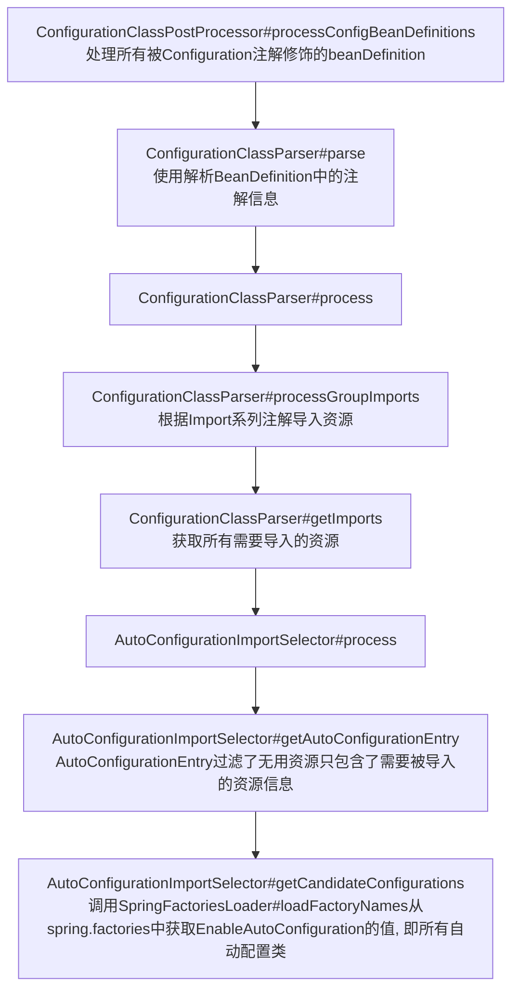

```java
// class ConfigurationClassPostProcessor
public void processConfigBeanDefinitions(BeanDefinitionRegistry registry) {
		List<BeanDefinitionHolder> configCandidates = new ArrayList<>();
		String[] candidateNames = registry.getBeanDefinitionNames();

		for (String beanName : candidateNames) {
			BeanDefinition beanDef = registry.getBeanDefinition(beanName);
			if (beanDef.getAttribute(ConfigurationClassUtils.CONFIGURATION_CLASS_ATTRIBUTE) != null) {
				if (logger.isDebugEnabled()) {
					logger.debug("Bean definition has already been processed as a configuration class: " + beanDef);
				}
			}
            // 检测是否是配置类, 即是否添加了@Configuration注解
			else if (ConfigurationClassUtils.checkConfigurationClassCandidate(beanDef, this.metadataReaderFactory)) {
				configCandidates.add(new BeanDefinitionHolder(beanDef, beanName));
			}
		}

		// Return immediately if no @Configuration classes were found
    	// 没有添加@Configuration的类就无需处理了, 直接返回
		if (configCandidates.isEmpty()) {
			return;
		}

		// Sort by previously determined @Order value, if applicable
    	// 排序beanDefinition
		configCandidates.sort((bd1, bd2) -> {
			int i1 = ConfigurationClassUtils.getOrder(bd1.getBeanDefinition());
			int i2 = ConfigurationClassUtils.getOrder(bd2.getBeanDefinition());
			return Integer.compare(i1, i2);
		});

		// Detect any custom bean name generation strategy supplied through the enclosing application context
    	// 如果没有使用自定义的bean名称生成策略, 就使用spring默认的策略
		SingletonBeanRegistry sbr = null;
		if (registry instanceof SingletonBeanRegistry) {
			sbr = (SingletonBeanRegistry) registry;
			if (!this.localBeanNameGeneratorSet) {
				BeanNameGenerator generator = (BeanNameGenerator) sbr.getSingleton(
						AnnotationConfigUtils.CONFIGURATION_BEAN_NAME_GENERATOR);
				if (generator != null) {
					this.componentScanBeanNameGenerator = generator;
					this.importBeanNameGenerator = generator;
				}
			}
		}

		if (this.environment == null) {
			this.environment = new StandardEnvironment();
		}

		// Parse each @Configuration class
    	// 配置类的解析器
		ConfigurationClassParser parser = new ConfigurationClassParser(
				this.metadataReaderFactory, this.problemReporter, this.environment,
				this.resourceLoader, this.componentScanBeanNameGenerator, registry);

		Set<BeanDefinitionHolder> candidates = new LinkedHashSet<>(configCandidates);
		Set<ConfigurationClass> alreadyParsed = new HashSet<>(configCandidates.size());
		do {
            // ConfigurationClassParser#parse 详细的解析流程就在这里
			parser.parse(candidates);
			parser.validate();
            // 省略...
		}
	    // 省略...
	}
```

```java
// class ConfigurationClassParser
public void parse(Set<BeanDefinitionHolder> configCandidates) {
   for (BeanDefinitionHolder holder : configCandidates) {
      BeanDefinition bd = holder.getBeanDefinition();
      // 根据不同类型的BeanDefinition, 进行不同的解析
      // 解析EnableAutoConfiguration注解时, 会识别@Import(AutoConfigurationImportSelector.class)
      // 解析@Import(AutoConfigurationImportSelector.class)时, 会注册对应的DeferredImportSelectorGrouping与DeferredImportSelectorHolder
      try {
         if (bd instanceof AnnotatedBeanDefinition) {
            parse(((AnnotatedBeanDefinition) bd).getMetadata(), holder.getBeanName());
         }
         else if (bd instanceof AbstractBeanDefinition && ((AbstractBeanDefinition) bd).hasBeanClass()) {
            parse(((AbstractBeanDefinition) bd).getBeanClass(), holder.getBeanName());
         }
         else {
            parse(bd.getBeanClassName(), holder.getBeanName());
         }
      }
      catch (BeanDefinitionStoreException ex) {
         throw ex;
      }
      catch (Throwable ex) {
         throw new BeanDefinitionStoreException(
               "Failed to parse configuration class [" + bd.getBeanClassName() + "]", ex);
      }
   }
 	// 由DeferredImportSelectorHolder进行处理, handler#processGroupImport中的getImports进行了自动配置操作   
   this.deferredImportSelectorHandler.process();
}
```

```java
// class ConfigurationClassParser
public void processGroupImports() {
   for (DeferredImportSelectorGrouping grouping : this.groupings.values()) {
      Predicate<String> exclusionFilter = grouping.getCandidateFilter();
      grouping.getImports().forEach(entry -> {
         ConfigurationClass configurationClass = this.configurationClasses.get(entry.getMetadata());
         try {
            // 处理自动配置
            processImports(configurationClass, asSourceClass(configurationClass, exclusionFilter),
                  Collections.singleton(asSourceClass(entry.getImportClassName(), exclusionFilter)),
                  exclusionFilter, false);
         }
         catch (BeanDefinitionStoreException ex) {
            throw ex;
         }
         catch (Throwable ex) {
            throw new BeanDefinitionStoreException(
                  "Failed to process import candidates for configuration class [" +
                        configurationClass.getMetadata().getClassName() + "]", ex);
         }
      });
   }
}

public void processGroupImports() {
    for (DeferredImportSelectorGrouping grouping : this.groupings.values()) {
        Predicate<String> exclusionFilter = grouping.getCandidateFilter();
        // 这里的getImport会执行AutoConfigurationImportSelector#process执行自动配置
        grouping.getImports().forEach(entry -> {
            ConfigurationClass configurationClass = this.configurationClasses.get(entry.getMetadata());
            try {
                processImports(configurationClass, asSourceClass(configurationClass, exclusionFilter),
                               Collections.singleton(asSourceClass(entry.getImportClassName(), exclusionFilter)),
                               exclusionFilter, false);
            }
            catch (BeanDefinitionStoreException ex) {
                throw ex;
            }
            catch (Throwable ex) {
                throw new BeanDefinitionStoreException(
                    "Failed to process import candidates for configuration class [" +
                    configurationClass.getMetadata().getClassName() + "]", ex);
            }
        });
    }
}
```

```java
// class AutoConfigurationImportSelector
@Override
public void process(AnnotationMetadata annotationMetadata, DeferredImportSelector deferredImportSelector) {
   Assert.state(deferredImportSelector instanceof AutoConfigurationImportSelector,
         () -> String.format("Only %s implementations are supported, got %s",
               AutoConfigurationImportSelector.class.getSimpleName(),
               deferredImportSelector.getClass().getName()));
    // getAutoConfigurationEntry, 将会调用getCandidateConfigurations完成自动配置
   AutoConfigurationEntry autoConfigurationEntry = ((AutoConfigurationImportSelector) deferredImportSelector)
         .getAutoConfigurationEntry(annotationMetadata);
   this.autoConfigurationEntries.add(autoConfigurationEntry);
   for (String importClassName : autoConfigurationEntry.getConfigurations()) {
      this.entries.putIfAbsent(importClassName, annotationMetadata);
   }
}

protected AutoConfigurationEntry getAutoConfigurationEntry(AnnotationMetadata annotationMetadata) {
    if (!isEnabled(annotationMetadata)) {
        return EMPTY_ENTRY;
    }
    AnnotationAttributes attributes = getAttributes(annotationMetadata);
   	// 这里调用SpringFactoriesLoader#loadFactoryNames加载spring.factories中EnableAutoConfiguration的值, 完成自动配置
    List<String> configurations = getCandidateConfigurations(annotationMetadata, attributes);
    configurations = removeDuplicates(configurations);
    Set<String> exclusions = getExclusions(annotationMetadata, attributes);
    checkExcludedClasses(configurations, exclusions);
    configurations.removeAll(exclusions);
    configurations = getConfigurationClassFilter().filter(configurations);
    fireAutoConfigurationImportEvents(configurations, exclusions);
    return new AutoConfigurationEntry(configurations, exclusions);
}
```

##### registerBeanPostProcessors

> 实例化并注册所有beanPostProcessor

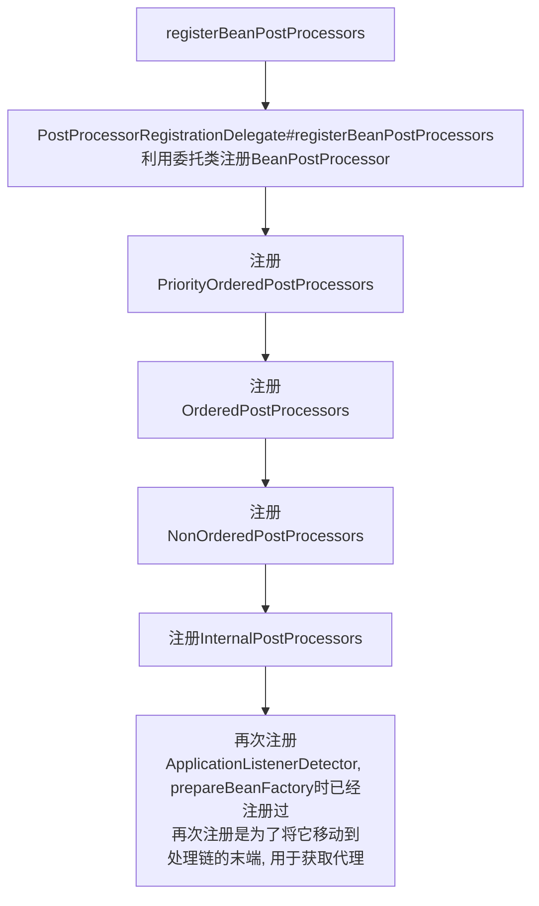

##### initMessageSource

> 初始化国际化资源, 默认注册DelegatingMessageSource类

##### initApplicationEventMulticaster

> 初始化应用程序广播器, 默认注册SimpleApplicationEventMulticaster类

##### onRefresh

> 扩展方法, 例如mvc在这里创建webServer

##### registerListeners

> initApplicationEventMulticaster方法注册了SimpleApplicationEventMulticaster类
>
> 这里AbstractApplicationContext#getApplicationEventMulticaster.addApplicationListener注册监听器, 先注册spring内部监听器, 再注册用户自定义的监听器.
>
> springboot中会有很多事件处理, 可以再springboot中看到详细处理
>
> 同时会发布一些早期事件

##### finishBeanFactoryInitialization

> 实例化beanFactory中所有bean
>
> 这里涉及Bean实例化, 属性填充, PostProcessor注解处理, AOP代理, 循环依赖等问题

###### 什么是三级缓存

其实就是DefaultSingletonBeanRegistry类中的三个成员变量

```java
/** Cache of singleton objects: bean name to bean instance. */
// 存储创建好的bean
private final Map<String, Object> singletonObjects = new ConcurrentHashMap<>(256);

/** Cache of singleton factories: bean name to ObjectFactory. */
// 存储还没初始化完成的bean, 主要用于处理依赖循环中的AOP
private final Map<String, ObjectFactory<?>> singletonFactories = new HashMap<>(16);

/** Cache of early singleton objects: bean name to bean instance. */
// 用于解决依赖循环, 提前暴露bean对象引用
private final Map<String, Object> earlySingletonObjects = new ConcurrentHashMap<>(16);
```

###### doCreateBean创建bean的流程

> AbstractAutowireCapableBeanFactory#doCraeteBean
>
> 实例化bean对象的方法, 包括实例化, 属性填充, Aware生命周期接口, BeanPostProcessor的处理以及无依赖循环的AOP代理

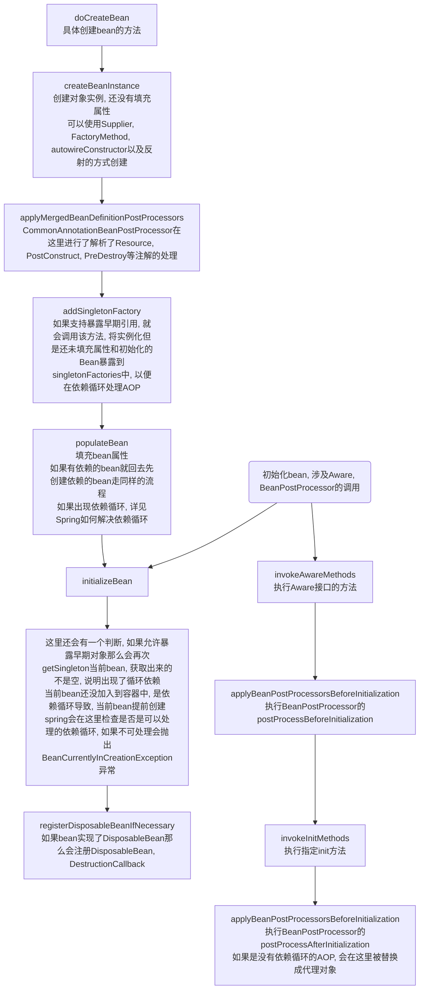

###### Spring如何解决依赖循环

当A类与B类出现依赖循环时, 有三种情况:

1. AB无需代理

    - ```mermaid
        graph TB
        doGetBeanA[doGetBeanA获取bean容器中没有时才会创建] 
        	--> createA[创建A] --> instantitateA[实例化A]
        	--> addSingletonFactoryA[将A类实例存储singletonFactories三级缓存中]
        	--> populateA[填充A类实例的属性]
        	--> initializingA[初始化A, 调用Aware, BeanPostProcessor]
        populateA_info(填充属性时, 发现依赖B, 现在去创建B) --> populateA
        populateA_info --> doGetBeanB[doGetBeanB获取bean容器中没有时才会创建]
        	--> createB[创建B] --> instantitateB[实例化B]
        	--> addSingletonFactoryB[将B类实例存储singletonFactories三级缓存中]
        	--> populateB[填充B类实例的属性]
        	--> initializingB[初始化B, 调用Aware, BeanPostProcessor]
        populateB_info(填充属性时, 发现依赖A, 现在去创建A) --> populateB
        populateB_info --> doGetBeanA_Align[doGetBeanA获取bean, 此时容器中三级缓存singletonFactories中有A<br>直接通过ObjectFactory获取A, 并将A存储二级缓存earlySingletonObjects中<br>这里会处理AOP, 但是现在是没有AOP的情况]
        	--> returnA[返回获取的A对象, 给B做属性填充]
        ```

2. A需要代理, B无需代理, Spring容器先创建A

    - 详见有循环依赖的AOP

3. B无需代理, A需要代理, Spring容器先创建B

    - 详见有循环依赖的AOP

4. AB都需要代理

    - 详见有循环依赖的AOP

## AOP

### 没有依赖循环的AOP

1. A对象需要被代理
    - 普通bean对象aop, 是在bean对象被实例化且属性填充完成后, 通过BeanPostProcessor子类InstantiationAwareBeanPostProcessor子类AnnotationAwareAspectJAutoProxyCreator#postProcessAfterInitialization来处理, 返回代理bean对象

### 有依赖循环的AOP

(这种情况最复杂), 有三种情况:

1. A依赖B, A是非代理bean B是需要代理的bean

    - 先创建A, A被加入singeltonFactories
    - 在populate属性填充时, 依赖B, 则创建B对象
    - B对象是代理对象, 依赖于A, getSingelton(A), 从singletonFactories获取A对象的早期引用即AbstractAutowireCapableBeanFactory#getEarlyBeanReference, 由于A对象无需代理, 直接返回之前创建好的A对象(此时属性还未填充完毕), 并将A对象存入earlySingletonObjects. 此时A对象属性还未填充, 需要等待B对象创建完成
    - B属性填充后, 走普通Bean对象代理流程
    - 返回被代理的B对象, 填充A
    - 最后A对象被创建完毕

2. A依赖B, A是需要代理的bean, B是非代理bean

    - 先创建A, A被加入singeltonFactories

    - 在populate属性填充时, 依赖B, 则创建B对象

    - B对象依赖于A, getSingleton(A), 从singletonFactories获取A对象的早期引用即AbstractAutowireCapableBeanFactory#getEarlyBeanReference, 由于A对象需要被代理, 会由AnnotationAwareAspectJAutoProxyCreator创建代理对象, 存入earlySingletonObjects, 然后返回给B对象

        - ```java
            protected Object getEarlyBeanReference(String beanName, RootBeanDefinition mbd, Object bean) {
               Object exposedObject = bean;
               if (!mbd.isSynthetic() && hasInstantiationAwareBeanPostProcessors()) {
                  for (SmartInstantiationAwareBeanPostProcessor bp : getBeanPostProcessorCache().smartInstantiationAware) {
                     exposedObject = bp.getEarlyBeanReference(exposedObject, beanName);
                  }
               }
               return exposedObject;
            }
            ```

    - B对象属性填充完毕, 返回给A

    - A对象属性填充完毕, 走普通Bean对象代理流程, 但是由于之前生成了A对象向的代理, 此时应该在earlySingletonObjects中, 所以这里不会再次创建代理对象了

    - A对象会在执行玩initializeBean(即执行awre方法与beanPostProcessor后), 再次getSingleton, 获取earlySingletonObjects存储的代理A对象, 将代理A对象返回

        - ```java
            // class AbstractAutowireCapableBeanFactory
            protected Object doCreateBean(String beanName, RootBeanDefinition mbd, @Nullable Object[] args)
                  throws BeanCreationException {
                
               // 省略...
              
               // 填充属性与执行声明周期接口和BeanPostProcessor
            
               // 允许早期引用
               if (earlySingletonExposure) {
                   // 由于A对象在B依赖A时, 被创建且是代理bean
                  Object earlySingletonReference = getSingleton(beanName, false);
                   // 能从earlySingletonObjects中获取到代理A对象
                  if (earlySingletonReference != null) {
                     if (exposedObject == bean) {
                         // 将返回的对象设为代理A对象
                        exposedObject = earlySingletonReference;
                     }
                     else if (!this.allowRawInjectionDespiteWrapping && hasDependentBean(beanName)) {
                        // 省略...
                     }
                  }
               }
               // 省略...
               return exposedObject;
            }
            ```
        
    - 最后A对象创建完毕
    
3. A依赖B, AB都是需要代理的bean

    - 同上

### 依赖循环与三级缓存

以下摘自 https://www.jianshu.com/p/64d42221768


参考文章：[Spring 为何需要三级缓存解决循环依赖，而不是二级缓存](https://links.jianshu.com/go?to=https%3A%2F%2Fwww.cnblogs.com%2Fsemi-sub%2Fp%2F13548479.html)

[Spring是如何利用"三级缓存"巧妙解决Bean的循环依赖问题](https://links.jianshu.com/go?to=https%3A%2F%2Fcloud.tencent.com%2Fdeveloper%2Farticle%2F1497692)

个人理解：
 1、其实把getEarlyBeanReference生成的对象直接保存到二级缓存，无需三级缓存用ObjectFacotry封装原始bean也可以解决循环依赖。三级缓存感觉纯粹是为了延迟调用aop逻辑而已。

2、其实把getEarlyBeanReference生成的对象直接暴露到一级缓存也是可以的。只要引用的地址不变，谁要用就提前给谁。初始化动作可以后面慢慢做。只要引用不变，它初始化完成后，所有引用它的bean都自然而然的能得到完成的该bean。可能spring担心一级缓存既用来存放单例bean，又用来存放提前暴露的bean，会引起混乱。所以，上面徐庶老师说的，只要胆子大，一级缓存够用。解决循环依赖的核心，不在乎几级缓存，而在于提前暴露引用地址即可。

#### 一、先交代下什么是循环依赖，什么是三级缓存

循环依赖：A依赖B，B依赖A
 三级缓存：


```dart
//一级缓存，用来存放初始化完成的单例bean
Map<String, Object> singletonObjects;
//二级缓存，用来存放提前暴露的原始bean
Map<String, Object> earlySingletonObjects;
//三级缓存，用来存放 “包装提前暴露的原始bean”的ObjectFactory对象
Map<String, ObjectFactory<?>> singletonFactories;
```

有人可能会问，提前暴露的对象已经存放在二级缓存了，为啥还要在三级缓存中存放呢？下文会详细解释。

#### 二、循环依赖的解决


```dart
    protected <T> T doGetBean(
            final String name, final Class<T> requiredType, final Object[] args, boolean typeCheckOnly)
            throws BeansException {

        final String beanName = transformedBeanName(name);
        Object bean;

        // Eagerly check singleton cache for manually registered singletons.
        Object sharedInstance = getSingleton(beanName);
        .....//省略
```

getBean的时候，一上来就先去拿一下提前暴露的bean对象。

getSingleton方法如下：


```kotlin
protected Object getSingleton(String beanName, boolean allowEarlyReference) {
        //先去一级缓存拿。新创建的bean，这里一定拿不到
        Object singletonObject = this.singletonObjects.get(beanName);
        //拿不到初始化完成的bean，且该bean正在被创建中
        if (singletonObject == null && isSingletonCurrentlyInCreation(beanName)) {
            synchronized (this.singletonObjects) {
        //优先去二级缓存拿，如果没有再去三级缓存拿。有了，就直接返回。
                singletonObject = this.earlySingletonObjects.get(beanName);
                if (singletonObject == null && allowEarlyReference) {
            //最后一步，去三级缓存拿
                    ObjectFactory<?> singletonFactory = this.singletonFactories.get(beanName);
                    if (singletonFactory != null) {
        //调用三级缓存ObjectFactory的getObject得到提前暴露的对象。
                        singletonObject = singletonFactory.getObject();
        //放到二级缓存中，然后删除三级缓存。可见：同一个提前暴露的bean，只能要么在三级缓存，要么在二级缓存。
                        this.earlySingletonObjects.put(beanName, singletonObject);
                        this.singletonFactories.remove(beanName);
                    }
                }
            }
        }
        return (singletonObject != NULL_OBJECT ? singletonObject : null);
    }
```

我们肯定会有疑问，不就去拿一个尚未初始化完成的bean对象而已嘛？有一个地方存一下，这里取出来，不就行了嘛。为啥非要在搞一个三级缓存呢？
 想知道三级缓存做了啥，就要看下三级缓存的ObjectFactory.getObject到底做了啥？

#### 三、三级缓存的ObjectFactory.getObject到底做了啥？

提前暴露对象的代码在doCreateBean里面。如下：


```dart
protected Object doCreateBean(final String beanName, final RootBeanDefinition mbd, final Object[] args)
            throws BeanCreationException {

        // Instantiate the bean.
        BeanWrapper instanceWrapper = null;
        if (mbd.isSingleton()) {
            instanceWrapper = this.factoryBeanInstanceCache.remove(beanName);
        }
        if (instanceWrapper == null) {
            //实例化bean，尚未初始化
            instanceWrapper = createBeanInstance(beanName, mbd, args);
        }
        final Object bean = (instanceWrapper != null ? instanceWrapper.getWrappedInstance() : null);
        Class<?> beanType = (instanceWrapper != null ? instanceWrapper.getWrappedClass() : null);
        mbd.resolvedTargetType = beanType;

        ..... //省略

        // Eagerly cache singletons to be able to resolve circular references
        // even when triggered by lifecycle interfaces like BeanFactoryAware.
      //判断是否可以提前暴露。判断条件 = 是否单例 && 是否允许(默认true) && 是否创建过程中
        boolean earlySingletonExposure = (mbd.isSingleton() && this.allowCircularReferences &&
                isSingletonCurrentlyInCreation(beanName));
        if (earlySingletonExposure) {
            if (logger.isDebugEnabled()) {
                logger.debug("Eagerly caching bean '" + beanName +
                        "' to allow for resolving potential circular references");
            }
              //这里把尚未初始化的bean，包装成ObjectFactory对象传递给addSingletonFactory方法
            addSingletonFactory(beanName, new ObjectFactory<Object>() {
                @Override
                public Object getObject() throws BeansException {
                    return getEarlyBeanReference(beanName, mbd, bean);
                }
            });
        }

        // Initialize the bean instance.
        Object exposedObject = bean;
        try {
            //注入属性
            populateBean(beanName, mbd, instanceWrapper);
            if (exposedObject != null) {
                //调用初始化方法，初始化bean
                exposedObject = initializeBean(beanName, exposedObject, mbd);
            }
        }
        ...//省略
```

我们看下解决循环依赖的核心方法addSingletonFactory，如下：


```kotlin
protected void addSingletonFactory(String beanName, ObjectFactory<?> singletonFactory) {
        Assert.notNull(singletonFactory, "Singleton factory must not be null");
        synchronized (this.singletonObjects) {
        //bean已经被其他线程初始化完成放到一级缓存了，这里也没必要放到三级缓存
            if (!this.singletonObjects.containsKey(beanName)) {
                //放到三级缓存，然后删除二级缓存(以防有值)
                this.singletonFactories.put(beanName, singletonFactory);
                this.earlySingletonObjects.remove(beanName);
                this.registeredSingletons.add(beanName);
            }
        }
    }
```

可以看到，这里仅仅是把提前暴露的bean封装成的ObjectFactory，放到三级缓存中。

是不是还是不明白为啥需要三级缓存？我们看下上面添加的匿名内部类ObjectFactory的实现。


```java
  new ObjectFactory<Object>() {
        @Override
        public Object getObject() throws BeansException {
                return getEarlyBeanReference(beanName, mbd, bean);
           }
     }
```

答案就在getEarlyBeanReference方法里面，如下：


```tsx
protected Object getEarlyBeanReference(String beanName, RootBeanDefinition mbd, Object bean) {
        Object exposedObject = bean;
        if (bean != null && !mbd.isSynthetic() && hasInstantiationAwareBeanPostProcessors()) {
    //对于有SmartInstantiationAwareBeanPostProcessor，特殊处理
            for (BeanPostProcessor bp : getBeanPostProcessors()) {
                if (bp instanceof SmartInstantiationAwareBeanPostProcessor) {
                    SmartInstantiationAwareBeanPostProcessor ibp = (SmartInstantiationAwareBeanPostProcessor) bp;
                    exposedObject = ibp.getEarlyBeanReference(exposedObject, beanName);
                    if (exposedObject == null) {
                        return null;
                    }
                }
            }
        }
        return exposedObject;
    }
```

这个地方专门用来特殊处理SmartInstantiationAwareBeanPostProcessor接口，说明getEarlyBeanReference也是一个拓展点，作用在这里的生命周期。getEarlyBeanReference的实现到底是啥呢？我们找个最常见的实现类，AbstractAutoProxyCreator。看下它的方法：


```tsx
@Override
    public Object getEarlyBeanReference(Object bean, String beanName) throws BeansException {
        Object cacheKey = getCacheKey(bean.getClass(), beanName);
        if (!this.earlyProxyReferences.contains(cacheKey)) {
            this.earlyProxyReferences.add(cacheKey);
        }
        return wrapIfNecessary(bean, beanName, cacheKey);
    }
```

很神奇的地方，我们在看下AbstractAutoProxyCreator.postProcessAfterInitialization方法：


```tsx
@Override
    public Object postProcessAfterInitialization(Object bean, String beanName) throws BeansException {
        if (bean != null) {
            Object cacheKey = getCacheKey(bean.getClass(), beanName);
            if (!this.earlyProxyReferences.contains(cacheKey)) {
                return wrapIfNecessary(bean, beanName, cacheKey);
            }
        }
        return bean;
    }
```

getEarlyBeanReference和postProcessAfterInitialization，何其相似啊！！！
 postProcessAfterInitialization我们知道，它只会在bean的所有初始化方法完成后，调用aop生成代理类。但是getEarlyBeanReference竟然对**尚未初始化完成的bean**，提前进行了aop代理。**Why？不用初始化完成，就能代理吗？**

一直想不通，最后终于想通了。既然尚未初始化完成的bean都可以提前注入到其他bean里面，为啥就不能提前AOP呢？我们用的是bean的引用，只要这个引用不变，至于引用所指向的对象啥时候初始化完，其实无所谓。其他bean也只是持有的是这个bean的引用，同理AOP代理也是仅仅持有target bean的引用。所以，所有使用到bean的地方，只要实例化完成生成了引用地址，只要这个地址不变，就可以把这个bean当做成熟的bean使用。等整个容器启动完成，这些bean自然而然的就初始化好了，所有引用这个bean的Bean也自然而然的就可以使用了。


image.png

到这里大家应该清楚了，为啥需要三级缓存了吧。如果你依赖的对象是AOP代理，那么就需要用到第三级缓存暂存ObjectFactory。

你可能又会问，为啥这里不直接把getEarlyBeanReference生成的对象，放到二级缓存里面呢？这样不也节省了三级缓存嘛？为啥非要在getBean.getSingleton里面去调用getObject呢?

这个问题问得好，其实我也觉得可以。我目前也没答案，可能spring基于效率的考虑吧。

个人理解：
 1、其实把getEarlyBeanReference生成的对象直接保存到二级缓存，无需三级缓存用ObjectFacotry封装原始bean也可以解决循环依赖。三级缓存感觉纯粹是为了延迟调用aop逻辑而已。
 2、其实把getEarlyBeanReference生成的对象直接暴露到一级缓存也是可以的。只要引用的地址不变，谁要用就提前给谁。初始化动作可以后面慢慢做。只要引用不变，它初始化完成后，所有引用它的bean都自然而然的能得到完成的该bean。可能spring担心一级缓存既用来存放单例bean，又用来存放提前暴露的bean，会引起混乱。所以，上面徐庶老师说的，只要胆子大，一级缓存够用。解决循环依赖的核心，不在乎几级缓存，而在于提前暴露引用地址即可。
