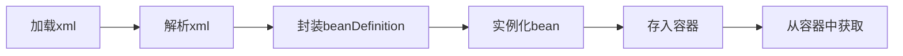
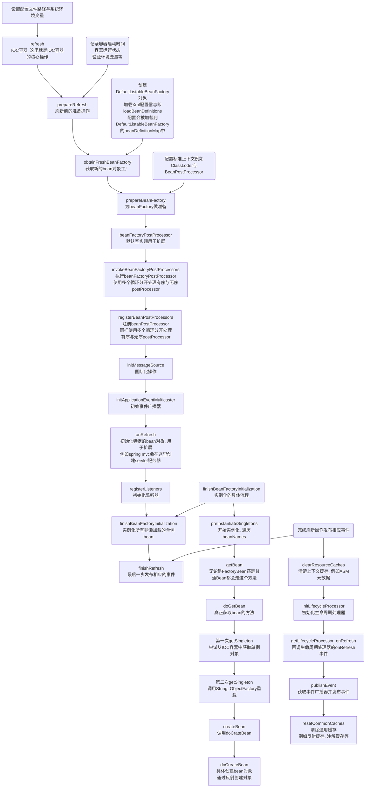
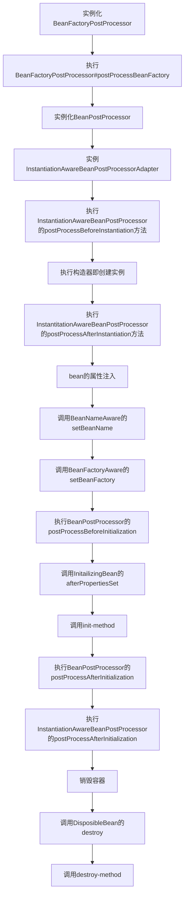
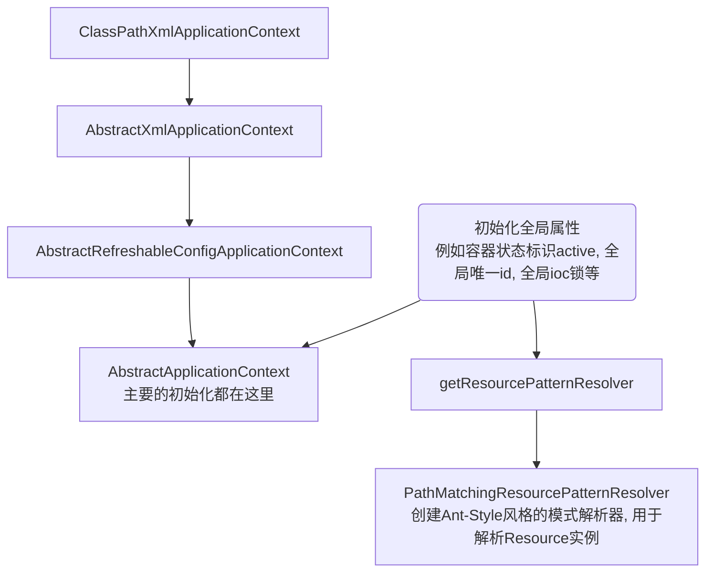
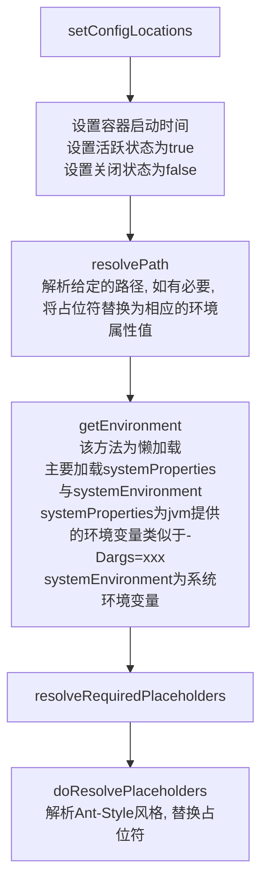
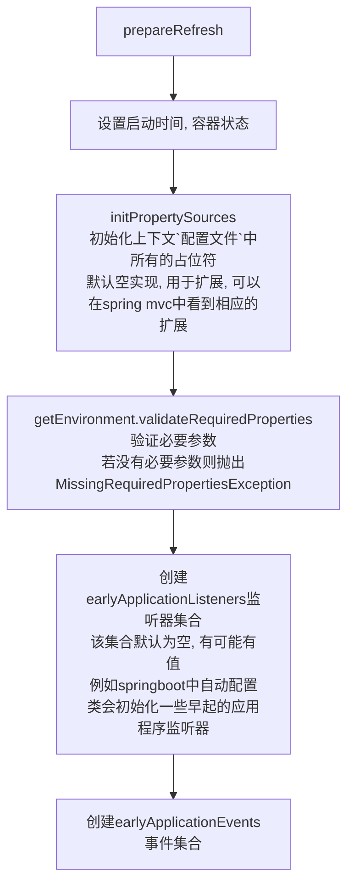
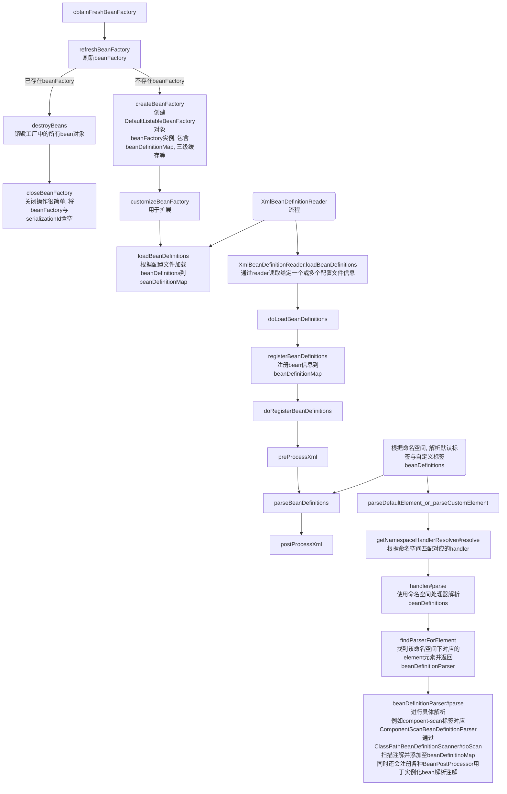

# Spring源码

## IOC

### IOC源码概览

#### 从简单Demo理解spring的流程

使用spring框架时我们会配置xml, spring从xml加载bean对象, 这是最简单的demo

将上述操作在源码中可以简述为:



#### 源码流程图

> 核心逻辑就是refresh方法



### SpringBean生命周期




### Spring 源码流程

> 以ClassPathXmlApplicationContext为列

```java
public ClassPathXmlApplicationContext(
    String[] configLocations, boolean refresh, @Nullable ApplicationContext parent)
    throws BeansException {
	// 调用父类构造器, 初始化全局属性.
    // 例如容器状态标识active, 全局唯一id, 全局ioc锁等
    super(parent);
    // 设置配置文件路径, 初始化Enviroment对象(存储环境变量, 系统环境变量与用户给定的环境变量)
    setConfigLocations(configLocations);
    if (refresh) {
        // IOC核心逻辑
        refresh();
    }
}
```

#### super

调用父类构造器, 创建全局属性, 全局唯一id, 初始化资源解析器(解析Ant-Style风格的模式), 并设置父容器



#### setConfigLocations

> 设置配置文件路径, 初始化Enviroment对象(存储环境变量, 系统环境变量与用户给定的环境变量)



#### refresh

> IOC核心方法, 根据配置刷新整个IOC容器

##### prepareRefresh

> 为刷新上下文做准备



##### obtainFreshBeanFactory

> 刷新并获取内部的beanFactory
>
> 加载所有beanDefinition信息, Component, Service, Repository等注解也是在这里解析的



##### prepareBeanFactory

> 准备beanFactory

* 设置BeanClassLoader
* bean spring el表达式解析器
* 设置PropertyEditorRegistrar, 属性处理器, 列如将字符串`A省_B市_C区`解析为Address对象
* 添加ApplicationContextAwareProcessor
* ignoreDependencyInterface忽略各种Aware生命周期接口, 后续实例化bean后会在invokeAwareMethods里执行, 这里不需要执行
* registerResolvableDependency预装配各种对象, 例如BeanFactory, ApplicationContext, ResourceLoader
* 添加ApplicationListenerDetector应用程序事件监听器BeanPostProcessor
* 初始化各种Environment, 注册到beanFactory中

##### postProcessBeanFactory

>扩展方法

## AOP

