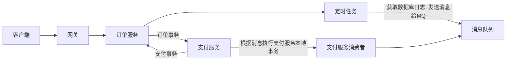

# 分布式事务

> 常见的分布式事务解决方案

* 2pc
    * 两阶段提交
* 3pc
    * 三阶段提交
* 消息队列
    * 基于消息队列实现异步通知
* 最大努力通知

## 消息队列-定时任务-本地事件表

> 基于ActiveMQ实现分布式事务



* 如果在定时任务发送时出现错误
    * 定时任务发送错误
        * 全部回滚没有问题
    * crud出错 回滚 为了防止消息发送, 应该将消息放在curd后面(放在最后)
* 支付服务的消费者消费消息时出现错误
    * 本地事务回滚
    * 如果支持回调, 回滚调用方事务
    * 多次出错事务进入死信队列
        * 人工处理
        * 脚本处理

#### 依赖

```xml
<dependency>
    <groupId>org.springframework.boot</groupId>
    <artifactId>spring-boot-starter-activemq</artifactId>
</dependency>
<dependency>
    <groupId>org.springframework.boot</groupId>
    <artifactId>spring-boot-starter-web</artifactId>
</dependency>
<dependency>
    <groupId>com.baomidou</groupId>
    <artifactId>mybatis-plus-boot-starter</artifactId>
    <version>3.4.2</version>
</dependency>
<dependency>
    <groupId>mysql</groupId>
    <artifactId>mysql-connector-java</artifactId>
</dependency>
<dependency>
    <groupId>com.alibaba</groupId>
    <artifactId>fastjson</artifactId>
    <version>1.2.78</version>
</dependency>

<dependency>
    <groupId>org.projectlombok</groupId>
    <artifactId>lombok</artifactId>
    <optional>true</optional>
</dependency>
```

#### 配置

activemq配置死信队列

```xml
<policyEntry queue="distributedTransactionDeadQueue">
    <deadLetterStrategy>
	    <individualDeadLetterStrategy processNonPersistent="true" useQueueForQueueMessages="true" queuePrefix="DLQ."/>
    </deadLetterStrategy>
</policyEntry>
```

yaml

```yaml
spring:
  application:
    name: service-order
#    name: service-pay
  datasource:
    url: jdbc:mysql://node1.com:3306/online_taxi_service_order?serverTimezone=Asia/Shanghai
    username: root
    password: tiger
    driver-class-name: com.mysql.cj.jdbc.Driver
  activemq:
    broker-url: nio://localhost:61617
    user: admin
    password: admin

mybatis-plus:
  configuration:
    log-impl: org.apache.ibatis.logging.stdout.StdOutImpl

logging:
  level:
    com.lcw.serviceorder: debug

server:
  port: 5001
```

#### 代码

##### service-order服务

activemq配置

```java
package com.lcw.serviceorder.config;

import org.apache.activemq.ActiveMQConnectionFactory;
import org.apache.activemq.command.ActiveMQQueue;
import org.springframework.beans.factory.annotation.Value;
import org.springframework.context.annotation.Bean;
import org.springframework.context.annotation.Configuration;

import javax.jms.ConnectionFactory;
import javax.jms.Queue;

@Configuration
public class ActiveMQConfig {
    @Value("${spring.activemq.broker-url}")
    private String brokerUrl;

    @Bean
    public Queue queue() {
        return new ActiveMQQueue("ActiveMQCQueue");
    }

    @Bean
    public ConnectionFactory connectionFactory() {
        return new ActiveMQConnectionFactory(brokerUrl);
    }
}
```

定时任务

```java
@Component
@Slf4j
@RequiredArgsConstructor
@Async
public class ProducerTask {

    private final TblOrderEventService tblOrderEventService;

    private final Queue queue;

    private final JmsMessagingTemplate jmsMessagingTemplate;

    @Scheduled(cron = "0/5 * * * * ?")
    @Transactional(rollbackFor = Exception.class)
    public void task() {
        log.info("------定时任务开始------");

        // NEW状态的事件
        final List<TblOrderEvent> orderEvents = tblOrderEventService.selectByOrderType(OrderType.NEW.getValue());

        for (TblOrderEvent orderEvent : orderEvents) {
            tblOrderEventService.updateOrderTypeById(orderEvent.getId(), OrderType.SENT.getValue());
            log.debug("修改事件表id: {}, orderType: {} => orderType: {}",
                    orderEvent.getId(), orderEvent.getOrderType(), OrderType.SENT.name());

            /*
             先本地事务, 再发送到mq
                本地事务成功
                    发送消息
                        消息发送成功
                            正常流程
                        消息发送失败
                            回滚
                本地事务失败
                    不发送消息
            */
            /* 分布式消息没有100%可靠性
               发送消息到mq后, 由消费者消费数据, 来完成远程事务
                    如果消费者, 事务操作成功
                        ack确认消息, 这次分布式事务结束, 没毛病
                    如果消费者, 事务操作失败(异常)
                        recover再投递消息, 再次消费消息
                            成功 ack
                            失败多次后(ActiveMQ默认6次)进入死信队列, 进行补偿操作
             */
            jmsMessagingTemplate.convertAndSend(queue, JSONObject.toJSONString(orderEvent));
            log.debug("消息发送完毕id: {}, orderType: {} => orderType: {}, 发送成功对方确认后修改数据库, 能执行这条数据就要保证",
                    orderEvent.getId(), orderEvent.getOrderType(), OrderType.SENT.name());
        }

        log.info("------定时任务结束------");
    }
}
```

##### service-pay服务

activemq配置

```java
package com.lcw.servicepay.config;

import org.apache.activemq.ActiveMQConnectionFactory;
import org.apache.activemq.RedeliveryPolicy;
import org.springframework.beans.factory.annotation.Value;
import org.springframework.context.annotation.Bean;
import org.springframework.context.annotation.Configuration;
import org.springframework.jms.config.DefaultJmsListenerContainerFactory;
import org.springframework.jms.config.JmsListenerContainerFactory;

import javax.jms.ConnectionFactory;
import javax.jms.Session;

@Configuration
public class ActiveMQConfig {
    @Value("${spring.activemq.broker-url}")
    private String brokerUrl;

    @Bean
    public ConnectionFactory connectionFactory(RedeliveryPolicy redeliveryPolicy) {
        final ActiveMQConnectionFactory connectionFactory = new ActiveMQConnectionFactory(brokerUrl);
        // 再投递策略, 如果消费消息失败了, 下一次可以重新消费
        connectionFactory.setRedeliveryPolicy(redeliveryPolicy);
        return connectionFactory;
    }

    /**
     * 再投递策略
     */
    @Bean
    public RedeliveryPolicy redeliveryPolicy() {
        return new RedeliveryPolicy();
    }

    /**
     * 配置消息队列确认机制
     */
    public JmsListenerContainerFactory jmsListenerContainerFactory(ActiveMQConnectionFactory connectionFactory) {
        final DefaultJmsListenerContainerFactory jmsListenerContainerFactory
                = new DefaultJmsListenerContainerFactory();
        jmsListenerContainerFactory.setConnectionFactory(connectionFactory);
        // 设置会话确认模式, 客户端手动确认
        jmsListenerContainerFactory.setSessionAcknowledgeMode(Session.CLIENT_ACKNOWLEDGE);
        return jmsListenerContainerFactory;
    }
}
```

消费者监听

```java
package com.lcw.servicepay.mq.consumer;

import com.alibaba.fastjson.JSONObject;
import com.lcw.servicepay.bean.TblOrderEvent;
import com.lcw.servicepay.bean.TblPayEvent;
import com.lcw.servicepay.service.TblPayEventService;
import lombok.RequiredArgsConstructor;
import lombok.extern.slf4j.Slf4j;
import org.springframework.jms.annotation.JmsListener;
import org.springframework.stereotype.Component;

import javax.jms.JMSException;
import javax.jms.Message;
import javax.jms.Session;
import javax.jms.TextMessage;
import java.util.Date;

@Component
@Slf4j
@RequiredArgsConstructor
public class ConsumerQueue {

    private final TblPayEventService tblPayEventService;

    @JmsListener(destination = "ActiveMQCQueue", containerFactory = "jmsListenerContainerFactory")
//    @Transactional 不需要事务, 如果失败, 会将消息再投递, 再次消费的时候, 会因为主键重复避免重复插入
    public void receive(TextMessage textMessage, Session session) throws JMSException {
        try {
            final String msg = textMessage.getText();
            TblOrderEvent tblOrderEvent = JSONObject.parseObject(msg, TblOrderEvent.class);
            log.info("收到消息: {}", msg);
            final TblPayEvent tblPayEvent
                    = new TblPayEvent()
                    .setId(tblOrderEvent.getId())
                    .setCreateTime(new Date())
                    .setUpdateTime(new Date())
                    .setContent(msg);
            tblPayEventService.saveWithId(tblPayEvent);
            int i = 1 / 0; // 不需要回滚, 由session.recover()再次消费
            textMessage.acknowledge();
        } catch (Exception e) {
            log.error("消息处理失败, 走补偿逻辑", e);
            session.recover();
        }
    }

    @JmsListener(destination = "ActiveMQ.DLQ")
    public void receiveDeadQueue(Message message) {
        log.info("死信队列, 走补偿逻辑: {}", message);
    }
}
```

## TX-LCN

> 国产分布式事务框架
>
> 5.0版本实现了LCN(Lock Confirm Notify), TCC(Try Confirm Cancel), TXC(Taobao Transaction Constructor)等分布式事务解决方案

### 事务控制原理

详见[官网](https://www.codingapi.com/)


### TransactionManager

```xml
<dependency>
    <groupId>com.codingapi.txlcn</groupId>
    <artifactId>txlcn-tm</artifactId>
    <version>5.0.2.RELEASE</version>
</dependency>
<dependency>
    <groupId>com.codingapi.txlcn</groupId>
    <artifactId>txlcn-tc</artifactId>
    <version>5.0.2.RELEASE</version>
</dependency>
<dependency>
    <groupId>com.codingapi.txlcn</groupId>
    <artifactId>txlcn-txmsg-netty</artifactId>
    <version>5.0.2.RELEASE</version>
</dependency>
<dependency>
    <groupId>mysql</groupId>
    <artifactId>mysql-connector-java</artifactId>
</dependency>
```

启动类加上注解`@EnableTransactionManagerServer`开启tm服务器

配置

```properties
# 应用名称
spring.application.name=tx-manager
# 注意txlcn(5.0.2)不支持 yaml, 只能使用properties
server.port=6011
# 数据源配置
spring.datasource.url=jdbc:mysql://node2.com:3306/tx-manager?serverTimezone=UTC
spring.datasource.username=root
spring.datasource.password=tiger
spring.datasource.driver-class-name=com.mysql.cj.jdbc.Driver
# redis
spring.redis.host=node2.com
spring.redis.port=6379
spring.redis.database=0
# tx-lcn
tx-lcn.manager.admin-key=lcw
tx-lcn.logger.enabled=true
#tx-lcn.logger.data-source-class-name=com.mysql.cj.jdbc.Driver
tx-lcn.logger.jdbc-url=jdbc:mysql://node2.com:3306/tx-manager?serverTimezone=UTC
tx-lcn.logger.username=root
tx-lcn.logger.password=tiger
```

### ResourceManager

```xml
<dependency>
    <groupId>org.springframework.cloud</groupId>
    <artifactId>spring-cloud-starter-netflix-eureka-client</artifactId>
</dependency>
<dependency>
    <groupId>mysql</groupId>
    <artifactId>mysql-connector-java</artifactId>
</dependency>

<dependency>
    <groupId>com.codingapi.txlcn</groupId>
    <artifactId>txlcn-tc</artifactId>
    <version>5.0.2.RELEASE</version>
</dependency>
<dependency>
    <groupId>com.codingapi.txlcn</groupId>
    <artifactId>txlcn-txmsg-netty</artifactId>
    <version>5.0.2.RELEASE</version>
</dependency>
<dependency>
    <groupId>com.baomidou</groupId>
    <artifactId>mybatis-plus-boot-starter</artifactId>
    <version>3.4.2</version>
</dependency>
<dependency>
    <groupId>mysql</groupId>
    <artifactId>mysql-connector-java</artifactId>
</dependency>
```

启动类加上注解`@EnableDistributedTransaction`开启分布式事务

配置

```properties
# 应用名称
spring.application.name=lcn-pay
server.port=6003
# 数据库
spring.datasource.url=jdbc:mysql://node2.com:3306/lcn_pay?serverTimezone=UTC
spring.datasource.username=root
spring.datasource.password=tiger
spring.datasource.driver-class-name=com.mysql.cj.jdbc.Driver
# eureka
eureka.client.service-url.defaultZone=http://euk.com:7900/eureka/
# tx-lcn
tx-lcn.client.manager-address=127.0.0.1:6111,127.0.0.1:6112
logging.level.com.lcw.lcnpay=debug
```

> !!!注意在使用tcc时, confirm与cancel方法可能与mapping方法不是一个线程, 不要使用尝试使用threadLocal保证线程安全

service-order服务

```kotlin
@RestController
class OrderController(
    val restTemplate: RestTemplate,
    val tblOrderService: TblOrderService,
) {
    val tlId: ThreadLocal<Int> = ThreadLocal()

    val idMap: ConcurrentHashMap<String, Int> = ConcurrentHashMap()

    @PostMapping("/insertOrder")
    @Transactional
    @LcnTransaction
    fun add(@RequestBody tblOrder: TblOrder): String {
        tblOrderService.save(tblOrder)
        // 远程事务
        val headers = HttpHeaders()
        headers.contentType = MediaType.APPLICATION_JSON
        val tblPay = TblPay(0, "pay")
        val httpEntity = HttpEntity<TblPay>(tblPay, headers)
        val res = restTemplate.postForObject("http://lcn-pay/insertPay", httpEntity, String::class.java);
        log.info("远程事务执行结果: {}", res)
        val i = 1 / 0
        return "新增订单成功"
    }

    @PostMapping("/insertOrder-tcc")
    @Transactional
    // 该注解会默认匹配confirm和cancel开头加上方法名首字母大写的方式
    @TccTransaction(confirmMethod = "confirmAddByTcc", cancelMethod = "cancelAddByTcc")
    fun addByTcc(@RequestBody tblOrder: TblOrder): String {
        tblOrderService.save(tblOrder)
        // 在远程服务调用时(远程事务管理), threadLocal无法使用, 远程的执行线程是tc-service里的, 不是tomcat线程
        tlId.set(tblOrder.id)
        idMap[tblOrder.name] = tblOrder.id
        // 远程事务
        val headers = HttpHeaders()
        headers.contentType = MediaType.APPLICATION_JSON
        val tblPay = TblPay(0, "pay")
        val httpEntity = HttpEntity<TblPay>(tblPay, headers)
        val res = restTemplate.postForObject("http://lcn-pay/insertPay-tcc", httpEntity, String::class.java);
        log.info("远程事务执行结果: {}", res)
        val i = 1 / 0
        return "新增订单成功 tcc"
    }

    fun confirmAddByTcc(tblOrder: TblOrder): String {
        log.info("confirm addByTcc")
        return "新增订单"
    }

    fun cancelAddByTcc(tblOrder: TblOrder): String {
        log.info("threadLocalId: {}", tlId.get())
        log.info("idMap[{}]: {}", tblOrder.name, idMap[tblOrder.name])
//        tblOrderService.removeById(tlId.get())
        tblOrderService.removeById(idMap[tblOrder.name])
        log.error("新增订单失败 执行逆sql")
        return "新增订单失败"
    }
}
```

service-pay服务

```kotlin
@RestController
class PayController(
    val tblPayService: TblPayService
) {

    val tlId: ThreadLocal<Int> = ThreadLocal()

    val idMap: ConcurrentHashMap<String, Int> = ConcurrentHashMap()

    @PostMapping("insertPay")
    @Transactional
    @LcnTransaction
    fun insertPay(@RequestBody tblPay: TblPay): String {
        tblPayService.save(tblPay)
        return "成功插入支付信息"
    }

    @PostMapping("insertPay-tcc")
    @Transactional
    @TccTransaction
    fun insertPayByTcc(@RequestBody tblPay: TblPay): String {
        tblPayService.save(tblPay)
        // 在远程服务调用时(远程事务管理), threadLocal无法使用, 远程的执行线程是tc-service里的, 不是tomcat线程
        tlId.set(tblPay.id)
        idMap[tblPay.name] = tblPay.id
        log.debug("insertPayByTcc thread: {}", Thread.currentThread().name)
        return "成功插入支付信息"
    }

    fun confirmInsertPayByTcc(@RequestBody tblPay: TblPay) {
        log.info("pay confirm")
    }

    fun cancelInsertPayByTcc(@RequestBody tblPay: TblPay) {
        log.error("pay cancel")
        log.error("插入支付信息失败, tlId: {}", tlId.get())
        log.error("插入支付信息失败, idMap[{}]: {}", tblPay.name, idMap[tblPay.name])
        log.debug("cancelInsertPayByTcc thread: {}", Thread.currentThread().name)
//        tblPayService.removeById(tlId.get())
        tblPayService.removeById(idMap[tblPay.name])
    }
}
```
