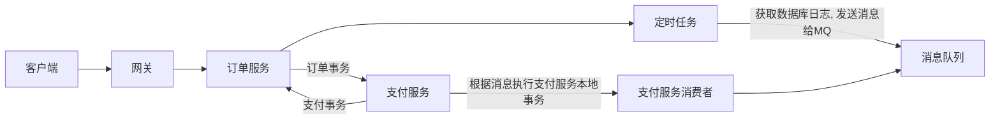

# 分式事务

> 常见的分布式事务解决方案

* 2pc
    * 两阶段提交
* 3pc
    * 三阶段提交
* 消息队列
    * 基于消息队列实现异步通知
* 最大努力通知

## 消息队列-定时任务-本地事件表

> 基于ActiveMQ实现分布式事务



* 如果在定时任务发送时出现错误
    * 定时任务发送错误
        * 全部回滚没有问题
    * crud出错 回滚 为了防止消息发送, 应该将消息放在curd后面(放在最后)
* 支付服务的消费者消费消息时出现错误
    * 本地事务回滚
    * 如果支持回调, 回滚调用方事务
    * 多次出错事务进入死信队列
        * 人工处理
        * 脚本处理

#### 依赖

```xml
<dependency>
    <groupId>org.springframework.boot</groupId>
    <artifactId>spring-boot-starter-activemq</artifactId>
</dependency>
<dependency>
    <groupId>org.springframework.boot</groupId>
    <artifactId>spring-boot-starter-web</artifactId>
</dependency>
<dependency>
    <groupId>com.baomidou</groupId>
    <artifactId>mybatis-plus-boot-starter</artifactId>
    <version>3.4.2</version>
</dependency>
<dependency>
    <groupId>mysql</groupId>
    <artifactId>mysql-connector-java</artifactId>
</dependency>
<dependency>
    <groupId>com.alibaba</groupId>
    <artifactId>fastjson</artifactId>
    <version>1.2.78</version>
</dependency>

<dependency>
    <groupId>org.projectlombok</groupId>
    <artifactId>lombok</artifactId>
    <optional>true</optional>
</dependency>
```

#### 配置

activemq配置死信队列

```xml
<policyEntry queue="distributedTransactionDeadQueue">
    <deadLetterStrategy>
	    <individualDeadLetterStrategy processNonPersistent="true" useQueueForQueueMessages="true" queuePrefix="DLQ."/>
    </deadLetterStrategy>
</policyEntry>
```

yaml

```yaml
spring:
  application:
    name: service-order
#    name: service-pay
  datasource:
    url: jdbc:mysql://node1.com:3306/online_taxi_service_order?serverTimezone=Asia/Shanghai
    username: root
    password: tiger
    driver-class-name: com.mysql.cj.jdbc.Driver
  activemq:
    broker-url: nio://localhost:61617
    user: admin
    password: admin

mybatis-plus:
  configuration:
    log-impl: org.apache.ibatis.logging.stdout.StdOutImpl

logging:
  level:
    com.lcw.serviceorder: debug

server:
  port: 5001
```

#### 代码

##### service-order服务

activemq配置

```java
package com.lcw.serviceorder.config;

import org.apache.activemq.ActiveMQConnectionFactory;
import org.apache.activemq.command.ActiveMQQueue;
import org.springframework.beans.factory.annotation.Value;
import org.springframework.context.annotation.Bean;
import org.springframework.context.annotation.Configuration;

import javax.jms.ConnectionFactory;
import javax.jms.Queue;

@Configuration
public class ActiveMQConfig {
    @Value("${spring.activemq.broker-url}")
    private String brokerUrl;

    @Bean
    public Queue queue() {
        return new ActiveMQQueue("ActiveMQCQueue");
    }

    @Bean
    public ConnectionFactory connectionFactory() {
        return new ActiveMQConnectionFactory(brokerUrl);
    }
}
```

定时任务

```java
@Component
@Slf4j
@RequiredArgsConstructor
@Async
public class ProducerTask {

    private final TblOrderEventService tblOrderEventService;

    private final Queue queue;

    private final JmsMessagingTemplate jmsMessagingTemplate;

    @Scheduled(cron = "0/5 * * * * ?")
    @Transactional(rollbackFor = Exception.class)
    public void task() {
        log.info("------定时任务开始------");

        // NEW状态的事件
        final List<TblOrderEvent> orderEvents = tblOrderEventService.selectByOrderType(OrderType.NEW.getValue());

        for (TblOrderEvent orderEvent : orderEvents) {
            tblOrderEventService.updateOrderTypeById(orderEvent.getId(), OrderType.SENT.getValue());
            log.debug("修改事件表id: {}, orderType: {} => orderType: {}",
                    orderEvent.getId(), orderEvent.getOrderType(), OrderType.SENT.name());

            /*
             先本地事务, 再发送到mq
                本地事务成功
                    发送消息
                        消息发送成功
                            正常流程
                        消息发送失败
                            回滚
                本地事务失败
                    不发送消息
            */
            /* 分布式消息没有100%可靠性
               发送消息到mq后, 由消费者消费数据, 来完成远程事务
                    如果消费者, 事务操作成功
                        ack确认消息, 这次分布式事务结束, 没毛病
                    如果消费者, 事务操作失败(异常)
                        recover再投递消息, 再次消费消息
                            成功 ack
                            失败多次后(ActiveMQ默认6次)进入死信队列, 进行补偿操作
             */
            jmsMessagingTemplate.convertAndSend(queue, JSONObject.toJSONString(orderEvent));
            log.debug("消息发送完毕id: {}, orderType: {} => orderType: {}, 发送成功对方确认后修改数据库, 能执行这条数据就要保证",
                    orderEvent.getId(), orderEvent.getOrderType(), OrderType.SENT.name());
        }

        log.info("------定时任务结束------");
    }
}
```

##### service-pay服务

activemq配置

```java
package com.lcw.servicepay.config;

import org.apache.activemq.ActiveMQConnectionFactory;
import org.apache.activemq.RedeliveryPolicy;
import org.springframework.beans.factory.annotation.Value;
import org.springframework.context.annotation.Bean;
import org.springframework.context.annotation.Configuration;
import org.springframework.jms.config.DefaultJmsListenerContainerFactory;
import org.springframework.jms.config.JmsListenerContainerFactory;

import javax.jms.ConnectionFactory;
import javax.jms.Session;

@Configuration
public class ActiveMQConfig {
    @Value("${spring.activemq.broker-url}")
    private String brokerUrl;

    @Bean
    public ConnectionFactory connectionFactory(RedeliveryPolicy redeliveryPolicy) {
        final ActiveMQConnectionFactory connectionFactory = new ActiveMQConnectionFactory(brokerUrl);
        // 再投递策略, 如果消费消息失败了, 下一次可以重新消费
        connectionFactory.setRedeliveryPolicy(redeliveryPolicy);
        return connectionFactory;
    }

    /**
     * 再投递策略
     */
    @Bean
    public RedeliveryPolicy redeliveryPolicy() {
        return new RedeliveryPolicy();
    }

    /**
     * 配置消息队列确认机制
     */
    public JmsListenerContainerFactory jmsListenerContainerFactory(ActiveMQConnectionFactory connectionFactory) {
        final DefaultJmsListenerContainerFactory jmsListenerContainerFactory
                = new DefaultJmsListenerContainerFactory();
        jmsListenerContainerFactory.setConnectionFactory(connectionFactory);
        // 设置会话确认模式, 客户端手动确认
        jmsListenerContainerFactory.setSessionAcknowledgeMode(Session.CLIENT_ACKNOWLEDGE);
        return jmsListenerContainerFactory;
    }
}
```

消费者监听

```java
package com.lcw.servicepay.mq.consumer;

import com.alibaba.fastjson.JSONObject;
import com.lcw.servicepay.bean.TblOrderEvent;
import com.lcw.servicepay.bean.TblPayEvent;
import com.lcw.servicepay.service.TblPayEventService;
import lombok.RequiredArgsConstructor;
import lombok.extern.slf4j.Slf4j;
import org.springframework.jms.annotation.JmsListener;
import org.springframework.stereotype.Component;

import javax.jms.JMSException;
import javax.jms.Message;
import javax.jms.Session;
import javax.jms.TextMessage;
import java.util.Date;

@Component
@Slf4j
@RequiredArgsConstructor
public class ConsumerQueue {

    private final TblPayEventService tblPayEventService;

    @JmsListener(destination = "ActiveMQCQueue", containerFactory = "jmsListenerContainerFactory")
//    @Transactional 不需要事务, 如果失败, 会将消息再投递, 再次消费的时候, 会因为主键重复避免重复插入
    public void receive(TextMessage textMessage, Session session) throws JMSException {
        try {
            final String msg = textMessage.getText();
            TblOrderEvent tblOrderEvent = JSONObject.parseObject(msg, TblOrderEvent.class);
            log.info("收到消息: {}", msg);
            final TblPayEvent tblPayEvent
                    = new TblPayEvent()
                    .setId(tblOrderEvent.getId())
                    .setCreateTime(new Date())
                    .setUpdateTime(new Date())
                    .setContent(msg);
            tblPayEventService.saveWithId(tblPayEvent);
            int i = 1 / 0; // 不需要回滚, 由session.recover()再次消费
            textMessage.acknowledge();
        } catch (Exception e) {
            log.error("消息处理失败, 走补偿逻辑", e);
            session.recover();
        }
    }

    @JmsListener(destination = "ActiveMQ.DLQ")
    public void receiveDeadQueue(Message message) {
        log.info("死信队列, 走补偿逻辑: {}", message);
    }
}
```

## TX-LCN

> 国产分布式事务框架
>
> 5.0版本实现了LCN(Lock Confirm Notify), TCC(Try Confirm Cancel), TXC(Taobao Transaction Constructor)等分布式事务解决方案

### 事务控制原理

详见[官网](https://www.codingapi.com/)


### TransactionManager

```xml
<dependency>
    <groupId>com.codingapi.txlcn</groupId>
    <artifactId>txlcn-tm</artifactId>
    <version>5.0.2.RELEASE</version>
</dependency>
<dependency>
    <groupId>com.codingapi.txlcn</groupId>
    <artifactId>txlcn-tc</artifactId>
    <version>5.0.2.RELEASE</version>
</dependency>
<dependency>
    <groupId>com.codingapi.txlcn</groupId>
    <artifactId>txlcn-txmsg-netty</artifactId>
    <version>5.0.2.RELEASE</version>
</dependency>
<dependency>
    <groupId>mysql</groupId>
    <artifactId>mysql-connector-java</artifactId>
</dependency>
```

启动类加上注解`@EnableTransactionManagerServer`开启tm服务器

配置

```properties
# 应用名称
spring.application.name=tx-manager
# 注意txlcn(5.0.2)不支持 yaml, 只能使用properties
server.port=6011
# 数据源配置
spring.datasource.url=jdbc:mysql://node2.com:3306/tx-manager?serverTimezone=UTC
spring.datasource.username=root
spring.datasource.password=tiger
spring.datasource.driver-class-name=com.mysql.cj.jdbc.Driver
# redis
spring.redis.host=node2.com
spring.redis.port=6379
spring.redis.database=0
# tx-lcn
tx-lcn.manager.admin-key=lcw
tx-lcn.logger.enabled=true
#tx-lcn.logger.data-source-class-name=com.mysql.cj.jdbc.Driver
tx-lcn.logger.jdbc-url=jdbc:mysql://node2.com:3306/tx-manager?serverTimezone=UTC
tx-lcn.logger.username=root
tx-lcn.logger.password=tiger
```

### ResourceManager

```xml
<dependency>
    <groupId>org.springframework.cloud</groupId>
    <artifactId>spring-cloud-starter-netflix-eureka-client</artifactId>
</dependency>
<dependency>
    <groupId>mysql</groupId>
    <artifactId>mysql-connector-java</artifactId>
</dependency>

<dependency>
    <groupId>com.codingapi.txlcn</groupId>
    <artifactId>txlcn-tc</artifactId>
    <version>5.0.2.RELEASE</version>
</dependency>
<dependency>
    <groupId>com.codingapi.txlcn</groupId>
    <artifactId>txlcn-txmsg-netty</artifactId>
    <version>5.0.2.RELEASE</version>
</dependency>
<dependency>
    <groupId>com.baomidou</groupId>
    <artifactId>mybatis-plus-boot-starter</artifactId>
    <version>3.4.2</version>
</dependency>
<dependency>
    <groupId>mysql</groupId>
    <artifactId>mysql-connector-java</artifactId>
</dependency>
```

启动类加上注解`@EnableDistributedTransaction`开启分布式事务

配置

```properties
# 应用名称
spring.application.name=lcn-pay
server.port=6003
# 数据库
spring.datasource.url=jdbc:mysql://node2.com:3306/lcn_pay?serverTimezone=UTC
spring.datasource.username=root
spring.datasource.password=tiger
spring.datasource.driver-class-name=com.mysql.cj.jdbc.Driver
# eureka
eureka.client.service-url.defaultZone=http://euk.com:7900/eureka/
# tx-lcn
tx-lcn.client.manager-address=127.0.0.1:6111,127.0.0.1:6112
logging.level.com.lcw.lcnpay=debug
```

> !!!注意在使用tcc时, confirm与cancel方法可能与mapping方法不是一个线程, 不要使用尝试使用threadLocal保证线程安全

service-order服务

```kotlin
@RestController
class OrderController(
    val restTemplate: RestTemplate,
    val tblOrderService: TblOrderService,
) {
    val tlId: ThreadLocal<Int> = ThreadLocal()

    val idMap: ConcurrentHashMap<String, Int> = ConcurrentHashMap()

    @PostMapping("/insertOrder")
    @Transactional
    @LcnTransaction
    fun add(@RequestBody tblOrder: TblOrder): String {
        tblOrderService.save(tblOrder)
        // 远程事务
        val headers = HttpHeaders()
        headers.contentType = MediaType.APPLICATION_JSON
        val tblPay = TblPay(0, "pay")
        val httpEntity = HttpEntity<TblPay>(tblPay, headers)
        val res = restTemplate.postForObject("http://lcn-pay/insertPay", httpEntity, String::class.java);
        log.info("远程事务执行结果: {}", res)
        val i = 1 / 0
        return "新增订单成功"
    }

    @PostMapping("/insertOrder-tcc")
    @Transactional
    // 该注解会默认匹配confirm和cancel开头加上方法名首字母大写的方式
    @TccTransaction(confirmMethod = "confirmAddByTcc", cancelMethod = "cancelAddByTcc")
    fun addByTcc(@RequestBody tblOrder: TblOrder): String {
        tblOrderService.save(tblOrder)
        // 在远程服务调用时(远程事务管理), threadLocal无法使用, 远程的执行线程是tc-service里的, 不是tomcat线程
        tlId.set(tblOrder.id)
        idMap[tblOrder.name] = tblOrder.id
        // 远程事务
        val headers = HttpHeaders()
        headers.contentType = MediaType.APPLICATION_JSON
        val tblPay = TblPay(0, "pay")
        val httpEntity = HttpEntity<TblPay>(tblPay, headers)
        val res = restTemplate.postForObject("http://lcn-pay/insertPay-tcc", httpEntity, String::class.java);
        log.info("远程事务执行结果: {}", res)
        val i = 1 / 0
        return "新增订单成功 tcc"
    }

    fun confirmAddByTcc(tblOrder: TblOrder): String {
        log.info("confirm addByTcc")
        return "新增订单"
    }

    fun cancelAddByTcc(tblOrder: TblOrder): String {
        log.info("threadLocalId: {}", tlId.get())
        log.info("idMap[{}]: {}", tblOrder.name, idMap[tblOrder.name])
//        tblOrderService.removeById(tlId.get())
        tblOrderService.removeById(idMap[tblOrder.name])
        log.error("新增订单失败 执行逆sql")
        return "新增订单失败"
    }
}
```

service-pay服务

```kotlin
@RestController
class PayController(
    val tblPayService: TblPayService
) {

    val tlId: ThreadLocal<Int> = ThreadLocal()

    val idMap: ConcurrentHashMap<String, Int> = ConcurrentHashMap()

    @PostMapping("insertPay")
    @Transactional
    @LcnTransaction
    fun insertPay(@RequestBody tblPay: TblPay): String {
        tblPayService.save(tblPay)
        return "成功插入支付信息"
    }

    @PostMapping("insertPay-tcc")
    @Transactional
    @TccTransaction
    fun insertPayByTcc(@RequestBody tblPay: TblPay): String {
        tblPayService.save(tblPay)
        // 在远程服务调用时(远程事务管理), threadLocal无法使用, 远程的执行线程是tc-service里的, 不是tomcat线程
        tlId.set(tblPay.id)
        idMap[tblPay.name] = tblPay.id
        log.debug("insertPayByTcc thread: {}", Thread.currentThread().name)
        return "成功插入支付信息"
    }

    fun confirmInsertPayByTcc(@RequestBody tblPay: TblPay) {
        log.info("pay confirm")
    }

    fun cancelInsertPayByTcc(@RequestBody tblPay: TblPay) {
        log.error("pay cancel")
        log.error("插入支付信息失败, tlId: {}", tlId.get())
        log.error("插入支付信息失败, idMap[{}]: {}", tblPay.name, idMap[tblPay.name])
        log.debug("cancelInsertPayByTcc thread: {}", Thread.currentThread().name)
//        tblPayService.removeById(tlId.get())
        tblPayService.removeById(idMap[tblPay.name])
    }
}
```

## Seata

> Simple Extensible Autonomous Transacation Architecture，seata是简单的、可扩展、自主性高的分布式架构

搭建Seata服务器

[官网](https://seata.io)下载seata-server

环境搭建参考[官网文档](https://seata.io/zh-cn/docs/overview/what-is-seata.html) 或者 [github wiki](https://github.com/seata/seata/wiki) 

数据库表与配置文件可以再[github仓库](https://github.com/seata/seata)中找到

### seata-server

seata-server主要配置文件有两个

1. registry.conf

    - ```conf
        registry {
          # file 、nacos 、eureka、redis、zk、consul、etcd3、sofa
          # 配置服务器类型, eureka则是注册将服务注册到eureka上
          type = "eureka"
        
          nacos {
            application = "seata-server"
            serverAddr = "127.0.0.1:8848"
            group = "SEATA_GROUP"
            namespace = ""
            cluster = "default"
            username = ""
            password = ""
          }
          # 将seata-server注册到eureka上
          eureka {
            serviceUrl = "http://euk.com:7900/eureka"
            # 配置seata-server的applicationName
            application = "seata-server"
            weight = "1"
          }
          
          # ......省略
          
          # 使用配置文件
          file {
            name = "file.conf"
          }
        }
        
        config {
          # file、nacos 、apollo、zk、consul、etcd3
          # 配置文件类型, file代表本地配置文件
          type = "file"
        
          nacos {
            serverAddr = "127.0.0.1:8848"
            namespace = ""
            group = "SEATA_GROUP"
            username = ""
            password = ""
            dataId = "seataServer.properties"
          }
          
          # ......省略
          
          # 使用本地配置文件
          file {
            name = "file.conf"
          }
        }
        ```

2. file.conf

    - 

    - ```conf
        ## transaction log store, only used in seata-server
        store {
          ## store mode: file、db、redis
          # mode = "file"
          # 使用db存储信息
          mode = "db"
          ## rsa decryption public key
          publicKey = ""
          
          # ......省略
        
          ## database store property
          db {
            ## the implement of javax.sql.DataSource, such as DruidDataSource(druid)/BasicDataSource(dbcp)/HikariDataSource(hikari) etc.
            datasource = "druid"
            ## mysql/oracle/postgresql/h2/oceanbase etc.
            dbType = "mysql"
            driverClassName = "com.mysql.jdbc.Driver"
            ## if using mysql to store the data, recommend add rewriteBatchedStatements=true in jdbc connection param
            url = "jdbc:mysql://node2.com:3306/seata?rewriteBatchedStatements=true"
            user = "root"
            password = "tiger"
            minConn = 5
            maxConn = 100
            # 全局锁表
            globalTable = "global_table"
            # 分支事务表
            branchTable = "branch_table"
            # 本地锁表
            lockTable = "lock_table"
            queryLimit = 100
            maxWait = 5000
          }
          # ......省略
        }
        ```

### seata-client

```xml
<dependency>
    <groupId>com.alibaba.cloud</groupId>
    <artifactId>spring-cloud-starter-alibaba-seata</artifactId>
</dependency>
```

yaml配置文件

```yaml
spring:
  application:
    name: seata-service-a
  datasource:
    url: jdbc:mysql://node2.com:3306/seata-service-a?serverTimezone=Asia/Shanghai
    username: root
    password: tiger
    driver-class-name: com.mysql.cj.jdbc.Driver
    type: com.alibaba.druid.pool.DruidDataSource
  cloud:
    alibaba:
      seata:
        # 必须配置这个, 与客户端file配置文件中vgroupMapping.default-seata-group = "default"对应上
        # 配置事务组, 类似于服务名
        
        # 为什么不直接使用服务名, 还要配置事务组?
        # 这里多了一层获取事务分组到映射集群的配置。这样设计后，事务分组可以作为资源的逻辑隔离单位，当发生故障时可以快速 failover。
        
        # 不知道分组的目的是什么？那不管什么情况我始终就一个分组有没问题？
        # 没问题，分组是用于资源的逻辑隔离，多租户的概念。
        tx-service-group: default-seata-group

eureka:
  client:
    service-url:
      defaultZone: http://euk.com:7900/eureka/

mybatis-plus:
  configuration:
    log-impl: org.apache.ibatis.logging.stdout.StdOutImpl

server:
  port: 9010

logging:
  level:
    com.lcw.seataservicea: debug
```

客户端配置文件

1. registry.conf

    - ```conf
        registry {
          # file 、nacos 、eureka、redis、zk、consul、etcd3、sofa、custom
          # 配置客户端去eureka中寻找seata-server, 这个对应seata-server注册的地方(type)
          type = "eureka"
          loadBalance = "RandomLoadBalance"
          loadBalanceVirtualNodes = 10
        
          eureka {
            serviceUrl = "http://euk.com:7900/eureka"
            # 添加服务名
            # 对应seata-server的applicationName
            application = "seata-server"
            weight = "1"
          }
        
          # ......省略
        
          file {
            name = "file.conf"
          }
          custom {
            name = ""
          }
        }
        
        config {
          # file、nacos 、apollo、zk、consul、etcd3、springCloudConfig、custom
          type = "file"
        
          nacos {
            serverAddr = "127.0.0.1:8848"
            namespace = ""
            group = "SEATA_GROUP"
            username = ""
            password = ""
          }
          
          # ......省略
          
          # 使用本地文件配置
          file {
            name = "file.conf"
          }
          custom {
            name = ""
          }
        }
        ```

2. file.conf

    - ```conf
        transport {
          # tcp, unix-domain-socket
          type = "TCP"
          #NIO, NATIVE
          server = "NIO"
          #enable heartbeat
          heartbeat = true
          # the client batch send request enable
          enableClientBatchSendRequest = true
          #thread factory for netty
          threadFactory {
            bossThreadPrefix = "NettyBoss"
            workerThreadPrefix = "NettyServerNIOWorker"
            serverExecutorThread-prefix = "NettyServerBizHandler"
            shareBossWorker = false
            clientSelectorThreadPrefix = "NettyClientSelector"
            clientSelectorThreadSize = 1
            clientWorkerThreadPrefix = "NettyClientWorkerThread"
            # netty boss thread size
            bossThreadSize = 1
            #auto default pin or 8
            workerThreadSize = "default"
          }
          shutdown {
            # when destroy server, wait seconds
            wait = 3
          }
          serialization = "seata"
          compressor = "none"
        }
        # 主要配置在这里
        service {
          #transaction service group mapping
          # 配置客户端的group, 这里要和配置文件中的spring.cloud.alibaba.seata.tx-service-group对应上, 后面跟具体分组
          # 格式为: vgroupMapping.[spring.cloud.alibaba.seata.tx-service-group] = [具体分组]
          vgroupMapping.default-seata-group = "default"
          #only support when registry.type=file, please don't set multiple addresses
          default.grouplist = "127.0.0.1:8091"
          #degrade, current not support
          enableDegrade = false
          #disable seata
          disableGlobalTransaction = false
        }
        
        client {
          rm {
            asyncCommitBufferLimit = 10000
            lock {
              retryInterval = 10
              retryTimes = 30
              retryPolicyBranchRollbackOnConflict = true
            }
            reportRetryCount = 5
            tableMetaCheckEnable = false
            reportSuccessEnable = false
            sagaBranchRegisterEnable = false
          }
          tm {
            commitRetryCount = 5
            rollbackRetryCount = 5
            defaultGlobalTransactionTimeout = 60000
            degradeCheck = false
            degradeCheckPeriod = 2000
            degradeCheckAllowTimes = 10
          }
          undo {
            dataValidation = true
            onlyCareUpdateColumns = true
            logSerialization = "jackson"
            logTable = "undo_log"
          }
          log {
            exceptionRate = 100
          }
        }
        ```

### AT模式

service-a

> 只需要在分布式事务发起方(发起方即时RM也是TM)添加@GlobalTransactional注解即可

```java
@RestController
@RequiredArgsConstructor
@Slf4j
public class MainController {

    private final TblServiceAService tblServiceAService;

    private final RestTemplate restTemplate;

    @PostMapping({"", "at"})
    // 使用@GlobalTransactional开启全局事务
    @GlobalTransactional(rollbackFor = Exception.class)
    public String add(@RequestBody TblServiceA tblServiceA) {
        tblServiceAService.save(tblServiceA);
        final HttpHeaders header = new HttpHeaders();
        header.setContentType(MediaType.APPLICATION_JSON);
        final HttpEntity<Object> httpEntity = new HttpEntity<>("seata-service-b", header);
        restTemplate.postForObject("http://seata-service-b", httpEntity, String.class);
        int i = 1 / 0;
        return "ok";
    }
}
```

service-b

```java
@RestController
@RequiredArgsConstructor
public class MainController {

    private final TblServiceBService tblServiceBService;

    @PostMapping({"", "at"})
    public String add(@RequestBody String name) {
        tblServiceBService.save(new TblServiceB().setName(name));
        return "ok";
    }
}
```

### TCC模式

> tcc模式依赖于接口
>
> 我们需要定义tcc模式的service接口, 配置@LocalTCC、@TwoPhaseBusinessAction与BusinessActionContext实现tcc事务

tcc service接口

```java
@LocalTCC
public interface ITccService {
    @TwoPhaseBusinessAction(
            // 指定tcc事务名
            name = "seata-service-b_tcc_action",
            // 指定提交方法, 对应confirm
            commitMethod = "addConfirm",
            // 指定回滚方法, 对应cancel
            rollbackMethod = "addCancel"
    )
    // add方法就是try, 参数任意, 如果confirm与cancel想要获取try的参数, 需要使用@BusinessActionContextParameter注解, 将参数传递到confirm与cancel的BusinessActionContext里
    String add(@BusinessActionContextParameter(paramName = "name") String name);

    // confrm 与 cancel参数必须为BusinessActionContext, 返回值可以是boolean或者TwoPhaseResult
    
    boolean addConfirm(BusinessActionContext businessActionContext);

    boolean addCancel(BusinessActionContext businessActionContext);
}
```

tcc serviceImpl

```java
@Component
@RequiredArgsConstructor
@Slf4j
public class TccServiceImpl implements ITccService {

    private final TblServiceBService tblServiceBService;

    @Override
    public String add(String name) {
        tblServiceBService.save(new TblServiceB().setName(name));
        return "ok";
    }

    @Override
    public boolean addConfirm(BusinessActionContext businessActionContext) {
        log.info("add confirm");
        String name = (String) businessActionContext.getActionContext("name");
        log.info("name: {}", name);
        return true;
    }

    @Override
    public boolean addCancel(BusinessActionContext businessActionContext) {
        log.info("add cancel");
        String name = (String) businessActionContext.getActionContext("name");
        log.info("name: {}", name);
        final QueryWrapper<TblServiceB> qw = new QueryWrapper<>();
        qw.lambda().eq(TblServiceB::getName, name);
        tblServiceBService.remove(qw);
        return true;
    }
}
```

service-a-tcc-controller 服务调用方, 只需要在服务最开始的调用方, 加上@GlobalTransactional注解即可

```java
@RestController
@RequiredArgsConstructor
public class TccController {

    private final TccService tccService;

    @PostMapping("tcc")
    @GlobalTransactional(rollbackFor = Exception.class)
    public String add(@RequestBody TblServiceA tblServiceA) {
        return tccService.add(tblServiceA);
    }
}
```

service-b-tcc-controller 远程服务调用方, 无需使用任何注解

```java
@RestController
@RequiredArgsConstructor
public class TccController {
    private final TccServiceImpl tccServiceImpl;

    @PostMapping("tcc")
    public String add(@RequestBody String name) {
        return tccServiceImpl.add(name);
    }
}
```

## RocketMQ

> rocketmq提供了事务消息, 帮助我们解决分布式事务

### 部署

> rocketmq部署和使用都有不少坑

去[RocmetMQ官网](https://rocketmq.apache.org/)下载rocketmq、rocketmq-dashboard

#### rocketmq-server

运行name-server `mqnamesrv.cmd`, 那么server默认端口是9876

运行broker 连接到name-server, 为了方便开发开启自动创建topic `mqbroker.cmd -n 127.0.0.1:9876 autoCreateTopicEnable=true`

##### 配置文件

> rocketmq默认内存2g (rocketmq 4.9.0 2021/12/27)
>
> 在小内存服务器中部署可能会出现内存不足, 需要配置runbroker或runserver脚本中的jvm内存大小

> rocketmq部署在windows上时, 可能会出现`Files\.....\`找不到文件或无法加载主类
>
> 大多数都是因为windows上的文件夹有空格导致, 要么将rocketmq与jdk安装到没有空格的路径下, 要么在配置文件中做出修改
>
> 如下:

```cmd
# runbroker.cmd
@echo off
rem Licensed to the Apache Software Foundation (ASF) under one or more
rem contributor license agreements.  See the NOTICE file distributed with
rem this work for additional information regarding copyright ownership.
rem The ASF licenses this file to You under the Apache License, Version 2.0
rem (the "License"); you may not use this file except in compliance with
rem the License.  You may obtain a copy of the License at
rem
rem     http://www.apache.org/licenses/LICENSE-2.0
rem
rem Unless required by applicable law or agreed to in writing, software
rem distributed under the License is distributed on an "AS IS" BASIS,
rem WITHOUT WARRANTIES OR CONDITIONS OF ANY KIND, either express or implied.
rem See the License for the specific language governing permissions and
rem limitations under the License.

# 添加一行, 将JAVA_HOME以字符串的方式存储, 替换下面的JAVA_HOME即可
set JAVAHOME="%JAVA_HOME%"

if not exist "%JAVA_HOME%\bin\java.exe" echo Please set the JAVA_HOME variable in your environment, We need java(x64)! & EXIT /B 1
set "JAVA=%JAVA_HOME%\bin\java.exe"

setlocal

set BASE_DIR=%~dp0
set BASE_DIR=%BASE_DIR:~0,-1%
for %%d in (%BASE_DIR%) do set BASE_DIR=%%~dpd

set CLASSPATH=.;%BASE_DIR%conf;%CLASSPATH%

rem ===========================================================================================
rem  JVM Configuration
rem ===========================================================================================
set "JAVA_OPT=%JAVA_OPT% -server -Xms2g -Xmx2g"
set "JAVA_OPT=%JAVA_OPT% -XX:+UseG1GC -XX:G1HeapRegionSize=16m -XX:G1ReservePercent=25 -XX:InitiatingHeapOccupancyPercent=30 -XX:SoftRefLRUPolicyMSPerMB=0 -XX:SurvivorRatio=8"
set "JAVA_OPT=%JAVA_OPT% -verbose:gc -Xloggc:%USERPROFILE%\mq_gc.log -XX:+PrintGCDetails -XX:+PrintGCDateStamps -XX:+PrintGCApplicationStoppedTime -XX:+PrintAdaptiveSizePolicy"
set "JAVA_OPT=%JAVA_OPT% -XX:+UseGCLogFileRotation -XX:NumberOfGCLogFiles=5 -XX:GCLogFileSize=30m"
set "JAVA_OPT=%JAVA_OPT% -XX:-OmitStackTraceInFastThrow"
set "JAVA_OPT=%JAVA_OPT% -XX:+AlwaysPreTouch"
set "JAVA_OPT=%JAVA_OPT% -XX:MaxDirectMemorySize=15g"
set "JAVA_OPT=%JAVA_OPT% -XX:-UseLargePages -XX:-UseBiasedLocking"
# 这里换成我们定义的字符串方式的JAVAHOME
set "JAVA_OPT=%JAVA_OPT% -Djava.ext.dirs=%BASE_DIR%lib;%JAVAHOME%\jre\lib\ext"
set "JAVA_OPT=%JAVA_OPT% -cp %CLASSPATH%"

"%JAVA%" %JAVA_OPT% %*
```

runserver.cmd文件同理

### 代码

#### producer

配置TransactionProducer对象, 并启动

```java
@Configuration
@Slf4j
@RequiredArgsConstructor
public class RocketMQTransactionProducerConfig {
    public static final String ORDER_TRANS_PRODUCER_GROUP = "order_trans_producer_group";

    @Autowired
    private OrderTransactionListener orderTransactionListener;

    @Bean
    public TransactionMQProducer orderTransactionProducer() {
        TransactionMQProducer producer = new TransactionMQProducer(ORDER_TRANS_PRODUCER_GROUP);
        producer.setNamesrvAddr("127.0.0.1:9876");
        // 发送消息10秒超时
        producer.setSendMsgTimeout(1000 * 10);
        // 加载事务监听器, 当发送消息时会走事务监听器
        producer.setTransactionListener(orderTransactionListener);

        // 启动producer
        try {
            producer.start();
        } catch (MQClientException e) {
            log.error("TransactionMQProducer producerGroup: {}, 启动失败, exceptionMsg: {}",
                    ORDER_TRANS_PRODUCER_GROUP, e.getMessage());
        }
        return producer;
    }
}
```

事务监听器

```java
@Slf4j
@Component
@RequiredArgsConstructor
public class OrderTransactionListener implements TransactionListener {

    @Autowired
    private TblOrderService tblOrderService;

    private final TransactionLogService transactionLogService;

    @Override
    @Transactional
    public LocalTransactionState executeLocalTransaction(Message msg, Object arg) {
        LocalTransactionState state;
        try {
            log.info("开始执行本地事务");

            String str = new String(msg.getBody());
            final TblOrder tblOrder = JSONObject.parseObject(str, TblOrder.class);
            tblOrderService.createOrder(tblOrder, msg.getTransactionId());

//            int i = 1 / 0;

            state = LocalTransactionState.COMMIT_MESSAGE;
            // state = LocalTransactionState.UNKNOW; // 用于消息回查

            log.info("本地事务已提交, TransactionId: {}", msg.getTransactionId());
        } catch (Exception e) {
            log.error("本地事务执行失败, exceptionMsg: {}, TransactionId: {}"
                    , e.getMessage(), msg.getTransactionId());
            state = LocalTransactionState.ROLLBACK_MESSAGE;
        }
        return state;
    }

    /**
     * 消息回查
     * 当LocalTransactionState为UNKONW时, 运行次方法回查
     * 多次回查失败, 人工补偿
     */
    @Override
    public LocalTransactionState checkLocalTransaction(MessageExt msg) {
        log.info("开始回查消息, TransactionId: {}", msg.getTransactionId());

        LocalTransactionState state;
        final String tid = msg.getTransactionId();
        final QueryWrapper<TransactionLog> qw = new QueryWrapper<>();
        qw.lambda().eq(TransactionLog::getTid, tid);
        if (transactionLogService.getOne(qw) != null) {
            state = LocalTransactionState.COMMIT_MESSAGE;
        } else {
            state = LocalTransactionState.UNKNOW;
        }

        log.info("回查消息结束, LocalTransactionState: {}", state);
        return state;
    }
}
```

#### consumer

初始化consumer并注册消息监听器


```java
@Configuration
@RequiredArgsConstructor
public class RocketMQTransactionConsumer {
    public static final String ORDER_TRANS_CONSUMER_GROUP = "order_trans_consumer_group";

    private DefaultMQPushConsumer consumer;

    private final OrderMessageListener orderMessageListener;

    /**
     * 初始化PushConsumer
     */
    @Autowired
    public void init() throws MQClientException {
        consumer = new DefaultMQPushConsumer(ORDER_TRANS_CONSUMER_GROUP);
        consumer.setNamesrvAddr("127.0.0.1:9876");
        consumer.subscribe("order", "*");
        consumer.registerMessageListener(orderMessageListener);
        // 消费3次没有成功, 就进死信队列
        consumer.setMaxReconsumeTimes(3);
        consumer.start();
    }
}
```

```java
@Component
@Slf4j
@RequiredArgsConstructor
public class OrderMessageListener implements MessageListenerConcurrently {

    private final TblOrderConsumeService tblOrderConsumeService;

    /**
     * 消费消息, 如果消息处理成功, 返回CONSUMER_SUCCESS, 处理失败返回RECONSUME_LATER
     * 配合setMaxReconsumeTimes, 多次消费失败的进死信队列, 人工补偿
     */
    @Override
    @Transactional
    public ConsumeConcurrentlyStatus consumeMessage(List<MessageExt> msgs,
                                                    ConsumeConcurrentlyContext context) {
        log.info("监听到消息");
        try {
            for (MessageExt msg : msgs) {
                TblOrder tblOrder = JSONObject.parseObject(msg.getBody(), TblOrder.class);
                tblOrderConsumeService.save(new TblOrderConsume().setName(tblOrder.getName()));
            }
            int i = 1 / 0;
            log.info("消息处理成功");
            return ConsumeConcurrentlyStatus.CONSUME_SUCCESS;
        } catch (Exception e) {
            log.error("处理消息失败, exceptionMsg: {}", e.getMessage());
            return ConsumeConcurrentlyStatus.RECONSUME_LATER;
        }
    }
}

```

#### 基于注解与RocketMQTemplate的方式

> !!!大坑:
>
> 记得要配置rocketmq.name-server, springboot提供的注解与RocketMQTemplate才会生效

consumer

```java
@RocketMQMessageListener(
        consumerGroup = "order_with_annotation",
        topic = "order_with_template",
        messageModel = MessageModel.CLUSTERING
)
@Component
@Slf4j
public class OrderMessageListenerWithAnnotation implements RocketMQListener<String> {

    /**
     * 收到消息, 泛型就是发送方发送的类型
     *
     * @param message
     */
    @Override
    public void onMessage(String message) {
        log.info("收到消息, message: {}", message);
    }
}
```

producer

```java
/**
 * 本地事务监听器
 * @author LCW
 */
@Component
@Slf4j
@RocketMQTransactionListener(
        txProducerGroup = RocketMQTransactionProducerConfig.ORDER_TRANS_PRODUCER_GROUP_WITH_TEMPLATE
)
@RequiredArgsConstructor
public class RocketMqTransactionProducerWithAnnotation implements RocketMQLocalTransactionListener {

    @Override
    public RocketMQLocalTransactionState executeLocalTransaction(Message msg, Object arg) {
        log.info("@RocketMQTransactionListener executeLocalTransaction, msg: {}, arg: {}", msg, arg);
        return RocketMQLocalTransactionState.COMMIT;
    }

    @Override
    public RocketMQLocalTransactionState checkLocalTransaction(Message msg) {
        return RocketMQLocalTransactionState.ROLLBACK;
    }
}
```

```java
@Service
@RequiredArgsConstructor
public class TblOrderServiceImpl extends ServiceImpl<TblOrderMapper, TblOrder>
        implements TblOrderService {

    private final TransactionLogService transactionLogService;

    // 依赖循环, Autowired, 后期再重构
    /*
    ┌─────┐
    |  orderTransactionListener
    ↑     ↓
    |  tblOrderServiceImpl
    ↑     ↓
    |  rocketMQTransactionProducerConfig
    └─────┘
     */
    private final RocketMQTransactionProducerConfig producerConfig;

    private final RocketMQTemplate rocketMQTemplate;

    @Override
    public String createOrder(TblOrder tblOrder) {
        try {
            producerConfig
                    .getProducer()
                    .sendMessageInTransaction(
                            new Message("order",
                                    JSONObject.toJSONString(tblOrder).getBytes(StandardCharsets.UTF_8)),
                            null);
        } catch (MQClientException e) {
            e.printStackTrace();
        }
        return "消息发送成功";
    }

    /**
     * RocketMQTemplate 发送消息
     */
    @Override
    public String createOrderByTemplate(TblOrder tblOrder) {
        rocketMQTemplate.sendMessageInTransaction(RocketMQTransactionProducerConfig.ORDER_TRANS_PRODUCER_GROUP_WITH_TEMPLATE,
                "order_with_template",
                MessageBuilder.withPayload(JSON.toJSONString(tblOrder)).build(),
                null);
        return "template 消息发送成功";
    }

    @Override
    public void createOrder(TblOrder tblOrder, String transactionId) {
        save(tblOrder);
        transactionLogService.save(new TransactionLog().setTid(transactionId));
    }
}
```
