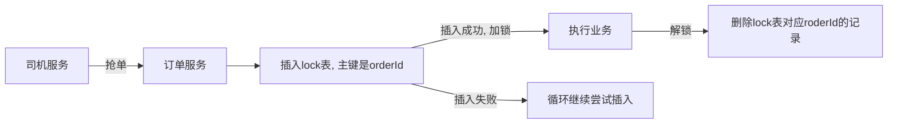
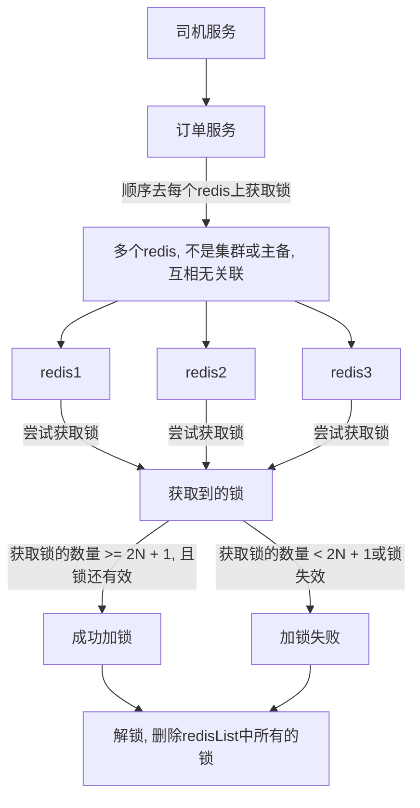

# 分布式锁

> jvm锁在单机下能保证数据一致性, 但是如果在分布式场景下, 网关路由到多台服务器
>
> jvm锁就无法保证数据一致性了
>
> 此时就出现了分布式锁, 通过第三方中间件提供分布式锁

常见的分布式锁实现方案:

* mysql
    * 依赖于mysql insert排他锁与主键冲突实现
* redis
    * 通过redis提供的原子性操作与过期时间实现, 相比mysql更加灵活, 并且redis高性能
    * redis存在单机问题, 主备集群也有问题(异步复制), 但是可以通过RedLock解决
* zookeeper
    * zk实现了了CP, 依赖C提供的原子操作实现, zk锁模型健壮, 但性能低于redis

## mysql

> 通过mysql insert主键重复, 实现分布式锁
>
> 创建一个lock表, lock表主键就是需要锁定的资源的唯一标识\



锁

```java
@Component
@RequiredArgsConstructor
@Slf4j
public class OrderMysqlLock implements Lock {

    private final TblOrderLockService tblOrderLockService;

    public static final ThreadLocal<TblOrderLock> ORDER_LOCK_THREAD_LOCAL = new ThreadLocal<>();

    @Override
    public void lock() {
        log.info("threadName: {}, 尝试加锁", Thread.currentThread().getName());
        // 如果加锁失败就继续自旋
        while (!tryLock()) {
            try {
                // 睡眠1秒, 继续尝试获取锁
                TimeUnit.MILLISECONDS.sleep(10);
            } catch (InterruptedException e) {
                e.printStackTrace();
            }
        }
        log.info("threadName: {}, 加锁成功", Thread.currentThread().getName());
    }

    @Override
    public void unlock() {
        tblOrderLockService.removeById(ORDER_LOCK_THREAD_LOCAL.get().getOrderId());
        ORDER_LOCK_THREAD_LOCAL.remove();
        log.info("threadName: {}, 解锁TblOrderLock: {}",
                Thread.currentThread().getName(), ORDER_LOCK_THREAD_LOCAL.get());
    }

    @Override
    public void lockInterruptibly() throws InterruptedException {
        throw new UnsupportedOperationException();
    }

    /**
     * 尝试获取锁
     * 向mysql orderLock中加一条锁记录, 由mysql保证acid
     * 主键是orderId, 别的线程再次插入时, 会因为主键重复失败
     */
    @Override
    public boolean tryLock() {
        try {
            // 成功插入信息就意味着获取锁了, mysql保证主键唯一, 其他线程插入会失败
            // 可能会出现
            // mysql Deadlock found when trying to get lock; try restarting transaction
            // 多条sql执行, 插入信息包含主键, 触发行锁, 上一条sql还未释放资源, 导致其他sql等待
            // 但是不影响正常流程, 失败后catch异常, 返回false会再次尝试获取锁
            // 从这里也可以看出mysql分布式锁不适合高并发场景, 还是建议使用其他比如redis, zk等中间件实现的分布式锁
            tblOrderLockService.saveWithPrimaryKey(ORDER_LOCK_THREAD_LOCAL.get());
            return true;
        } catch (Exception e) {
            log.error("orderLock tryLock 出错", e);
            return false;
        }
    }

    @Override
    public boolean tryLock(long time, TimeUnit unit) throws InterruptedException {
        throw new UnsupportedOperationException();
    }

    @Override
    public Condition newCondition() {
        throw new UnsupportedOperationException();
    }
}
```

服务

```java
@Service
@Slf4j
@RequiredArgsConstructor
public class TblOrderServiceMysqlLockImpl extends ServiceImpl<TblOrderMapper, TblOrder>
        implements TblOrderService {

    private final OrderMysqlLock orderMysqlLock;

    @Override
    @Transactional(rollbackFor = Exception.class)
    public String grabOrder(String orderId, String driverId) {
        TblOrder order = null;
        OrderMysqlLock.ORDER_LOCK_THREAD_LOCAL.set(new TblOrderLock()
                .setOrderId(Integer.valueOf(orderId)).setDriverId(Integer.valueOf(driverId)));
        try {
            // lock
            orderMysqlLock.lock();
            order = lambdaQuery()
                    .eq(TblOrder::getId, orderId)
                    .eq(TblOrder::getStatus, false)
                    .one();
            if (order != null) {
                lambdaUpdate().eq(TblOrder::getId, orderId)
                        .set(TblOrder::getStatus, true)
                        .update();
                log.info("driverId: {}, 抢到订单, orderId: {}", driverId, orderId);
            } else {
                log.info("driverId: {}, 没有抢到订单, orderId: {}", driverId, orderId);
            }
        } catch (Exception e) {
            e.printStackTrace();
        } finally {
            // unlock
            orderMysqlLock.unlock();
        }

        return order != null ? orderId : null;
    }
}
```

## redis

> 利用redis提供的原子命令实现分布式锁

### simple

实现简单的分布式锁

常见问题(注意事项):

*        情况一: 如果司机获取锁后服务器挂了, 导致锁一直没有释放, 订单无法解锁
         *        设置超时时间, 如果服务器挂了, 等待超时即可
*        情况二: 设置过期时间必须使用一条命令发送, 即要保证原子性, 如果设置完锁之后, 服务器宕机, 锁还是没有过期时间
*        情况三: 如果当前锁过期时间是1分钟, 但是业务执行超过了一分钟锁失效了, 其他driver抢到锁执行, 最后释放锁的时候可能会释放别人的锁
         *        释放锁的时候判断一下里面的值, 里面的值标识当前锁的持有者
         *        为了防止该问题, 我们可以采用续约的方式, 只要服务器没宕机, 我们就一直续约. 如果服务器宕机没有续约, 锁就会过期

```java
@Service
@Slf4j
@RequiredArgsConstructor
public class TblOrderServiceMyRedisLockImpl extends ServiceImpl<TblOrderMapper, TblOrder>
        implements TblOrderService {

    private final RedissonClient redissonClient;

    @Override
    @Transactional(rollbackFor = Exception.class)
    public String grabOrder(String orderId, String driverId) {
        TblOrder order = null;
        String orderLockKey = "lock_order_" + orderId;
        // orderLock 中存储的是driverId
        final RBucket<Integer> orderLock = redissonClient.getBucket(orderLockKey);

        /*
         情况一: 如果司机获取锁后服务器挂了, 导致锁一直没有释放, 订单无法解锁
            设置超时时间, 如果服务器挂了, 等待超时即可
         情况二: 设置过期时间必须使用一条命令发送, 即要保证原子性, 如果设置完锁之后, 服务器宕机, 锁还是没有过期时间
         情况三: 如果当前锁过期时间是1分钟, 但是业务执行超过了一分钟锁失效了, 其他driver抢到锁执行, 最后释放锁的时候可能会释放别人的锁
            释放锁的时候判断一下里面的值, 里面的值标识当前锁的持有者
         */

        // redisson Bucket 貌似没有提供setIfAbsent功能, 这样写不是原子操作, 会有问题
        if (!orderLock.isExists()) {
            try {
                // lock
                // 设置锁, 一分钟过期
                orderLock.set(Integer.valueOf(driverId), 1, TimeUnit.MINUTES);

                order = lambdaQuery()
                        .eq(TblOrder::getId, orderId)
                        .eq(TblOrder::getStatus, false)
                        .one();
                if (order != null) {
                    lambdaUpdate().eq(TblOrder::getId, orderId)
                            .set(TblOrder::getStatus, true)
                            .update();
                    log.info("driverId: {}, 抢到订单, orderId: {}", driverId, orderId);
                } else {
                    log.info("driverId: {}, 没有抢到订单, orderId: {}", driverId, orderId);
                }
            } catch (Exception e) {
                e.printStackTrace();
            } finally {
                // unlock
                // 确实是当前司机的锁才需要解锁
                // 这里的操作也不是原子操作, 需要使用lua脚本让redis原子执行命令
                if (Integer.valueOf(driverId).equals(orderLock.get())) {
                    orderLock.delete();
                }
            }
        }

        return order != null ? orderId : null;
    }
}
```

续约服务

要使用@Async记得开启@EnableAsync

```java
@Service
@Slf4j
@RequiredArgsConstructor
public class TblOrderMyRedisLockRenewServiceImpl implements TblOrderMyRedisLockRenewService {

    private final RedissonClient redissonClient;

    /**
     * 使用async开辟线程执行续约, 不阻塞主线程
     * 当过去1 / 3时间后续约
     *
     * @param key   key
     * @param value value
     * @param time  keepAliveTime
     */
    @Override
    @Async
    public void renew(String key, String value, long time) {
        log.info("myRedisLock续约 key: {}, value: {}, time: {}", key, value, time);
        RBucket<Integer> orderLock = redissonClient.getBucket(key);
        // 这里也不是原子命令, 会出问题, 需要使用lua脚本封装命令, redis原子执行lua脚本
        if (orderLock.isExists() && orderLock.get().equals(Integer.valueOf(value))) {
            long sleepTime = time / 3;
            try {
                TimeUnit.SECONDS.sleep(sleepTime);
            } catch (InterruptedException e) {
                e.printStackTrace();
            }
            
            orderLock.expire(time, TimeUnit.SECONDS);
            renew(key, value, time);
        }
    }
}
```

### lua

> 上面的简单实现其实是有问题的, 如 `        orderLock.isExists() && orderLock.get().equals(Integer.valueOf(value)) `这行代码不是原子的, 不能保证资源共享安全
>
> 我们需要通过lua脚本的方式执行命令, redis会原子的执行lua脚本我们不需要担心线程安全问题

### redisson

#### lock

redisson config

```java
@Bean
@Primary
public RedissonClient redissonClient() {
    final Config config = new Config();
    config.useSingleServer()
            .setAddress("redis://" + redisHost + ":" + redisPort)
            .setDatabase(0);
    return Redisson.create(config);
}
```

```java
@Service
@Slf4j
@RequiredArgsConstructor
public class TblOrderServiceRedissonLockImpl extends ServiceImpl<TblOrderMapper, TblOrder>
        implements TblOrderService {

    @Qualifier("redissonClient")
    private final RedissonClient redissonClient;

    @Override
    @Transactional(rollbackFor = Exception.class)
    public String grabOrder(String orderId, String driverId) {
        TblOrder order = null;
        String orderLockKey = "lock_order_" + orderId;

        final RLock orderLock = redissonClient.getLock(orderLockKey);

        try {
            // lock
            // 该方法默认30s过期, 只要服务器没有宕机, 会自动无限续期. 底层通过监听器实现续期
            // 如果设置了leaseTime, 就没有不会自动续约了, 多数情况直接使用lock()即可, 不许要添加过期时间
            orderLock.lock();
            // TimeUnit.SECONDS.sleep(60);
            order = lambdaQuery()
                    .eq(TblOrder::getId, orderId)
                    .eq(TblOrder::getStatus, false)
                    .one();
            if (order != null) {
                lambdaUpdate().eq(TblOrder::getId, orderId)
                        .set(TblOrder::getStatus, true)
                        .update();
                log.info("driverId: {}, 抢到订单, orderId: {}", driverId, orderId);
            } else {
                log.info("driverId: {}, 没有抢到订单, orderId: {}", driverId, orderId);
            }
        } catch (Exception e) {
            e.printStackTrace();
        } finally {
            // unlock
            orderLock.unlock();
        }

        return order != null ? orderId : null;
    }
}
```

#### red lock

> 单机redis无法保证高可用, 配置主从集群可能会出现问题
>
> A在master获取锁, master还没有异步复制数据到slave, master宕机, 切换到slave, salve上没有锁信息, 其他人又可以获取锁了
>
> 该问题可以通过RedLock解决

red lock流程

1. 获取当前时间戳

2. client尝试按照顺序使用相同的key获取所有redis服务的锁，在获取锁的过程中的获取时间比锁过期时间短很多，这是为了不要过长时间等待已经关闭的redis服务。并且试着获取下一个redis实例。

  比如：TTL为5s,设置获取锁最多用1s，所以如果一秒内无法获取锁，就放弃获取这个锁，从而尝试获取下个锁

3. client通过获取所有能获取的锁后的时间减去第一步的时间，这个时间差要小于TTL时间并且至少有`N / 2 + 1`个redis实例成功获取锁，才算真正的获取锁成功

4. 如果成功获取锁，则锁的真正有效时间是TTL减去第三步的时间差. 比如：TTL 是5s,  获取所有锁用了2s, 则真正锁有效时间为3s(其实应该再减去时钟漂移)

5. 如果客户端由于某些原因获取锁失败，便会开始解锁所有redis实例；因为可能已经获取了小于3个锁，必须释放，否则影响其他client获取锁



配置多台redis

```java
@Bean
public RedissonClient redissonClientRedLock1() {
    final Config config = new Config();
    config.useSingleServer()
            .setAddress("redis://" + redisHost + ":" + "6379")
            .setDatabase(0);
    return Redisson.create(config);
}

@Bean
public RedissonClient redissonClientRedLock2() {
    final Config config = new Config();
    config.useSingleServer()
            .setAddress("redis://" + redisHost + ":" + "6380")
            .setDatabase(0);
    return Redisson.create(config);
}

@Bean
public RedissonClient redissonClientRedLock3() {
    final Config config = new Config();
    config.useSingleServer()
            .setAddress("redis://" + redisHost + ":" + "6381")
            .setDatabase(0);
    return Redisson.create(config);
}
```

```java
@Service
@Slf4j
@RequiredArgsConstructor
public class TblOrderServiceRedissonRedLockImpl extends ServiceImpl<TblOrderMapper, TblOrder>
        implements TblOrderService {

    @Qualifier("redissonClientRedLock1")
    private final RedissonClient redissonClientRedLock1;

    @Qualifier("redissonClientRedLock2")
    private final RedissonClient redissonClientRedLock2;

    @Qualifier("redissonClientRedLock3")
    private final RedissonClient redissonClientRedLock3;

    @Override
    @Transactional(rollbackFor = Exception.class)
    public String grabOrder(String orderId, String driverId) {
        TblOrder order = null;
        String orderLockKey = "lock_order_" + orderId;

        // 创建红锁
        final RedissonRedLock orderRedLock = new RedissonRedLock(
                redissonClientRedLock1.getLock(orderLockKey),
                redissonClientRedLock2.getLock(orderLockKey),
                redissonClientRedLock3.getLock(orderLockKey)
        );

        try {
            // lock
            // 该方法默认30s过期, 只要服务器没有宕机, 会自动无限续期. 底层通过监听器实现续期
            // 如果设置了leaseTime, 就没有不会自动续约了, 多数情况直接使用lock()即可, 不许要添加过期时间
            orderRedLock.lock();
            // TimeUnit.SECONDS.sleep(60);
            order = lambdaQuery()
                    .eq(TblOrder::getId, orderId)
                    .eq(TblOrder::getStatus, false)
                    .one();
            if (order != null) {
                lambdaUpdate().eq(TblOrder::getId, orderId)
                        .set(TblOrder::getStatus, true)
                        .update();
                log.info("driverId: {}, 抢到订单, orderId: {}", driverId, orderId);
            } else {
                log.info("driverId: {}, 没有抢到订单, orderId: {}", driverId, orderId);
            }
        } catch (Exception e) {
            e.printStackTrace();
        } finally {
            // unlock
            orderRedLock.unlock();
        }

        return order != null ? orderId : null;
    }
}
```