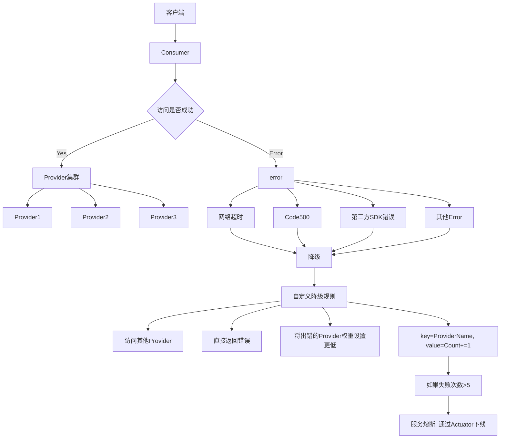

```mermaid
graph TB
client[客户端] --> api[Consumer]

api --> apiCond{访问是否成功}
apiCond -->|Yes| providerCluster[Provider集群]

providerCluster --> Provider1 & Provider2 & Provider3

apiCond --> |Error| error
error --> 网络超时 & Code500 & 第三方SDK错误 & 其他Error --> downLevel

downLevel[降级] --> downRules[自定义降级规则]
downRules 
	--> 访问其他Provider & 直接返回错误 & 将出错的Provider权重设置更低
downRules --> redisRule[key=ProviderName, value=Count+=1] 
		  --> redisRuleNext[如果失败次数>5]
		  --> downOnline[服务熔断, 通过Actuator下线]
```

