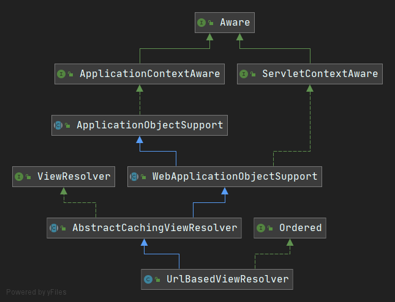

# SpringMVC

## 使用前的配置

1. 在web.xml中配置前端控制器 DispatcherServlet 

   - 前端控制器要映射所有请求, 所以servlet-class要写 `/` 	(`/`和`/*`有区别)

2. 在DispatcherServlet 中的`<init>`标签设置spring的xml地址

   - ```xml
     <init-param>
         <param-name>contextConfigLocation</param-name>
         <param-value>classpath:springmvc.xml</param-value>
     </init-param>
     ```

## HelloSpringMVC

```java
//Controller
package com.lcw.controller;

import org.springframework.web.servlet.ModelAndView;
import org.springframework.web.servlet.mvc.Controller;
import javax.servlet.http.HttpServletRequest;
import javax.servlet.http.HttpServletResponse;

public class HelloController implements Controller {

    @Override
    public ModelAndView handleRequest(HttpServletRequest httpServletRequest, HttpServletResponse httpServletResponse) throws Exception {
        System.out.println(this.getClass().getName());
        ModelAndView mv = new ModelAndView();
        mv.setViewName("hello");
        mv.addObject("hello","hello SpringMVC");
        return mv;
    }
}
```

```xml
<!--springmvc.xml配置文件-->
<?xml version="1.0" encoding="UTF-8"?>
<beans xmlns="http://www.springframework.org/schema/beans"
       xmlns:xsi="http://www.w3.org/2001/XMLSchema-instance"
       xsi:schemaLocation="http://www.springframework.org/schema/beans http://www.springframework.org/schema/beans/spring-beans.xsd">

    <!--Controller的bean, id就是请求-->
    <bean id="/hello" class="com.lcw.controller.HelloController"></bean>
    <!--如果要请求到页面, 必须配置请求的路径-->
    <bean class="org.springframework.web.servlet.view.InternalResourceViewResolver">
        <property name="prefix" value="/WEB-INF/page/"></property>
        <property name="suffix" value=".jsp"></property>
    </bean>
</beans>
```

## / 和 /*的区别

在配置DispatcherServlet的时候, 映射的请求, 可以写`/` 和 `/*` 他们都是匹配所有请求

但是在/*会拦截jsp页面, /不会, /会拦截html页面

在使用DispatcherServlet后会覆盖, tomcat中的DefaultServlet, 所以无法处理html页面, 能处理jsp页面,  
是因为tomcat中有单独的jsp处理类

## @RequestMapping注解

1. value 请求
2. method 请求方式
3. headers 限制请求方式
4. params 限制请求中的参数
5. produces 限制请求中的Content-Type
6. consumers 限制求情中的Content-Type

### 模糊匹配

- `?` 替代一个字符 (必须有一个字符)
- `*` 替代多个字符 (0个或多个字符)
- `**` 替代多层路径

### @PathVariable

**该注解可以获取请求路径中的变量**

```java
import org.springframework.stereotype.Controller;
import org.springframework.web.bind.annotation.PathVariable;
import org.springframework.web.bind.annotation.RequestMapping;

@Controller
public class PathVariableController {
    @RequestMapping("/testPathVariable/{id}/{name}")
    //@PathVariable可以放到参数前面, 表示当前参数从请求路径中获取
    //可以指定value来绑定形参, 默认不指定value就是匹配同名形参
    public String testPathVariable(@PathVariable("id") Integer id, @PathVariable String name){
        //request.getParameter("name);
        System.out.println(id);
        System.out.println(name);
        return "hello";
    }
}
```

### 实际应用 --- REST

从路径中获取信息, 简化了crud操作

不需要再分别写出, query, insert, delete, update操作

所有操作开头都是同一个样子`/test`

**我们根据请求的方式来区分crud操作**

| Method | Explain  |
| ------ | -------- |
| GET    | 获取资源 |
| POST   | 新建资源 |
| PUT    | 更新资源 |
| DELETE | 删除资源 |

### SpringMVC帮我们实现了PUT和DELTE请求

**新建一个Filter, 然后在web.xml中配置HiddenHttpMethodFilter**

```xml
<filter>
    <filter-name>hidden</filter-name>
    <filter-class>org.springframework.web.filter.HiddenHttpMethodFilter</filter-class>
</filter>
<filter-mapping>
    <filter-name>hidden</filter-name>
    <url-pattern>/*</url-pattern>
</filter-mapping>
```

### 发送PUT, DELETE案例

给隐藏域设置那么为_method, 然后设置value为put或delete

HiddenHttpMethodFilter会自动处理我们设置好的hidden

```html	
<form action="${ctx}/user" method="post">
    <input type="hidden" name="_method" value="put">
    <input type="submit" value="update">
</form>
  
<form action="${ctx}/user" method="post">
    <input type="hidden" name="_method" value="delete">
    <input type="submit" value="delete">
</form>
```

## SpringMVC请求处理

@RequestParam请求中的参数, 不要与@PathVariable混淆

- @RequestParam设置请求?中的参数
- @PathVariable设置请求路径中的参数

### @RequestParam

| value        | 参数的名字           |
| :----------- | :------------------- |
| required     | 设置参数是否是必要的 |
| defaultValue | 设置参数的默认值     |

### @RequestHeader

获取请求头数据, value同上

### @CookieValue

获取Cookie数据, value同上

## SpringMVC乱码

### GET

在server.xml中的Connector设置URIEncoding='utf-8'

### POST

单独设置Request和Respone的编码格式

并且如果设置了编码过滤器, 则请保证编码过滤器优先执行

### SpringMVC的编码过滤器

**CharacterEncodingFilter**

```xml
<filter>
    <filter-name>encoding</filter-name>
    <filter-class>org.springframework.web.filter.CharacterEncodingFilter</filter-class>
    <init-param>
        <!--设置编码-->
        <param-name>encoding</param-name>
        <param-value>UTF-8</param-value>
    </init-param>
    <init-param>
        <!--设置为true才能强制编码-->
        <param-name>forceEncoding</param-name>
        <param-value>true</param-value>
    </init-param>
</filter>
<filter-mapping>
    <filter-name>encoding</filter-name>
    <url-pattern>/*</url-pattern>
</filter-mapping>
```

## @SessionAttributes注解

该注解用来设置需要保存的session

**@SessionAttributes(value = { "attributeName" }, types = { String.class });**

- value 表示需要保存色session名字
- types 表示该类型会被Session保存

**注意该注解必须要在request中设置了数据后才能自动向Session中设置数据**

## @ModelAttribute注解

- 如果参数中的注解没有写名字, 默认用参数名称首字母小写匹配
- 如果没有找到值, 就会去Session中查找

```java
@RequestMapping("/updateJsp")
public String updateJsp(){
    return "update";
}

@RequestMapping("/update")
public String update(@ModelAttribute("user3") User user){
    System.out.println(user);
    return "success";
}

@ModelAttribute
public void testModelAttribute(Model model){
    User user = new User();
    user.setName("杨水马");
    model.addAttribute("user",user);
}

@ModelAttribute
public void testModelAttribute2(Model model){
    User user = new User();
    user.setName("王五");
    model.addAttribute("user2",user);
}

@ModelAttribute("user3")
public User testModelAttribute3(Model model){
    User user = new User();
    user.setName("赵六");
    return user;
}
```

- 可以通过Model model参数设置Attribute
- 也可以返回对象, 默认是匹配对象的名字, 也可以通过在方法上添加的ModelAttribute设置value属性, 来匹配对象

## ForWard & Redirect

在请求中返回

- "forward:/index";

  - ```java
    @Controller
    public class ForWardController {
        @RequestMapping("/forward")
        public String forward(){
            return "forward:/index.jsp";
        }
    
        @RequestMapping("/forward2")
        public String forward2(){
            return "forward:/forward";
        }
    }
    ```

- "redirect:/index"

  - ```java
    @Controller
    public class RedirectController {
        @RequestMapping("/redirect")
        public String redirect(){
            return "redirect:/index.jsp";
        }
    
        @RequestMapping("/redirect2")
        public String redirect2(){
            return "redirect:/redirect";
        }
    }
    ```

## 静态资源的请求

在处理静态资源时, 无法访问

原因是DispatcherServlet覆盖了DefaultServlet

在springmvc中配置`<mvc:default-servlet-handler>`并且还要配置`<mvc:annotation-driven>`才能正常访问静态资源

## 自定义ViewResolver/View

InternalResourceViewResolver关系图



如果要自定义ViewResolver只需要实现ViewResolver接口

```java
@Component
public class MyViewResolver implements ViewResolver {
    @Override
    //resolverViewName需要返回一个View接口的子类实现
    public View resolveViewName(String s, Locale locale) throws Exception {
        if(s.startsWith("lcw:")){
            System.out.println(s);
            return new MyView();
        }
        return null;
    }
}
```

```java
public class MyView implements View {
    @Override
    public String getContentType() {
        return "text/html";
    }

    @Override
    public void render(Map<String, ?> map, HttpServletRequest httpServletRequest, HttpServletResponse httpServletResponse) throws Exception {
        System.out.println("Map"+map);
        PrintWriter writer = httpServletResponse.getWriter();
        //只要要设置ContentType与上面的getContentType返回值一致, 不然可能会乱码
        httpServletResponse.setContentType("text/html");
        writer.write("<h1>LCW_ACM</h1>");
        writer.write("<h1>中文</h1>");
    }
}
```

### 多个ViewResolver执行顺序--Ordered

如果设置InternalResourceViewResovler和MyViewResolver后,  
MyViewResovler会失效, 因为InternalResourceViewResovler会默认匹配所有请求

想要MyViewResovler先执行, 需要实现Ordered接口

```java
public class MyViewResolver implements ViewResolver, Ordered {

    //设置一个order属性, 调用getOrdered方法时直接返回该属性, 这样方便在xml中配置property
    private int order = 0;

    @Override
    public View resolveViewName(String s, Locale locale) throws Exception {
        if(s.startsWith("lcw:")){
            System.out.println(s);
            return new MyView();
        }
        return null;
    }

    public void setOrder(int order) {
        this.order = order;
    }

    @Override
    public int getOrder() {
        return order;
    }
}
```

```xml
<?xml version="1.0" encoding="UTF-8"?>
<beans xmlns="http://www.springframework.org/schema/beans"
       xmlns:xsi="http://www.w3.org/2001/XMLSchema-instance"
       xmlns:context="http://www.springframework.org/schema/context"
       xmlns:mvc="http://www.springframework.org/schema/mvc"
       xsi:schemaLocation="http://www.springframework.org/schema/beans http://www.springframework.org/schema/beans/spring-beans.xsd http://www.springframework.org/schema/context https://www.springframework.org/schema/context/spring-context.xsd http://www.springframework.org/schema/mvc https://www.springframework.org/schema/mvc/spring-mvc.xsd">
    <context:component-scan base-package="com.lcw"></context:component-scan>
    
    <mvc:default-servlet-handler></mvc:default-servlet-handler>
    <mvc:annotation-driven></mvc:annotation-driven>
    
    <bean class="org.springframework	.web.servlet.view.InternalResourceViewResolver">
        <property name="prefix" value="/WEB-INF/page/"></property>
        <property name="suffix" value=".jsp"></property>
    </bean>

    <bean class="com.lcw.viewResolver.MyViewResolver">
        <property name="order" value="1"></property>
    </bean>
</beans>
```

## 自定义Converter

```java
//注意是org.springframework.core.convert.converter.Converter这个类;
@Component
public class MyConverter implements Converter<String, User> {
   
    @Override
    public User convert(String s) {
        User user = null;
        String[] split = s.split("-");
        if(s != null && !s.isEmpty() && split.length == 4){
            user = new User();
            user.setId(Integer.parseInt(split[0]));
            user.setName(split[1]);
            user.setAge(Integer.parseInt(split[2]));
            user.setPassword(split[3]);
        }
        return user;
    }
}
```

定义好MyConverter后, 需要在xml进行配置

```xml
<!--注意id必须为conversionService-->
<bean id="conversionService" class="org.springframework.context.support.ConversionServiceFactoryBean">
    <property name="converters">
        <set>
            <ref bean="myConverter"></ref>
        </set>
    </property>
</bean>

<!--想要上面的bean生效, 必须配置该注解-->
<mvc:annotation-driven conversion-service="conversionService"></mvc:annotation-driven>
```

## 自定义Date格式

直接在类字段上添加**@DateTimeFormat**注解

```java
public class User {
    private Integer id;
    private String name;
    private String password;
    private Integer age;
    @DateTimeFormat(pattern = "yyyy-MM-dd hh:mm:ss")
    private Date birth;

    public User() {}
}
```

**注意如果想要添加自定义Date格式, 并且还要配置自定义Converter, 那么还要配置一个FormattingConversionServiceFactoryBean**

```xml
<mvc:annotation-driven conversion-service="conversionService"></mvc:annotation-driven>

<bean id="conversionService" class="org.springframework.format.support.FormattingConversionServiceFactoryBean">
    <property name="converters">
        <set>
            <ref bean="myConverter"></ref>
        </set>
    </property>
</bean>
```

