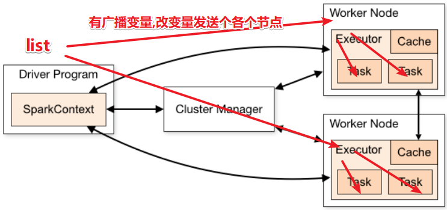

# Spark

> spark是一个适用于大规模数据处理的统一分析引擎
>
> spark是一个计算引擎，需要依赖于hadoop，数据存储在hdfs中，由于spark是基于内存的性能远高于MapReduce，可以替代MR。

## Spark角色

* master
    * 集群主节点，负责整个集群的资源调度（类似于yarn中的ResourceManager）
* woker
    * 负责单节点的资源调度（类似于yarn中的NodeManager）
* driver
    * 负责每个任务的资源调度（类似于yarn中的ApplicationMaster）
* executor
    * 具体计算任务的进程（类似于yarn分配的容器里的maptask）

## 部署

spark往往是与hadoop配套使用，请先搭建hadoop运行环境。

### anaconda pyspark

后续操作使用pyspark, 首先安装去anaconda官网下载安装脚本，安装anaconda环境。

安装成功，重新连接linux，控制台前面显示`(base)`即成功。


配置anaconda国内源

```
channels:
  - defaults
show_channel_urls: true
default_channels:
  - https://mirrors.tuna.tsinghua.edu.cn/anaconda/pkgs/main
  - https://mirrors.tuna.tsinghua.edu.cn/anaconda/pkgs/r
  - https://mirrors.tuna.tsinghua.edu.cn/anaconda/pkgs/msys2
custom_channels:
  conda-forge: https://mirrors.tuna.tsinghua.edu.cn/anaconda/cloud
  msys2: https://mirrors.tuna.tsinghua.edu.cn/anaconda/cloud
  bioconda: https://mirrors.tuna.tsinghua.edu.cn/anaconda/cloud
  menpo: https://mirrors.tuna.tsinghua.edu.cn/anaconda/cloud
  pytorch: https://mirrors.tuna.tsinghua.edu.cn/anaconda/cloud
  simpleitk: https://mirrors.tuna.tsinghua.edu.cn/anaconda/cloud
```


创建虚拟环境

```bash
# 创建虚拟环境 pyspark, 基于Python 3.8
conda create -n pyspark python=3.8
# 切换到虚拟环境内
conda activate pyspark
# 在虚拟环境内安装pyspark
pip install pyspark -i https://pypi.tuna.tsinghua.edu.cn/simple 
```

### 部署spark

[下载spark](https://spark.apache.org/downloads.html)，这里使用的是spark3.2

解压spark软件包

配置全局环境变量

/etc/profile

```bash
export JAVA_HOME=/usr/java/jdk1.8.0_181-cloudera
# 运行pyspark程序时需要配置, 这里配置为anaconda的pyspark虚拟环境
export PYSPARK_PYTHON=/opt/anaconda3/envs/pyspark/bin/python3.8
# 配置spark软件根目录
export SPARK_HOME=/opt/spark
```

linux bash启动时，不会执行/etc/profile中的环境变量，在`/.bashrc`中添加`. /etc/profile`，使bash启动时执行`/etc/profile`中export的变量。

#### Local

> spark本地模式，在一个spark进程中开启多个线程模拟spark运行环境。
>
> 该模式下，由于只有一个进程，driver与woker是同一身份，都在一个进程内，executor对应多个线程。
>
> **注意spark-shell, pyspark等交互环境支持client模式**

运行`$SPARK_HOME/bin/pyspark`

内存小的机器指定一下driver与executor占用的内存`./pyspark --master yarn --deploy-mode client --num-executors 2 --executor-memory 512m --driver-memory 512m`

```python
# 执行pyspark代码
sc.parallelize([1,2,3,4,5]).map(lambda x: x + 1).collect()
```

##### WebUI

spark提供了两个WebUI，默认是`8080`、`4040`分别是spark主节点监控页面、spark当前正在运行的spark任务的监控页面。

主节点`8080`的页面是唯一的，而`4040`是spark任务的job页面，如果开启多个spark任务4040`端口被占用端口，新的端口号会顺延。

主节点`8080`端口被占用同样会顺延。

##### spark-submit

作用: 提交指定的Spark代码到Spark环境中运行


使用方法:


```shell
# 语法
bin/spark-submit [可选的一些选项] jar包或者python代码的路径 [代码的参数]

# 示例
bin/spark-submit /opt/spark/examples/src/main/python/pi.py 10
# 此案例 运行Spark官方所提供的示例代码 来计算圆周率值.  后面的10 是主函数接受的参数, 数字越高, 计算圆周率越准确.
```

#### StandAlone

> Spark提供了集群部署模式，如果有足够多的集群资源，可以单独搭建StandAlone模式的spark集群。


新角色 历史服务器

历史服务器不是Spark环境的必要组件, 是可选的.

回忆: 在YARN中 有一个历史服务器, 功能: 将YARN运行的程序的历史日志记录下来, 通过历史服务器方便用户查看程序运行的历史信息.


Spark的历史服务器, 功能: 将Spark运行的程序的历史日志记录下来, 通过历史服务器方便用户查看程序运行的历史信息.

搭建集群环境, 我们一般`推荐将历史服务器也配置上`, 方面以后查看历史记录


##### 集群规划

cdh1 spark worker节点

cdh2 spark主节点

##### anaconda环境

所有机器安装anaconda，并配置pyspark虚拟环境。

##### 配置文件

来到`$SPARK_HOME/conf`配置目录下


配置workers

改名, 去掉后面的.template后缀

`cp workers.template workers`

编辑workers文件

```bash
# 将里面的localhost删除, 追加
node1
node2
node3
```


配置`spark-env.sh`

`cp spark-env.sh.template spark-env.sh`

编辑`spark-env.sh`

```bash
# 设置JAVA安装目录
JAVA_HOME=/usr/java/jdk1.8.0_181-cloudera

# HADOOP软件配置文件目录，读取HDFS上文件和运行YARN集群
HADOOP_CONF_DIR=/etc/hadoop/conf
YARN_CONF_DIR=/etc/hadoop/conf

# 指定spark老大Master的IP和提交任务的通信端口
# 告知Spark的master运行在哪个机器上
# export SPARK_MASTER_HOST=cdh2
# 告知sparkmaster的通讯端口
export SPARK_MASTER_PORT=7077
# 告知spark master的 webui端口
SPARK_MASTER_WEBUI_PORT=8080

# worker cpu可用核数
SPARK_WORKER_CORES=1
# worker可用内存
SPARK_WORKER_MEMORY=1g
# worker的工作通讯地址
SPARK_WORKER_PORT=7078
# worker的 webui地址
SPARK_WORKER_WEBUI_PORT=8081

# 设置历史服务器
# 配置的意思是  将spark程序运行的历史日志 存到hdfs的/sparklog文件夹中
SPARK_HISTORY_OPTS="-Dspark.history.fs.logDirectory=hdfs://cdh1:8020/sparklog/ -Dspark.history.fs.cleaner.enabled=true"
```


注意，上面的配置的路径 要根据你自己机器实际的路径来写。

在HDFS上创建程序运行历史记录存放的文件夹：

```bash
hadoop fs -mkdir /sparklog
hadoop fs -chmod 777 /sparklog
```


配置`spark-defaults.conf`文件

`cp spark-defaults.conf.template spark-defaults.conf`

注意Spark log虽然存储在HDFS上，但是必须使用Spark History Server才能访问。

```
# 2. 修改内容, 追加如下内容
# 开启spark的日期记录功能
spark.eventLog.enabled 	true
# 设置spark日志记录的路径
spark.eventLog.dir	 hdfs://node1:8020/sparklog/ 
# 设置spark日志是否启动压缩
spark.eventLog.compress 	true
```


配置log4j.properties 文件 [可选配置]

`cp log4j.properties.template log4j.properties`

```properties
log4j.rootCategory=WARN, console
```

这个文件的修改不是必须的,  为什么修改为WARN. 因为Spark是个话痨

会疯狂输出日志, 设置级别为WARN 只输出警告和错误日志, 不要输出一堆废话.

不想全局配置日志，可以再代码中配置，API大致如下：

```kotlin
val sc = JavaSparkContext(spark.sparkContext())
sc.setLogLevel("warn")
```


使用rsync将配置分发到其他服务器

##### 启动Spark

启动历史服务器

`$SPARK_HOME/sbin/start-history-server.sh`

启动Spark主节点

`$SPARK_HOME/sbin/start-master.sh`

启动Woker节点

`$SPARK_HOME/sbin/start-worker.sh`


全部启动/关闭

`$SPARK_HOME/sbin/start-all.sh`

`$SPARK_HOME/sbin/stop-all.sh`

##### 连接StandAlone集群

pyspark

```bash
# 通过--master选项来连接到 StandAlone集群
# 如果不写--master选项, 默认是local模式运行
pyspark --master spark://node1:7077
```

spark-shell

```bash
# 同样适用--master来连接到集群使用
spark-shell --master spark://node1:7077
```

```scala
// 测试代码
sc.parallelize(Array(1,2,3,4,5)).map(x=> x + 1).collect()
```

spark-submit

```bash
spark-submit --master spark://node1:7077 /opt/spark/examples/src/main/python/pi.py 100
# 同样使用--master来指定将任务提交到集群运行
```

#### StandAlone HA

> 前提: 确保Zookeeper 和 HDFS 均已经启动


先在`spark-env.sh`中, 删除: `SPARK_MASTER_HOST=node1`


原因: 配置文件中固定master是谁, 那么就无法用到zk的动态切换master功能了.


在`spark-env.sh`中, 增加:


```shell
SPARK_DAEMON_JAVA_OPTS="-Dspark.deploy.recoveryMode=ZOOKEEPER -Dspark.deploy.zookeeper.url=node1:2181,node2:2181,node3:2181 -Dspark.deploy.zookeeper.dir=/spark-ha"
# spark.deploy.recoveryMode 指定HA模式 基于Zookeeper实现
# 指定Zookeeper的连接地址
# 指定在Zookeeper中注册临时节点的路径
```

将spark-env.sh 分发到每一台服务器上


停止当前StandAlone集群


```shell
sbin/stop-all.sh
```


启动集群:


```shell
# 在node1上 启动一个master 和全部worker
sbin/start-all.sh

# 注意, 下面命令在node2上执行
sbin/start-master.sh
# 在node2上启动一个备用的master进程
```


**Spark master主备切换**


提交一个spark任务到当前`alive`master上:


```shell
spark-submit --master spark://node1:7077 /opt/spark/examples/src/main/python/pi.py 1000
```


在提交成功后, 将alivemaster直接kill掉

不会影响程序运行:

当新的master接收集群后, 程序继续运行, 正常得到结果.


> 结论 HA模式下, 主备切换 不会影响到正在运行的程序.
>
> 最大的影响是 会让它中断大约30秒左右.

#### 两种运行模式

确保spark-env.sh配置文件中有以下配置:


- HADOOP_CONF_DIR
- YARN_CONF_DIR

##### Client模式


```bash
SPARK_HOME=/export/server/spark
${SPARK_HOME}/bin/spark-submit \
--master yarn  \
--deploy-mode client \
--driver-memory 512m \
--driver-cores 1 \
--executor-memory 512m \
--num-executors 2 \
--executor-cores 1 \
--class org.apache.spark.examples.SparkPi \
${SPARK_HOME}/examples/jars/spark-examples_2.12-3.0.1.jar \
10
```

##### Cluster模式


```bash
SPARK_HOME=/export/server/spark
${SPARK_HOME}/bin/spark-submit \
--master yarn \
--deploy-mode cluster \
--driver-memory 512m \
--executor-memory 512m \
--num-executors 1 \
--class org.apache.spark.examples.SparkPi \
${SPARK_HOME}/examples/jars/spark-examples_2.12-3.0.1.jar \
10
```

> client模式driver运行在客户端，可以看到控制台输出，通常用于开发调试。
>
> cluster模式driver运行在yarn分配的ApplicationMaster上，由yarn调度，想要查看输出需要去yarn上历史服务器上查看日志信息。

```bash
# --deploy-mode 选项是指定部署模式, 默认是 客户端模式
# client就是客户端模式
# cluster就是集群模式
# --deploy-mode 仅可以用在YARN模式下
pyspark --master yarn --deploy-mode client|cluster
```

> 注意: 交互式环境 pyspark  和 spark-shell  无法运行 cluster模式

spark-submit通过`--deploy-mode`指定运行模式

```bash
spark-submit --master yarn --deploy-mode client|cluster /opt/spark/examples/src/main/python/pi.py 10
```

### pyspark与spark-submit

常见的客户端工具：


- pyspark: pyspark解释器spark环境
- spark-shell: scala解释器spark环境
- spark-submit: 提交jar包或Python文件执行的工具
- spark-sql: sparksql客户端工具

这4个客户端工具的参数基本通用.

以spark-submit 为例：

| 参数                     | 描述                                                         | 可选值                                     |
| ------------------------ | ------------------------------------------------------------ | ------------------------------------------ |
| --class                  | Spark 程序中包含主函数的类                                   |                                            |
| --master                 | Spark 程序运行的模式(环境)                                   | 模式：local[*]、spark://linux1:7077、 Yarn |
| --executor-memory 1G     | 指定每个 executor 可用内存为 1G                              |                                            |
| --total-executor-cores 2 | 指定所有executor使用的cpu核数为2个。                         |                                            |
| --executor-cores         | 指定每个executor使用的cpu核数                                |                                            |
| application-jar          | 打包好的应用 jar，包含依赖。这 个 URL 在集群中全局可见。 比 如 hdfs:// 共享存储系统，如果是file:// path，那么所有的节点的 path 都包含同样的 jar。 |                                            |
| application-arguments    | 传给 main()方法的参数                                        |                                            |


```
Usage: spark-submit [options] <app jar | python file | R file> [app arguments]
Usage: spark-submit --kill [submission ID] --master [spark://...]
Usage: spark-submit --status [submission ID] --master [spark://...]
Usage: spark-submit run-example [options] example-class [example args]

Options:
  --master MASTER_URL         spark://host:port, mesos://host:port, yarn,
                              k8s://https://host:port, or local (Default: local[*]).
  --deploy-mode DEPLOY_MODE   部署模式 client 或者 cluster 默认是client
  --class CLASS_NAME          运行java或者scala class(for Java / Scala apps).
  --name NAME                 程序的名字
  --jars JARS                 Comma-separated list of jars to include on the driver
                              and executor classpaths.
  --packages                  Comma-separated list of maven coordinates of jars to include
                              on the driver and executor classpaths. Will search the local
                              maven repo, then maven central and any additional remote
                              repositories given by --repositories. The format for the
                              coordinates should be groupId:artifactId:version.
  --exclude-packages          Comma-separated list of groupId:artifactId, to exclude while
                              resolving the dependencies provided in --packages to avoid
                              dependency conflicts.
  --repositories              Comma-separated list of additional remote repositories to
                              search for the maven coordinates given with --packages.
  --py-files PY_FILES         指定Python程序依赖的其它python文件
  --files FILES               Comma-separated list of files to be placed in the working
                              directory of each executor. File paths of these files
                              in executors can be accessed via SparkFiles.get(fileName).
  --archives ARCHIVES         Comma-separated list of archives to be extracted into the
                              working directory of each executor.

  --conf, -c PROP=VALUE       手动指定配置
  --properties-file FILE      Path to a file from which to load extra properties. If not
                              specified, this will look for conf/spark-defaults.conf.

  --driver-memory MEM         Driver的可用内存(Default: 1024M).
  --driver-java-options       Driver的一些Java选项
  --driver-library-path       Extra library path entries to pass to the driver.
  --driver-class-path         Extra class path entries to pass to the driver. Note that
                              jars added with --jars are automatically included in the
                              classpath.

  --executor-memory MEM       Executor的内存 (Default: 1G).

  --proxy-user NAME           User to impersonate when submitting the application.
                              This argument does not work with --principal / --keytab.

  --help, -h                  显示帮助文件
  --verbose, -v               Print additional debug output.
  --version,                  打印版本

 Cluster deploy mode only(集群模式专属):
  --driver-cores NUM          Driver可用的的CPU核数(Default: 1).

 Spark standalone or Mesos with cluster deploy mode only:
  --supervise                 如果给定, 可以尝试重启Driver

 Spark standalone, Mesos or K8s with cluster deploy mode only:
  --kill SUBMISSION_ID        指定程序ID kill
  --status SUBMISSION_ID      指定程序ID 查看运行状态

 Spark standalone, Mesos and Kubernetes only:
  --total-executor-cores NUM  整个任务可以给Executor多少个CPU核心用

 Spark standalone, YARN and Kubernetes only:
  --executor-cores NUM        单个Executor能使用多少CPU核心

 Spark on YARN and Kubernetes only(YARN模式下):
  --num-executors NUM         Executor应该开启几个
  --principal PRINCIPAL       Principal to be used to login to KDC.
  --keytab KEYTAB             The full path to the file that contains the keytab for the
                              principal specified above.

 Spark on YARN only:
  --queue QUEUE_NAME          指定运行的YARN队列(Default: "default").
```

### 注意事项

1. 使用yarn模式运行时，出现

## Spark-Python

### RDD

https://spark.apache.org/docs/latest/rdd-programming-guide.html

### SparkSQL

https://spark.apache.org/docs/latest/sql-programming-guide.html

### 简单演示

#### 客户端

spark提供了两种客户端用法，早期使用rdd编程时的SparkContext和SparkSQL出现后的SparkSession

SparkContext支持RDD方式编程，SparkSession支持RDD与SQL

SparkContext

```python
from pyspark import SparkConf, SparkContext

if __name__ == '__main__':
    conf = SparkConf().setAppName("SparkConfApp").setMaster("local[*]")
    sc = SparkContext(conf=conf)

	print(sc.parallelize([1, 2, 3]).sum())
```

SparkSession

```python
from pyspark.sql import SparkSession
from pyspark.sql.types import StructType, StringType, IntegerType

if __name__ == '__main__':
    spark = SparkSession.builder \
        .appName("test") \
        .master("local[*]") \
        .getOrCreate()

    sc = spark.sparkContext
    print(sc.parallelize([1, 2, 3]).sum())
```

### 算子简单演示

#### join

```python
from pyspark import SparkConf, SparkContext

if __name__ == '__main__':
    conf = SparkConf().setAppName("SparkConfApp").setMaster("local[*]")
    sc = SparkContext(conf=conf)

    rdd1 = sc.parallelize([
        (1001, "ZhangSan"), (1001, "LiSi"), (1002, "City"), (1003, "Cooker"), (1111, "XiaoMing")
    ])
    rdd2 = sc.parallelize([
        (1001, "销售部"), (1002, "开发部"), (1003, "人事部"), (1004, "财务")
    ])

    print(rdd1.join(rdd2).collect())
    print(rdd1.leftOuterJoin(rdd2).collect())
    print(rdd1.rightOuterJoin(rdd2).collect())
    print(rdd1.fullOuterJoin(rdd2).collect())
```

#### groupby

```python
import operator
from pyspark import SparkConf, SparkContext

if __name__ == '__main__':
    conf = SparkConf().setAppName("SparkConfApp").setMaster("local[*]")
    sc = SparkContext(conf=conf)

    rdd = sc.parallelize([("a", 1), ("a", 1), ("b", 1), ("a", 1), ("b", 1)])
    print(rdd.groupBy(lambda x: x[0]).map(lambda x: (x[0], list(x[1]))).collect())
```

### DataFrame API简单演示

#### 创建DF

```python
from pyspark.sql import SparkSession
from pyspark.sql.types import StructType, StringType, IntegerType

if __name__ == '__main__':
    spark = SparkSession.builder \
        .appName("test") \
        .master("local[*]") \
        .getOrCreate()

    sc = spark.sparkContext

    rdd = sc.textFile("/user/root/test_data/sql/people.txt") \
        .map(lambda x: x.split(",")) \
        .map(lambda x: (x[0], int(x[1])))

    # df = spark.createDataFrame(rdd, schema=["name", "age"])
    # schema = StructType().add("name", StringType(), nullable=True) \
    #     .add("age", IntegerType(), nullable=True)
    # df = spark.createDataFrame(rdd, schema=schema)

    # df = rdd.toDF(schema=["name", "age"])
    df = rdd.toDF(schema=StructType().add("name", StringType(), True) \
                  .add("age", IntegerType(), True))
    df.printSchema()
    df.show()

    df.createOrReplaceTempView("people")

    spark.sql("select * from people where age > 20").show()
```

```python
from pyspark.sql import SparkSession
from pyspark.sql.types import StructType, StringType, IntegerType
import pyspark.pandas as pd

if __name__ == '__main__':
    spark = SparkSession.builder \
        .appName("test") \
        .master("local[*]") \
        .getOrCreate()

    df = spark.read.parquet("/user/root/test_data/sql/users.parquet")
    df.printSchema()
    df.show()
```

#### Sogou搜索统计

```python
import jieba
from pyspark import SparkConf, SparkContext, StorageLevel
import operator


def parse_words(word):
    return list(jieba.cut_for_search(word))


def parse_user_with_words(args):
    uid = args[0]
    phrase = args[1]
    words = list(jieba.cut_for_search(phrase))
    return [(f"{uid}_{x}", 1) for x in words if x not in ["谷", "帮", "客"]]


if __name__ == '__main__':
    # conf = SparkConf().setMaster("local[*]").setAppName("SparkHelloWorld")
    conf = SparkConf().setAppName("SparkHelloWorld")
    sc = SparkContext(conf=conf)

    rdd = sc.textFile("/user/root/test_data/SogouQ.txt")

    split_rdd = rdd.map(lambda x: x.split())
    split_rdd.persist(StorageLevel.DISK_ONLY)

    # split_rdd.takeSample(3, True)
    phrase_rdd = split_rdd.map(lambda x: x[2])

    words_rdd = phrase_rdd.flatMap(parse_words)

    filtered_rdd = words_rdd.filter(lambda x: x not in ["谷", "帮", "客"]) \
        .map(lambda x: ({"传智播": "传智播客", "院校": "院校帮", "博学": "博学谷"}.get(x, x), 1))

    print(filtered_rdd.reduceByKey(operator.add) \
          .takeOrdered(5, lambda x: -x[1]))

    user_with_word_rdd = split_rdd.map(lambda x: (x[1], x[2]))

    user_with_words_rdd = user_with_word_rdd.flatMap(parse_user_with_words)
    print(user_with_words_rdd.reduceByKey(operator.add) \
          .takeOrdered(5, lambda x: -x[1]))

    time_rdd = split_rdd.map(lambda x: x[0])
    hour_rdd = time_rdd.map(lambda x: (x.split(":")[0], 1))
    print(hour_rdd.reduceByKey(operator.add) \
          .takeOrdered(5, lambda x: -x[1]))
```

#### SQL WordCount

```python
from pyspark.sql import SparkSession
from pyspark.sql.types import StructType, StringType, IntegerType
from pyspark.sql import functions as F

if __name__ == '__main__':
    spark = SparkSession.builder \
        .appName("test") \
        .master("local[*]") \
        .getOrCreate()

    sc = spark.sparkContext
    rdd = sc.textFile("/user/root/test_data/words.txt") \
        .flatMap(lambda x: x.split()) \
        .map(lambda x: [x])

    df = rdd.toDF(["word"])
    df.createTempView("words")

    spark.sql("""
    select word, count(*) as cnt from words group by word order by cnt desc
    """).show()

    df = spark.read.text("/user/root/test_data/words.txt")
    df2 = df.withColumn("value", F.explode(F.split(df["value"], " ")))
    df2.groupby("value") \
        .count() \
        .withColumnRenamed("value", "word") \
        .withColumnRenamed("count", "cnt") \
        .orderBy("cnt", ascending=False) \
        .show()
```

#### MovieDemo

```python
import time

from pyspark.sql import SparkSession
from pyspark.sql.types import StructType, StringType, IntegerType
from pyspark.sql import functions as F
import pyspark.pandas as pd

if __name__ == '__main__':
    # 设置sql的分区数,  该分区数与rdd中设置的并行度是独立的
    # config("spark.sql.shuffle.partitions", 2) \
    spark = SparkSession.builder \
        .appName("test") \
        .master("local[*]") \
        .config("spark.sql.shuffle.partitions", 3) \
        .getOrCreate()

    df = spark.read.csv("/user/root/test_data/sql/u.data",
                        schema=StructType().add("user_id", StringType(), True)
                        .add("movie_id", IntegerType(), True)
                        .add("rank", IntegerType(), True)
                        .add("ts", StringType(), True),
                        encoding="utf8", sep="\t", header=False)

    # 每个人打分的平均分
    df.groupby("user_id") \
        .avg("rank") \
        .withColumnRenamed("avg(rank)", "avg_rank") \
        .withColumn("avg_rank", F.round("avg_rank", 2)) \
        .orderBy("avg_rank", ascending=False) \
        .show()

    # 每个电影的平均分
    df.createTempView("movie")
    spark.sql("""
    with q1 as (
    select movie_id, round(avg(rank)) as avg_rank from movie group by movie_id order by avg_rank desc
    )
    select * from q1
    """).show()

    print(f'大于平均分的电影的数量: {df.where(df["rank"] > df.select(F.avg(df["rank"])).first()["avg(rank)"]).count()}')

    # 查询高分电影中(>3分),打分次数最多的用户,此用户打分的平均分
    user_id = df.where(df["rank"] > 3) \
        .groupby("user_id") \
        .count() \
        .withColumnRenamed("count", "cnt") \
        .orderBy("cnt", ascending=False) \
        .limit(1) \
        .first()["user_id"]

    df.filter(f"user_id == {user_id}") \
        .select(F.round(F.avg("rank"), 2)) \
        .show()

    # 查询用户的平均打分, 最低打分, 最高打分
    df.groupby("user_id") \
        .agg(F.round(F.avg("rank"), 2).alias("avg_rank"),
             F.max("rank").alias("max_rank"),
             F.min("rank").alias("min_rank")) \
        .show()

    # 查询评分超过100次的电影的平均分, 排名top10
    spark.sql("""
    with q1 as (
        select
            movie_id, count("movie_id") cnt, round(avg(rank), 2) avg_rank
        from movie
        group by movie_id
        having cnt >= 100
        order by avg_rank desc
        limit 10
    )
    select * from q1;
    """).show()
```

#### 销售信息Demo

数据的结构

```json
{"discountRate": 1, "dayOrderSeq": 8, "storeDistrict": "雨花区", "isSigned": 0, "storeProvince": "湖南省", "origin": 0, "storeGPSLongitude": "113.01567856440359", "discount": 0, "storeID": 4064, "productCount": 4, "operatorName": "OperatorName", "operator": "NameStr", "storeStatus": "open", "storeOwnUserTel": 12345678910, "corporator": "hnzy", "serverSaved": true, "payType": "alipay", "discountType": 2, "storeName": "杨光峰南食店", "storeOwnUserName": "OwnUserNameStr", "dateTS": 1563758583000, "smallChange": 0, "storeGPSName": "", "erase": 0, "product": [{"count": 1, "name": "百事可乐可乐型汽水", "unitID": 0, "barcode": "6940159410029", "pricePer": 3, "retailPrice": 3, "tradePrice": 0, "categoryID": 1}, {"count": 1, "name": "馋大嘴盐焗鸡筋110g", "unitID": 0, "barcode": "6951027300076", "pricePer": 2.5, "retailPrice": 2.5, "tradePrice": 0, "categoryID": 1}, {"count": 2, "name": "糯米锅巴", "unitID": 0, "barcode": "6970362690000", "pricePer": 2.5, "retailPrice": 2.5, "tradePrice": 0, "categoryID": 1}, {"count": 1, "name": "南京包装", "unitID": 0, "barcode": "6901028300056", "pricePer": 12, "retailPrice": 12, "tradePrice": 0, "categoryID": 1}], "storeGPSAddress": "", "orderID": "156375858240940641230", "moneyBeforeWholeDiscount": 22.5, "storeCategory": "normal", "receivable": 22.5, "faceID": "", "storeOwnUserId": 4082, "paymentChannel": 0, "paymentScenarios": "PASV", "storeAddress": "StoreAddress", "totalNoDiscount": 22.5, "payedTotal": 22.5, "storeGPSLatitude": "28.121213726311993", "storeCreateDateTS": 1557733046000, "payStatus": -1, "storeCity": "长沙市", "memberID": "0"}
```

```python
# coding: utf-8
from pyspark.sql import SparkSession, DataFrame
from pyspark.storagelevel import StorageLevel
from pyspark.sql import functions as F

"""
各省的销售额
TOP3销售省份中, 有多少店铺达到过日销售1000+
TOP3省份中, 各省的平均单价
TOP3省份中, 各省份的支付比例

storeID 店铺ID
receivable 订单金额
storeProvince 店铺省份
dateTS 订单的销售日期
payType 支付类型

写出结果到: mysql和hive
"""


def store_to_mysql_and_hive(df: DataFrame, tb_name: str):
    df.write.jdbc(
        mode="overwrite",
        url="jdbc:mysql://cdh2/test?useUnicode=true&characterEncoding=utf-8",
        table=f"{tb_name}",
        properties={"user": "root", "password": "000000", "encoding": "utf-8"}
    )

    df.write.saveAsTable(f"default.{tb_name}", format="parquet", mode="overwrite")


if __name__ == '__main__':
    spark = SparkSession.builder \
        .appName("SparkSql example") \
        .master("local[*]") \
        .config("spark.sql.shuffle.partitions", 2) \
        .config("spark.sql.warehouse.dir", "hdfs://cdh1:8020/user/hive/warehouse") \
        .config("hive.metastore.uris", "thrift://cdh2:9083") \
        .enableHiveSupport() \
        .getOrCreate()

    df = spark.read.json("/user/root/test_data/mini.json")
    # 数据清洗
    df = df.dropna(thresh=1, subset=["storeProvince"]) \
        .where("storeProvince != 'null'") \
        .where("receivable < 10000") \
        .select("storeProvince", "storeID", "receivable", "dateTS", "payType")

    # 各省的销售额
    province_sale_df = df.groupby("storeProvince").sum("receivable") \
        .withColumnRenamed("sum(receivable)", "money") \
        .withColumn("money", F.round("money", 2)) \
        .orderBy("money", ascending=False)
    province_sale_df.show()
    store_to_mysql_and_hive(province_sale_df, "province_sale")

    # ------
    # 全省销售额度top3
    top3_province_df = province_sale_df.limit(3) \
        .select("storeProvince").withColumnRenamed("storeProvince", "top3_province")
    top3_province_join_df = df.join(top3_province_df, on=df["storeProvince"] == top3_province_df["top3_province"])
    top3_province_join_df.show()
    top3_province_join_df.persist(StorageLevel.MEMORY_AND_DISK)

    # TOP3销售省份中, 有多少店铺达到过日销售1000+
    province_hot_store_count_df = top3_province_join_df.groupby("storeProvince", "storeID",
                                                                F.from_unixtime(df["dateTS"], "yyyy-MM-dd")) \
        .sum("receivable").withColumnRenamed("sum(receivable)", "money") \
        .dropDuplicates(subset=["storeID"]) \
        .where("money > 1000") \
        .groupby("storeProvince").count()
    province_hot_store_count_df.show()
    store_to_mysql_and_hive(province_hot_store_count_df, "province_hot_store_count")

    # TOP3省份中, 各省的平均单价
    top3_province_avg_money_df = top3_province_join_df.groupby("storeProvince") \
        .avg("receivable") \
        .withColumnRenamed("avg(receivable)", "avg_money") \
        .withColumn("avg_money", F.round("avg_money", 2))
    top3_province_avg_money_df.show()
    store_to_mysql_and_hive(top3_province_avg_money_df, "top3_province_avg_money")

    # TOP3省份中, 各省份的支付比例
    top3_province_join_df.createTempView("province_pay")
    top3_province_payType_percent_df = spark.sql("""
    with q1 as (
        select storeProvince, 
            payType, 
            count(*) over(partition by storeProvince) as total
         from province_pay
    ) 
    select storeProvince, payType, concat(round(count(payType) / total * 100, 2), '%') as pay_type_percent
    from q1
    group by storeProvince, payType, total
    """)
    top3_province_payType_percent_df.show()
    store_to_mysql_and_hive(top3_province_payType_percent_df, "top3_province_payType_percent")

    # 清除缓存
    top3_province_join_df.unpersist()
```

### 文件读写

```python
from pyspark import SparkConf
from pyspark.sql import SparkSession
from pyspark.sql.types import StructType, StringType, IntegerType
from pyspark.sql import functions as F

if __name__ == '__main__':
    spark = SparkSession.builder \
        .appName("test") \
        .master("local[*]") \
        .getOrCreate()

    # 按照csv方式读取
    df = spark.read.csv("/user/root/test_data/sql/u.data",
                        schema=StructType().add("user_id", StringType(), True)
                        .add("movie_id", IntegerType(), True)
                        .add("rank", IntegerType(), True)
                        .add("ts", StringType(), True),
                        encoding="utf8", sep="\t", header=False)
	"""
	mode写入模式
	error 文件已存在报错, 默认
	append 文件存在追加
	overwrite 文件已存在覆盖
	ignore 文件存在不做任何操作
	"""
    
    # 写入文本文件(只能是单列表)
    df.select(F.concat_ws(",", "user_id", "movie_id", "rank", "ts")).write.mode("overwrite") \
        .format("text") \
        .save("/user/root/test_data/text_output")
    
    df.write.mode("overwrite") \
        .option("sep", ",") \
        .format("csv") \
        .save("/user/root/test_data/csv_output")
    
    df.write.mode("overwrite") \
        .format("json") \
        .save("/user/root/test_data/json_output")
    
    df.write.mode("overwrite") \
        .format("parquet") \
        .save("/user/root/test_data/parquet_output")

    df.printSchema()
    df.show()

    # 写入到数据库时, 需要将连接启动上传到服务器的spark安装目录下的jars中
    df.write.mode("overwrite") \
        .format("jdbc") \
        .option("url", "jdbc:mysql://cdh1:3306/test?useUnicode=true&characterEncoding=utf-8") \
        .option("driver", "com.mysql.jdbc.Driver") \
        .option("user", "root") \
        .option("password", "000000") \
        .option("dbtable", "movie_table") \
        .save()

    df = df.read.format("jdbc") \
        .option("url", "jdbc:mysql://cdh1/test?useUnicode=true&characterEncoding=utf-8") \
        .option("user", "root") \
        .option("password", "000000") \
        .option("dbtable", "movie_table") \
        .load()
```

### 自定义函数

> pyspark只能定义udf函数，可以通过mapPartitions模拟udaf函数，无法定义udtf函数，spark目前只支持使用scala或java定义udtf函数。

#### udf

```python
from pyspark.sql import SparkSession
from pyspark.sql.types import StructType, StringType, IntegerType
from pyspark.sql import functions as F

if __name__ == '__main__':
    spark = SparkSession.builder \
        .appName("test") \
        .master("local[*]") \
        .getOrCreate()

    sc = spark.sparkContext

    rdd = sc.parallelize([1, 2, 3, 4])
    df = rdd.map(lambda x: [x]).toDF(["num"])

    # 使用spark.udf方式注册,可以在sql中使用
    udf1 = spark.udf.register("udf1", lambda x: x * 10, "int")

    df.select(udf1(df["num"])).show()
    df.selectExpr("udf1(num)").show()
	
    # 使用spark.sql.functions定义,只能在rdd中定义
    udf2 = F.udf(lambda x: x * 100, "int")
    df.select(udf2(df["num"])).show()
```

udf函数返回数组

```python
from pyspark.sql import SparkSession
from pyspark.sql.types import StructType, StringType, IntegerType, ArrayType
from pyspark.sql import functions as F

if __name__ == '__main__':
    spark = SparkSession.builder \
        .appName("test") \
        .master("local[*]") \
        .getOrCreate()

    sc = spark.sparkContext
    df = sc.parallelize(["hell hadoop", "spark flink"]).map(lambda x: [x]).toDF(["content"])
    udf1 = spark.udf.register("udf1", lambda x: x.split(), ArrayType(StringType()))

    df.select(udf1(df["content"])).show()
    df.selectExpr("udf1(content)").show()
    df.createTempView("contents")
    spark.sql("""
    select udf1(content) from contents
    """).show()

    udf2 = F.udf(lambda x: x.split(), ArrayType(StringType()))
    df.select(udf2(df["content"])).show()
```

udf函数返回结构体

```python
import string

from pyspark.sql import SparkSession
from pyspark.sql.types import StructType, StringType, IntegerType, ArrayType
from pyspark.sql import functions as F

if __name__ == '__main__':
    spark = SparkSession.builder \
        .appName("test") \
        .master("local[*]") \
        .getOrCreate()

    sc = spark.sparkContext
    df = sc.parallelize([1, 2, 3]).map(lambda x: [x]).toDF(["num"])
    udf1 = spark.udf.register("udf1", lambda x: {"num": x, "letter": string.ascii_letters[x]},
                              StructType().add("num", "integer")
                              .add("letter", "string"))
    df.select(udf1(df["num"])).show()
    df.selectExpr("udf1(num)").show()
```

#### udaf

> 通过mapPartitions模拟udaf函数

```python
from pyspark.sql import SparkSession
from pyspark.sql.types import StructType, StringType, IntegerType
from pyspark.sql import functions as F

if __name__ == '__main__':
    spark = SparkSession.builder \
        .appName("test") \
        .master("local[*]") \
        .getOrCreate()

    sc = spark.sparkContext
    df = sc.parallelize([1, 2, 3, 4]).map(lambda x: [x]).toDF(["num"])


    # 模拟sum函数
    def process(rows):
        num = 0
        for row in rows:
            num += row["num"]
        return [num]


    # 模拟udaf聚合函数操作
    print(df.rdd.repartition(1).mapPartitions(process) \
          .collect())
```

### 共享变量与累加变量

在spark中想要共享python变量，需要使用broadcast广播该变量

```python
from pyspark.sql import SparkSession
from pyspark.sql.types import StructType, StringType, IntegerType
from pyspark.sql import functions as F

if __name__ == '__main__':
    spark = SparkSession.builder \
        .appName("test") \
        .master("local[*]") \
        .getOrCreate()

    sc = spark.sparkContext

    # 记录了职业
    occs = sc.broadcast([(1001, "cooker"), (1002, "students"), (1003, "teacher")])

    rdd = sc.parallelize([
        (1001, "ZhangSan"),
        (1002, "WangWu"),
        (1003, "LiSi"),
    ], 3)


    def process(x):
        item = [i for i in occs.value if i[0] == x[0]]
        if item:
            return x[0], (x[1], item[0][1])
        return x[0], (x[1], None)


    print(rdd.map(process).collect())
```

在spark中想要共享python变量且累加，需要使用累加变量

```python
from pyspark import SparkConf, SparkContext

if __name__ == '__main__':
    conf = SparkConf().setMaster("local[*]").setAppName("SparkHelloWorld")
    sc = SparkContext(conf=conf)

    # 被广播的变量是只读的,不能修改
    # count = sc.broadcast(0)
    # 创建全局共享的累加变量
    count = sc.accumulator(0)


    def foo():
        global count
        count += 1
        print(count)


    rdd = sc.parallelize([1, 2, 3, 4], 2)
    rdd2 = rdd.map(lambda x: foo())
    rdd2.cache()

    print(rdd2.collect())
    print(rdd2.collect())
    print(count)
```

### 窗口函数

```python
from pyspark.sql import SparkSession
from pyspark.sql.types import StructType, StringType, IntegerType
from pyspark.sql.window import Window
from pyspark.sql import functions as F

if __name__ == '__main__':
    spark = SparkSession.builder \
        .appName("test") \
        .master("local[*]") \
        .getOrCreate()

    sc = spark.sparkContext

    df = sc.parallelize([
        (1001, 0),
        (1001, 2),
        (1001, 1),
        (1003, 12),
        (1004, 11),
    ]).toDF("id int, score int")
    df.createTempView("scores")
    spark.sql("""
    select id, score, sum(score) over(partition by id order by score) as accumulator_sum from scores
    """).show()

    w = Window().partitionBy("id").orderBy("score")
    df.select(["id", "score", F.sum("score").over(w).alias("accumulator_sum")]).show()
```

### spark.sql.shuffle.partitions

spark.sql.shuffle.partitions和 spark.default.parallelism 的区别
spark.default.parallelism只有在处理RDD时有效.
spark.sql.shuffle.partitions则是只对SparkSQL有效

两个值的设置都会影响在rdd或SparkSQL下的并行度

### Spark中会导致Shuffle的算子

1. repartition类的操作：比如repartition、repartitionAndSortWithinPartitions、coalesce等
2. byKey类的操作：比如reduceByKey、groupByKey、sortByKey等
3. join类的操作：比如join、cogroup等

## Spark-Javaer

偏向Javaer的笔记（实际上大量使用了kotlin）

### 准备工作

1. maven导包

```xml
<?xml version="1.0" encoding="UTF-8"?>
<project xmlns="http://maven.apache.org/POM/4.0.0"
         xmlns:xsi="http://www.w3.org/2001/XMLSchema-instance"
         xsi:schemaLocation="http://maven.apache.org/POM/4.0.0 http://maven.apache.org/xsd/maven-4.0.0.xsd">
    <modelVersion>4.0.0</modelVersion>

    <groupId>my.lcw.learn.spark</groupId>
    <artifactId>spark_javaer</artifactId>
    <version>1.0-SNAPSHOT</version>

    <properties>
        <maven.compiler.source>8</maven.compiler.source>
        <maven.compiler.target>8</maven.compiler.target>
        <kotlin.version>1.5.32</kotlin.version>
    </properties>
    <dependencies>
        <!-- spark begin -->
        <dependency>
            <groupId>org.apache.spark</groupId>
            <artifactId>spark-sql_2.13</artifactId>
            <version>3.3.0</version>
            <!-- 导包时注意！
			由于我们是在自己电脑上开发测试，所以所有spark相关依赖运行时都需要。
			请将scope指定为Runtime（不指定就行，默认就是保留到运行时）。
			打包上传服务器是，不需要附带spark相关依赖，因为服务器上已经有了。
 			-->
            <!--            <scope>provided</scope>-->
        </dependency>
        <dependency>
            <groupId>org.apache.spark</groupId>
            <artifactId>spark-streaming_2.13</artifactId>
            <version>3.3.0</version>
            <!--            <scope>provided</scope>-->
        </dependency>
        <dependency>
            <groupId>org.apache.spark</groupId>
            <artifactId>spark-core_2.13</artifactId>
            <version>3.3.0</version>
        </dependency>
        <!--spark sql kafka-->
        <dependency>
            <groupId>org.apache.spark</groupId>
            <artifactId>spark-sql-kafka-0-10_2.13</artifactId>
            <version>3.3.0</version>
        </dependency>
        <!-- spark end -->

        <!-- kafka连接数据源 -->
        <dependency>
            <groupId>org.apache.spark</groupId>
            <artifactId>spark-streaming-kafka-0-10_2.13</artifactId>
            <version>3.3.0</version>
        </dependency>

        <dependency>
            <groupId>mysql</groupId>
            <artifactId>mysql-connector-java</artifactId>
            <version>8.0.30</version>
        </dependency>

        <!-- 中文分词 Begin -->
        <dependency>
            <groupId>com.hankcs</groupId>
            <artifactId>hanlp</artifactId>
            <version>portable-1.8.3</version>
        </dependency>
        <!-- 中文分词 End -->

        <dependency>
            <groupId>org.jetbrains.kotlin</groupId>
            <artifactId>kotlin-stdlib-jdk8</artifactId>
            <version>${kotlin.version}</version>
        </dependency>
        <dependency>
            <groupId>org.jetbrains.kotlin</groupId>
            <artifactId>kotlin-test</artifactId>
            <version>${kotlin.version}</version>
            <scope>test</scope>
        </dependency>
    </dependencies>

    <build>
        <plugins>
            <plugin>
                <groupId>org.apache.maven.plugins</groupId>
                <artifactId>maven-assembly-plugin</artifactId>
                <version>3.0.0</version>
                <configuration>
                    <descriptorRefs>
                        <descriptorRef>jar-with-dependencies</descriptorRef>
                    </descriptorRefs>
                </configuration>
                <executions>
                    <execution>
                        <id>make-assembly</id>
                        <phase>package</phase>
                        <goals>
                            <goal>single</goal>
                        </goals>
                    </execution>
                </executions>
            </plugin>
            <plugin>
                <groupId>org.jetbrains.kotlin</groupId>
                <artifactId>kotlin-maven-plugin</artifactId>
                <version>${kotlin.version}</version>
                <executions>
                    <execution>
                        <id>compile</id>
                        <phase>compile</phase>
                        <goals>
                            <goal>compile</goal>
                        </goals>
                        <configuration>
                            <sourceDirs>
                                <source>src/main/java</source>
                                <source>src/main/scala</source>
                            </sourceDirs>
                        </configuration>
                    </execution>
                    <execution>
                        <id>test-compile</id>
                        <phase>test-compile</phase>
                        <goals>
                            <goal>test-compile</goal>
                        </goals>
                    </execution>
                </executions>
                <configuration>
                    <jvmTarget>1.8</jvmTarget>
                </configuration>
            </plugin>
            <plugin>
                <groupId>org.apache.maven.plugins</groupId>
                <artifactId>maven-compiler-plugin</artifactId>
                <executions>
                    <execution>
                        <id>compile</id>
                        <phase>compile</phase>
                        <goals>
                            <goal>compile</goal>
                        </goals>
                    </execution>
                    <execution>
                        <id>testCompile</id>
                        <phase>test-compile</phase>
                        <goals>
                            <goal>testCompile</goal>
                        </goals>
                    </execution>
                </executions>
            </plugin>
        </plugins>
    </build>
</project>
```

SparkUtils：避免重复编写SparkConf、SparkContext等配置代码。

```kotlin
import org.apache.spark.SparkConf
import org.apache.spark.api.java.JavaSparkContext
import org.apache.spark.sql.SparkSession

object SparkUtils {
    fun sparkRunCtx(
        master: String,
        appName: String,
        block: (SparkSession, JavaSparkContext) -> Unit,
        confBlock: SparkConf.() -> Unit
    ) {
        val spark = SparkSession.builder()
            .master(master)
            .appName(appName)
            .config(SparkConf().apply { confBlock(this) })
            .orCreate
        apply { }
        val sc = JavaSparkContext(spark.sparkContext())
        sc.setLogLevel("warn")
        block(spark, sc)
    }

    fun sparkRunCtx(
        block: (SparkSession, JavaSparkContext) -> Unit
    ) {
        sparkRunCtx("local[*]", "KtSpark", block) {}
    }

    fun sparkRunCtx(
        block: (SparkSession, JavaSparkContext) -> Unit,
        configBlock: SparkConf.() -> Unit
    ) {
        sparkRunCtx("local[*]", "KtSpark", block, configBlock)
    }
}
```

### WordCount

代码如果运行在windows上，需要访问hdfs，可以通过`System.setProperty("HADOOP_USER_NAME", "root")`指定用户名。

```kotlin
import org.apache.spark.SparkConf
import org.apache.spark.api.java.JavaSparkContext

class KtWordCount {
    companion object {
        @JvmStatic
        fun main(args: Array<String>) {
//            val (inputPath, outputPath) = args
            val inputPath = "./a.txt"
            val outputPath = "./a.out"
            
            val conf = SparkConf()
                .setMaster("local[*]")
                .setAppName("KtSpark")

            val sc = JavaSparkContext(conf)
            val file = sc.textFile(inputPath)
            val resultRdd = file.flatMap { it.split(" ").iterator() }
                .map { Pair(it, 1) }
                .keyBy { it.first }
                .reduceByKey { a, b -> Pair(a.first, b.second + a.second) }
                .map { it._2 }

            resultRdd.saveAsTextFile(outputPath)
        }
    }
}
```

### SparkCore-RDD

常见算子就不做介绍了

#### 重分区操作


#### 聚合操作

```java
import org.apache.spark.SparkConf;
import org.apache.spark.api.java.JavaRDD;
import org.apache.spark.api.java.JavaSparkContext;

import java.util.Random;
import java.util.stream.Collectors;
import java.util.stream.Stream;

public class AggregationOperatorTest {
    public static void main(String[] args) {
        final SparkConf conf = new SparkConf()
                .setMaster("local[*]")
                .setAppName("WordCount");

        final JavaSparkContext sc = new JavaSparkContext(conf);

        final JavaRDD<Integer> rdd = sc.parallelize(Stream.generate(() -> new Random().nextInt(10))
                .limit(10)
                .collect(Collectors.toList()));
        System.out.println(rdd.filter(it -> it > 8).collect());
//        rdd.keyBy(it -> it)
//                .groupByKey()
//                .foreachPartition((VoidFunction<Iterator<Tuple2<Integer, Iterable<Integer>>>>) it -> {
//                    it.forEachRemaining(System.out::println);
//                });
        rdd.keyBy(it -> it)
                .max((o1, o2) -> o1._1.compareTo(o2._2));
    }
}
```

#### 关联操作

```java
import org.apache.spark.SparkConf;
import org.apache.spark.api.java.JavaRDD;
import org.apache.spark.api.java.JavaSparkContext;
import scala.Tuple2;
import scala.Tuple3;

import java.util.List;
import java.util.concurrent.TimeUnit;
import java.util.stream.Collectors;
import java.util.stream.Stream;

public class JoinTest {
    public static void main(String[] args) throws InterruptedException {
        final SparkConf conf = new SparkConf()
                .setMaster("local[*]")
                .setAppName("WordCount");
        final JavaSparkContext sc = new JavaSparkContext(conf);

        final JavaRDD<Tuple3<String, Integer, Integer>> scores = sc.parallelize(Stream.of(
                Tuple3.apply("张三", 1, 100),
                Tuple3.apply("张三", 2, 90),
                Tuple3.apply("张三", 3, 78)
        ).collect(Collectors.toList()));

        final JavaRDD<Tuple2<Integer, String>> subjects = sc.parallelize(Stream.of(
                Tuple2.apply(1, "数学"),
                Tuple2.apply(2, "语文"),
                Tuple2.apply(3, "英语"),
                Tuple2.apply(4, "英语")
        ).collect(Collectors.toList()));

        final List<Tuple3<String, String, Integer>> result1 = scores.keyBy(it -> it._2())
            	// 内连接
                .join(subjects.keyBy(it -> it._1))
                .map(it -> {
                    // 映射成 姓名 科目(替换id) 成绩
                    return Tuple3.apply(it._2()._1()._1(), it._2()._2()._2(), it._2()._1()._3());
                }).collect();
        System.out.println(result1);

        final List<Tuple3<String, String, Integer>> result2 = scores.keyBy(it -> it._2())
            	// full join
                .fullOuterJoin(subjects.keyBy(it -> it._1()))
                .map(it -> {
                    // 映射成 姓名 科目(替换id) 成绩
                    return Tuple3.apply(it._2()._1().or(Tuple3.apply("", -1, -1))._1(),
                            it._2()._2().or(Tuple2.apply(-1, ""))._2(),
                            it._2()._1().or(Tuple3.apply("", -1, -1))._3());
                }).collect();
        System.out.println(result2);
        
        TimeUnit.SECONDS.sleep(30);
    }
}
```

#### 排序操作

```java
import org.apache.spark.SparkConf;
import org.apache.spark.api.java.JavaRDD;
import org.apache.spark.api.java.JavaSparkContext;
import org.apache.spark.storage.StorageLevel;

import java.util.Comparator;
import java.util.Random;
import java.util.stream.Collectors;
import java.util.stream.Stream;

public class SortTopNTest {
    public static void main(String[] args) {
        final SparkConf conf = new SparkConf()
                .setMaster("local[*]")
                .setAppName("WordCount");
        final JavaSparkContext sc = new JavaSparkContext(conf);

        final JavaRDD<Integer> rdd = sc.parallelize(Stream.generate(() -> new Random().nextInt(100))
                .limit(10)
                .collect(Collectors.toList()));

        rdd.persist(StorageLevel.MEMORY_ONLY());

        System.out.println(rdd.top(3, Comparator.reverseOrder()));
        System.out.println(rdd.sortBy(it -> it, false, 1).collect()
                .stream().limit(3).collect(Collectors.toList()));
        System.out.println(rdd.keyBy(it -> it).sortByKey(Comparator.reverseOrder())
                .map(it -> it._2).collect()
                .stream().limit(3).collect(Collectors.toList()));

        rdd.unpersist();
    }
}
```

#### RDD缓存/持久化


#### RDD Checkpoint


#### Checkpoint与缓存/持久化的区别

1. 存储位置

缓存/持久化数据存默认存在内存, 一般设置为内存+磁盘(普通磁盘)

Checkpoint检查点：一般存储在HDFS

2. 功能

缓存/持久化：保证数据后续使用的效率高

Checkpoint检查点：保证数据安全/也能一定程度上提高效率

3. 对于依赖关系

缓存/持久化：保留了RDD间的依赖关系

Checkpoint检查点：不保留RDD间的依赖关系

4. 开发中如何使用？

对于计算复杂且后续会被频繁使用的RDD先进行缓存/持久化,再进行Checkpoint

```java
sc.setCheckpointDir("./ckp")//实际中写HDFS目录
rdd.persist(StorageLevel.MEMORY_AND_DISK)
rdd.checkpoint()
//频繁操作rdd
result.unpersist()//清空缓存
```

#### 共享变量

##### 广播变量

广播变量BroadcastVariables，可以在节点间共享。底层是变量拷贝到每个Executor上保存一份，每个节点的Worker从Executor上读取广播变量，减少了Driver想每个Task发送变量带来的IO损耗。


##### 累加器

如果我们需要维护一个全局累加值，使用不同变量是不行的，spark会将不同变量广播到所有Task，每个Task只会操作自己的变量。

如果想要一个全局累加值，需要使用Spark提供的`Accumulators`，由Spark维护全局变量状态改变后的正确性。



#### 外部数据源

##### File

```scala
import java.lang

import org.apache.commons.lang3.StringUtils
import org.apache.spark
import org.apache.spark.broadcast.Broadcast
import org.apache.spark.rdd.RDD
import org.apache.spark.util.LongAccumulator
import org.apache.spark.{SparkConf, SparkContext, broadcast}

/**
 * Author itcast
 * Desc 演示RDD的外部数据源
 */
object RDDDemo12_DataSource{
  def main(args: Array[String]): Unit = {
    //TODO 0.env/创建环境
    val conf: SparkConf = new SparkConf().setAppName("spark").setMaster("local[*]")
    val sc: SparkContext = new SparkContext(conf)
    sc.setLogLevel("WARN")

    //TODO 1.source/加载数据/创建RDD
    val lines: RDD[String] = sc.textFile("data/input/words.txt")

    //TODO 2.transformation
    val result: RDD[(String, Int)] = lines.filter(StringUtils.isNoneBlank(_))
      .flatMap(_.split(" "))
      .map((_, 1))
      .reduceByKey(_ + _)

    //TODO 3.sink/输出
    result.repartition(1).saveAsTextFile("data/output/result1")
    result.repartition(1).saveAsObjectFile("data/output/result2")
    result.repartition(1).saveAsSequenceFile("data/output/result3")

  }
}
```

##### Mysql

```kotlin
import org.apache.spark.api.java.JavaSparkContext
import org.apache.spark.api.java.function.MapFunction
import org.apache.spark.sql.Encoders
import org.apache.spark.sql.SparkSession
import scala.Tuple2
import java.util.*

/**
 * spark读写mysql
 */
object ExternalDataSourceTest {
    @JvmStatic
    fun main(args: Array<String>) {
        val spark = SparkSession.builder()
            .master("local[*]")
            .appName("ExternalDataSourceTest")
            .orCreate
        val sc = JavaSparkContext(spark.sparkContext())

        val jdbcUrl = "jdbc:mysql://localhost:3336/test?useUnicode=true&characterEncoding=utf-8"
        val tableName = "tbl_student"
        val jdbcProp = Properties().apply {
            putAll(
                hashMapOf(
                    "driver" to "com.mysql.cj.jdbc.Driver",
                    "user" to "root",
                    "password" to "tiger"
                )
            )
        }

        val dataSet = spark.read()
            .jdbc(
                jdbcUrl,
                tableName,
                jdbcProp
            )
        dataSet.printSchema()
        dataSet.show()

        dataSet.createTempView("students")

        val ds = dataSet.sqlContext().sql(
            """
            select * from students where id > 2
        """.trimIndent()
        )
        ds.show()

        val ds2 = ds.map(MapFunction {
            Tuple2.apply(
                UUID.randomUUID().leastSignificantBits.toInt(),
                it.getString(1) + "__" + "BY_SPARK"
            )
        }, Encoders.tuple(Encoders.INT(), Encoders.STRING()))

        ds2.write()
            .jdbc(jdbcUrl, "tbl_students_new", jdbcProp)
    }
}
```

#### 案例

##### SogouQ

数据网址：http://www.sogou.com/labs/resource/q.php

搜狗实验室提供【用户查询日志(SogouQ)】数据分为三个数据集，大小不一样

迷你版(样例数据, 376KB)：http://download.labs.sogou.com/dl/sogoulabdown/SogouQ/SogouQ.mini.zip

精简版(1天数据，63MB)：http://download.labs.sogou.com/dl/sogoulabdown/SogouQ/SogouQ.reduced.zip

完整版(1.9GB)：http://www.sogou.com/labs/resource/ftp.php?dir=/Data/SogouQ/SogouQ.zip

上面的数据现在已经失效了（2022/08）


中文分词

```xml
<dependency>
    <groupId>com.hankcs</groupId>
    <artifactId>hanlp</artifactId>
    <version>portable-1.8.3</version>
</dependency>
```

```kotlin
import com.hankcs.hanlp.HanLP
import org.apache.spark.api.java.JavaSparkContext
import org.apache.spark.sql.SparkSession
import org.apache.spark.storage.StorageLevel

object SogouCase {
    @JvmStatic
    fun main(args: Array<String>) {
        val spark = SparkSession.builder()
            .master("local[*]")
            .appName("SogouCase")
            .orCreate
        val sc = JavaSparkContext(spark.sparkContext())

        val lines = sc.textFile("./SogouQ.txt")

        // 映射成搜索记录实体类
        val recordsRdd = lines.map {
            val fields = it.split(Regex("\\s+"))
            Record(
                time = fields[0],
                id = fields[1],
                key = fields[2],
                url = fields.last()
            )
        }
        // 持久化，后面要重复使用
        recordsRdd.persist(StorageLevel.MEMORY_ONLY())

        // 求Top10的热搜词
        val topNWords = recordsRdd.flatMap {
            // 进行分词
            HanLP.segment(it.key).map { itt ->
                Pair(it.id, itt.word)
            }.iterator()
        }.map { Pair(it, 1) }
            .keyBy { it.first.second }
        	// 求WordCount
            .reduceByKey { a, b ->
                Pair(a.first, a.second + b.second)
            }
            .map { it._2() }
            .sortBy({ it.second }, false, 1)
            .take(10)
        println(topNWords)

        val topNWordWithId = recordsRdd.flatMap {
            // 进行分词
            HanLP.segment(it.key).map { it.word }.iterator()
        }.map { Pair(it, 1) }
            .keyBy { it.first }
            .reduceByKey { a, b ->
                Pair(a.first, a.second + b.second)
            }
            .map { it._2 }
            .sortBy({ it.second }, false, 1)
            .take(10)

        // 各个时间段的搜索热度
        // val timeFormatter = DateTimeFormatter.ofPattern("yyyy-MM-dd")
        val timeHotResult = recordsRdd.map {
//            LocalDateTime.parse("1970-01-01 ${it.time.substring(0, 5)}", timeFormatter) to 1
            it.time.substring(0, 5) to 1
        }.keyBy { it.first }
            .reduceByKey { a, b ->
                a.first to a.second + b.second
            }.map { it._2 }
            .sortBy({ it.second }, false, 1)
            .take(10)
        println(timeHotResult)
    }
}

data class Record(
    val time: String,
    val id: String,
    val key: String,
    val url: String
)
```

### Spark内核

#### 宽窄依赖

##### 宽依赖

宽依赖就是以出现shuffle的算子为分界线，将处理过程分为一个阶段Stage。

- 子RDD的一个分区会依赖于父RDD的多个分区--错误
- 父RDD的一个分区会被子RDD的多个分区所依赖--正确


##### 窄依赖

窄依赖就是不会出现shuffle的算子。

- 子RDD的一个分区只会依赖于父RDD的1个分区--错误
- 父RDD的一个分区只会被子RDD的1个分区所依赖 --正确


##### 为什么区分宽窄依赖


总结：

窄依赖：并行化 + 容错

宽依赖：进行阶段划分(shuffle后的阶段需要等待shuffle前的阶段计算完才能执行（依赖于前面的阶段全部执行完成）)

#### DAG

> 在图论中，如果一个图无法从任意节点出发经过任意条边后回到该节点，那么这个图就是一个有向无环图。
>
> 为什么需要DAG？
>
> 在Spark的计算过程中，很多计算都有先后顺序、依赖关系，必须Task进行排队，生成执行计划，哪些Task可以并行，哪些Task有依赖关系。
>
> 因此通过DAG图可以轻松表示这种复杂的依赖关系，每一个图节点就是一个任务，每一条边表示依赖关系。

DAG：就是spark任务/程序执行的流程图！

DAG的开始：从创建RDD开始

DAG的结束：到Action结束算子

一个Spark程序中有几个Action操作就有几个DAG！

#### Stage

Stage就是Spark为任务划分的阶段。

为什么要划分阶段？

Spark通过DAG来表示整个作业的执行流程，并通过Stage进行优化。

由于宽依赖有shuffle，下游算子需要等待上有shuffle算子全部完成后才能执行，所以Spark在宽依赖出划分Stage。

对于窄依赖，RDD之间没有shuffle，多个数据处理可以再同一台机器的内存中执行，所以多个窄依赖在Spark中被划分为一个Stage，如果划分成多个Stage在多台机器上执行，效率往往是更低的，涉及到跨进程、跨机器的数据传输。


总结：

Stage：是DAG中根据shuffle划分出来的阶段！

前面的阶段执行完才可以执行后面的阶段！

同一个阶段中的各个任务可以并行执行无需等待！

#### 基本名词

1. Application：应用,就是程序员编写的Spark代码,如WordCount代码

2. Driver：驱动程序,就是用来执行main方法的JVM进程,里面会执行一些Drive端的代码,如创建SparkContext,设置应用名,设置日志级别...

3. SparkContext:Spark运行时的上下文环境,用来和ClusterManager进行通信的,并进行资源的申请、任务的分配和监控等

4. ClusterManager：集群管理器,对于Standalone模式,就是Master,对于Yarn模式就是ResourceManager/ApplicationMaster,在集群上做统一的资源管理的进程

5. Worker:工作节点,是拥有CPU/内存等资源的机器,是真正干活的节点

6. Executor：运行在Worker中的JVM进程!

7. RDD：弹性分布式数据集

8. DAG：有向无环图,就是根据Action形成的RDD的执行流程图---静态的图

9. Job：作业,按照DAG进行执行就形成了Job---按照图动态的执行

10. Stage：DAG中,根据shuffle依赖划分出来的一个个的执行阶段!

11. Task：一个分区上的一系列操作(pipline上的一系列流水线操作)就是一个Task,同一个Stage中的多个Task可以并行执行!(一个Task由一个线程执行),所以也可以这样说:Task(线程)是运行在Executor(进程)中的最小单位!
12. TaskSet: 任务集,就是同一个Stage中的各个Task组成的集合!

#### Job提交流程

1. Driver启动后创建SparkContext
2. Driver向ClusterManger（以下简称CM）注册，申请资源。
3. CM找Worker分配资源并启动Executor
4. Executor等待Task提交
5. Driver构建DAG
6. DAGSchduler划分Stage
7. TaskScheduler提交Task
8. Executor执行Task
9. 注销资源

### SparkStreaming


SparkStreaming采用微批处理，因此处理数据时延迟较大，相对吞吐量更高。

Flink采用的是基于事件的原生流式处理，毫秒级延迟。对于乱序事件流，提供事件时间与水位线语义以及精确一次。因此对于实时性较高的系统使用flink更为合适。

#### SparkStreaming数据抽象

##### DStream

SparkStreaming将流式数据抽象为DStream


对DStream的操作，实际上就是对底层RDD的操作。

RDD之间存在依赖关系，DStream之间也存在依赖关系。

#### SparkStreaming案例

##### WordCount

从TCP Socket数据源，实时消费数据，求WordCount。

Centos上安装nc命令

```bash
yum install -y nc
```

```kotlin
import org.apache.spark.SparkConf
import org.apache.spark.streaming.Duration
import org.apache.spark.streaming.Seconds
import org.apache.spark.streaming.api.java.JavaStreamingContext
import scala.Tuple2

/**
 * @author liuchongwei
 * @email lcwliuchongwei@qq.com
 * @date 2022-08-05
 */
object WordCountStreamingWithAllWindow {
    @JvmStatic
    fun main(args: Array<String>) {
        val conf = SparkConf().apply {
            setAppName("WordCountStreaming")
            setMaster("local[*]")
        }
        // 第二个参参数指的是批处理延迟
        val ssc = JavaStreamingContext(conf, Duration.apply(Seconds.apply(5).milliseconds()))
        ssc.sparkContext().setLogLevel("error")
        
        // 连接socket
        val lines = ssc.socketTextStream("192.168.150.121", 8000)
        
        // WordCount，处理上与rdd api基本一致
        lines.flatMap { it.split(" ").iterator() }
            .mapToPair { Tuple2.apply(it, 1) }
            .reduceByKey { a, b ->
                a + b
            }.print()
        
        ssc.start()
        ssc.awaitTermination()
        ssc.stop(true, true)
    }
}
```

##### 状态管理


SparkStreaming提供了时间窗口，我们可以再一个时间窗口内进行聚合操作。

但是SparkStreaming时间窗口中的状态需要我们自己维护，Spark后来提供了StructuredStreaming可以自动维护状态（部分API）。


现在我们向要统计所有单词累计出现的次数，需要使用updateStateByKey函数，维护每个Key的全局状态。

```kotlin
import my.lcw.learn.spark.javaer.util.SparkUtils
import org.apache.spark.api.java.Optional
import org.apache.spark.streaming.Duration
import org.apache.spark.streaming.Seconds
import org.apache.spark.streaming.api.java.JavaStreamingContext
import scala.Tuple2

object WordCountWithSlideWindowStreaming {
    @JvmStatic
    fun main(args: Array<String>) {
        SparkUtils.sparkRunCtx { spark, sc ->
            // 后面给定批处理延迟（类似于滚动窗口，通过updateStateByKey聚合一个批次的数据）
            val ssc = JavaStreamingContext(sc, Duration.apply(Seconds.apply(1).milliseconds()))
            ssc.checkpoint("./temp.ckpt")

            val lines = ssc.socketTextStream("192.168.150.121", 8000)
            lines.flatMapToPair { it.split(" ").map { Tuple2.apply(it, 1) }.iterator() }
                // updateStateByKey 可以通过为每个key维护一个全局状态，实现每个key的累加值
                .updateStateByKey<Int> { values, state ->
                    if (values.isNotEmpty()) {
                        val sum = values.sum() + state.or(0)
                        Optional.of(sum)
                    } else {
                        // Optional.empty() 之前这里写的是empty错了，我们要的是没有数据就返回之前的数据（有数据来了继续累加到之前的数据上）
                        state
                    }
                }
                // reduceByKeyAndWindow只计算当前窗口内的数据（上面设置了批处理延迟，每隔1秒就会reduce一个批次的数据，
                // 窗口内的数据WordCount会叠加）
                // .reduceByKeyAndWindow({ a, b -> a + b }, Duration(4000))
                .print()

            ssc.start()
            ssc.awaitTermination()
            ssc.stop(true, true)
        }
    }

}
```

##### 状态恢复

Spark提供了checkpoint来持久化程序状态，任务失败时，可以使用checkpoint恢复状态。

**！！！下面的代码恢复检查点汇报LambdaSerialize错误，无法使用，原因未知**

```kotlin
import my.lcw.learn.spark.javaer.util.SparkUtils
import org.apache.spark.SparkConf
import org.apache.spark.api.java.JavaSparkContext
import org.apache.spark.api.java.Optional
import org.apache.spark.sql.SparkSession
import org.apache.spark.streaming.Duration
import org.apache.spark.streaming.api.java.JavaStreamingContext
import scala.Tuple2

object WordCountCheckPointStreaming {
    @JvmStatic
    fun main(args: Array<String>) {
        if (false) { // 运行程序，保存检查点
            SparkUtils.sparkRunCtx({ spark, sc ->
                val ssc = JavaStreamingContext(sc, Duration.apply(5000))
                // 保存检查点
                ssc.checkpoint("./wordcount.ckpt")

                val lines = ssc.socketTextStream("192.168.150.121", 8000)
                lines.flatMapToPair {
                    it.split(" ").map { Tuple2.apply(it, 1) }.iterator()
                }.updateStateByKey<Int> { values, state ->
                    if (values.isNotEmpty()) {
                        val sum = values.sum() + state.or(0)
                        Optional.of(sum)
                    } else {
                        state
                    }
                }.print()

                ssc.start()
                ssc.awaitTermination()
                ssc.stop(true, true)
            }, {
                setJars(JavaSparkContext.jarOfClass(this.javaClass))
            })
        } else { // 从检查点恢复状态，继续运行
            SparkUtils.sparkRunCtx { spark, sc ->
                // 从检查点点恢复状态
                val ssc = JavaStreamingContext.getOrCreate("./wordcount.ckpt") {
                    val spark = SparkSession.builder()
                        .master("local[*]")
                        .appName("KtSpark")
                        .config(SparkConf().apply {
                            setJars(JavaSparkContext.jarOfClass(this.javaClass))
                        }
                        )
                        .orCreate
                    val sc = JavaSparkContext(spark.sparkContext())
                    sc.setLogLevel("warn")
                    val ssc = JavaStreamingContext(sc, Duration.apply(5000))
                    // 保存检查点
                    ssc.checkpoint("./wordcount2.ckpt")

                    val lines = ssc.socketTextStream("192.168.150.121", 8000)
                    lines.flatMapToPair {
                        it.split(" ").map { Tuple2.apply(it, 1) }.iterator()
                    }.updateStateByKey<Int> { values, state -> // 状态是检查点恢复的，因此可以继续在上次状态基础上累加
                        if (values.isNotEmpty()) {
                            val sum = values.sum() + state.or(0)
                            Optional.of(sum)
                        } else {
                            state
                        }
                    }.print()

                    ssc
                }

                ssc.start()
                ssc.awaitTermination()
                ssc.stop(true, true)
            }
        }
    }
}
```

##### 窗口计算

时间窗口：在指定时间段、时间间隔内进行计算，这段时间我们称之为时间窗口。

常见的时间窗口有：滚动窗口、滑动窗口。

1. 滚动窗口是每隔多久，计算一次窗口内（间隔的时间段）的数据。
    - 窗口长度为5s时：每隔5s计算窗口内的数据。

2. 滑动窗口是每隔多久，计算最近多久的数据。
    - 窗口长度为5s时，滑动间隔是1s：每隔1s，计算前5s的数据。


```kotlin
import my.lcw.learn.spark.javaer.util.SparkUtils
import org.apache.spark.api.java.Optional
import org.apache.spark.streaming.Duration
import org.apache.spark.streaming.Seconds
import org.apache.spark.streaming.api.java.JavaStreamingContext
import scala.Tuple2

/**
 * @author liuchongwei
 * @email lcwliuchongwei@qq.com
 * @date 2022-08-05
 */
object WordCountWithSlideWindowStreaming {
    @JvmStatic
    fun main(args: Array<String>) {
        SparkUtils.sparkRunCtx { spark, sc ->
			// 第二个参数是批处理延迟
            val ssc = JavaStreamingContext(sc, Duration.apply(Seconds.apply(1).milliseconds()))
            ssc.checkpoint("./temp.ckpt")

            val lines = ssc.socketTextStream("192.168.150.121", 8000)
            lines.flatMapToPair { it.split(" ").map { Tuple2.apply(it, 1) }.iterator() }
                // reduceByKeyAndWindow只计算当前窗口内的数据（上面设置了批处理延迟，每个1秒，就会reduce一个批次的数据，
                // 窗口内的数据WordCount会叠加）
                 .reduceByKeyAndWindow({ a, b -> a + b }, Duration(4000))
                .print()

            ssc.start()
            ssc.awaitTermination()
            ssc.stop(true, true)
        }
    }
}
```

##### 计算TopN热搜词

```kotlin
import my.lcw.learn.spark.javaer.util.SparkUtils
import org.apache.spark.api.java.Optional
import org.apache.spark.streaming.Duration
import org.apache.spark.streaming.api.java.JavaStreamingContext
import scala.Tuple2

object TopNStreaming {
    @JvmStatic
    fun main(args: Array<String>) {
        SparkUtils.sparkRunCtx { spark, sc ->
            val scc = JavaStreamingContext(sc, Duration(1000))
            // 使用状态编程，必须指定checkpoint
            scc.checkpoint("./temp.ckpt")

            // 模拟Top3热搜词
            val lines = scc.socketTextStream("192.168.150.121", 8000)
            val resultRdd = lines.flatMapToPair { it.split(" ").map { Tuple2.apply(it, 1) }.iterator() }
                .updateStateByKey<Int> { values, state ->
                    if (values.isNotEmpty()) {
                        val sum = values.sum() + state.or(0)
                        Optional.of(sum)
                    } else {
                        state
                    }
                }

            // DStream没有提供sort、order系列函数，我们可以通过transform函数操作底层rdd
            resultRdd.transform { rdd ->
                // 计算top3热搜词并输出
                val top3Result = rdd.rdd().toJavaRDD().sortBy({ it._2() }, false, 1)
                    .take(3)
                println("============Tpp3============")
                println(top3Result)
                println("============Tpp3============")
                rdd.rdd().toJavaRDD()
            }.print()

            scc.start()
            scc.awaitTermination()
            scc.stop(true, true)
        }
    }
}
```

##### 自定义输出

```kotlin
import my.lcw.learn.spark.javaer.util.SparkUtils
import org.apache.spark.api.java.Optional
import org.apache.spark.streaming.Duration
import org.apache.spark.streaming.api.java.JavaStreamingContext
import scala.Tuple2

/**
 * @author liuchongwei
 * @email lcwliuchongwei@qq.com
 * @date 2022-08-05
 */
object TopNStreaming {
    @JvmStatic
    fun main(args: Array<String>) {
        SparkUtils.sparkRunCtx { spark, sc ->
            val scc = JavaStreamingContext(sc, Duration(1000))
            // 使用状态编程，必须指定checkpoint
            scc.checkpoint("./temp.ckpt")

            // 模拟Top3热搜词
            val lines = scc.socketTextStream("192.168.150.121", 8000)
            val resultRdd = lines.flatMapToPair { it.split(" ").map { Tuple2.apply(it, 1) }.iterator() }
//                .reduceByKeyAndWindow({ a, b -> a + b }, Duration(4000), Duration(2000))
                // .window(Duration(4000), Duration(2000))
                .updateStateByKey<Int> { values, state ->
                    if (values.isNotEmpty()) {
                        val sum = values.sum() + state.or(0)
                        Optional.of(sum)
                    } else {
                        state
                    }
                }

            // DStream没有提供sort、order系列函数，我们可以通过transform函数操作底层rdd
            resultRdd.transform { rdd ->
                // 计算top3热搜词并输出
                val top3Result = rdd.rdd().toJavaRDD().sortBy({ it._2() }, false, 1)
                    .take(3)
                println("============Tpp3============")
                println(top3Result)
                println("============Tpp3============")
                
                rdd.rdd().toJavaRDD()
            }.print()

            resultRdd.foreachRDD { rdd, time ->
                val timestamp = time.milliseconds()
                // 输出到控制台
                rdd.foreach { println(it) }

                // 将数据存储到硬盘
                rdd.coalesce(1).saveAsTextFile("./data/result-$timestamp")

                // rdd.foreachPartition {
                // jdbc连接, 输出都数据库
                // 遍历每个分区的数据存储到外部数据库中
                // }
            }

            scc.start()
            scc.awaitTermination()
            scc.stop(true, true)
        }
    }
}
```

#### SparkStreaming整合Kafka

> 流式数据的常见流程
>
> 流式数据 ---> (Flume)---->Kafka--->SparkStreaming/StructStreaming/Flink--->Redis/HBase/HDFS


kafka快速回顾

kafka通过zk来维护元数据信息（分区信息、主题信息）。

Kakfa中通过主题来发布/订阅消息，所有生产与消费都要选择对应主题。

Kafka中每个Consumer都对应一个消费组，每个消费组都有一个唯一`GROUP_ID`，对于`kafka-console-consumer`这种一个消费者事实上kafka为其生成了唯一消费组ID。

Kafka通过分区机制，将消息数据分区到多台Broker节点，实现了存储上的扩展（有冗余备份），并且消费者内的不同消费者可以分别消费不同的分区，提高了并行度使消费消息速度很快速。（注意不能出现同一分区被消费者组内的多个消费者消费，但是一个消费者可以消费多个分区的数据）


Kafka常用命令

```bash
#启动kafka
/export/server/kafka/bin/kafka-server-start.sh -daemon /export/server/kafka/config/server.properties 

#停止kafka
/export/server/kafka/bin/kafka-server-stop.sh 

#查看topic信息
/export/server/kafka/bin/kafka-topics.sh --list --zookeeper node1:2181
 
#创建topic
/export/server/kafka/bin/kafka-topics.sh --create --zookeeper node1:2181 --replication-factor 1 --partitions 3 --topic test
 
#查看某个topic信息
/export/server/kafka/bin/kafka-topics.sh --describe --zookeeper node1:2181 --topic test
 
#删除topic
/export/server/kafka/bin/kafka-topics.sh --zookeeper node1:2181 --delete --topic test
 
#启动生产者--控制台的生产者--一般用于测试
/export/server/kafka/bin/kafka-console-producer.sh --broker-list node1:9092 --topic spark_kafka

 
# 启动消费者--控制台的消费者
/export/server/kafka/bin/kafka-console-consumer.sh --bootstrap-server node1:9092 --topic spark_kafka --from-beginning 
```

##### KafkaUtils


##### 代码案例

导入spark-streaming kafka相关依赖

```xml
<dependency>
    <groupId>org.apache.spark</groupId>
    <artifactId>spark-streaming-kafka-0-10_2.13</artifactId>
    <version>3.3.0</version>
</dependency>
```

###### 自动提交偏移量

```kotlin
import my.lcw.learn.spark.javaer.util.SparkUtils
import org.apache.kafka.clients.consumer.ConsumerConfig
import org.apache.kafka.common.serialization.StringDeserializer
import org.apache.spark.streaming.Duration
import org.apache.spark.streaming.api.java.JavaStreamingContext
import org.apache.spark.streaming.kafka010.*

object SparkKafkaConsumer {
    @JvmStatic
    fun main(args: Array<String>) {
        SparkUtils.sparkRunCtx { spark, sc ->
            val ssc = JavaStreamingContext(sc, Duration(1000))

            val kafkaParams: HashMap<String, Any> = hashMapOf(
                // kafka集群地址
                ConsumerConfig.BOOTSTRAP_SERVERS_CONFIG to "192.168.150.121:9092",
                ConsumerConfig.KEY_DESERIALIZER_CLASS_CONFIG to StringDeserializer::class.java,
                ConsumerConfig.VALUE_DESERIALIZER_CLASS_CONFIG to StringDeserializer::class.java,
                // 必须指定GROUP_ID
                ConsumerConfig.GROUP_ID_CONFIG to "test",
                // 从主题最后位置开始读取
                ConsumerConfig.AUTO_OFFSET_RESET_CONFIG to "latest",
                // 是否开启自动offset提交
                ConsumerConfig.ENABLE_AUTO_COMMIT_CONFIG to true,
            )

            // 创建直接流，无需依赖zk维护消费索引元数据信息
            val ds = KafkaUtils.createDirectStream<String, String>(
                ssc,
                // 大多数情况都用这个策略，可以均匀的在所有程序中分配分区
                LocationStrategies.PreferConsistent(),
                // 订阅主题并传入配置信息
                ConsumerStrategies.Subscribe(listOf("hello-world"), kafkaParams)
            )

            ds.foreachRDD { rdd ->
                rdd.foreach {
                    println(it)
                }
            }

            ssc.start()
            ssc.awaitTermination();
            ssc.stop(true, true)
        }
    }
}
```

###### 手动提交

```kotlin
import my.lcw.learn.spark.javaer.util.SparkUtils
import org.apache.kafka.clients.consumer.ConsumerConfig
import org.apache.kafka.common.serialization.StringDeserializer
import org.apache.spark.streaming.Duration
import org.apache.spark.streaming.api.java.JavaStreamingContext
import org.apache.spark.streaming.kafka010.*

object SparkKafkaConsumer {
    @JvmStatic
    fun main(args: Array<String>) {
        SparkUtils.sparkRunCtx { spark, sc ->
            val ssc = JavaStreamingContext(sc, Duration(1000))

            val kafkaParams: HashMap<String, Any> = hashMapOf(
                // kafka集群地址
                ConsumerConfig.BOOTSTRAP_SERVERS_CONFIG to "192.168.150.121:9092",
                ConsumerConfig.KEY_DESERIALIZER_CLASS_CONFIG to StringDeserializer::class.java,
                ConsumerConfig.VALUE_DESERIALIZER_CLASS_CONFIG to StringDeserializer::class.java,
                // 必须指定GROUP_ID
                ConsumerConfig.GROUP_ID_CONFIG to "test",
                // 从主题最后位置开始读取
                ConsumerConfig.AUTO_OFFSET_RESET_CONFIG to "latest",
                // 是否开启自动offset提交
                ConsumerConfig.ENABLE_AUTO_COMMIT_CONFIG to false,
            )

            // 创建直接流，无需依赖zk维护消费索引元数据信息
            val ds = KafkaUtils.createDirectStream<String, String>(
                ssc,
                // 大多数情况都用这个策略，可以均匀的在所有程序中分配分区
                LocationStrategies.PreferConsistent(),
                // 订阅主题并传入配置信息
                ConsumerStrategies.Subscribe(listOf("hello-world"), kafkaParams)
            )

            ds.foreachRDD { rdd ->
                rdd.foreach {
                    println(it)
                }
                // 获取偏移量
                val offsetRanges = (rdd.rdd() as HasOffsetRanges).offsetRanges()
                // 提交偏移量
                (ds.inputDStream() as CanCommitOffsets).commitAsync(offsetRanges)
                println("当前批次数据以消费，并提交偏移量")
            }

            ssc.start()
            ssc.awaitTermination();
            ssc.stop(true, true)
        }
    }
}
```

###### 将Offset保存到MySQL

```kotlin
import my.lcw.learn.spark.javaer.util.SparkUtils
import org.apache.kafka.clients.consumer.ConsumerConfig
import org.apache.kafka.common.TopicPartition
import org.apache.kafka.common.serialization.StringDeserializer
import org.apache.spark.streaming.Duration
import org.apache.spark.streaming.api.java.JavaStreamingContext
import org.apache.spark.streaming.kafka010.*
import java.sql.DriverManager

/**
 * spark streaming默认会将消费offset存储在CheckPoint中，防止丢数据（不能保证精确一次）
 * 我们现在尝试使用mysql手动维护offset
 */
object KafkaOffsetSaveToMysql {
    @JvmStatic
    fun main(args: Array<String>) {
        SparkUtils.sparkRunCtx { spark, sc ->
            val ssc = JavaStreamingContext(sc, Duration(1000))

            val kafkaParams: HashMap<String, Any> = hashMapOf(
                // kafka集群地址
                ConsumerConfig.BOOTSTRAP_SERVERS_CONFIG to "192.168.150.121:9092",
                ConsumerConfig.KEY_DESERIALIZER_CLASS_CONFIG to StringDeserializer::class.java,
                ConsumerConfig.VALUE_DESERIALIZER_CLASS_CONFIG to StringDeserializer::class.java,
                ConsumerConfig.GROUP_ID_CONFIG to "test",
                ConsumerConfig.AUTO_OFFSET_RESET_CONFIG to "latest",
                // 是否开启自动offset提交
                ConsumerConfig.ENABLE_AUTO_COMMIT_CONFIG to false,
            )

            val offsetMap = OffsetUtils.loadOffsets("test", "hello-world")

            // mysql中存储了偏移量信息，就从mysql中加载偏移量信息
            // 否则不加载偏移量，通过spark checkpoint存储新的偏移量
            val ds = if (offsetMap.isNotEmpty()) {
                KafkaUtils.createDirectStream<String, String>(
                    ssc,
                    LocationStrategies.PreferConsistent(),
                    ConsumerStrategies.Subscribe(listOf("hello-world"), kafkaParams, offsetMap)
                )
            } else {
                KafkaUtils.createDirectStream<String, String>(
                    ssc,
                    LocationStrategies.PreferConsistent(),
                    ConsumerStrategies.Subscribe(listOf("hello-world"), kafkaParams)
                )
            }

            ds.foreachRDD { rdd ->
                rdd.foreach {
                    println(it)
                }
                // 获取偏移量
                val offsetRanges = (rdd.rdd() as HasOffsetRanges).offsetRanges()
                // 提交偏移量
                // (ds.inputDStream() as CanCommitOffsets).commitAsync(offsetRanges)

                // 将偏移量提交到mysql上
                OffsetUtils.saveOffsets("test", offsetRanges)
                println("当前批次数据以消费，并提交偏移量")
            }

            ssc.start()
            ssc.awaitTermination();
            ssc.stop(true, true)
        }
    }
}

object OffsetUtils {
    /**
     * 保存offset索引到MySQL中
     */
    fun saveOffsets(groupId: String, offsetRanges: Array<OffsetRange>) {
        val conn = DriverManager.getConnection(
            "jdbc:mysql://localhost:3306/test?useUnicode=true&characterEncoding=utf-8",
            "root", "tiger"
        )
        conn.use {
            // topic partition groupid 三个属性可以确定一个唯一的消费者
            conn.prepareStatement(
                """
                replace into kafka_offset(`'topic'`, `'partition'`, `'groupid'`, `'offset'`) values(?, ?, ?, ?)
            """.trimIndent()
            ).use {
                conn.autoCommit = false
                runCatching {
                    for (offset in offsetRanges) {
                        it.setString(1, offset.topic())
                        it.setInt(2, offset.partition())
                        it.setString(3, groupId)
                        it.setLong(4, offset.untilOffset())
                        it.executeUpdate()
                    }
                }.onSuccess { conn.commit() }
                    .onFailure {
                        it.printStackTrace()
                        conn.rollback()
                    }
            }
        }
    }

    /**
     * 加载MySQL中的Offset
     */
    fun loadOffsets(groupId: String, topic: String): HashMap<TopicPartition, Long> {
        val conn = DriverManager.getConnection(
            "jdbc:mysql://localhost:3306/test?useUnicode=true&characterEncoding=utf-8",
            "root", "tiger"
        )

        // topic partition groupid 三个属性可以确定一个唯一的消费者
        val offsetMap = hashMapOf<TopicPartition, Long>()

        conn.use {
            conn.prepareStatement(
                """
                select `'topic'`, `'partition'`, `'groupid'`, `'offset'` 
                from kafka_offset
                where `'topic'` = ? and `'groupid'` = ?
            """.trimIndent()
            ).use {
                it.setString(1, topic)
                it.setString(2, groupId)
                val result = it.executeQuery()
                result.use { cursor ->
                    while (cursor.next()) {
                        val topic = cursor.getString(1)
                        val partition = cursor.getInt(2)
                        val groupid = cursor.getString(3)
                        val offset = cursor.getLong(4)
                        offsetMap[TopicPartition(topic, partition)] = offset
                    }
                }
            }
        }

        return offsetMap
    }
}
```

### SparkSql

#### SparkSql数据抽象

SparkCore的数据抽象：RDD。

SparkStreaming的数据抽象：DStream，底层是RDD。

SparkSQL的数据抽象：DataFrame和DataSet，底层是RDD。


#### DataFrame

DataFrame = RDD - 泛型  + Schema约束(指定了字段名和类型) + SQL操作 + 优化

DataFrame就是在RDD的基础之上做了进一步的封装,支持SQL操作！

DataFrame就是一个分布式表！

#### DataSet

DataSet = DataFrame + 泛型

DataSet = RDD  + Schema约束(指定了字段名和类型) + SQL操作 + 优化

DataSet在DataFrame的基础上增加了泛型约束，将原本一行数据Row，抽象为具体的实体类，方便了Java、Scala静态语言等的操作。

DataSet就是一个分布式表！

#### 将数据加载为DataFrame

```kotlin
import my.lcw.learn.spark.javaer.util.SparkUtils

object SqlHelloWorld {
    @JvmStatic
    fun main(args: Array<String>) {
        SparkUtils.sparkRunCtx { spark, sc ->
            val df = spark.read().json("./data/person.json")

            df.printSchema()
            df.show()

            spark.stop()
        }
    }
}
```

#### RDD to DataFrame

##### 通过JavaBean转换

```kotlin
import my.lcw.learn.spark.javaer.util.SparkUtils

object RDDConvertDFByJavaBean {
    @JvmStatic
    fun main(args: Array<String>) {
        SparkUtils.sparkRunCtx { spark, sc ->
            val fileRdd = sc.textFile("./data/person.txt")
            val personRdd = fileRdd.map {
                val fields = it.split(Regex("\\s+"))
                Person(fields[0], fields[1].toInt())
            }

            val df = spark.sqlContext().createDataFrame(personRdd, Person::class.java)
            df.printSchema()
            df.show()

            spark.stop()
        }
    }

    data class Person(val name: String, val age: Int)
}
```

##### 通过Scheme转换

```kotlin
import my.lcw.learn.spark.javaer.util.SparkUtils
import org.apache.spark.sql.RowFactory
import org.apache.spark.sql.types.*

object RDDConvertDFBySchema {
    @JvmStatic
    fun main(args: Array<String>) {
        SparkUtils.sparkRunCtx { spark, sc ->
            val fileRdd = sc.textFile("./data/person.txt")
            val personRdd = fileRdd.map {
                val fields = it.split(Regex("\\s+"))
                RowFactory.create(fields[0], fields[1].toInt())
            }

            val df = spark.createDataFrame(
                personRdd, StructType()
                    .add("name", DataTypes.StringType, true)
                    .add("age", DataTypes.IntegerType, true)
            )

            df.printSchema()
            df.show()

            spark.stop()
        }
    }
}
```

##### RDD DataFrame DataSet转换

```scala
import org.apache.spark.SparkContext
import org.apache.spark.rdd.RDD
import org.apache.spark.sql.{DataFrame, Dataset, Row, SparkSession}

object Demo03_RDD_DF_DS {
  def main(args: Array[String]): Unit = {
    //TODO 0.准备环境
    val spark: SparkSession = SparkSession.builder().appName("sparksql").master("local[*]").getOrCreate()
    val sc: SparkContext = spark.sparkContext
    sc.setLogLevel("WARN")

    //TODO 1.加载数据
    val lines: RDD[String] = sc.textFile("data/input/person.txt")

    //TODO 2.处理数据
    val personRDD: RDD[Person] = lines.map(line => {
      val arr: Array[String] = line.split(" ")
      Person(arr(0).toInt, arr(1), arr(2).toInt)
    })

    //转换1:RDD-->DF
    import spark.implicits._
    val personDF: DataFrame = personRDD.toDF()
    //转换2:RDD-->DS
    val personDS: Dataset[Person] = personRDD.toDS()
    //转换3:DF-->RDD,注意:DF没有泛型,转为RDD时使用的是Row
    val rdd: RDD[Row] = personDF.rdd
    //转换4:DS-->RDD
    val rdd1: RDD[Person] = personDS.rdd
    //转换5:DF-->DS
    val ds: Dataset[Person] = personDF.as[Person]
    //转换6:DS-->DF
    val df: DataFrame = personDS.toDF()


    //TODO 3.输出结果
    personDF.printSchema()
    personDF.show()
    personDS.printSchema()
    personDS.show()
    rdd.foreach(println)
    rdd1.foreach(println)

    //TODO 4.关闭资源
    spark.stop()
  }
  case class Person(id:Int,name:String,age:Int)
}
```

#### Sql、DSL案例

```kotlin
import my.lcw.learn.spark.javaer.util.SparkUtils
import org.apache.spark.sql.types.DataTypes
import org.apache.spark.sql.types.Metadata
import org.apache.spark.sql.types.StructField
import org.apache.spark.sql.types.StructType

object SqlQueryDemo {
    @JvmStatic
    fun main(args: Array<String>) {
        SparkUtils.sparkRunCtx { spark, sc ->
            val df = spark.read().schema(
                StructType(
                    arrayOf(
                        StructField("name", DataTypes.StringType, false, Metadata.empty()),
                        StructField("age", DataTypes.IntegerType, false, Metadata.empty())
                    )
                )
            ).json("./data/person.json")

            df.printSchema()
            df.show()

            df.createTempView("person")

            // sql style
			// 查询年龄>20的人
            df.sqlContext().sql("select * from person where age > 20")
                .show()
			// 查询每个name出现的次数
            df.sqlContext().sql("select name, count(1) from person group by name")
                .show()
			// 查询每个年龄，有哪些人，name去重（案例：年龄1=>[张三，李四，王五]）
            df.sqlContext().sql("select age, concat_ws(',', collect_set(name)) from person group by age")
                .show()

            // dsl style
			// 查询年龄>20的人
            df.select("*").where("age > 20")
                .show()
			// 查询每个name出现的次数
            df.groupBy("name")
                .agg(
                    hashMapOf(
                        "name" to "count"
                    )
                )
                .withColumnRenamed("count(name)", "cnt")
                .select("name", "cnt")
                .show()
			// 查询每个年龄，有哪些人，name去重（案例：年龄1=>[张三，李四，王五]）
            df.groupBy("age")
                // 使用spark提供的静态函数，相比HashMap与Tuple更加方便
                .agg(F.collect_set("name").`as`("names"))
                .select("age", "names")
                .show()

            spark.stop()
        }
    }
}
```

#### WordCountBySql

```kotlin
import my.lcw.learn.spark.javaer.util.SparkUtils
import org.apache.spark.api.java.function.FlatMapFunction
import org.apache.spark.sql.Encoders

object SqlWordCount {
    @JvmStatic
    fun main(args: Array<String>) {
        SparkUtils.sparkRunCtx { spark, sc ->
            val ds = spark.read().textFile("./a.txt")

            ds.printSchema()
            ds.show()

            val wordDs = ds.flatMap(
                FlatMapFunction { it.split(Regex("\\s+")).iterator() },
                Encoders.STRING()
            )
            wordDs.show()

            wordDs.createTempView("words")

            // sql style
            wordDs.sqlContext().sql(
                """
                select value word, count(*) as cnt
                from words
                group by value
                order by cnt desc
            """.trimIndent()
            ).show()

            // dsl style
            wordDs.groupBy("value")
                .count()
                .orderBy(wordDs.col("count").desc())
                .show()
        }
    }
}
```

#### 多数据源

以输出到Mysql为例

```kotlin
import my.lcw.learn.spark.javaer.util.SparkUtils
import org.apache.spark.api.java.function.FlatMapFunction
import org.apache.spark.sql.Encoders
import org.apache.spark.sql.SaveMode
import java.util.*

object OutDataSource {
    @JvmStatic
    fun main(args: Array<String>) {
        SparkUtils.sparkRunCtx { spark, sc ->
            val ds = spark.read().textFile("./a.txt")

            ds.printSchema()
            ds.show()

            val wordDs = ds.flatMap(
                FlatMapFunction { it.split(Regex("\\s+")).iterator() },
                Encoders.STRING()
            )
            wordDs.show()

            wordDs.createTempView("words")

            // sql style
            val wordCountResult = wordDs.sqlContext().sql(
                """
                select value word, count(*) as cnt
                from words
                group by value
                order by cnt desc
            """.trimIndent()
            )

            // 输出到一个分区
            wordCountResult.repartition(1).write().mode(SaveMode.Overwrite)
                .jdbc(
                    "jdbc:mysql://localhost:3336/test?useUnicode=true&characterEncoding=utf-8",
                    "word_count", Properties().apply {
                        putAll(
                            hashMapOf(
                                "user" to "root",
                                "password" to "tiger"
                            )
                        )
                    }
                )

            spark.stop()
        }
    }
}
```

#### 案例--电影数据分析

数据结构如下：

```
196	242	3	881250949
186	302	3	891717742
22	377	1	878887116
244	51	2	880606923
166	346	1	886397596
```

```kotlin
import my.lcw.learn.spark.javaer.util.SparkUtils
import org.apache.spark.sql.Column
import org.apache.spark.sql.RowFactory
import org.apache.spark.sql.catalyst.expressions.Literal
import org.apache.spark.sql.catalyst.expressions.Round
import org.apache.spark.sql.types.DataTypes
import org.apache.spark.sql.types.Metadata
import org.apache.spark.sql.types.StructField
import org.apache.spark.sql.types.StructType

object MovieAnalysis {
    @JvmStatic
    fun main(args: Array<String>) {
        SparkUtils.sparkRunCtx { spark, sc ->
            val ds = spark.read().textFile("./data/input/rating_100k.data")

            // 获取电影评分Top10，要求电影的评分次数>200
            val moveRdd = ds.toJavaRDD().map {
                val fields = it.split(Regex("\\s+"))
                RowFactory.create(
                    fields[0].toInt(),
                    fields[1].toInt(),
                    fields[2].toInt(),
                    fields[3].toLong()
                )
            }

            val movieDf = spark.createDataFrame(
                moveRdd.rdd(),
                StructType(
                    arrayOf(
                        StructField("uid", DataTypes.IntegerType, false, Metadata.empty()),
                        StructField("movieId", DataTypes.IntegerType, false, Metadata.empty()),
                        StructField("score", DataTypes.IntegerType, false, Metadata.empty()),
                        StructField("time", DataTypes.LongType, false, Metadata.empty()),
                    )
                )
            )

            movieDf.printSchema()
            movieDf.show()

            movieDf.createTempView("movies")

            // 需求求评分次数>200的电影平均分Top3
            // sql
            movieDf.sqlContext().sql(
                """
                with q1 as (
                select
                    movieId, round(avg(score), 2) avg_score
                from movies
                group by movieId
                having count(*) > 200)
                select * from q1 order by avg_score desc limit 10
            """.trimIndent()
            ).show()

            // dsl
            movieDf.groupBy("movieId")
                .agg(
                    hashMapOf(
                        "score" to "avg",
                        "movieId" to "count"
                    )
                ).withColumnRenamed("avg(score)", "avg_score")
                .withColumnRenamed("count(movieId)", "commentCnt")
                .withColumn(
                    "avg_score", Column(
                        Round(
                            Column("avg_score").expr(),
                            Literal(2, DataTypes.IntegerType)
                        )
                    ).alias("avg_score")
                )
                .where("commentCnt > 200")
                .orderBy(Column("avg_score").desc())
                .select("movieId", "avg_score")
                .limit(10)
                .show()
        }
    }

    data class MovieRecord(
        val uid: Int,
        val movieId: Int,
        val commentCnt: Int,
        val time: Long
    )
}
```

#### 自定义UDF函数

```kotlin
import my.lcw.learn.spark.javaer.util.SparkUtils
import org.apache.spark.sql.api.java.UDF1
import org.apache.spark.sql.types.DataTypes
import org.apache.spark.sql.functions as F

object UserUDFDemo {
    @JvmStatic
    fun main(args: Array<String>) {
        SparkUtils.sparkRunCtx { spark, sc ->
            // 注册udf函数，实现字符串转大写
            // 可以使用专门为Java提供的API注册UDF
            // spark.udf().registerJava("my_upper", "", DataTypes.StringType)
            // 注册JavaUDAF函数，详细使用查看代码文档
            // spark.udf().registerJavaUDAF("", "")
            val udfMyUpper = UDF1 { data: String ->
                data.uppercase()
            }
            spark.udf().register("my_upper", udfMyUpper, DataTypes.StringType)

            val fileRdd = spark.read().textFile("./data/input/udf.txt")
                .toDF("value")

            // dsl style
            fileRdd
                .select(F.callUDF("my_upper", fileRdd.col("value")))
                .show()

            fileRdd.createTempView("df")
            // sql style
            spark.sql(
                """
                select
                    my_upper(value)
                from df
            """.trimIndent()
            ).show()

            spark.stop()
        }
    }
}
```

#### SparkSql整合Hive

##### Spark-Shell

1. 注意:需要先启动Hive的metastore

`nohup /export/server/hive/bin/hive --service metastore &`

2. 把hive的配置文件hive-site.xml拷贝到spark/conf目录,把mysql驱动上传到spark/jars里面--node1 (也可以把配置文件和jar分发到其他机器,在其他机器使用SparkSQL操作hive)

3. 启动spark/bin下的spark-sql命令行

`/export/server/spark/bin/spark-sql`

在命令行内编写spark-sql即可（95%兼容hive-sql）

##### SparkSql代码整合

注意：需要先启动Hive的metastore 

`nohup /export/server/hive/bin/hive --service metastore &`

```python
from pyspark.sql import SparkSession

if __name__ == '__main__':
    # 如果配置了$SPARK_HOME/conf下的hive-site.xml下面就不需要配置了, 只需要enableHiveSupport开启hive
    spark = SparkSession.builder \
        .appName("test") \
        .master("local[*]") \
        .config("spark.sql.warehouse.dir", "hdfs://hadoop-1:8020/user/hive/warehouse") \
        .config("hive.metastore.uris", "thrift://hadoop-1:9083") \
        .enableHiveSupport() \
        .getOrCreate()

    spark.sql("""
        show databases; 
        """).show()

    spark.sql("""
    use default;
    """)
    spark.sql("""show tables;""").show()
    spark.sql("""
    create table if not exists person(id int, name string) row format delimited fields terminated by ' '
    """).show()
    
    spark.sql("""show tables;""")

    spark.sql("""insert into person(id, name) values(1001, 'ZhangSan')""").show()
    spark.sql("""select * from person""").show()

    spark.stop()
```

##### JDBC访问Hive

1. 导入依赖

```xml
<dependency>
            <groupId>org.apache.spark</groupId>
            <artifactId>spark-hive-thriftserver_2.12</artifactId>
            <version>${spark.version}</version>
</dependency>
```

2. 代码

```scala
package cn.itcast.sql

import java.sql.{Connection, DriverManager, PreparedStatement, ResultSet}

/**
 * Author itcast
 * Desc 演示使用jdbc访问SparkSQL的ThriftServer
 */
object Demo10_ThriftServer{
  def main(args: Array[String]): Unit = {
    //0.加载驱动
    Class.forName("org.apache.hive.jdbc.HiveDriver")

    //1.获取连接
    val conn: Connection = DriverManager.getConnection(
      "jdbc:hive2://node2:10000/default", //看上去像是在使用Hive的server2,本质上使用Spark的ThriftServer
      "root",
      "123456"
    )

    //2.编写sql
    val sql = """select id,name,age from person"""

    //3.获取预编译语句对象
    val ps: PreparedStatement = conn.prepareStatement(sql)

    //4.执行sql
    val rs: ResultSet = ps.executeQuery()

    //5.处理结果
    while (rs.next()){
      val id: Int = rs.getInt("id")
      val name: String = rs.getString("name")
      val age: Int = rs.getInt("age")
      println(s"id=${id},name=${name},age=${age}")
    }

    //6.关闭资源
    if(rs != null) rs.close()
    if(ps != null) ps.close()
    if(conn != null) conn.close()
  }
}
```

### StructuredStreaming

#### SparkStreaming的不足

1. 基于微批,延迟高不能做到真正的实时

2. DStream基于RDD,不直接支持SQL

3. 流批处理的API应用层不统一,(流用的DStream-底层是RDD,批用的DF/DS/RDD)

4. 不支持EventTime事件时间

- EventTime事件时间 :事件真正发生的事件
- PorcessingTime处理时间:事件被流系统处理的时间
- IngestionTime摄入时间:事件到底流系统的时间
- 如: 一条错误日志10月1日,23:59:00秒产生的(事件时间),因为网路延迟,到10月2日 00:00:10到达日志处理系统(摄入时间),10月2日 00:00:20被流系统处理(处理时间)
- 如果要统计10月1日的系统bug数量,那么SparkStreaming不能正确统计,因为它不支持事件时间

5. 数据的Exactly-Once(恰好一次语义)需要手动实现

- 数据的一致性语义
- 最多一次
- 恰好一次--是我们的目标,SparkStreaming如果要实现恰好一次,需要手动维护偏移量+其他操作
- 最少一次

#### StructuredStreaming介绍

1. 使SparkSql API支持流式处理
2. 流批一体API
3. 增加了事件时间、处理时间、摄入时间等语义。
4. 增加了Continuous Processing毫秒级处理（真正的流式处理而不是批处理）

#### 数据源

官网指南：https://spark.apache.org/docs/latest/structured-streaming-programming-guide.html

- **File source** - Reads files written in a directory as a stream of data. Files will be processed in the order of file modification time. If `latestFirst` is set, order will be reversed. Supported file formats are text, CSV, JSON, ORC, Parquet. See the docs of the DataStreamReader interface for a more up-to-date list, and supported options for each file format. Note that the files must be atomically placed in the given directory, which in most file systems, can be achieved by file move operations.
- **Kafka source** - Reads data from Kafka. It’s compatible with Kafka broker versions 0.10.0 or higher. See the [Kafka Integration Guide](https://spark.apache.org/docs/latest/structured-streaming-kafka-integration.html) for more details.
- **Socket source (for testing)** - Reads UTF8 text data from a socket connection. The listening server socket is at the driver. Note that this should be used only for testing as this does not provide end-to-end fault-tolerance guarantees.
- **Rate source (for testing)** - Generates data at the specified number of rows per second, each output row contains a `timestamp` and `value`. Where `timestamp` is a `Timestamp` type containing the time of message dispatch, and `value` is of `Long` type containing the message count, starting from 0 as the first row. This source is intended for testing and benchmarking.
- **Rate Per Micro-Batch source (for testing)** - Generates data at the specified number of rows per micro-batch, each output row contains a `timestamp` and `value`. Where `timestamp` is a `Timestamp` type containing the time of message dispatch, and `value` is of `Long` type containing the message count, starting from 0 as the first row. Unlike `rate` data source, this data source provides a consistent set of input rows per micro-batch regardless of query execution (configuration of trigger, query being lagging, etc.), say, batch 0 will produce 0~999 and batch 1 will produce 1000~1999, and so on. Same applies to the generated time. This source is intended for testing and benchmarking.

Kafka数据源开发时使用最多

File文件数据源偶尔使用

Socket与Rate只在开发测试时使用

##### Socket

```kotlin
import my.lcw.learn.spark.javaer.util.SparkUtils
import org.apache.spark.api.java.function.FlatMapFunction
import org.apache.spark.sql.Encoders
import org.apache.spark.sql.streaming.OutputMode
import org.apache.spark.sql.functions as F

object SourceSocketDemo {
    @JvmStatic
    fun main(args: Array<String>) {
        SparkUtils.sparkRunCtx { spark, sc ->
            val df = spark.readStream()
                .format("socket")
//                .option("host", "192.168.150.121")
                .option("host", "dev.server")
                .option("port", 8000)
                .load()

            // 将Dataset<Row>转换成Dataset<String>
            val ds = df.`as`(Encoders.STRING())
            val resultDs = ds.flatMap(FlatMapFunction { it.split(" ").iterator() }, Encoders.STRING())
                .groupBy("value")
                .count()
                .orderBy(F.col("count").desc())

            resultDs.writeStream()
                .format("console")
                .outputMode(OutputMode.Complete())
                .start().awaitTermination()

            spark.stop()
        }
    }
}
```

##### Rate

Rate流可以生成随机数，用于测试。

```kotlin
import my.lcw.learn.spark.javaer.util.SparkUtils
import org.apache.spark.sql.streaming.OutputMode

/**
 * Rate流主要用于测试可以生成随机数据
 */
object RateSourceDemo {
    @JvmStatic
    fun main(args: Array<String>) {
        SparkUtils.sparkRunCtx { spark, sc ->
            val df = spark.readStream()
                .format("rate")
                // 每秒生成多少条数据
                .option("rowsPerSecond", 10)
                // 每条数据生成的间隔时间
                .option("rampUpTime", "0s")
                // 分区数
                .option("numPartitions", "2")
                .load()
            df.printSchema()

            df.writeStream()
                .format("console")
                // complete输出模式只能用于聚合
                // .outputMode(OutputMode.Complete())
                .outputMode(OutputMode.Append())
                // 显示完整列名
                .option("truncate", false)
                .start().awaitTermination()

            spark.stop()
        }
    }
}
```

##### File

```kotlin
import my.lcw.learn.spark.javaer.util.SparkUtils
import org.apache.spark.sql.streaming.OutputMode
import org.apache.spark.sql.types.DataTypes
import org.apache.spark.sql.types.StructType

object SourceFileDemo {
    @JvmStatic
    fun main(args: Array<String>) {
        SparkUtils.sparkRunCtx { spark, sc ->
            val csvSchema = StructType().add("name", DataTypes.StringType, true)
                .add("age", DataTypes.IntegerType, false)
                .add("hobby", DataTypes.StringType, false)

            val df = spark.readStream()
                .option("sep", ";")
                // csv没有标题头
                .option("header", false)
                // .csv("data/input/persons")
                .format("csv")
                .schema(csvSchema)
                .load("data/input/persons")

            df.writeStream()
                .format("console")
                .outputMode(OutputMode.Append())
                .start().awaitTermination()

            spark.stop()
        }
    }
}
```

#### WordCount

```kotlin
import my.lcw.learn.spark.javaer.util.SparkUtils
import org.apache.spark.api.java.function.FlatMapFunction
import org.apache.spark.sql.Encoders
import org.apache.spark.sql.streaming.OutputMode
import org.apache.spark.sql.functions as F

/**
 * @author liuchongwei
 * @email lcwliuchongwei@qq.com
 * @date 2022-08-07
 */
object WordCountDemo {
    @JvmStatic
    fun main(args: Array<String>) {
        SparkUtils.sparkRunCtx { spark, sc ->
            val df = spark.readStream()
                .format("socket")
                .option("host", "192.168.150.121")
                .option("port", 8000)
                .load()

            val ds = df.`as`(Encoders.STRING())

            val wordDs = ds.flatMap(FlatMapFunction { it.split(Regex("\\s+")).iterator() }, Encoders.STRING())

            val result1 = wordDs.groupBy("value")
                .count()
                .orderBy(F.col("count").desc())

            result1.writeStream()
                .format("console")
                .outputMode(OutputMode.Complete())
                .start()
				// 阻塞运行，如果有多个输出，只能在最后输出的地方阻塞，不然后面的代码就无法运行了。
                .awaitTermination()

            spark.stop()
        }
    }
}
```

#### Sink

输出到外部数据源

##### Output Modes

三种输出模式：

- *Complete Mode* - 更新整个结果到外部数据源，如何写入外部数据源覆盖、追加可以指定，该模式下通常是覆盖。
- *Append Mode* - 将数据追加到外部数据源，只能用于没有更新操作、没有聚合计算的流。
- *Update Mode* - 只将更新的数据追加到外部数据源，支持聚合计算，如果没有聚合计算与Append Mode效果一致。

##### Sink不同外部数据源

```kotlin
import my.lcw.learn.spark.javaer.util.SparkUtils
import org.apache.spark.api.java.function.FlatMapFunction
import org.apache.spark.api.java.function.VoidFunction2
import org.apache.spark.sql.Encoders
import org.apache.spark.sql.SaveMode
import org.apache.spark.sql.streaming.OutputMode

/**
 * @author liuchongwei
 * @email lcwliuchongwei@qq.com
 * @date 2022-08-07
 */
object SinkDemo {
    @JvmStatic
    fun main(args: Array<String>) {
        SparkUtils.sparkRunCtx { spark, sc ->
            val df = spark.readStream()
                .format("socket")
                .option("host", "192.168.150.121")
                .option("port", 8000)
                .load()
            val ds = df.`as`(Encoders.STRING())

            // 输出控制台
//            val result1 = ds.writeStream()
//                .format("console")
//                .outputMode(OutputMode.Append())
//                .start()
//            result1.awaitTermination()

//            val result2 = ds.writeStream()
//                .format("memory")
//                // memory模式将流数据存储到内存中，需要指定表名
//                .queryName("memory_data")
//                .outputMode(OutputMode.Append())
//                .start()
            // 死循环读取内存的流入的数据
//            while (true) {
//                spark.sql(
//                    """select * from memory_data""".trimIndent()
//                ).show()
//                Thread.sleep(2000L)
//            }

            ds.flatMap(FlatMapFunction { it.split(Regex("\\s+")).iterator() }, Encoders.STRING())
                .groupBy("value")
                .count()
                .writeStream()
                // 类似于foreachPartitions
                .foreachBatch(VoidFunction2 { ds, batchId ->
                    println("---------------------------")
                    println("batchId:$batchId")
                    println("---------------------------")
                    ds.show()
                    // 自定义输出到mysql、控制台、kafka等（kafka有专用的库用来输出，无需手动编写）
                    ds.repartition(1)
                        .write()
                        .mode(SaveMode.Overwrite)
                        .format("jdbc")
                        .option(
                            "url",
                            "jdbc:mysql://localhost:3336/test?useUnicode=true&characterEncoding=utf-8&serverTimezone=Asia/Shanghai"
                        )
                        .option("user", "root")
                        .option("password", "tiger")
                        .option("dbtable", "test.t_spark_stream_values")
                        .save()
                })
                // 将所有数据写入数据库，上面写入采用的是覆盖，不会出现问题
                .outputMode(OutputMode.Complete())
                .start()
                .awaitTermination()

            spark.stop()
        }
    }
}
```

##### 触发间隔

| Trigger Type                                                 | Description                                                  |
| :----------------------------------------------------------- | :----------------------------------------------------------- |
| 默认                                                         | 如果未明确指定触发器设置，则默认情况下，查询将在微批模式下执行，在该模式下，一旦前一个微批完成处理，就会生成新的微批，即尽快微批处理。 |
| **Fixed interval micro-batches**                             | 查询将在微批次模式下执行，微批次将在用户指定的时间间隔内启动。如果前一个微批次在间隔内完成，则发动机将等待间隔结束后再启动下一个微批。如果前一个微批次的完成时间长于间隔（即，如果错过间隔边界），则下一个微批将在前一个完成后立即开始（即，它不会等待下一个间隔边界）。如果没有新数据可用，则不会启动微批处理。 |
| **One-time micro-batch**                                     | 查询将只执行**一个**微批以处理所有可用数据，然后自行停止。这在以下场景中非常有用：您希望定期启动集群，处理自上一个周期以来可用的所有内容，然后关闭集群。在某些情况下，这可能会大大节省成本。 |
| **Available-now micro-batch**                                | 与一次性微批触发查询类似，查询将处理所有可用数据，然后自行停止。不同之处在于，它将根据源数据（如文件源的“MaxFilePerTrigger”）处理多个微批次处理数据（不一定处理），可以获得更好的查询可伸缩性。 |
| **Continuous with fixed checkpoint interval** *(experimental)* | 真正的流式处理，而非微批处理，可以获得毫秒级的延迟。该选项还是实验性的，想要做实时还得是Flink。 |

```kotlin
import my.lcw.learn.spark.javaer.util.SparkUtils
import org.apache.spark.api.java.function.FlatMapFunction
import org.apache.spark.sql.Encoders
import org.apache.spark.sql.streaming.OutputMode
import org.apache.spark.sql.streaming.Trigger

object SinkTriggerAndCheckpoint {
    @JvmStatic
    fun main(args: Array<String>) {
        SparkUtils.sparkRunCtx { spark, sc ->
            val df = spark.readStream()
                .format("socket")
                .option("host", "192.168.150.121")
                .option("port", 8000)
                .load()
            val ds = df.`as`(Encoders.STRING())

            ds.flatMap(FlatMapFunction { it.split(Regex("\\s+")).iterator() }, Encoders.STRING())
                // continuous模式流（即实时流）中，必须在groupBy前coalesce(1)
                // 即不能分布式只能单分区内执行（一台机器上执行，可以多线程执行）
				// Spark3.3.0 版本实时流，也不支持聚合操作，真LJ，还得是Flink
//                .coalesce(1)
//                .groupBy("value")
//                .count()
                // 注意：
                // Sorting is not supported on streaming DataFrames/Datasets,
                // unless it is on aggregated DataFrame/Dataset in Complete output mode;
                // .orderBy(F.col("count").desc())
                .writeStream()
                .format("console")
                .outputMode(OutputMode.Append())
                // `Trigger.ProcessingTime("2 seconds")`，延迟2秒后处理

                // 默认不指定trigger，就是`run micro-batch as soon as it can`
                // 尽快微批处理（可见任然使用micro batch模拟streaming，远远达不到flink的实时性）

                // 相当于 `Trigger.ProcessingTime("0 seconds")`
                // `Trigger.Once()` write只触发一次

                // 连续处理，即数据来了就处理（真正的实时处理，而非micro batch），目前仍处于试验阶段
                // 连续处理需要指定checkpoint间隔（下面指定的是checkpoint时间间隔）
                .trigger(Trigger.Continuous("1 seconds"))
                .option("checkpointLocation", "./streaming_continuous.ckpt")
                .start()
                .awaitTermination()

            spark.stop()
        }
    }
}
```

#### StructuredStreaming整合Kafka

```kotlin
import my.lcw.learn.spark.javaer.util.SparkUtils
import org.apache.spark.api.java.function.FlatMapFunction
import org.apache.spark.sql.Encoders
import org.apache.spark.sql.streaming.OutputMode
import org.apache.spark.sql.streaming.Trigger
import java.util.concurrent.TimeUnit

object KafkaEtlDemo {
    @JvmStatic
    fun main(args: Array<String>) {
        SparkUtils.sparkRunCtx { spark, sc ->
            val kafkaDf = spark.readStream()
                .format("kafka")
                .option("kafka.bootstrap.servers", "192.168.150.121:9092")
                .option("subscribe", "hello-world")
                .load()
            // 默认从Kafka读取的key是binary格式，需要使用转换类型后才能作为字符串使用
            val ds = kafkaDf.selectExpr("cast(value as string)").`as`(Encoders.STRING())

            val wordCountDs = ds
                .flatMap(FlatMapFunction { it.split(Regex("\\s+")).iterator() }, Encoders.STRING())
//                .groupBy("value")
//                .count()
//                .orderBy(F.col("count").desc())

			// 想要输出到kafka，配置同输入端。
            wordCountDs.writeStream()
                .format("console")
                .outputMode(OutputMode.Append())
				// 用连续流（实时流），为了快速看到消息，但是连续流不支持聚合计算。
                .trigger(Trigger.Continuous(1, TimeUnit.SECONDS))
                .option("checkpointLocation", "./kafkaEtl.ckpt")
                .start()
                .awaitTermination()

            spark.stop()
        }
    }
}
```

#### 案例--物联网设备数据

```kotlin
import my.lcw.learn.spark.javaer.util.SparkUtils
import org.apache.spark.sql.Encoders
import org.apache.spark.sql.streaming.OutputMode
import org.apache.spark.sql.functions as F

object KafkaIotDemo {
    @JvmStatic
    fun main(args: Array<String>) {
        SparkUtils.sparkRunCtx { spark, sc ->
            val kafkaDf = spark.readStream()
                .format("kafka")
                .option("kafka.bootstrap.servers", "192.168.150.121:9092")
                .option("subscribe", "hello-world")
                .load()
            val ds = kafkaDf.selectExpr("cast(value as string)").`as`(Encoders.STRING())
            // {"device": "device_1", "deviceType": "kafka", "signal": 77.0, "time": 1613312321312}
            val schemeDf = ds.select(
                F.get_json_object(ds.col("value"), "$.device").`as`("device"),
                F.get_json_object(ds.col("value"), "$.deviceType").`as`("deviceType"),
                F.get_json_object(ds.col("value"), "$.signal").`as`("signal"),
                F.get_json_object(ds.col("value"), "$.time").`as`("time"),
            )
            // 统计信号强度>30的各种设备类型对应的数量和平均信号强度
            val result1 = schemeDf.filter("signal > 30")
                .groupBy("deviceType")
                .agg(
                    F.count("deviceType").`as`("cnt"),
                    F.avg("signal").`as`("avg_signal")
                ).select("deviceType", "cnt", "avg_signal")

            result1.writeStream()
                .format("console")
                .outputMode(OutputMode.Complete())
                .start()
                .awaitTermination()

//            schemeDf.createTempView("df")
//            val result2 = spark.sql("""
//                select
//                    deviceType,
//                    count(deviceType) as cnt,
//                    avg(signal) as avg_signal
//                from df
//                where signal > 30
//                group by deviceType
//            """.trimIndent())
//
//            result1.writeStream()
//                .format("console")
//                .outputMode(OutputMode.Complete())
//                .start()
//                .awaitTermination()

            spark.stop()
        }
    }
}
```

#### 事件时间


基于事件时间进行窗口计算，会出现一下问题：

数据可能迟到，1:00产生的数据可能由于网络延迟，在1:05产生的数据后到来，我们是否应该计算它，还是忽略。

为了解决数据迟到的问题，引入了水位线机制，数据到来时会使水位线逐渐升高。如果到来的数据事件时间比水位线小，那么数据就是迟到了，Spark提供API，支持处理迟到指定时间内的数据。

基于事件时间进行窗口计算 + Watermaker水位线 解决数据延迟到达问题


```kotlin
import my.lcw.learn.spark.javaer.util.SparkUtils
import org.apache.spark.api.java.function.MapFunction
import org.apache.spark.sql.Encoders
import org.apache.spark.sql.streaming.OutputMode
import scala.Tuple2
import java.sql.Timestamp
import org.apache.spark.sql.functions as F

object WindowWaterMarkDemo {
    @JvmStatic
    fun main(args: Array<String>) {
        SparkUtils.sparkRunCtx { spark, sc ->
            val fileDs = spark.readStream()
                .textFile("./data/input/window_watermark_demo")

            val dataWithTime = fileDs.map(MapFunction {
                val fields = it.split(" ")
                // Spark要求水位线不许是Timestamp类型
                Tuple2.apply(Timestamp(fields[0].toLong()), fields[1])
            }, Encoders.tuple(Encoders.TIMESTAMP(), Encoders.STRING()))
                .toDF("timestamp", "word")

            dataWithTime.printSchema()

            // 指定水位线与允许迟到的时间
            val dataWithWaterMark = dataWithTime.withWatermark("timestamp", "1 seconds")
                .groupBy(
                    F.window(
                        dataWithTime.col("timestamp"),
                        //   窗口大小      滑动距离
                        // "4 seconds", "2 seconds"
                        // 2秒的滚动窗口
                        "2 seconds"
                    ),
                    F.col("word")
                ).count()

            dataWithWaterMark.writeStream()
                .format("console")
                .outputMode(OutputMode.Complete())
                .option("truncate", false)
                .start()
                .awaitTermination()

            spark.stop()
        }
    }
}
```

#### 流数据去重

Spark中的批数据去重很简单

```
df.dropDuplicates("列名1","列名2")
```

流式数据去重需要保存历史数据的状态才可以做的去重，在SparkStreaming我们需要自己维护状态，而StructuredStreaming的状态管理是自动的，所以StructuredStreaming的流式数据去重和批处理一样。

```
df.dropDuplicates("列名1","列名2")
```

##### SparkStreaming去重

```kotlin
import my.lcw.learn.spark.javaer.util.SparkUtils
import org.apache.spark.api.java.Optional
import org.apache.spark.streaming.Duration
import org.apache.spark.streaming.api.java.JavaStreamingContext
import scala.Tuple2

object SparkStreamingDropDuplicateDemo {
    @JvmStatic
    fun main(args: Array<String>) {
        SparkUtils.sparkRunCtx { spark, sc ->
            val ssc = JavaStreamingContext(sc, Duration(2000))
            ssc.checkpoint("./temp.ckpt")

            val ds = ssc.socketTextStream("192.168.150.121", 8000)

            ds.mapToPair { Tuple2.apply(it, it) }
                .updateStateByKey<MutableSet<String>> { values, state ->
                    // 初始化HashSet状态
                    val st = state.or(hashSetOf())
                    // 利用HashSet去重
                    st += values
                    Optional.of(st)
                }.print()

            ssc.start()
            ssc.awaitTermination()
            spark.stop()
        }
    }
}
```

##### StructuredStreaming去重

```kotlin
import my.lcw.learn.spark.javaer.util.SparkUtils
import org.apache.spark.api.java.function.MapFunction
import org.apache.spark.sql.Encoders
import org.apache.spark.sql.streaming.OutputMode
import org.apache.spark.sql.streaming.Trigger
import scala.Tuple2
import java.sql.Timestamp

object DropDuplicateDemo {
    @JvmStatic
    fun main(args: Array<String>) {
        SparkUtils.sparkRunCtx { spark, sc ->
            val fileDs = spark.readStream()
                .textFile("./data/input/structured_streaming_drop_duplicate")

            val wordDs = fileDs.map(MapFunction {
                val fields = it.split(" ")
                Tuple2.apply(Timestamp(fields[0].toLong()), fields[1])
            }, Encoders.tuple(Encoders.TIMESTAMP(), Encoders.STRING()))
                .toDF("time", "word")
                // 测试流式数据去重，正常情况下流式数据需要保存状态，StructuredStreaming自动维护了状态，无需用户手动维护
                .dropDuplicates("time", "word")
                .withWatermark("time", "1 seconds")

            wordDs.writeStream()
                .format("console")
                .outputMode(OutputMode.Append())
                .option("truncate", false)
                .trigger(Trigger.ProcessingTime("0 seconds"))
//                .trigger(Trigger.Continuous("1 seconds"))
//                .option("checkpointLocation", "./temp.ckpt")
                .start()
                .awaitTermination()

            spark.stop()
        }
    }
}
```


## SparkOnHive

> Spark通过Hive Metastore做hdfs上的hive表数据
>
> 还有一个HiveOnSpark, 将hive sql转换成spark的rdd运行, 将spark作为执行引擎速度上远快于MR程序。
>
> 与SparkOnHive的主要区别是：SparkOnHive只是依赖于HiveMetaserver，sql的语法解析、优化、DAG构建都是由Spark完成的。（但是SparkOnHive并不完全支持Hive语法，95%以上语法支持）。

spark配置

在spark安装目录下的conf文件夹中配置`hive-site.xml`

```xml
<?xml version="1.0" encoding="UTF-8"?>

<configuration>
  <!-- 指定hive metastore uri -->
  <property>
    <name>hive.metastore.uris</name>
    <value>thrift://cdh2:9083</value>
  </property>
  <!-- 指定hive数据库的目录 -->
  <property>
    <name>hive.metastore.warehouse.dir</name>
    <value>/user/hive/warehouse</value>
  </property>
</configuration>
```

配置并开启hive metastore即可

测试pyspark

`$SPARK_HOME/bin/pyspark`进入pyspark交互环境

`spark.sql("show databases;")`

测试spark-sql

`$SPARK_HOME/bin/spark-sql`进入spark-sql交互环境

`show databases;`


在pyspark程序中配置

```python
# coding: utf-8

from pyspark.sql import SparkSession
from pyspark.sql.types import StructType, StringType, IntegerType
from pyspark.sql import functions as F

if __name__ == '__main__':
    # 如果配置了$SPARK_HOME/conf下的hive-site.xml下面就不需要配置了, 只需要enableHiveSupport开启hive
    spark = SparkSession.builder \
        .appName("test") \
        .master("local[*]") \
        .config("spark.sql.warehouse.dir", "hdfs://cdh1:8020/user/hive/warehouse") \
        .config("hive.metastore.uris", "thrift://cdh2:9083") \
        .enableHiveSupport() \
        .getOrCreate()

    spark.sql("""
        show databases; 
        """).show()
```

## SparkThriftServer

> Spark ThriftServer提供的Sql服务, 兼容hiveserver2协议, 直接使用hive客户端连接即可.

1. 将`hive-site.xml`拷贝到`$SPARK_HOE/conf`下
2. 如果想要ThriftServer中的Spark任务被Yarn调度，需要配置`spark-env.sh`并指定`--master yarn`

3. 启动spark-thriftserver

````bash
$SPARK_HOME/sbin/start-thriftserver.sh \
--hiveconf hive.server2.thrift.port=10001 \
--hiveconf hive.server2.thrift.bind.host=cdh2 \
--master local[*]
````

4. spark-thriftserver详细参数

```bash
$SPARK_HOME/sbin/start-thriftserver.sh \
--master yarn \
--driver-memory 2G \
--executor-memory 2G \
--num-executors 2 \
--executor-cores 2 \
--hiveconf hive.server2.thrift.bind.host=`hostname -i` \
--hiveconf hive.server2.thrift.port=10001
```

动态资源分配

```bash
export SPARK_NO_DAEMONIZE=true
export SPARK_LOG_DIR=/data0/Logs/$USER/spark-2.1.0 
export SPARK_PID_DIR=$SPARK_LOG_DIR/PID

$SPARK_HOME/sbin/start-thriftserver.sh --executor-memory 20g --executor-cores 5 --driver-memory 10g \
--driver-cores 5 --conf spark.dynamicAllocation.enabled=true --conf spark.shuffle.service.enabled=true \
--conf spark.dynamicAllocation.initialExecutors=20 --conf spark.dynamicAllocation.minExecutors=20 \
--conf spark.dynamicAllocation.maxExecutors=400 --conf spark.dynamicAllocation.executorIdleTimeout=300s \
--conf spark.dynamicAllocation.schedulerBacklogTimeout=10s --conf spark.speculation=true \
--conf spark.speculation.interval=2s --conf spark.speculation.multiplier=10 \
--conf spark.speculation.quantile=0.9 --hiveconf hive.server2.global.init.file.location=$SPARK_CONF_DIR \
--hiveconf hive.server2.thrift.bind.host=`hostname -i` --hiveconf hive.server2.thrift.port=10001
```

## Spark3.0新特性

### 动态分区裁剪

```sql
select * 
from a 
join b on a.id = b.id and a.id < 2
```

对于上面的sql，spark2.x的处理，是将a表数据filter过滤`id<2`后，与b表全部数据等值连接。

但是由于是等值连接，b表中的`id < 2`时，才可能有对应的数据，Spark3.x引入动态分区裁剪，可以在b表中先进行`id < 2`过滤，然后再将a、b表进行连接。（类似于谓词下推）

开启动态分区裁剪：`spark.sql.optimizer.dynamicPartitionPruning.enabled=true`，该值默认就是**true**

注意：并不是开启动态分区裁剪，就一定会进行优化，还要满足一下条件：

1. 裁剪的表必须是分区表，并且分区字段在`join on`条件中
2. join类型必须是inner，`left semi join`要求左边是分区表，`left outer`要求右表是分区表，`right outer`要求左表是分区表。
3. `spark.sql.optimizer.dynamicPartitionPruning.useStats`和`spark.sql.optimizer.dynamicPartitionPruning.fallbackFilterRatio`两个参数综合评估出动态分区裁剪是否有益，满足了才会进行分区裁剪。

代码

```java
import my.lcw.learn.spark.javaer.util.SparkUtils;
import org.apache.spark.sql.AnalysisException;
import org.apache.spark.sql.Dataset;
import org.apache.spark.sql.Row;

/**
 * 测试spark3.x动态分区裁剪
 */
public class DynamicPartitionPruning {
    public static void main(String[] args) {
        SparkUtils.INSTANCE.sparkRunCtx((spark, sc) -> {
            final Dataset<Row> tb1 = spark.range(10000)
                    .select("id");
            
            final Dataset<Row> tb2 = spark.range(100)
                    .select("id");

            try {
                tb1.createTempView("tb1");
                tb2.createTempView("tb2");
            } catch (AnalysisException e) {
                e.printStackTrace();
            }

            final Dataset<Row> result1 = spark.sql("select * from tb1 a join tb2 b on a.id = b.id and b.id < 10");
            result1.explain();
            result1.show();

            spark.stop();
            return null;
        }, conf -> {
            // 开启动态分区裁剪
            conf.set("spark.sql.optimizer.dynamicPartitionPruning.enabled", "true");
            return null;
        });
    }
}
```

### 静态分区裁剪

```sql
select * 
from a 
join b on a.id = b.id and a.id < 2
```

同动态分区裁剪，只不过在编译期间规划好，读取数据源时就过滤a表`id < 2`的数据。相比动态分区裁剪能通过运行时信息，在b表中也过滤出`id < 2`的数据。

### Adaptive Query Execution自适应查询(SparkSQL)

> 类似于hive的CBO优化器, 通过运行时统计数据获得的元数据, 动态优化

开启方式

配置`spark.sql.adaptive.enabled`设置为true开启AQE优化


优化案例

1. 动态合并
    - 运行时动态调整shuffle分区数量
    - 例如有10个分区, 但是其中有3, 4个分区的大小只有1M, 其他分区又10M, 此时开启AQE后, 运行时会将相邻的小分区合并成一个分区.

2. 动态join调整
    - 动态调整join策略
    - `select * from a join b on a.id = b.id where b.value like 'xyz%'`这条sql运行时, 默认会走sort merge join, 开启AQE后, 会动态检测sort merge join时数据的大小, 如果数据量太小, 就会优化成broadcast hash join, 将join的小表广播出去全局共享.
3. 动态优化倾斜join
    - 开启AQE后, 在join时, 有分区发生数据倾斜, 会将数据倾斜的分区分割成更小的分区, 并行话处理后汇聚, 提升性能.

## 面试题

### HashShuffle与SortShuffle

#### HashShuffle

> 未优化的HashShuffle每个Executor内的Task都会对数据分组, 然后写入到Reduce端(相当于没有做mapjoin), 浪费性能导致多次网络IO


> 优化后的HashShuffle
>
> 在Executor内部采用了MapJoin, 先将数据在同一个Executor的Map端进行分组汇聚, 最后发送给Reduce, 减少网络IO开销.


#### SortShuffle

> SortShuffle有两种情况, 分别是普通情况与bypass机制

每个Task会对数据进行当前分区内进行一下操作:

1. 数据被写入内存(Map or Array)
2. 然后对数据进行分组与排序
3. 最后将数据汇聚一个文件中, 且会创建一个索引文件, 里面记录了每个分区的数据段.
4. Reduce端主动拉取Task的数据, 通过索引文件拉取当前分组内的数据.


bypass机制

1. 当shuffle map task的数量小于`spark.shuffle.sort.bypassMergeThreshold=200`参数的值
2. 当前计算链中没有聚合类的shuffle算子, 例如reduceByKey

满足上面两个条件时, SortShuffle不会进行排序和分组(毕竟计算中根本没有分组操作, 当然就不需要排序与分组聚合了)


## Spark调优

### 10大准侧

#### **原则一：避免创建重复的RDD**

```text
一般而言，我们加载数据在hdfs或者本地或者任何地方
比如下面的语句：
val rdd1 = sc.textFile("hdfs://node1:9000/hello.txt")
上面的语句我们从hdfs加载了一份hello.txt文件，这是正确的，毫无疑问，但是有时候当我们的代码达到一定
数量级别之后，比如超过500行或者一千行，这个时候我们就可能忘记我们已经加载过这个数据源了，很大的程度
上我们还会写下面的代码
val rdd2  = sc.textFile("hdfs://node1:9000/hello.txt")
所以你发现了没？我们对同一份数据进行了两次加载，读者读到这里可能会笑，怎么可能，我不会犯这样的错误，
或者读者根本没有意识到这种有什么问题？
很简单，在代码多的时候这种问题出现的概率很大，而且同一份数据加载两次就意味着我们第二次执行了一次耗时
的操作，而且还没有啥用处。
所以，我们再写代码的时候一定要注意这个问题，当数据量特别大的时候，而且是越大的时候，这个问题越严重，要
仔细检查我们的代码，避免重复加载同一份数据。
```

#### **原则二：尽可能的复用同一个RDD**

```text
比如我们这里创建了一个rdd操作
val rdd1 = xxxxx
总之我们通过一种方式获取了一种rdd
比如rdd1的数据格式现在为(key1,value1),这个时候我们想要做一种操作，我们指向用rdd1中的value1
所以我们很有可能的操作是下面这种
val rdd2 = rdd1.map(x=>(x._2))
于是通过上面的操作我们又获得了一个新的rdd，于是接下来我们继续用rdd2操作
rdd2.map(x=>x*2)
到这里，读者你发现了问题了没？首先rdd2.map(x=>x*2)这个操作的执行步骤当在运行的时候还依旧是先去执行
rdd1,然后创建rdd2,然后把里面的每个元素乘以2，有没有觉得多余呢？是的，很多余。
那么我们正确的做法就是直接用rdd1来操作即可

比如这个样子：
val rdd1 = xxxx
rdd1.map(x=>x._2 * 2))
以上操作，我们并没有创建新的rdd，但是我们做到了相同的效果

所以，我们再写rdd的时候尽可能的用同一个rdd，避免创建更多的rdd，以减少开销，减少算子的执行次数
```

#### **原则三：对多次使用的RDD进行持久化**

```text
比如下面的场景
val rdd1 = sc.textFile("hdfs://node1:9000/hello.txt")
rdd1.map(..)
rdd1.reduce(..)
我们观察一下，发现第二个rdd1.reduce实际上它的执行过程，依旧是从rdd1的加载开始执行，而rdd1.map也是从
rdd1的加载数据开始执行，发现没？无论我们愿意还是不愿意，我们都将rdd1的过程执行了两次
那么遇到这种情况，我们就可以将rdd1进行持久化，这样我们再次执行rdd1.reduce方法的时候实际上我们是从内存
中直接加载的rdd1,并未重新执行rdd1的加载过程。
正确代码如下：
val rdd1 = sc.textFile("hdfs://node1:9000/hello.txt").cache()
rdd1.map(..).foreach()
rdd1.reduce(..)
是的，接下来就要说明了一个问题了，cache()这个操作呢，需要action操作才能进行持久化。
那么都有哪些action 操作呢？
我来列举一下 
collect()	
first()	
take(n)	
takeSample(withReplacement, num, [seed])	
takeOrdered(n, [ordering])	
saveAsTextFile(path)	
saveAsSequenceFile(path)
saveAsObjectFile(path)
countByKey()	
foreach(func)	
以上就是我们常用的action操作。
接下来我们来聊一聊持久化除了cache()这种的其他持久化方法
我们还可以使用persist方法指定其他形式的操作

我们先来一个代码进行展示一下如何设置 
val rdd1 = sc.txttFile("hdfs://node1:9000/hello.txt").persist(StorageLevel.MEMORY_AND_DISK_SER)
是的，就这样子设置
然后再来让我们认识一下持久化的级别都有哪些？
```

持久化级别列表：


```text
接下来让我们聊一聊该如何设置这些级别，也就是如何选择一种最合适的的持久化策略。

1.默认情况下，性能最高的的当然是MEMORY_ONLY，但是前提是你的内存足够大，可以绰绰有余的存放下整个rdd的所有数据。
因为不进行序列化和反序列化操作，就避免了这部分的性能开销，对这个rdd的后续算子操作，都是基于纯内存中的数据的操作。
不需要从磁盘文件中读取数据，性能最高，而且不需要复制一份数据副本，并远程传送到其他节点上，但是这里要注意的时候，在
实际的生产环境中，恐怕能够直接用到这种常见还是有限的，如果rdd中的数据较多的时候，比如有几十亿，直接用这种持久化级别
会导致jvm的oom内存溢出。

2.如果上述使用MEMORY_ONLY级别时发生了内存溢出，那么建议尝试使用MEMORY_ONLY_SER级别，该级别会将rdd数据序列化后
再保存到内存中，此时每个partition仅仅是一个字节数组而已，大大减少了对象数量，并降低了内存占用，这种级别比MEMORY_ONLY
多出来的性能开销，主要就是序列化和反序列化的开销，但是后续算子可以基于纯内存进行操作，因此性能总体还是可以的，此外，
可能发生的问题同上，如果rdd中的数量过多的话，还是有可能导致OOM内存溢出。

3.如果纯内存的级别都无法使用，那么建议使用MEMORY_AND_DISK_SER策略，而不是MEMORY_AND_DISK策略，因为既然到了这一步
就说明rdd的数量很大，内存无法完全放下，序列化后的数据比较小，可以节省内存和磁盘的空间开销，同时该策略优先尽量尝试将数据
缓存在内存中，内存放不下，然后再写入磁盘中。

注意：通常不建议使用DISK_ONLY和后缀为2的级别：因为完全基于磁盘文件进行数据的读写，会导致性能急剧降低，有时还不如重新
计算一次所有的rdd，后缀为2的级别，必须将所有数据都复制一份副本，并发送到其他节点上，数据复制以及网络传输会导致较大的
性能开销，除非是要求作业的高可用性，否则不建议，其实在实际中，也没人使用。
```

#### **原则四：尽量避免使用shuffle类算子**

```text
如果有可能的情况下，我们尽量避免使用shuffle类的算子，我们都是在spark的运行过程中，shuffle算子会从多个节点上
将key拉到同一个节点上，进行聚合或者join操作，在这个过程中，会产生大量的网络磁盘IO，所以我们要尽量避免，以减少磁盘IO的
开销。
举个例子：

val rdd3= rdd1.join（rdd2)
在这个过程中会把其他节点上的key通过网络拉到一个节点上，这是错误的。

遇到这种问题，我们就可以使用广播变量的方式
比如：
val rdd2Data = rdd2.collect()
val rdd2DataBroadcast = sc.broadcast(rdd2Data)
```

#### **原则五：使用map-side预聚合的shuffle操作**

```text
 当然了，在原则四的基础上，我们可能有时候根本无法避免使用shuffle操作，那么这个时候我们就使用预聚合的shuffle操作算子
比如我们优先使用reduceBykey，而不是使用groupBykey算子

怎么理解呢？我们要从reduceBykey和gropBykey的执行过程来说明这个过程。

我们先说groupBykey操作，它是将其他节点上的数据先传输到reduce端，然后进行聚合的操作
然后是reduceBykey是现在Map端进行先聚合，然后再传输到reduce端
读者发现了没？
groupBykey是将全量的数据进行传输，也就是原始数据进行传输
而reduceBykey呢？他是将聚合后的数据传输，这样子实际上经过了聚合之后，数据量已经缩小了很大，极大的减少了网络的传输IO
通过这样方式，我们在无法避免使用shuffle操作算子的情况下，我们使用了一种更优化的方法来执行。
```

#### **原则六：使用高性能的算子**

```text
 在原则五的基础上，我们总结了一些算子是比较高性能的，我们优先选择这些高性能的算子操作
第一个就是优先使用reduceBykey，而不是使用groupBYkey
第二个使用MapPartitions替代普通的map操作
我们知道map是对数据的每一条进行处理，比如我们有这么一个场景，我们需要把数据写入到mysql中，如果我们使用map操作，我们则需要
一条一条的插入，这会产生大量的数据库链接操作，但是使用MapPartitons的时候，我们可以一个分区一个分区的进行插入mysql，操作
量一下子就小了，但是也需要注意点的就是，因为MapPartions操作是进行分区操作，所以会产生内存溢出的问题，所以，我们在我们内存
够用的时候使用MapPartitions更优于使用Map
第三个使用foreach Partitions代替foreache
这个其实和第二个及其相似，也就是我们能够在批量处理的时候就尽量使用批量处理的函数，而不是使用单个出来的函数

第四个使用filter之后进行coalesce操作
这里要说明一下coalesce和repartition操作都是进行分区操作
我们在使用filter通常是过滤操作，于是数据量就减少了，但是分区这个分区并没有减少，所以，我们这里减少分区，则会优化一定的性能
一般建议，使用coalesce来减少分区，使用repartition来增加分区

第五个使用repartitionAndSortWithinPartitions替代repartition与sort类操作
因为这两个操作都是同样的操作，但是官方建立使用前者更好
```

#### **原则六：广播大变量**（中型变量）

```text
比如我们这里有一个场景

val list1 = ... 
rdd1.map(x=>x.list1)

假设上面的list1的数量级别为100M或者更大比如1个G，那么如果按照上面的代码来看的话，因为list1是在driver端来形成的
当每个Executor中的task要使用的时候，就需要把list1中的数据传输到每一个task中，我们知道，对于一个Executor来说
它的内部可能被分配多个task，于是乎，每一个task需要一份数据，那么这个数据就被传输了和task数量级别的数据
比如一个Exector中有3个task，而list1中的数据为1个G，这个时候，我们就要传输3个G的大小，到Exector中，数量增大了很多
尤其是在内存不是那么大的情况下，这个内存溢出的可能性非常大。

所以针对这种情况，我们使用广播变量就会减少数据传输
比如下面这种写法：
val list1 = ...
val listBradcast = sc.broadcast(list1)
rdd1.map(x=>x.list1.value)

在这种情况下，list1这个数据只会传输到Executor中保留一份，其他的所有task共享这一份数据，于是就跟task的个数无关，
原先传输3个G的情况下， 这个时候只会传输1个G。
数据量的减少就会减少网络传输，就会增加算子的执行时间。
```

#### 原则八：使用Kryo优化序列性能

```text
上面我们我们可以使用广播变量将数据给广播给Executor，以减少数据量的传输，但是实际上，spark默认就是
将数据进行序列化，那么默认情况下spark使用的是Java的序列化机制，如果这个时候一种更好的序列化方式岂不是更好吗？
是的，在spark的官方文档上，也就是我前言中写到的官网的文档地址中，官方建议是用Kryo这种序列化的算法更好。

那么怎么设置这种呢？

val conf = new SparkConf().setMaster(..).setAppName(..)

zconf.set("spark.serializer", "org.apache.spark.serializer.KryoSerizlizer")  # 这里设置

# 在某种情况下比如我们上面的注册自定义的，则可以这样设置

conf.registerKryoClasses(Array(classOf[MyClass], classOf[Myclass2]))

建议：在写spark代码的时候就直接先设置上，管他用不用
```

#### **原则九：优化数据结构**

```text
 这个规则是官网给出的建议，但是呢，这个比较扯淡，看看就行了

1.能用json字符串的不要用对象表示，因为对象头额外占用16个字节，多个对象就会占用x乘以16个字节，而字符串始终占用40个字节
2.能不用字符串就用不用字符串，因为字符串占用40个字节，比如 能用 数字1 就不用 字符串 “1“
3.尽量用数组代码集合类型
4.上面的嘛看看就行了，你说不用对象，那么面向对象的思想何在，代码的可读性都没有了，所以看一看注意一下即可
```

#### **原则十：尽可能的数据本地化**

### 常用Conf参数

#### spark.default.parallelism

用户设置每个Stage的默认Task数量。这个参数很重要，会直接影响Spark作业性能。

参数调优建议：Spak作业的默认task数量为500~1000个较为合适。

如果不去设置这个参数，那么此时就会导致Spark自己根据底层HDFS的block数量来设置task的数量，默认是一个HDFS blocki对应一个task。通常来说，Spark默认设置的数量是偏少的(比如就几十个task),如果task数量偏少的话，就会导致你前面设置好的Executor的参数都前功尽弃。试想一下，无论你的Executor进程有多少个，内存和CPU有多大，但是task只有1个或者10个，那么90%的Executori进程可能根本就没有task执行，也就是白白浪费了资源！

因此Spark?官网建议的设置原则是，设置该参数为`num-executors * executor-cores`的2~3倍较为合适，比如Executor的总CPU core数量为300个，那么设置1000个task是可以的，此时可以充分地利用Spark集的资源。

#### spark.storage.memoryFraction

参数说明：该参数用于设置RDD持久化数据在Executor内存中能占的比例，默认是0.6。也就是说，默认Executor60%的内存，可以用来保存持久化的RDD数据。根据你选择的不同的特久化策略，如果内存不够时，可能数据就不会持久化，或者数据会溢写到磁盘。

参数调优建议：如果Spak作业中，有较多的RDD持久化操作，该参数的值可以适当提高一些，保证持久化的数据能够容纳在内存中。避免内存不够缓存所有的数据，导致数据只能写入磁盘中，降低了性能。但是如果Spark作业中的shuffle类操作比较多，而特久化操作比较少，
那么这个参数的值适当降低一些比较合适。

此外，如果发现作业由于频繁的gc导致运行缓慢（通过spark web ui可以观察到作业的gc耗时)，意味着task执行用户代码的内存不够用，那么同
样建议调低这个参数的值。


更多配置详细见官方配置：https://spark.apache.org/docs/latest/configuration.html

### 数据倾斜

TODO Spark解决数据倾斜
