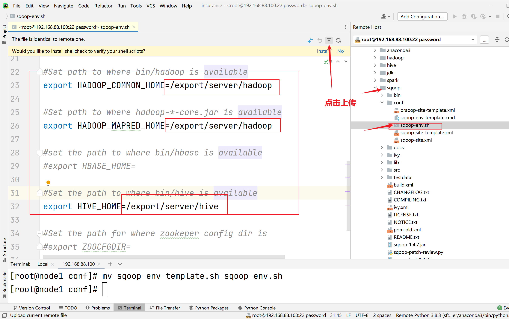
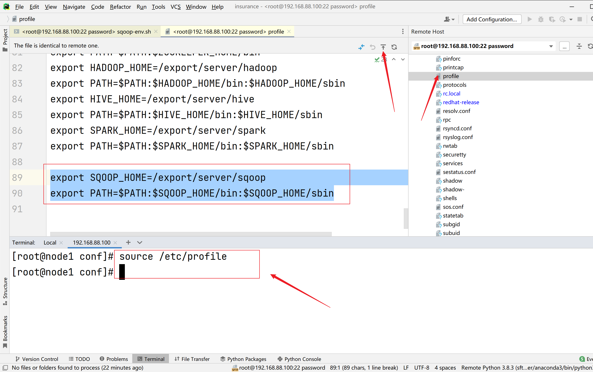

# Sqoop

## 部署

> **老版本**：
>
> 下载sqoop安装包，http://archive.cloudera.com/cdh5/cdh/5/sqoop-1.4.6-cdh5.14.0.tar.gz。
>
> 将安装包上传到linux中, 并解压
>
>  建议放置在hive和hadoop同服务器的路径下
>
> `tar -zxvf /export/software/sqoop-1.4.6-cdh5.14.0.tar.gz -C /export/server/`
>
> 创建软连接
>
> `ln -s /export/server/sqoop-1.4.6-cdh5.14.0/ /export/server/sqoop`
>
> 配置环境变量
>
> `vi /etc/profile添加export SQOOP_HOME=/export/server/sqoop`
>
> 验证启动 :
>
> ```bash
> bin/sqoop list-databases \
> --connect jdbc:mysql://localhost:3306/ \
> --username root --password 123456
> ```
>
> 本命令会列出所有mysql的数据库。如果可以显示, 整个Sqoop安装工作完成。

### 上传sqoop到远程服务器

### 解压安装包到指定/export/server

```sh
cd /root/insurance/4_software/
tar zxvf sqoop-1.4.7.bin_hadoop-2.6.0.tar.gz -C /export/server/
```

### 修改安装包名

```sh
cd /export/server/
mv sqoop-1.4.7.bin__hadoop-2.6.0/ sqoop
```

### 修改配置文件名

```sh
cd /export/server/sqoop/conf/
mv sqoop-env-template.sh sqoop-env.sh
```

### 修改配置文件信息



### 复制hive的驱动包

* sqoop连接mysql 需要mysql驱动包
* sqoop连接hive  需要hive驱动包

```sh
cp /export/server/hive/lib/mysql-connector-java-5.1.32.jar /export/server/sqoop/lib/
cp /export/server/hive/lib/hive-exec-3.1.2.jar /export/server/sqoop/lib/
cp /export/server/hive/lib/commons-lang-2.6.jar /export/server/sqoop/lib/
```

### 将sqoop指定添加系统变量

```sh
export SQOOP_HOME=/export/server/sqoop
export PATH=$PATH:$SQOOP_HOME/bin:$SQOOP_HOME/sbin
export HCAT_HOME=/usr/hive/hcatalog
export PATH=$PATH:$HCAT_HOME/bin
```



* 验证

```sh
 sqoop list-databases  --connect jdbc:mysql://node1:3306  --username root --password 123456
```

## 常用命令

| 参数                                                         | 说明                                                         |
| ------------------------------------------------------------ | ------------------------------------------------------------ |
| --connect                                                    | 连接关系型数据库的URL                                        |
| --username                                                   | 连接数据库的用户名                                           |
| --password                                                   | 连接数据库的密码                                             |
| --driver                                                     | JDBC的driver class                                           |
| --query或--e <statement>                                     | 将查询结果的数据导入，使用时必须伴随参--target-dir或--hcatalog-table，如果查询中有where条件，则条件后必须加上$CONDITIONS关键字，并且不能使用--where选项。  如果使用双引号包含sql，则$CONDITIONS前要加上\以完成转义：\$CONDITIONS。 |
| --hcatalog-database                                          | 指定HCatalog表的数据库名称。如果未指定，default则使用默认数据库名称。提供 --hcatalog-database不带选项--hcatalog-table是错误的。 |
| --hcatalog-table                                             | 此选项的参数值为HCatalog表名。该--hcatalog-table选项的存在表示导入或导出作业是使用HCatalog表完成的，并且是HCatalog作业的必需选项。 |
| --create-hcatalog-table                                      | 此选项指定在导入数据时是否应自动创建HCatalog表。表名将与转换为小写的数据库表名相同。 |
| --hcatalog-storage-stanza 'stored as orc  tblproperties ("orc.compress"="SNAPPY")' \ | 建表时追加存储格式到建表语句中，tblproperties修改表的属性，这里设置orc的压缩格式为SNAPPY |
| -m                                                           | 指定并行处理的MapReduce任务数量。  -m不为1时，需要用split-by指定分片字段进行并行导入，尽量指定int型。 |
| --split-by id                                                | 如果指定--split by, 必须使用$CONDITIONS关键字, 双引号的查询语句还要加\。当--m参数>1时，必须通过--split-by指定主键，以便sqoop根据指定主键，分割数据交给多个map读取。  <br />--split-by对数字类型字段支持较好，如果字段是字符串类型需要加上-Dorg.apache.sqoop.splitter.allow_text_splitter=true选项。 |
| --hcatalog-e-keys  --hcatalog-partition-values               | keys和values必须同时存在，相当于指定静态分区。允许将多个键和值提供为静态分区键。多个选项值之间用，（逗号）分隔。比如：  --hcatalog-partition-keys year,month,day  --hcatalog-partition-values 1999,12,31 |
| --null-string '\\N'  --null-non-string '\\N'                 | 指定mysql数据为空值时用什么符号存储，null-string针对string类型的NULL值处理，--null-non-string针对非string类型的NULL值处理 |
| --hive-drop-import-delims                                    | 设置无视字符串中的分割符（hcatalog默认开启）                 |
| --fields-terminated-by '\t'                                  | 设置字段分隔符，默认sqoop导入数据到HDFS，会用逗号作为分隔符号。 |
| --target-dir                                                 | 可以用来指定导出数据存放至HDFS的目录                         |
| --delete-target-dir                                          | 判断导出目录是否已存在，如果存在就删掉                       |

## 详细命令选项

**1） 公用参数：数据库连接**

| 参数       | 说明                   |
| ---------- | ---------------------- |
| --connect  | 连接关系型数据库的URL  |
| --help     | 打印帮助信息           |
| --driver   | JDBC的driver class     |
| --password | 连接数据库的密码       |
| --username | 连接数据库的用户名     |
| --verbose  | 在控制台打印出详细信息 |

**2） 公用参数：import**

| 参数                            | 说明                                                         |
| ------------------------------- | ------------------------------------------------------------ |
| --enclosed-by <char>            | 给字段值前加上指定的字符                                     |
| --escaped-by <char>             | 对字段中的双引号加转义符                                     |
| --fields-terminated-by <char>   | 设定每个字段是以什么符号作为结束，默认为逗号                 |
| --lines-terminated-by <char>    | 设定每行记录之间的分隔符，默认是\n                           |
| --mysql-delimiters              | Mysql默认的分隔符设置，字段之间以逗号分隔，行之间以\n分隔，默认转义符是\，字段值以单引号包裹。 |
| --optionally-enclosed-by <char> | 给带有双引号或单引号的字段值前后加上指定字符。               |
| -m                              | 指定并行处理的MapReduce任务数量。 -m不为1时，需要用split-by指定分片字段进行并行导入，尽量指定int型。 |
| --split-by id                   | 如果指定-split by, 必须使用$CONDITIONS关键字, 双引号的查询语句还要加\ |
| --query或--e <statement>        | 将查询结果的数据导入，使用时必须伴随参--target-dir，--hcatalog-table，如果查询中有where条件，则条件后必须加上CONDITIONS关键字。 如果使用双引号包含sql，则CONDITIONS前要加上\以完成转义：\$CONDITIONS |

**3 公用参数：export**

| 参数                                  | 说明                                       |
| ------------------------------------- | ------------------------------------------ |
| --input-enclosed-by <char>            | 对字段值前后加上指定字符                   |
| --input-escaped-by <char>             | 对含有转移符的字段做转义处理               |
| --input-fields-terminated-by <char>   | 字段之间的分隔符                           |
| --input-lines-terminated-by <char>    | 行之间的分隔符                             |
| --input-optionally-enclosed-by <char> | 给带有双引号或单引号的字段前后加上指定字符 |

**2.4 公用参数：hive**

| 参数                            | 说明                                                      |
| ------------------------------- | --------------------------------------------------------- |
| --hive-delims-replacement <arg> | 用自定义的字符串替换掉数据中的\r\n和\013 \010等字符       |
| --hive-drop-import-delims       | 在导入数据到hive时，去掉数据中的\r\n\013\010这样的字符    |
| --map-column-hive <arg>         | 生成hive表时，可以更改生成字段的数据类型                  |
| --hive-partition-key            | 创建分区，后面直接跟分区名，分区字段的默认类型为string    |
| --hive-partition-value <v>      | 导入数据时，指定某个分区的值                              |
| --hive-home <dir>               | hive的安装目录，可以通过该参数覆盖之前默认配置的目录      |
| --hive-import                   | 将数据从关系数据库中导入到hive表中                        |
| --hive-overwrite                | 覆盖掉在hive表中已经存在的数据                            |
| --create-hive-table             | 默认是false，即，如果目标表已经存在了，那么创建任务失败。 |
| --hive-table                    | 后面接要创建的hive表,默认使用MySQL的表名                  |
| --table                         | 指定关系数据库的表名                                      |

## Demo

查询指定mysql的所有数据库

```bash
sqoop list-databases --connect jdbc:mysql://192.168.52.150:3306 --username root --password 123456
```

查询指定mysql数据库中的所有表

```bash
sqoop list-tables \
--connect jdbc:mysql://192.168.52.150:3306/test \
--username root \
--password 123456 
```

数据导入到hdfs

```bash
sqoop import \
--connect jdbc:mysql://192.168.52.150:3306/test \
--username root \
--password 123456 \
--table emp
# 说明:
#	默认情况下, 会将数据导入到操作sqoop用户的HDFS的家目录下,在此目录下会创建一个以导入表的表名为名称文件夹, 在此文件夹下莫每一条数据会运行一个mapTask, 数据的默认分隔符号为 逗号

# 指定文件夹，存在就删除
sqoop import \
--connect jdbc:mysql://192.168.52.150:3306/test \
--username root \
--password 123456 \
--table emp \
--delete-target-dir \
--target-dir '/sqoop_works/emp_1'

# 指定maptask数量，需要配合--split-by（指定分割字段）使用
sqoop import \
--connect jdbc:mysql://192.168.52.150:3306/test \
--username root \
--password 123456 \
--table emp \
--delete-target-dir \
--target-dir '/sqoop_works/emp_2' \
--split-by id \
-m 2 

# 指定输出文件的分隔符（当然也可以指定输入分隔符）
sqoop import \
--connect jdbc:mysql://192.168.52.150:3306/test \
--username root \
--password 123456 \
--table emp \
--fields-terminated-by '\001' \
--delete-target-dir \
--target-dir '/sqoop_works/emp_3' \
-m 1 
```

数据导入到hive

```bash
# hive中的表
# create database hivesqoop;
# use hivesqoop;
# create table hivesqoop.emp_add_hive(
#	id  int,
#	hno string,
#	street string,
#	city string
#) 
#row format delimited fields terminated by '\t'
#stored as  orc ;

# 通过hcatalog导入到hive，table指定mysql表，hcatalog系列命令指定hive相关配置
sqoop import \
--connect jdbc:mysql://192.168.52.150:3306/test \
--username root \
--password 123456 \
--table emp_add \
--hcatalog-database hivesqoop \
--hcatalog-table emp_add_hive \
-m 1 
```

数据按条件导入到hive

```bash
# 使用where选项过滤数据
sqoop import \
--connect jdbc:mysql://192.168.52.150:3306/test \
--username root \
--password 123456 \
--table emp \
--where 'id > 1205' \
--delete-target-dir \
--target-dir '/sqoop_works/emp_2' \
--split-by id \
-m 2 

# 通过query选项，指定sql导入数据
# !!!注意使用sql必须在where后面加上$CONDITIONS
# !!!如果SQL语句使用 双引号包裹,  $CONDITIONS前面需要将一个\进行转义, 单引号是不需要的
sqoop import \
--connect jdbc:mysql://192.168.52.150:3306/test \
--username root \
--password 123456 \
--query 'select deg  from emp where 1=1 AND $CONDITIONS' \
--delete-target-dir \
--target-dir '/sqoop_works/emp_4' \
--split-by id \
-m 1 
```

数据导出到mysql

```bash
# 第一步: 在mysql中创建目标表 (必须创建，不会自动创建)
#create table test.emp_add_mysql(
#	 id     INT  ,
#    hno    VARCHAR(32) NULL,
#    street VARCHAR(32) NULL,
#    city   VARCHAR(32) NULL
#);

# export导出到mysql
sqoop export \
--connect jdbc:mysql://192.168.52.150:3306/test \
--username root \
--password 123456 \
--table emp_add_mysql \
--hcatalog-database hivesqoop \
--hcatalog-table emp_add_hive \
-m 1
# 存在问题: 如果hive中表数据存在中文, 通过上述sqoop命令, 会出现中文乱码的问题
# 连接mysql时，添加参数useUnicode=true&characterEncoding=utf-8，防止乱码
```

## Sqoop原生API和HCatalog区别

* 数据格式支持（这是实际中使用HCatalog的主要原因，否则还是原生的灵活一些）
    * Sqoop方式支持的数据格式较少
    * HCatalog支持的数据格式多，包括RCFile, ORCFile, CSV, JSON和SequenceFile等格式。

* 数据覆盖
    * Sqoop方式允许数据覆盖，HCatalog不允许数据覆盖，每次都只是追加。

* 字段名匹配
    * Sqoop方式比较随意，不要求源表和目标表字段相同(字段名称和个数都可以不相同)，它抽取的方式是将字段按顺序插入，比如目标表有3个字段，源表有一个字段，它会将数据插入到Hive表的第一个字段，其余字段为NULL。
    * 但是HCatalog不同，源表和目标表字段名需要相同，字段个数可以不相等，如果字段名不同，抽取数据的时候会报NullPointerException错误。HCatalog抽取数据时，会将字段对应到相同字段名的字段上，哪怕字段个数不相等。


虽然sqoop支持很多种方式把数据从mysql导入到hive中，但是实际中使用最多的是：

1、用户自己手动在hive中建表，并且根据自己的需求指定存储格式、分隔符、是否压缩等属性

2、使用sqoop新的API---Hcatalog API将输入导入到hive表中。

## Sqoop数据导入

### 导入HDFS

```bash
sqoop import \
--connect jdbc:mysql://192.168.88.80:3306/userdb \
--username root \
--password 123456 \
--target-dir /sqoop/result3 \
--table emp --m 2
#上述执行报错 错误信息如下
Import failed: No primary key could be found for table emp. Please specify one with --split-by or perform a sequential import with '-m 1'.


sqoop import \
--connect jdbc:mysql://192.168.88.80:3306/userdb \
--username root \
--password 123456 \
--target-dir /sqoop/result3 \
--fields-terminated-by '\t' \
--split-by id \
--table emp --m 2

#请结合一下的日志信息感受如何进行切片的
BoundingValsQuery: SELECT MIN(`id`), MAX(`id`) FROM `emp`
Split size: 2; Num splits: 2 from: 1201 to: 1205
mapreduce.JobSubmitter: number of splits:2

#下面这个命令是错误的  没有指定切割的判断依据
sqoop import \
--connect jdbc:mysql://192.168.88.80:3306/userdb \
--username root \
--password 123456 \
--target-dir /sqoop/result3 \
--fields-terminated-by '\t' \
--table emp --m 2

#扩展知识点
关于mr输出的结果文件名称

part-r-00000  r表示reducetask 说明这个mr程序是一个标准的两个阶段的程序
part-m-00000  m表示maptask   说明这个mr是一个只有map阶段没有reduce阶段的程序
```

### 导入Hive

1. 手动建表后导入数据

```bash
#将关系型数据的表结构复制到hive中
sqoop create-hive-table \
--connect jdbc:mysql://192.168.88.80:3306/userdb \
--table emp_add \
--username root \
--password 123456 \
--hive-table test.emp_add_sp

# 其中 
--table emp_add为mysql中的数据库sqoopdb中的表   
--hive-table emp_add_sp 为hive中新建的表名称。如不指定，将会在hive的default库下创建和MySQL同名表

# 导入数据
sqoop import \
--connect jdbc:mysql://192.168.88.80:3306/userdb \
--username root \
--password 123456 \
--table emp_add \
--hive-table test.emp_add_sp \
--hive-import \
--m 1
```

2. 直接导入数据，Sqoop自动为我们建表

```bash
sqoop import \
--connect jdbc:mysql://192.168.88.80:3306/userdb \
--username root \
--password 123456 \
--table emp_conn \
--hive-import \
--m 1 \
--hive-database test
```

### Sqoop增量数据导入

* --check-column 以哪一列的值作为增量的基准
* --last-value：指定上一次这一列的值是什么
* --incremental：指定增量的方式
    * append模式
    * lastmodified模式

#### append

- 要求：必须有一列自增的值，按照自增的int值进行判断。
- 特点：只能导入增加的数据，**无法更新的数据**，即只能追加。

```bash
#首先执行以下指令先将我们之前的数据导入
sqoop import \
--connect jdbc:mysql://192.168.88.80:3306/userdb \
--username root \
--password 123456 \
--target-dir /sqoop/appendresult \
--table emp --m 1

#查看生成的数据文件，发现数据已经导入到hdfs中.

#然后在mysql的emp中插入2条数据:
insert into `userdb`.`emp` (`id`, `name`, `deg`, `salary`, `dept`) values ('1206', 'allen', 'admin', '30000', 'tp');
insert into `userdb`.`emp` (`id`, `name`, `deg`, `salary`, `dept`) values ('1207', 'woon', 'admin', '40000', 'tp');

#执行如下的指令，实现增量的导入:
sqoop import \
--connect jdbc:mysql://192.168.88.80:3306/userdb \
--username root \
--password 123456 \
--table emp --m 1 \
--target-dir /sqoop/appendresult \
--incremental append \
--check-column id \
--last-value 1205


####如果想实现sqoop自动维护增量记录  可以使用sqoop job作业来实现
21/10/09 15:03:37 INFO tool.ImportTool:  --incremental append
21/10/09 15:03:37 INFO tool.ImportTool:   --check-column id
21/10/09 15:03:37 INFO tool.ImportTool:   --last-value 1207
21/10/09 15:03:37 INFO tool.ImportTool: (Consider saving this with 'sqoop job --create')
```

#### lastmodified

- 要求：**必须包含时间列**，按照数据时间的变化进行判断。
- 特点：**既可以新增的数据也可以更新的数据**，可以通过**指定--merge-key来更新数据**。

```bash
# 首先我们要在mysql中创建一个customer表，指定一个时间戳字段
create table customertest(id int,name varchar(20),last_mod timestamp default current_timestamp on update current_timestamp);

#此处的时间戳设置为在数据的产生和更新时都会发生改变. 

#插入如下记录:
insert into customertest(id,name) values(1,'neil');
insert into customertest(id,name) values(2,'jack');
insert into customertest(id,name) values(3,'martin');
insert into customertest(id,name) values(4,'tony');
insert into customertest(id,name) values(5,'eric');

#此时执行sqoop指令将数据导入hdfs:
sqoop import \
--connect jdbc:mysql://192.168.88.80:3306/userdb \
--username root \
--password 123456 \
--target-dir /sqoop/lastmodifiedresult \
--table customertest --m 1


#再次插入一条数据进入customertest表
insert into customertest(id,name) values(6,'james');
#更新一条已有的数据，这条数据的时间戳会更新为我们更新数据时的系统时间.
update customertest set name = 'Neil' where id = 1;


#执行如下指令，把id字段作为merge-key:
sqoop import \
--connect jdbc:mysql://192.168.88.80:3306/userdb \
--username root \
--password 123456 \
--table customertest \
--target-dir /sqoop/lastmodifiedresult \
--check-column last_mod \
--incremental lastmodified \
--last-value "2022-06-13 16:26:02" \
--m 1 \
--merge-key id

#由于merge-key这种模式是进行了一次完整的mapreduce操作，
#因此最终我们在lastmodifiedresult文件夹下可以发现id=1的name已经得到修改，同时新增了id=6的数据
```

#### Custom Condition

自定义条件过滤实现增量数据导入，实际开发中使用最多的就是这种方式。

> 使用--query或--where选项筛选日期字段，实现增量导入。

```bash
sqoop import \
--connect jdbc:mysql://192.168.88.80:3306/userdb \
--username root \
--password 123456 \
--query "select * from emp where id>1203 and  \$CONDITIONS" \
--fields-terminated-by '\001' \
--hcatalog-database test \
--hcatalog-table emp_hive \
-m 1
```

## Sqoop数据导出

>sqoop导出操作最大的特点是，目标表需要自己手动提前创建。

### 全量数据导出

```bash
#step1:MySQL中建表
mysql> use userdb;
mysql> create table employee ( 
   id int not null, 
   name varchar(20), 
   deg varchar(20),
   salary int,
   dept varchar(10));
   
#step2:从HDFS导出数据到MySQL
sqoop export \
--connect jdbc:mysql://192.168.88.80:3306/userdb \
--username root \
--password 123456 \
--table employee \
--export-dir /sqoop/result1/


sqoop export \
--connect jdbc:mysql://192.168.88.80:3306/userdb \
--username root \
--password 123456 \
--table employee \
--export-dir /sqoop/result2/


mapred --daemon start historyserver


#启动jobhistory服务 日志显示java.lang.RuntimeException: Can't parse input data: '1205kranthiadmin20000TP' 
解析数据失败  失败的原因在于HDFS上sqoop默认分隔符是, 而数据中是\001 所以需要指定分隔符。


sqoop export \
--connect jdbc:mysql://192.168.88.80:3306/userdb \
--username root \
--password 123456 \
--table employee \
--input-fields-terminated-by '\001' \
--export-dir /sqoop/result2/


#step3:从Hive导出数据到MySQL
#首先清空MySQL表数据
truncate table employee;


sqoop export \
--connect jdbc:mysql://192.168.88.80:3306/userdb \
--username root \
--password 123456 \
--table employee \
--hcatalog-database test \
--hcatalog-table emp_hive \
--input-fields-terminated-by '\t' \
-m 1 

#注意，如果Hive中的表底层是使用ORC格式存储的，那么必须使用hcatalog API进行操作。
```

### 增量数据导出

- updateonly：只增量导出更新的数据。
- allowerinsert：既导出更新的数据，也导出新增的数据。

#### updateonly

```bash
#在HDFS文件系统中/sqoop/updateonly/目录的下创建一个文件updateonly_1.txt
hadoop fs -mkdir -p /sqoop/updateonly/
hadoop fs -put updateonly_1.txt /sqoop/updateonly/

1201,gopal,manager,50000
1202,manisha,preader,50000
1203,kalil,php dev,30000

#手动创建mysql中的目标表
mysql> USE userdb;
mysql> CREATE TABLE updateonly ( 
   id INT NOT NULL, 
   name VARCHAR(20), 
   deg VARCHAR(20),
   salary INT);

#先执行全部导出操作：
sqoop export \
--connect jdbc:mysql://192.168.88.80:3306/userdb \
--username root \
--password 123456 \
--table updateonly \
--export-dir /sqoop/updateonly/updateonly_1.txt

#新增一个文件updateonly_2.txt：修改了前三条数据并且新增了一条记录
1201,gopal,manager,1212
1202,manisha,preader,1313
1203,kalil,php dev,1414
1204,allen,java,1515

hadoop fs -put updateonly_2.txt /sqoop/updateonly/

#执行更新导出：
sqoop export \
--connect jdbc:mysql://192.168.88.80:3306/userdb \
--username root \
--password 123456 \
--table updateonly \
--export-dir /sqoop/updateonly/updateonly_2.txt \
--update-key id \
--update-mode updateonly
```

#### allowinsert

```bash
#手动创建mysql中的目标表
mysql> USE userdb;
mysql> CREATE TABLE allowinsert ( 
   id INT NOT NULL PRIMARY KEY, 
   name VARCHAR(20), 
   deg VARCHAR(20),
   salary INT);
   
#先执行全部导出操作
sqoop export \
--connect jdbc:mysql://192.168.88.80:3306/userdb \
--username root \
--password 123456 \
--table allowinsert \
--export-dir /sqoop/updateonly/updateonly_1.txt


#执行更新导出
sqoop export \
--connect jdbc:mysql://192.168.88.80:3306/userdb \
--username root --password 123456 \
--table allowinsert \
--export-dir /sqoop/updateonly/updateonly_2.txt \
--update-key id \
--update-mode allowinsert
```

## 运行--split-by字段为字符串

```bash
sqoop import -Dorg.apache.sqoop.splitter.allow_text_splitter=true \
--connect ${url}/${db}?tinyInt1isBit=false \
--username ${username} \
--password ${password} \
--table seewo_system_info \
--hive-import 
--hive-database seewo \
--hive-overwrite \
--bindir . \
--delete-target-dir \
--hive-table seewo_class_seewo_system_info_text \
--hive-drop-import-delims --autoreset-to-one-mapper --verbose
```


