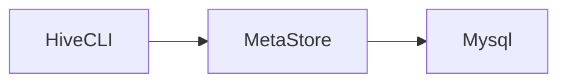

# Hive

> 一个数据仓库工具，用于查询和分析hdfs上的大规模数据。
>
> 提供了类似sql的方式操作hdfs上的数据，底层将sql转换为MR程序在hadoop上运行，同时也支持spark、tez的高性能内存计算框架。

## hive与mysql的区别

mysql是一个数据库，用于存储业务数据，有完整的事务支持，适合业务系统中的数据存储，支持crud。

而hive只是一个数据仓库工具，本身不存储任何数据，只是提供了简单的方式（sql），操作hdfs上的数据，hive不支持更新操作。

hive没有索引需要扫描所有数据，是秒级、分钟级、小时级甚至更长时间的响应，但是可以利用hadoop集群算力，适合大数据并行计算。

而mysql有索引，响应式毫秒级的响应，适合在线搜索（大数据实时搜索请使用类似es的搜索引擎）。

## 搭建

[hive官网下载链接](https://hive.apache.org/downloads.html)

以下演示使用`apache-hive-3.1.3`版本

hive依赖于hadoop环境，请在使用前启动hadoop hdfs集群（java环境就不多说了）。

### 配置文件

hive安装目录下的conf/hive-env.sh

```shell
export HADOOP_HOME=/opt/hadoop-3.3.3
export HIVE_CONF_DIR=/opt/apache-hive-3.1.3-bin/conf
export HIVE_AUX_JARS_PATH=/opt/apache-hive-3.1.3-bin/lib
```

hive-site.xml相关配置请看mysql元数据配置

### 元数据源

hive将sql解析为MR程序后运行，前提是需要知道hdfs上文件映射成数据库表的关系。

hive提供了metasotre server作为元数据源存储介质，将映射关系存储在元数据服务器上。


hive有两种元数据源，分别是本地derby数据库，与第三方`mysql`、`pgsql`等数据源。

开发期间为了方便可以使用`derby`本地数据库，只有在derby运行的服务器上才能访问元数据信息。

#### derby

初始化元数据信息`HIVE_HOME/bin/schematool -initSchema -dbType derby`

derby内嵌数据库会自动启动metastore，无需手动启动。（如果没有手动启动请使用hive目录下的`HIVE_HOME/bin/hive --service metastore`）

可以使用`jps`查看`RunJar`是否运行（不过`HIVE_HOME/bin/hive --service`启动的服务名称都是`RunJar`）

使用`HIVE_HOME/bin/hive`，使用`show databases;`查看是否成功。

#### mysql

在任意服务器上启动一个mysql（生产环境下当然是单独的mysql服务器），集群内能正常访问就行。

mysql相关配置

hive-site.xml

```xml
<?xml version="1.0"?>
<?xml-stylesheet type="text/xsl" href="configuration.xsl"?>
<configuration>
    <!-- jdbc 连接的 URL -->
    <property>
        <name>javax.jdo.option.ConnectionURL</name>
        <value>jdbc:mysql://domain:3336/hive?useSSL=false</value>
    </property>
    <!-- jdbc 连接的 Driver-->
    <property>
        <name>javax.jdo.option.ConnectionDriverName</name>
        <value>com.mysql.cj.jdbc.Driver</value> <!-- 注意这里用的是cj包下的启动，需要mysql8.0以上的驱动 -->
    </property>
    <!-- jdbc 连接的 username-->
    <property>
        <name>javax.jdo.option.ConnectionUserName</name>
        <value>root</value>
    </property>
    <!-- jdbc 连接的 password -->
    <property>
        <name>javax.jdo.option.ConnectionPassword</name>
        <value>tiger</value>
    </property>
    <!-- Hive 元数据存储版本的验证 -->
    <property>
        <name>hive.metastore.schema.verification</name>
        <value>false</value>
    </property>
    <!--元数据存储授权-->
    <property>
        <name>hive.metastore.event.db.notification.api.auth</name>
        <value>false</value>
    </property>
    <!-- Hive 默认在 HDFS 的工作目录 -->
<!--    <property>-->
<!--        <name>hive.metastore.warehouse.dir</name>-->
<!--        <value>/user/hive/warehouse</value>-->
<!--    </property>-->
        <!-- 指定存储元数据要连接的地址，用于其他hive连接metasotre -->
<!--    <property>-->
<!--        <name>hive.metastore.uris</name>-->
<!--        <value>thrift://node01:9083</value>-->
<!--    </property>-->
        <!-- 指定 hiveserver2 连接的 host -->
<!--    <property>-->
<!--        <name>hive.server2.thrift.bind.host</name>-->
<!--        <value>node01</value>-->
<!--    </property>-->
        <!-- 指定 hiveserver2 连接的端口号 -->
<!--    <property>-->
<!--        <name>hive.server2.thrift.port</name>-->
<!--        <value>10000</value>-->
<!--    </property>-->
</configuration>
```


配置完成后使用`HIVE_HOME/bin/schematool -initSchema -dbType mysql -verbose`初始化元数据信息。（新版本貌似初始化元数据信息后，就会自动启动metastore服务，通过`jps`查看有没有RunJar。如果没有通过`HIVE_HOME/bin/hive --service metastore`手动启动。）

如果启动后报错，找不到mysql驱动，去maven上下一个mysql驱动放到`HIVE_HOME/lib`下就行了。

## 客户端

### Hive CLI

> 第一代hive客户端




直接使用`HIVE_HOME/bin/hive`运行即可

### Beeline

> 第二代hvie客户端


中间多了一个hiveserver2，需要启动hiveserver2才能使用，通过hiveserver2访问metastore。

`HIVE_HOME/bin/hive --service hiveserver2`启动hiveserver2


客户端通过`HIVE_HOME/bin/beeline`启动

在客户端中使用`! connect jdbc:hive2://your_hiveserver2_host:10000`，连接hiveserver2。

连接后需要输入用户名，输入一个在hdfs中有数据权限的用户名即可，密码可以跳过直接回车。

## 常见DML

> 需要使用时，直接网上搜索即可

### 建库

```sql
CREATE (DATABASE|SCHEMA) [IF NOT EXISTS] database_name
[COMMENT database_comment]
[LOCATION hdfs_path]
[WITH DBPROPERTIES (property_name=property_value, ...)];

create database if not exists itcast
comment "this is my first db"
with dbproperties ('createdBy'='Allen');
```

### 建表


```sql
CREATE TABLE [IF NOT EXISTS] [db_name.]table_name
(col_name data_type [COMMENT col_comment], ... )
[COMMENT table_comment]
[ROW FORMAT DELIMITED …];
```

row format delimited所有选项

```sql
row format delimited
	# 每行数据字段的分隔符
	[fields terminated by char]
	# 集合元素的分隔符，例如1,张三,a=1-b=2-c=3其中-就是集合分隔符
    [collection items terminated by char]
	# map元素的分隔符，例如1,张三,a=1-b=2-c=3其中=就是集合分隔符
    [map keys terminated by char]
    # 标识一行数据结束的分隔符，默认\n
    [lines terminated by char]
```

### 视图与物化视图

```sql
# 创建视图
create view v_user_transaction_all as
select *
from user_info_transaction;

# 创建物化视图
create materialized view user_info_transaction_agg_mview
as
select name, count(*)
from user_info_transaction
group by name;
```

## 分区

> 通过指定分区字段，将数据文件按字段分区，hdfs上以为`分区字段名=字段值`的形式组织数据。
>
> 分区可以提升性能，在进行where条件时，由于hive对索引支持有限，默认情况下只能走全表扫描，性能极低。当进行表分区后，对分区字段的条件过滤，不会全表扫描，只会扫描该分区内的数据。

注意事项：

* **分区字段与表字段不能重名**
* **分区表需要自己加入数据（加载数据可以手动分区或自动分区）**

```sql
create table hero
(
    id   int,
    name string,
    role string
) partitioned by (role_ext string)
    row format delimited fields terminated by ",";
```

### 多重分区

可以指定多个分区字段，注意顺序，hive会按照分区字段的顺序，优先按靠前的字段分区。

```sql
create table user_info_dy_part
(
    id       int,
    name     string,
    province string,
    city     string
) partitioned by (province_ext string, city_ext string)
    row format delimited fields terminated by ",";
```

分区表需要使用`load data`语法加入数据：

### 手动分区


```sql
load data inpath "/user/hive/warehouse/test.db/hero/tank.txt" into table hero partition (role_ext = "tank");
```

### 自动分区

```sql
# 开启自动分区
set hive.exec.dynamic.partition = true;
# 关闭严格模式（必须至少有一个静态分区）
set hive.exec.dynamic.partition.mode = nostrict;

# 全量数据表
create table user_info
(
    id       int,
    name     string,
    province string,
    city     string
) row format delimited fields terminated by ",";

# 分区表
create table user_info_dy_part
(
    id       int,
    name     string,
    province string,
    city     string
) partitioned by (province_ext string, city_ext string)
    row format delimited fields terminated by ",";


# 动态分区需要从已有数据表中导入数据
insert into table user_info_dy_part partition (province_ext, city_ext)
select t.*, t.province, t.city
from user_info t;
```

## 分桶

> 分桶与分区操作类似，可以将分桶理解为以指定字段的hash散列方式分区。（类似于mysql hash索引）
>
> 分桶操作会通过指定字段的hash值取模桶数量，得到的记过就是分区表所在的文件（例如取模结果为0，那么就在第一个文件中）。这与MapReduce中的分区操作类似。
>
> 分桶操作也可以提升查询性能，在查询的过滤条件是分桶字段时，直接走对应的分桶文件，而不需要全表扫描。同时在join操作时，如果两边的字段都是分桶字段，那么只会走两个桶的笛卡尔积，不会走全量数据。

```sql
create table user_info_without_bucket
(
    id   int,
    name string,
    age  int
) row format delimited fields terminated by ",";

create table user_info_bucket
(
    id   int,
    name string,
    age  int
    # 指定分桶字段与桶数量
) clustered by (id) into 5 buckets;

# 分桶也需要手动加载数据，但是使用的是insert into table as select方式
insert into user_info_bucket
select *
from user_info_without_bucket;
```

## 事务表

> hive一开始并不支持事务，后来由于flume、spark、kafka工具组件将数据流高速传输到hdfs上。高速传输和分区会给NameNode带来压力，因此使用这些数据流工具将数据传输到已有的分区中。但是可能会造成脏读（数据传输一般失败，回滚）。需要通过事务让用户获取一致性的数据，避免产生太多小文件。
>
> Hive 在设计之初时，是不支持事务操作的，因为 Hive 的核心目标是将已存在的结构化数据文件映射成表，然后提供基于表的SQL分析处理；是一款面向分析的工具。且映射的文件存在 HDFS 中，其本身也不支持随机修改文件的数据。这个定位就意味着早期的 HQL 本身就不支持 update、delete 语法，也就没有所谓的事务支持。
>
> hive0.14版本开始支持事务，但是想使用事务操作仍然还有许多限制。

最终 Hive 支持了具有 ACID 语义的事务，但做不到和传统关系型数据库那样的事务级别，仍有很多局限如：

1. 不支持 begin、commit、rollback，所有操作自动提交
2. 仅支持 orc 文件格式
3. 默认事务关闭，需要额外配置
4. 表参数 transactional 必须为 true
5. 外部表不能成为 ACID 表，不允许从非 ACID 会话读取/写入 ACID 表

```sql
# 使用事务需要开启的配置（事务操作只支持分通表），set配置是临时的，在hive-site.xml中配置全局持久生效。
set hive.support.concurrency = true;
# hive3.0默认开启，之前的版本需要手动开启
set hive.enforce.bucketing = true;
set hive.exec.dynamic.partition.mode = nostrict;
# 指定事务管理器
set hive.txn.manager = org.apache.hadoop.hive.ql.lockmgr.DbTxnManager;
# 是否在Meatastore对delta文件进行压缩合并
set hive.compactor.initiator.on = true;
# 压缩合并的工作线程数
set hive.compactor.worker.threads = 1;

create table user_info_transaction
(
    id   int,
    name string,
    age  int
) clustered by (id) into 5 buckets stored as orc tblproperties ("transactional" = "true");

select *
from user_info_transaction;

# hdfs不支持更改操作（可以追加），hive的删改操作本质上是重新写入删改后的所有数据
update user_info_transaction
set age = 18
where id = 1;

delete user_info_transaction
where id = 6;
```

## 导出数据

```sql
-- 注意overwrite语法表示直接情况目标文件夹并写入数据, 使用时一定要注意(默认是hdfs上，使用local存储到hiveserver2上)
insert overwrite directory "/tmp/hive_export/1"
select id, name, province_ext
From user_with_province_part;
```

## 视图

### 虚拟视图

```sql
create view jt_usr_covid19_alabama as
select *
from t_usa_covid19_part
where state = "Alabama"
order by deaths desc;
```

### 物化视图

```sql
create materialized view jt_usr_covid19_alabama as
select *
from t_usa_covid19_part
where state = "Alabama"
order by deaths desc;
```

## 排序

### order by

```sql
select *
from students
order by sex;
```

### cluster by

>根据指定字段分区（类似partition）同时根据该字段排序（默认升序，无法指定升序、逆序）

```sql
select *
from students cluster by num;
-- 上面语句等同于:
-- select * from students distributed by num sort by num;
```

### distributed by srot by

> 根据distributed by的字段分区（类似partition），同时根据sort by字段排序（默认升序，可以指定升序、逆序）

```sql
select *
from students distribute by sex sort by age;
-- 上面的语句可以类比partition返回结果类似:
/*
select name,
       age,
       sex,
       rank() over (partition by sex order by age)
from students;
*/
```

## hive函数

> 这里只列举常用函数与hive独有特殊函数，多数函数与mysql保持一致

### 常用函数

```sql
-- 运算符与函数
select 1 + 1;

select *
from students
where name like "李%";

select *
from students
where name rlike "^李.$";

select *
from students
where name regexp "^李.$";

select 17 / 3;
select 17 div 3;
select 17 % 3;
select 17 & 3;
select 17 | 3;
select 17 ^ 3;

select concat("A", "B", "C");
select "A" || "B" || "C";

select array(1, 2, "hello");
select map("hello", 1, "world", 2);
select struct("name", "age");
select named_struct("hello", 1, "world", 2);
select create_union(0, "uu", array(1, 2, 3), "aa");

-- 常用函数
-- 字符串函数
-- 拼接
select concat("A", "B");
-- 拼接多个值，自动拆包数组
select concat_ws(",", "hello", "world", array("P", 2));
-- 截取从倒数第4位开始截取到最后
select substr("hello world", -4);
-- 正则替换所有满足条件的值
select regexp_replace("100-200", "(\\d+)", "num");
-- 提取匹配到的内容
select regexp_extract("100-200", "(\\d+)-(\\d+)", 2);
-- URL解析函数：从URL解析出host地址
select parse_url("http://www.itcast.cn/path/p1.php?query=1", "HOST");
-- URL解析函数：从URL中解析出多个参数以数组形式返回
select parse_url_tuple("http://www.itcast.cn/path/p1.php?query=1&city=wuhan", "HOST", "PATH", "QUERY", "QUERY:city");
-- 分割字符串（支持正则）
select split("apache hive", "\\s+");
-- select get_splits("apache hive", 1); -- 没搞懂怎么用
-- 解析json，通过指定占位符获取内容
select get_json_object('[{"name": "ZhangSan", "age": "12"},{"name": "ZhangSan", "age": "20"}]', '$.[1]');

-- 获取字符串长度
select length("hello");
-- 反转字符串
select reverse("olleh");

-- 全大写
select upper("city");
select ucase("city");
-- 全小写
select lower("City");
select lcase("City");

-- 查找字符串是否出现在后面的字符串中（默认字符串按`,`分割）, 如果有返回是第几个元素, 不存在返回0
-- 不能用于查找array等结构，查找array请使用array_contains, map[key]如果key不存在返回null
select find_in_set("aaaa", "abc,defg,a");
select find_in_set("a", concat_ws(",", array("A", "a", "cd")));
select array_contains(array(1, 2, 3, "a"), "a");
select map("name", "ZhangSan")["Name"] is null;

-- 时间戳系列
select unix_timestamp();
select datediff("2022-6-14", "2022-6-16");

-- 条件判断
select if(null is null, "NULL", "NOT NULL");
select case 100 when 50 then "TOM" when "100" then "TOM100" else "TIM" end;

-- 数据脱敏
select mask("helloWORLD");
select mask_last_n("helloWORLD");
select mask_show_first_n("15388883445", 3);
select mask_hash("15388883445", 3);
```

### 调用Java方法

> hive支持通过反射调用第三方库中的函数

```sql
-- 如果想使用第三方类库，请使用add jar添加
select java_method("java.lang.Math", "max", 10, 20);
select reflect("java.lang.Math", "max", 10, 20);
```

### collect_list/collect_set

```sql
-- 多行转单列(这里的行是array里的假数据)
-- 不会将数组中的元素拿出来，而是将数组视为一个整体
select collect_list(array(1, 2, 3, 3));
select collect_set(array(1, 2, 2, 2, 2));
-- 将sex字段收集成一行
select collect_list(sex)
from students;
select collect_set(sex)
from students;
```

### explode

```sql
-- explode函数使用，多列转单行
select explode(array(11, 22, 33));

/*
A,1000|2000|3000
B,2222|3333|4444
*/
create table nba
(
    team_name  string,
    good_years array<string>
) row format delimited fields terminated by ","
    collection items terminated by "|";

load data local inpath "/root/hive_data_samples/nba.txt"
    into table nba;

select *
from nba;

select explode(good_years)
from nba;

-- 这个sql运行会报错，无法自动映射航专列后的其他字段
select team_name, explode(good_years)
from nba;
-- 可以先保存所有年份信息，然后join插叙出结果
with years as (select explode(good_years) year
               from nba)
select n.team_name, y.year
from nba n
         join years y
where array_contains(n.good_years, y.year);

-- hive提供了lateral view侧视图，自动实现join
-- 并且不需要查多次表吗，底层缓存了每列对应的其他字段，性能更好
select team_name, b.year
from nba
         lateral view explode(good_years) b as year;

-- 返回每个球队获奖次数并根据获奖次数降序排列
select team_name, count(*) nums
from nba
         lateral view explode(good_years) b as year
group by team_name
order by nums desc;
```

### 抽样函数

```sql
--------------------------
-- 抽样函数
select *
from t_usa_covid19_part;

-- 基于随机排序的随机采样
-- 优点随机性高，缺点性能低
select *
from t_usa_covid19_part
    distribute by rand() sort by rand()
limit 2;

select *
from t_usa_covid19_part
order by rand()
limit 2;

-- 块采样
-- 优点性能高，缺点随机性低
-- 随机获取1行的数据
select *
from t_usa_covid19_part
         tablesample (1 rows);
-- 随机获取50%的数据
select *
from t_usa_covid19_part
         tablesample (50 percent);
-- 随机获取1kb的数据
select *
from t_usa_covid19_part
         tablesample (1k);


-- 基于分桶抽样
-- 性能与随机性兼顾
create table t_usa_covid19_bucket
(
    `count_date` string,
    `county`     string,
    `state`      string,
    `fips`       int,
    `cases`      int,
    `deaths`     int
) clustered by (state) into 5 buckets
    row format delimited fields terminated by ",";

insert into t_usa_covid19_bucket
select *
from t_usa_covid19;

select *
From t_usa_covid19_bucket;

-- 抽取5/5个桶的数据，从第一个桶开始抽取
select *
from t_usa_covid19_bucket
         tablesample (bucket 1 out of 5 on rand());

-- tablesample (bucket x out of y [on column])
-- x表示从第几个桶开始抽样, y=2时, 总桶数是5时, 会抽取 5 / 2个桶的数据, 以on指定的字段为key hash后得到结果
select *
from t_usa_covid19_bucket
         tablesample (bucket 1 out of 3 on state);
```

### 增强聚合函数

> grouping_sets、cube、rollup三个增强聚合功能类似，提供了更简单的语法实现多维度分析（就是分组查询，但是能自动查询出站在不同的字段角度分析的结果），同时相比多次查询union all汇聚结果性能更高。

#### grouping_sets

> 根据指定字段（维度）进行多维度分析
>
> 列如：
>
> ```sql
> select month,
>        day,
>        count(distinct cookieid)
> from cookies_info
> group by month, day
>     grouping sets ( month, day);
> -- 表示根据month与day分组，最后返回的结果分别是group by month与group by day的结果
> ```

```sql
-- 增强聚合函数
-- 一下的增强聚合函数都是只针对group by的字段, 在不同维度(字段)上分析, 最后将结果聚合为一张表
/*
2018-3,2018-3-9,c1                                                           
2018-3,2018-3-6,c1
2018-3,2018-3-14,c1
2018-4,2018-4-13,c1
2018-4,2018-4-4,c1
*/
create table cookies_info
(
    month    string,
    day      string,
    cookieid string
) row format delimited fields terminated by ",";

load data local inpath "/root/hive_data_samples/cookie_info.txt"
    into table cookies_info;

select *
from cookies_info;

select month,
       day,
       count(distinct cookieid)
from cookies_info
group by month, day;

-- 根据(month, day)分组, 并在month和day两个维度分析
select month,
       day,
       count(distinct cookieid)
from cookies_info
group by month, day
    grouping sets ( month, day);
-- 上面语句等价于下面的语句
select month, null, count(distinct cookieid)
from cookies_info
group by month
union all
select null, day, count(distinct cookieid)
from cookies_info
group by day;

-- 根据(month, day)分组, 并在month和day和(month, day)三个维度分析
select month,
       day,
       count(distinct cookieid)
from cookies_info
group by month, day
    grouping sets ( month, day, ( month, day));
-- 上面语句等价于下面的语句
select month, null, count(distinct cookieid)
from cookies_info
group by month
union all
select null, day, count(distinct cookieid)
from cookies_info
group by day
union all
select month, day, count(distinct cookieid)
from cookies_info
group by month, day;
```

#### cube

> GROUPING__ID是使用增强聚合函数时，hive自动生成的字段，用于区分维度（不同的组）

```sql
-- cube根据指定分组字段全维度分析, 结果是2的n次方, n表示维度数量, 下面的例子就是根据（month, day）两个维度（两个字段分组）
-- a,b --> (a) (b) (a,b) ()
-- ()相当于汇总所有
select month, day, count(distinct cookieid) cnt, GROUPING__ID
from cookies_info
group by month, day
with cube;
-- 等价于以下sql
select month, day, count(distinct cookieid) cnt
from cookies_info
union
select month, day, count(distinct cookieid) cnt
from cookies_info
group by month
union
select month, day, count(distinct cookieid) cnt
from cookies_info
group by day
union
select month, day, count(distinct cookieid) cnt
from cookies_info
group by month, day;
```

#### rollup

```sql
-- rollup以最左侧维度为主进行层级聚合
-- a,b,c -> (a) (a,b) (a,b,c) () 四种情况, 有mysql索引最左匹配内味儿了
select month, day, count(distinct cookieid) cnt, GROUPING__ID
from cookies_info
group by month, day
with rollup
order by GROUPING__ID;
```

## hive技巧

### url解析

```sql
select parse_url("http://www.baidu.com/q?wd=python", "HOST");
select parse_url_tuple("http://www.baidu.com/q?wd=python", "PROTOCOL", "HOST", "PATH", "QUERY");

-- parse_url_tuple是一个udtf函数，只不过返回的是一行，但是返回的仍然是虚拟表，需要配置侧视图使用
with t0 as (select explode(array(named_struct("id", "1", "url", "http://www.baidu.com/q?wd=python"),
                                 named_struct("id", "2", "url", "http://www.baidu.com/q?wd=python"))) as item),
     t as (select item.id, item.url
           from t0)
select id, url_info.protocol, url_info.host, url_info.path, url_info.query
from t lateral view parse_url_tuple(t.url, "PROTOCOL", "HOST", "PATH", "QUERY") url_info
         as protocol, host, path, query;

-- udtf函数返回的是空时，关联的结果也是空，需要使用outer保留原来表的数据
with t0 as (select explode(array(named_struct("id", "1", "url", "http://www.baidu.com/q?wd=python"),
                                 named_struct("id", "2", "url", "http://www.baidu.com/q?wd=python"))) as item),
     t as (select item.id, item.url
           from t0)
select t.*, p.*
from t
         lateral view explode(array()) p;

with t0 as (select explode(array(named_struct("id", "1", "url", "http://www.baidu.com/q?wd=python"),
                                 named_struct("id", "2", "url", "http://www.baidu.com/q?wd=python"))) as item),
     t as (select item.id, item.url
           from t0)
select t.*, p.*
from t
         lateral view outer explode(array()) p;
```

### 复杂分隔符处理

> row format delimited fileds terminated by 只能使用单字节字符，如果想使用多字节字符需要使用其他SerDe或自定义SerDe实现。
>
> 接下来以一下数据举例：
>
> 周杰伦||七里香
>
> 周杰伦||暗号

`||`是双字符delimited无法处理

#### RegexSerde

> hive提供了正则的方式匹配字段
>
> 这里需要使用正则()组匹配来匹配每个字段（并不是将匹配到的内容视为分隔符）

```sql
-- 通过RegexSerDe正则表达式分割文件
create table singer
(
    name string,
    song string ) row format serde "org.apache.hadoop.hive.serde2.RegexSerDe"
    with serdeproperties (
        "input.regex" = "(.*)\\|\\|(.*)"
        );
drop table singer;

load data local inpath "/root/hive_data_samples/singer.txt"
    into table singer;

select *
from singer;
```

#### MR程序处理

> 我们直接通过mr程序并发清洗数据

以hadoop streaming为例

mapper

```python
#!/opt/python3/bin/python3
import sys

for line in sys.stdin:
    k, v = line.split("||")
    print(f"{k} {v}")
```

这里不需要reduce（但是mr处理的结果有空行不知道为什么？）

启动脚本

```python
#!/bin/env python3
import os

os.system("""mapred streaming -files ./singer_mapper.py \
-mapper ./singer_mapper.py \
-reducer None \
-input /itheima/singer.txt \
-output /itheima/singer_format
""")
```

#### 自定InputFormat

这里需要使用java程序，很麻烦不建议使用（使用场景少），就不做演示了，只说一下流程。

将自定义的InputFormat打成jar包，在hive中通过`add jar`添加。

然后建表时指定inputformat即可：

```sql
create table singer
(
    name string,
    song string ) row format delimited fields terminated by "|"
stored as 
inputformat "完全限定名"
outputformat "org.apache.hadoop.hive.ql.io.HiveIgnoreKeyTextOutputFormat";
```

### 行列转换

```sql
/*
张三,数学,20
张三,英语,30
张三,语文,60
显康,数学,100
显康,语文,20
显康,英语,80
 */
create table stu_score
(
    name    string,
    subject string,
    score   int
) row format delimited fields terminated by ",";

load data local inpath "/root/hive_data_samples/stu_score.txt"
    into table stu_score;

select *
from stu_score;

-- 多行转多列
select name,
       max(if(subject = "数学", score, 0)) as `数学`,
       max(if(subject = "语文", score, 0)) as `语文`,
       max(if(subject = "英语", score, 0)) as `英语`
from stu_score
group by name;

-- 多行转单列
select name,
       concat_ws(",", collect_list(subject)),
       concat_ws(",", collect_list(cast(score as string)))
from stu_score
group by name;

-- 多列转多行
/*
张三,10,20,30
显康,100,30,60
 */
create table stu_score_all
(
    name    string,
    math    int,
    chinese int,
    english int
) row format delimited fields terminated by ",";

load data local inpath "/root/hive_data_samples/stu_score_all.txt"
    into table stu_score_all;

select *
from stu_score_all;

select name, "数学" as `科目`, math
from stu_score_all
union
select name, "语文" as `科目`, chinese
from stu_score_all
union
select name, "英语" as `科目`, english
from stu_score_all;

-- 单列转多行
with tb0 as (select explode(array(
        named_struct("name", "张三", "math", "数学", "scores", "10,20,30"),
        named_struct("name", "显康", "math", "数学", "scores", "100,60,80")
    )) as item),
     tb as (select item.name name, item.math math, item.scores scores
            from tb0)
select name, math, lv.score
from tb lateral view explode(split(scores, ",")) lv as score;
```

### 窗口函数案例

#### 连续登录问题

```sql
/*
1,2022-6-13
1,2022-6-14
1,2022-6-15
1,2022-6-16
2,2022-6-16
2,2022-6-17
2,2022-6-11
2,2022-6-18
*/
create table user_login
(
    user_id    string,
    login_time string
) row format delimited fields terminated by ",";

load data local inpath '/root/hive_data_samples/user_login.txt'
    into table user_login;

select *
from user_login;

------------------ 连续登录2天的用户
-- 笛卡尔积实现（性能极低，并且如果求连续登录N天就需要N张表的笛卡尔积）
with q1 as (select a.user_id    a_uid,
                   a.login_time a_time,
                   b.user_id    b_uid,
                   b.login_time b_time
            from user_login a,
                 user_login b)
select distinct q1.a_uid
from q1
where q1.a_uid = q1.b_uid
  and day(q1.a_time) - 1 = day(q1.b_time);

-- 使用窗口函数实现(lead函数取不到的时候返回null，记得给个默认值)
with q1 as (select user_id,
                   login_time,
                   date_add(login_time, 1)                                                   next_day,
                   lead(login_time, 1, 0) over (partition by user_id order by login_time) as next_time
            from user_login)
select distinct user_id
from q1
where q1.next_day = q1.next_time;
```

#### 累计求和

```sql
------------------ 累计求和问题
create table money_month
(
    user_id string,
    month   string,
    money   int
) row format delimited fields terminated by ",";
drop table money_month;

load data local inpath "/root/hive_data_samples/money_month.txt"
    into table money_month;

select *
from money_month;

-- 求每个月的总消费与累计消费 笛卡尔积实现
with user_month as (select user_id, month, sum(money) m_money
                    from money_month
                    group by user_id, month)
select a.user_id, a.month, max(a.m_money) as `当月总消费`, sum(b.m_money) as `累计消费`
from user_month a
         join user_month b on a.user_id = b.user_id
where a.month >= b.month
group by a.user_id, a.month;

-- 求每个月的总消费与累计消费 窗口函数
with user_month as (select user_id,
                           month,
                           sum(money) m_money
                    from money_month
                    group by user_id, month)
select user_id,
       month,
       m_money,
       sum(m_money) over (order by month) as `累计消费`
from user_month;
```

#### 分组TopN问题

```sql
------------------ 分组TopN问题
-- 各部门前薪水最高的前两名
with q as (select id,
                  name,
                  deg,
                  salary,
                  dept,
                  rank() over (partition by dept order by salary desc) rk
           from employee)
select *
from q
where q.rk <= 2;
```
