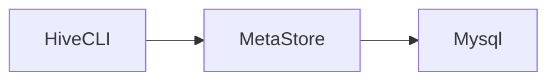
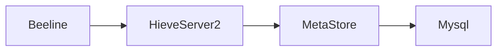

# Hive

> 一个数据仓库工具，用于查询和分析hdfs上的大规模数据。
>
> 提供了类似sql的方式操作hdfs上的数据，底层将sql转换为MR程序在hadoop上运行，同时也支持spark、tez的高性能内存计算框架。

## hive与mysql的区别

mysql是一个数据库，用于存储业务数据，有完整的事务支持，适合业务系统中的数据存储，支持crud。

而hive只是一个数据仓库工具，本身不存储任何数据，只是提供了简单的方式（sql），操作hdfs上的数据，hive不支持更新操作。

hive没有索引需要扫描所有数据，是秒级、分钟级、小时级甚至更长时间的响应，但是可以利用hadoop集群算力，适合大数据并行计算。

而mysql有索引，响应式毫秒级的响应，适合在线搜索（大数据实时搜索请使用类似es的搜索引擎）。

## 搭建

[hive官网下载链接](https://hive.apache.org/downloads.html)

以下演示使用`apache-hive-3.1.3`版本

hive依赖于hadoop环境，请在使用前启动hadoop hdfs集群（java环境就不多说了）。

### 配置文件

hive安装目录下的conf/hive-env.sh

```shell
export HADOOP_HOME=/opt/hadoop-3.3.3
export HIVE_CONF_DIR=/opt/apache-hive-3.1.3-bin/conf
export HIVE_AUX_JARS_PATH=/opt/apache-hive-3.1.3-bin/lib
```

hive-site.xml相关配置请看mysql元数据配置

### 元数据源

hive将sql解析为MR程序后运行，前提是需要知道hdfs上文件映射成数据库表的关系。

hive提供了metasotre server作为元数据源存储介质，将映射关系存储在元数据服务器上。


hive有两种元数据源，分别是本地derby数据库，与第三方`mysql`、`pgsql`等数据源。

开发期间为了方便可以使用`derby`本地数据库，只有在derby运行的服务器上才能访问元数据信息。

#### derby

初始化元数据信息`HIVE_HOME/bin/schematool -initSchema -dbType derby`

derby内嵌数据库会自动启动metastore，无需手动启动。（如果没有手动启动请使用hive目录下的`HIVE_HOME/bin/hive --service metastore`）

可以使用`jps`查看`RunJar`是否运行（不过`HIVE_HOME/bin/hive --service`启动的服务名称都是`RunJar`）

使用`HIVE_HOME/bin/hive`，使用`show databases;`查看是否成功。

#### mysql

在任意服务器上启动一个mysql（生产环境下当然是单独的mysql服务器），集群内能正常访问就行。

mysql相关配置

hive-site.xml

```xml
<?xml version="1.0"?>
<?xml-stylesheet type="text/xsl" href="configuration.xsl"?>
<configuration>
    <!-- jdbc 连接的 URL -->
    <property>
        <name>javax.jdo.option.ConnectionURL</name>
        <value>jdbc:mysql://domain:3336/hive?useSSL=false</value>
    </property>
    <!-- jdbc 连接的 Driver-->
    <property>
        <name>javax.jdo.option.ConnectionDriverName</name>
        <value>com.mysql.cj.jdbc.Driver</value> <!-- 注意这里用的是cj包下的启动，需要mysql8.0以上的驱动 -->
    </property>
    <!-- jdbc 连接的 username-->
    <property>
        <name>javax.jdo.option.ConnectionUserName</name>
        <value>root</value>
    </property>
    <!-- jdbc 连接的 password -->
    <property>
        <name>javax.jdo.option.ConnectionPassword</name>
        <value>tiger</value>
    </property>
    <!-- Hive 元数据存储版本的验证 -->
    <property>
        <name>hive.metastore.schema.verification</name>
        <value>false</value>
    </property>
    <!--元数据存储授权-->
    <property>
        <name>hive.metastore.event.db.notification.api.auth</name>
        <value>false</value>
    </property>
    <!-- Hive 默认在 HDFS 的工作目录 -->
<!--    <property>-->
<!--        <name>hive.metastore.warehouse.dir</name>-->
<!--        <value>/user/hive/warehouse</value>-->
<!--    </property>-->
        <!-- 指定存储元数据要连接的地址，用于其他hive连接metasotre -->
<!--    <property>-->
<!--        <name>hive.metastore.uris</name>-->
<!--        <value>thrift://node01:9083</value>-->
<!--    </property>-->
        <!-- 指定 hiveserver2 连接的 host -->
<!--    <property>-->
<!--        <name>hive.server2.thrift.bind.host</name>-->
<!--        <value>node01</value>-->
<!--    </property>-->
        <!-- 指定 hiveserver2 连接的端口号 -->
<!--    <property>-->
<!--        <name>hive.server2.thrift.port</name>-->
<!--        <value>10000</value>-->
<!--    </property>-->
</configuration>
```


配置完成后使用`HIVE_HOME/bin/schematool -initSchema -dbType mysql -verbose`初始化元数据信息。（新版本貌似初始化元数据信息后，就会自动启动metastore服务，通过`jps`查看有没有RunJar。如果没有通过`HIVE_HOME/bin/hive --service metastore`手动启动。）

如果启动后报错，找不到mysql驱动，去maven上下一个mysql驱动放到`HIVE_HOME/lib`下就行了。

## 客户端

### Hive CLI

> 第一代hive客户端




直接使用`HIVE_HOME/bin/hive`运行即可

### Beeline

> 第二代hvie客户端




中间多了一个hiveserver2，需要启动hiveserver2才能使用，通过hiveserver2访问metastore。

`HIVE_HOME/bin/hive --service hiveserver2`启动hiveserver2


客户端通过`HIVE_HOME/bin/beeline`启动

在客户端中使用`! connect jdbc:hive2://your_hiveserver2_host:10000`，连接hiveserver2。

连接后需要输入用户名，输入一个在hdfs中有数据权限的用户名即可，密码可以跳过直接回车。

## 常见DML

> 需要使用时，直接网上搜索即可

### 建库

```sql
CREATE (DATABASE|SCHEMA) [IF NOT EXISTS] database_name
[COMMENT database_comment]
[LOCATION hdfs_path]
[WITH DBPROPERTIES (property_name=property_value, ...)];

create database if not exists itcast
comment "this is my first db"
with dbproperties ('createdBy'='Allen');
```

### 建表


```sql
CREATE TABLE [IF NOT EXISTS] [db_name.]table_name
(col_name data_type [COMMENT col_comment], ... )
[COMMENT table_comment]
[ROW FORMAT DELIMITED …];
```

row format delimited所有选项

```sql
row format delimited
	# 每行数据字段的分隔符
	[fields terminated by char]
	# 集合元素的分隔符，例如1,张三,a=1-b=2-c=3其中-就是集合分隔符
    [collection items terminated by char]
	# map元素的分隔符，例如1,张三,a=1-b=2-c=3其中=就是集合分隔符
    [map keys terminated by char]
    # 标识一行数据结束的分隔符，默认\n
    [lines terminated by char]
```

### 视图与物化视图

```sql
# 创建视图
create view v_user_transaction_all as
select *
from user_info_transaction;

# 创建物化视图
create materialized view user_info_transaction_agg_mview
as
select name, count(*)
from user_info_transaction
group by name;
```

## 分区

> 通过指定分区字段，将数据文件按字段分区，hdfs上以为`分区字段名=字段值`的形式组织数据。
>
> 分区可以提升性能，在进行where条件时，由于hive对索引支持有限，默认情况下只能走全表扫描，性能极低。当进行表分区后，对分区字段的条件过滤，不会全表扫描，只会扫描该分区内的数据。

注意事项：

* **分区字段与表字段不能重名**
* **分区表需要自己加入数据（加载数据可以手动分区或自动分区）**

```sql
create table hero
(
    id   int,
    name string,
    role string
) partitioned by (role_ext string)
    row format delimited fields terminated by ",";
```

多重分区

可以指定多个分区字段，注意顺序，hive会按照分区字段的顺序，优先按靠前的字段分区。

```sql
create table user_info_dy_part
(
    id       int,
    name     string,
    province string,
    city     string
) partitioned by (province_ext string, city_ext string)
    row format delimited fields terminated by ",";
```

分区表需要使用`load data`语法加入数据：

手动分区


```sql
load data inpath "/user/hive/warehouse/test.db/hero/tank.txt" into table hero partition (role_ext = "tank");
```

自动分区

```sql
# 开启自动分区
set hive.exec.dynamic.partition = true;
# 关闭严格模式（必须至少有一个静态分区）
set hive.exec.dynamic.partition.mode = nostrict;

# 全量数据表
create table user_info
(
    id       int,
    name     string,
    province string,
    city     string
) row format delimited fields terminated by ",";

# 分区表
create table user_info_dy_part
(
    id       int,
    name     string,
    province string,
    city     string
) partitioned by (province_ext string, city_ext string)
    row format delimited fields terminated by ",";


# 动态分区需要从已有数据表中导入数据
insert into table user_info_dy_part partition (province_ext, city_ext)
select t.*, t.province, t.city
from user_info t;
```

## 分桶

> 分桶与分区操作类似，可以将分桶理解为以指定字段的hash散列方式分区。（类似于mysql hash索引）
>
> 分桶操作会通过指定字段的hash值取模桶数量，得到的记过就是分区表所在的文件（例如取模结果为0，那么就在第一个文件中）。这与MapReduce中的分区操作类似。
>
> 分桶操作也可以提升查询性能，在查询的过滤条件是分桶字段时，直接走对应的分桶文件，而不需要全表扫描。同时在join操作时，如果两边的字段都是分桶字段，那么只会走两个桶的笛卡尔积，不会走全量数据。

```sql
create table user_info_without_bucket
(
    id   int,
    name string,
    age  int
) row format delimited fields terminated by ",";

create table user_info_bucket
(
    id   int,
    name string,
    age  int
    # 指定分桶字段与桶数量
) clustered by (id) into 5 buckets;

# 分桶也需要手动加载数据，但是使用的是insert into table as select方式
insert into user_info_bucket
select *
from user_info_without_bucket;
```

## 事务表

> hive一开始并不支持事务，后来由于flume、spark、kafka工具组件将数据流高速传输到hdfs上。高速传输和分区会给NameNode带来压力，因此使用这些数据流工具将数据传输到已有的分区中。但是可能会造成脏读（数据传输一般失败，回滚）。需要通过事务让用户获取一致性的数据，避免产生太多小文件。
>
> Hive 在设计之初时，是不支持事务操作的，因为 Hive 的核心目标是将已存在的结构化数据文件映射成表，然后提供基于表的SQL分析处理；是一款面向分析的工具。且映射的文件存在 HDFS 中，其本身也不支持随机修改文件的数据。这个定位就意味着早期的 HQL 本身就不支持 update、delete 语法，也就没有所谓的事务支持。
>
> hive0.14版本开始支持事务，但是想使用事务操作仍然还有许多限制。

最终 Hive 支持了具有 ACID 语义的事务，但做不到和传统关系型数据库那样的事务级别，仍有很多局限如：

1. 不支持 begin、commit、rollback，所有操作自动提交
2. 仅支持 orc 文件格式
3. 默认事务关闭，需要额外配置
4. 表参数 transactional 必须为 true
5. 外部表不能成为 ACID 表，不允许从非 ACID 会话读取/写入 ACID 表

```sql
# 使用事务需要开启的配置（事务操作只支持分通表），set配置是临时的，在hive-site.xml中配置全局持久生效。
set hive.support.concurrency = true;
# hive3.0默认开启，之前的版本需要手动开启
set hive.enforce.bucketing = true;
set hive.exec.dynamic.partition.mode = nostrict;
# 指定事务管理器
set hive.txn.manager = org.apache.hadoop.hive.ql.lockmgr.DbTxnManager;
# 是否在Meatastore对delta文件进行压缩合并
set hive.compactor.initiator.on = true;
# 压缩合并的工作线程数
set hive.compactor.worker.threads = 1;

create table user_info_transaction
(
    id   int,
    name string,
    age  int
) clustered by (id) into 5 buckets stored as orc tblproperties ("transactional" = "true");

select *
from user_info_transaction;

# hdfs不支持更改操作（可以追加），hive的删改操作本质上是重新写入删改后的所有数据
update user_info_transaction
set age = 18
where id = 1;

delete user_info_transaction
where id = 6;
```


