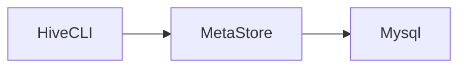
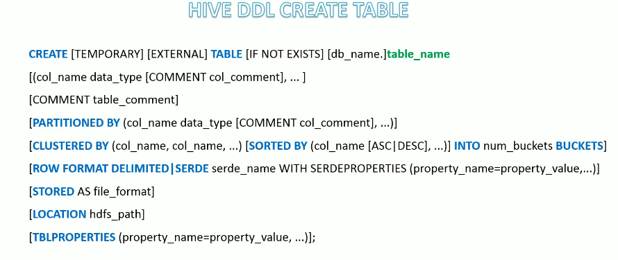
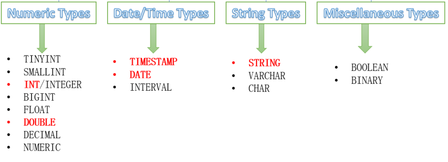
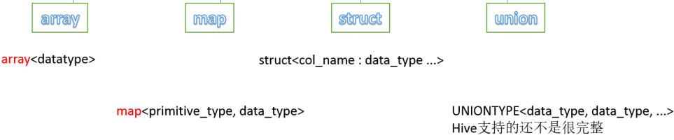
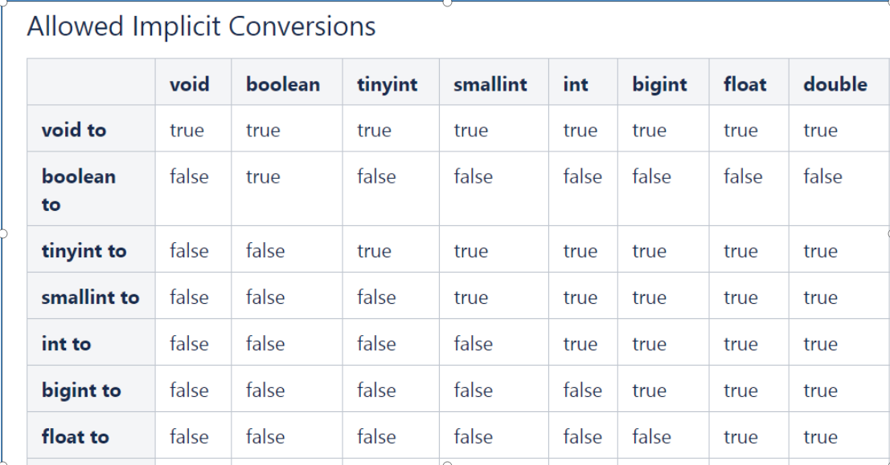
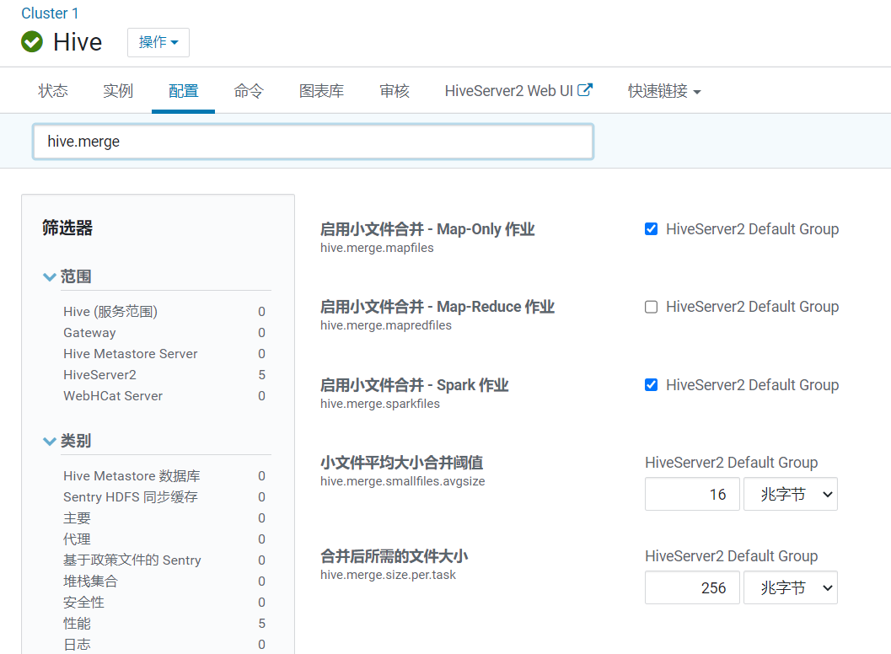
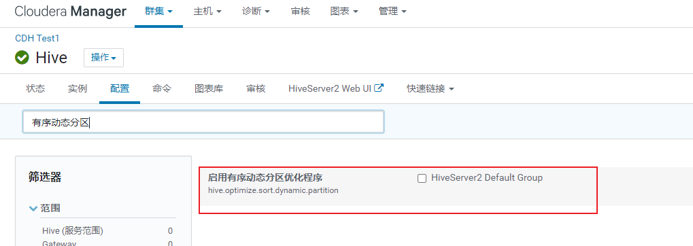
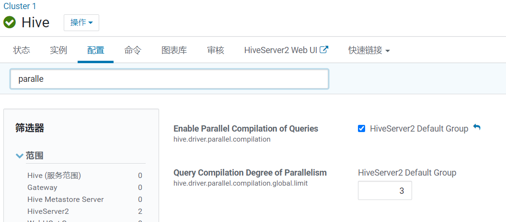

# Hive

> 一个数据仓库工具，用于查询和分析hdfs上的大规模数据。
>
> 提供了类似sql的方式操作hdfs上的数据，底层将sql转换为MR程序在hadoop上运行，同时也支持spark、tez的高性能内存计算框架。

## hive与mysql的区别

mysql是一个数据库，用于存储业务数据，有完整的事务支持，适合业务系统中的数据存储，支持crud。

而hive只是一个数据仓库工具，本身不存储任何数据，只是提供了简单的方式（sql），操作hdfs上的数据，hive不支持更新操作。

hive没有索引需要扫描所有数据，是秒级、分钟级、小时级甚至更长时间的响应，但是可以利用hadoop集群算力，适合大数据并行计算。

而mysql有索引，响应式毫秒级的响应，适合在线搜索（大数据实时搜索请使用类似es的搜索引擎）。

## 搭建

[hive官网下载链接](https://hive.apache.org/downloads.html)

以下演示使用`apache-hive-3.1.3`版本

hive依赖于hadoop环境，请在使用前启动hadoop hdfs集群（java环境就不多说了）。

### 配置文件

hive安装目录下的conf/hive-env.sh

```shell
export HADOOP_HOME=/opt/hadoop-3.3.3
export HIVE_CONF_DIR=/opt/apache-hive-3.1.3-bin/conf
export HIVE_AUX_JARS_PATH=/opt/apache-hive-3.1.3-bin/lib
```

hive-site.xml相关配置请看mysql元数据配置

### 元数据源

hive将sql解析为MR程序后运行，前提是需要知道hdfs上文件映射成数据库表的关系。

hive提供了metasotre server作为元数据源存储介质，将映射关系存储在元数据服务器上。


hive有两种元数据源，分别是本地derby数据库，与第三方`mysql`、`pgsql`等数据源。

开发期间为了方便可以使用`derby`本地数据库，只有在derby运行的服务器上才能访问元数据信息。

#### derby

初始化元数据信息`HIVE_HOME/bin/schematool -initSchema -dbType derby`

derby内嵌数据库会自动启动metastore，无需手动启动。（如果没有手动启动请使用hive目录下的`HIVE_HOME/bin/hive --service metastore`）

可以使用`jps`查看`RunJar`是否运行（不过`HIVE_HOME/bin/hive --service`启动的服务名称都是`RunJar`）

使用`HIVE_HOME/bin/hive`，使用`show databases;`查看是否成功。

#### mysql

在任意服务器上启动一个mysql（生产环境下当然是单独的mysql服务器），集群内能正常访问就行。

mysql相关配置

hive-site.xml

```xml
<?xml version="1.0"?>
<?xml-stylesheet type="text/xsl" href="configuration.xsl"?>
<configuration>
    <!-- jdbc 连接的 URL -->
    <property>
        <name>javax.jdo.option.ConnectionURL</name>
        <value>jdbc:mysql://domain:3336/hive?useSSL=false</value>
    </property>
    <!-- jdbc 连接的 Driver-->
    <property>
        <name>javax.jdo.option.ConnectionDriverName</name>
        <value>com.mysql.cj.jdbc.Driver</value> <!-- 注意这里用的是cj包下的启动，需要mysql8.0以上的驱动 -->
    </property>
    <!-- jdbc 连接的 username-->
    <property>
        <name>javax.jdo.option.ConnectionUserName</name>
        <value>root</value>
    </property>
    <!-- jdbc 连接的 password -->
    <property>
        <name>javax.jdo.option.ConnectionPassword</name>
        <value>tiger</value>
    </property>
    <!-- Hive 元数据存储版本的验证 -->
    <property>
        <name>hive.metastore.schema.verification</name>
        <value>false</value>
    </property>
    <!--元数据存储授权-->
    <property>
        <name>hive.metastore.event.db.notification.api.auth</name>
        <value>false</value>
    </property>
    <!-- Hive 默认在 HDFS 的工作目录 -->
<!--    <property>-->
<!--        <name>hive.metastore.warehouse.dir</name>-->
<!--        <value>/user/hive/warehouse</value>-->
<!--    </property>-->
        <!-- 指定存储元数据要连接的地址，用于其他hive连接metasotre -->
<!--    <property>-->
<!--        <name>hive.metastore.uris</name>-->
<!--        <value>thrift://node01:9083</value>-->
<!--    </property>-->
        <!-- 指定 hiveserver2 连接的 host -->
<!--    <property>-->
<!--        <name>hive.server2.thrift.bind.host</name>-->
<!--        <value>node01</value>-->
<!--    </property>-->
        <!-- 指定 hiveserver2 连接的端口号 -->
<!--    <property>-->
<!--        <name>hive.server2.thrift.port</name>-->
<!--        <value>10000</value>-->
<!--    </property>-->
</configuration>
```


配置完成后使用`HIVE_HOME/bin/schematool -initSchema -dbType mysql -verbose`初始化元数据信息。（新版本貌似初始化元数据信息后，就会自动启动metastore服务，通过`jps`查看有没有RunJar。如果没有通过`HIVE_HOME/bin/hive --service metastore`手动启动。）

如果启动后报错，找不到mysql驱动，去maven上下一个mysql驱动放到`HIVE_HOME/lib`下就行了。

### Metastore单独部署

> 有些应用也可能依赖于hive的metastore服务，因此可以考虑单独部署metastore服务。
>
> 开发中为了方便，我们通常还是将hiveserver2与metastore部署在一起。


## 客户端

### Hive CLI

> 第一代hive客户端




直接使用`HIVE_HOME/bin/hive`运行即可

### Beeline

> 第二代hvie客户端


中间多了一个hiveserver2，需要启动hiveserver2才能使用，通过hiveserver2访问metastore。

`HIVE_HOME/bin/hive --service hiveserver2`启动hiveserver2


客户端通过`HIVE_HOME/bin/beeline`启动

在客户端中使用`! connect jdbc:hive2://your_hiveserver2_host:10000`，连接hiveserver2。

连接后需要输入用户名，输入一个在hdfs中有数据权限的用户名即可，密码可以跳过直接回车。

## 常见DDL

Hive中的**ALTER DATABASE**语句用于更改与Hive中的数据库关联的元数据。

```sql
-- 更改数据库属性
ALTER (DATABASE|SCHEMA) database_name SET DBPROPERTIES (property_name=property_value, ...);

-- 更改数据库所有者
ALTER (DATABASE|SCHEMA) database_name SET OWNER [USER|ROLE] user_or_role;

-- 更改数据库位置
ALTER (DATABASE|SCHEMA) database_name SET LOCATION hdfs_path;
```

Hive中的**DESCRIBE table**语句用于显示Hive中表的元数据信息。

```sql
describe formatted [db_name.]table_name;
describe extended [db_name.]table_name;
```

从表中删除所有行。可以简单理解为清空表的所有数据但是保留表的元数据结构。如果HDFS启用了垃圾桶，数据将被丢进垃圾桶，否则将被删除。

```sql
TRUNCATE [TABLE] table_name;
```

### alter table

```sql
-- 1、更改表名
ALTER TABLE table_name RENAME TO new_table_name;
-- 2、更改表属性
ALTER TABLE table_name SET TBLPROPERTIES (property_name = property_value, ... );
-- 更改表注释
ALTER TABLE student SET TBLPROPERTIES ('comment' = "new comment for student table");
-- 3、更改SerDe属性
ALTER TABLE table_name SET SERDE serde_class_name [WITH SERDEPROPERTIES (property_name = property_value, ... )];
ALTER TABLE table_name [PARTITION partition_spec] SET SERDEPROPERTIES serde_properties;
ALTER TABLE table_name SET SERDEPROPERTIES ('field.delim' = ',');
-- 移除SerDe属性
ALTER TABLE table_name [PARTITION partition_spec] UNSET SERDEPROPERTIES (property_name, ... );

-- 4、更改表的文件存储格式 该操作仅更改表元数据。现有数据的任何转换都必须在Hive之外进行。
ALTER TABLE table_name  SET FILEFORMAT file_format;
-- 5、更改表的存储位置路径
ALTER TABLE table_name SET LOCATION "new location";

-- 6、更改列名称/类型/位置/注释
CREATE TABLE test_change (a int, b int, c int);
-- First change column a's name to a1.
ALTER TABLE test_change CHANGE a a1 INT;
-- Next change column a1's name to a2, its data type to string, and put it after column b.
ALTER TABLE test_change CHANGE a1 a2 STRING AFTER b;
-- The new table's structure is:  b int, a2 string, c int.
-- Then change column c's name to c1, and put it as the first column.
ALTER TABLE test_change CHANGE c c1 INT FIRST;
-- The new table's structure is:  c1 int, b int, a2 string.
-- Add a comment to column a1
ALTER TABLE test_change CHANGE a1 a1 INT COMMENT 'this is column a1';

-- 7、添加/替换列
-- 使用ADD COLUMNS，您可以将新列添加到现有列的末尾但在分区列之前。
-- REPLACE COLUMNS 将删除所有现有列，并添加新的列集。
ALTER TABLE table_name ADD|REPLACE COLUMNS (col_name data_type,...);
```

### alter table partition

分区的DDL操作

#### add partition

```sql
-- 1、增加分区
-- 一次添加一个分区
ALTER TABLE table_name ADD PARTITION (dt='20170101') location
    '/user/hadoop/warehouse/table_name/dt=20170101'; 

-- 一次添加多个分区
ALTER TABLE table_name ADD PARTITION (dt='2008-08-08', country='us') location '/path/to/us/part080808'
                       PARTITION (dt='2008-08-09', country='us') location '/path/to/us/part080809';  
```

#### rename partition

```sql
-- 2、重命名分区
ALTER TABLE table_name PARTITION partition_spec RENAME TO PARTITION partition_spec;
ALTER TABLE table_name PARTITION (dt='2008-08-09') RENAME TO PARTITION (dt='20080809');
```

#### delete partition

```sql
--3、删除分区
ALTER TABLE table_name DROP [IF EXISTS] PARTITION (dt='2008-08-08', country='us');
ALTER TABLE table_name DROP [IF EXISTS] PARTITION (dt='2008-08-08', country='us') PURGE; -- 加上PURGE直接删除数据 不进垃圾桶
```

#### msck partition

Hive将每个表的分区列表信息存储在其metastore中。

但是，如果将新分区直接添加到HDFS（例如通过使用hadoop fs -put命令）或从HDFS中直接删除分区文件夹，则除非用户ALTER TABLE table_name ADD/DROP PARTITION在每个新添加的分区上运行命令，否则metastore（也就是Hive）将不会意识到分区信息的这些更改。

用户可以通过`metastore check`即msck命令修复分区

```sql
-- 4、修复分区
MSCK [REPAIR] TABLE table_name [ADD/DROP/SYNC PARTITIONS];
```

MSC命令的默认选项是“添加分区”。使用此选项，它将把HDFS上存在但元存储中不存在的所有分区添加到元存储中。DROP PARTITIONS选项将从已经从HDFS中删除的metastore中删除分区信息。SYNC PARTITIONS选项等效于调用ADD和DROP PARTITIONS。

如果存在大量未跟踪的分区，则可以批量运行MSCK REPAIR TABLE，以避免OOME（内存不足错误）。

#### alter partition

```sql
-- 5、修改分区
-- 更改分区文件存储格式
ALTER TABLE table_name PARTITION (dt='2008-08-09') SET FILEFORMAT file_format;
-- 更改分区位置
ALTER TABLE table_name PARTITION (dt='2008-08-09') SET LOCATION "new location";
```

## 常见DML

> 需要使用时，直接网上搜索即可

### 建库

```sql
CREATE (DATABASE|SCHEMA) [IF NOT EXISTS] database_name
[COMMENT database_comment]
[LOCATION hdfs_path]
[WITH DBPROPERTIES (property_name=property_value, ...)];

create database if not exists itcast
comment "this is my first db"
with dbproperties ('createdBy'='Allen');
```

### 建表



* 蓝色字体是建表语法的关键字，用于指定某些功能。
* []中括号的语法表示可选。
* |表示使用的时候，左右语法二选一。
* 建表语句中的语法顺序要和上述语法规则保持一致。

```sql
CREATE TABLE [IF NOT EXISTS] [db_name.]table_name
(col_name data_type [COMMENT col_comment], ... )
[COMMENT table_comment]
[ROW FORMAT DELIMITED …];
```

row format delimited所有选项

```sql
row format delimited
	# 每行数据字段的分隔符
	[fields terminated by char]
	# 集合元素的分隔符，例如1,张三,a=1-b=2-c=3其中-就是集合分隔符
    [collection items terminated by char]
	# map元素的分隔符，例如1,张三,a=1-b=2-c=3其中=就是集合分隔符
    [map keys terminated by char]
    # 标识一行数据结束的分隔符，默认\n
    [lines terminated by char]
```

### Insert

#### insert + select

Hive中insert主要是结合select查询语句使用，将查询结果插入到表中，例如：

```sql
INSERT OVERWRITE TABLE tablename1 [PARTITION (partcol1=val1, partcol2=val2 ...) [IF NOT EXISTS]] select_statement1 FROM from_statement;

INSERT INTO TABLE tablename1 [PARTITION (partcol1=val1, partcol2=val2 ...)] select_statement1 FROM from_statement;
```

#### multiple inserts

multiple inserts可以翻译成为多次插入，多重插入，核心是：一次扫描，多次插入。其功能也体现出来了就是减少扫描的次数。

```sql
------------multiple inserts----------------------
-- 当前库下已有一张表student
select * from student;
-- 创建两张新表
create table student_insert1(sno int);
create table student_insert2(sname string);
-- 多重插入
from student
insert overwrite table student_insert1
select num
insert overwrite table student_insert2
select name;
```

#### insert directory

```sql
-- 标准语法:
INSERT OVERWRITE [LOCAL] DIRECTORY directory1
    [ROW FORMAT row_format] [STORED AS file_format] (Note: Only available starting with Hive 0.11.0)
SELECT ... FROM ...

-- Hive extension (multiple inserts):
FROM from_statement
INSERT OVERWRITE [LOCAL] DIRECTORY directory1 select_statement1
[INSERT OVERWRITE [LOCAL] DIRECTORY directory2 select_statement2] ...

-- row_format
: DELIMITED [FIELDS TERMINATED BY char [ESCAPED BY char]] [COLLECTION ITEMS TERMINATED BY char]
[MAP KEYS TERMINATED BY char] [LINES TERMINATED BY char]
```

```sql
-- 当前库下已有一张表student
select * from student;

-- 1、导出查询结果到HDFS指定目录下
insert overwrite directory '/tmp/hive_export/e1' select * from student;

-- 2、导出时指定分隔符和文件存储格式
insert overwrite directory '/tmp/hive_export/e2' row format delimited fields terminated by ','
stored as orc
select * from student;

-- 3、导出数据到本地文件系统指定目录下
insert overwrite local directory '/root/hive_export/e1' select * from student;
```

## 常见数据类型




Hive支持的复杂数据类型如下图所示：




Hive支持隐式转换，下面列举了，哪些类型可以进行隐式转换：



更多数据类型查看官网：https://cwiki.apache.org/confluence/display/Hive/LanguageManual+Types

## Show命令

Show相关的语句提供了一种查询Hive metastore的方法。可以帮助用户查询相关信息。

```sql
-- 1、显示所有数据库 SCHEMAS和DATABASES的用法 功能一样
show databases;
show schemas;

-- 2、显示当前数据库所有表/视图/物化视图/分区/索引
show tables;
SHOW TABLES [IN database_name]; --指定某个数据库

-- 3、显示当前数据库下所有视图
Show Views;
SHOW VIEWS 'test_*'; -- show all views that start with "test_"
SHOW VIEWS FROM test1; -- show views from database test1
SHOW VIEWS [IN/FROM database_name];

-- 4、显示当前数据库下所有物化视图
SHOW MATERIALIZED VIEWS [IN/FROM database_name];

-- 5、显示表分区信息，分区按字母顺序列出，不是分区表执行该语句会报错
show partitions table_name;

-- 6、显示表/分区的扩展信息
SHOW TABLE EXTENDED [IN|FROM database_name] LIKE table_name;
show table extended like student;

-- 7、显示表的属性信息
SHOW TBLPROPERTIES table_name;
show tblproperties student;

-- 8、显示表、视图的创建语句
SHOW CREATE TABLE ([db_name.]table_name|view_name);
show create table student;

-- 9、显示表中的所有列，包括分区列。
SHOW COLUMNS (FROM|IN) table_name [(FROM|IN) db_name];
show columns  in student;

-- 10、显示当前支持的所有自定义和内置的函数
show functions;

-- 11、Describe desc
-- 查看表信息
desc extended table_name;
-- 查看表信息（格式化美观）
desc formatted table_name;
-- 查看数据库相关信息
describe database database_name;
```

## 加载数据

建表后，我们可以将数据手动上传到hive表的目录下。

只要格式与建表时对应上，接下来就可以查询到结果。

通过下面的语句建表：

```sql
create table tbl_user(
    id int,
    name string
)
row format delimited 
fields terminated by ','
collection items terminated by '-'
map keys terminated ':';
```

hive默认存储路径在hdfs`/user/hive/warehouse/`

`/user/hive/warehouse/数据库名.db/表名.db`

```bash
hadoop fs -put hot_hero_skin_price.txt /user/hive/warehouse/default.db/tbl_user.db
```


除了使用`hadoop fs`上传数据到hive表目录下，还可通过`load`命令加载hdfs或本地文件系统的数据。

```sql
-- load data语法
-- filepath可以是相对路径、绝对路径、完整的URL（hdfs或其他受支持的分布式存储系统URL）
LOAD DATA [LOCAL] INPATH 'filepath' [OVERWRITE] INTO TABLE tablename [PARTITION (partcol1=val1, partcol2=val2 ...)]
LOAD DATA [LOCAL] INPATH 'filepath' [OVERWRITE] INTO TABLE tablename [PARTITION (partcol1=val1, partcol2=val2 ...)] [INPUTFORMAT 'inputformat' SERDE 'serde'] (3.0 or later)
```


加载本地数据：

`overwrite`表示覆盖写入

注意：加载本地数据时，需要保证hiveserver所在服务端拥有该文件（hiveserver执行上传命令，因此要求文件在hiveserver上）。

`load data local inpath '/root/xuchang/myfile' overwrite into table tbl_user;`

加载hdfs数据：

`load data inpath '/usr/hive/users.txt' overwrite into table tbl_user;`

## 视图与物化视图

```sql
# 创建视图
create view v_user_transaction_all as
select *
from user_info_transaction;

# 创建物化视图
create materialized view user_info_transaction_agg_mview
as
select name, count(*)
from user_info_transaction
group by name;
```

## 临时表

从Hive1.1开始临时表可以存储在内存或SSD，使用hive.exec.temporary.table.storage参数进行配置，该参数有三种取值：memory、ssd、default。

`set hive.exec.temporary.table.storage=default;`默认值，存储到磁盘中。

`set hive.exec.temporary.table.storage = memory;`存储到内存中。

## 分区

> 通过指定分区字段，将数据文件按字段分区，hdfs上以为`分区字段名=字段值`的形式组织数据。
>
> 分区可以提升性能，在进行where条件时，由于hive对索引支持有限，默认情况下只能走全表扫描，性能极低。当进行表分区后，对分区字段的条件过滤，不会全表扫描，只会扫描该分区内的数据。

注意事项：

* **分区字段与表字段不能重名**
* **分区表需要自己加入数据（加载数据可以手动分区或自动分区）**

```sql
create table hero
(
    id   int,
    name string,
    role string
) partitioned by (role_ext string)
    row format delimited fields terminated by ",";
```

### 多重分区

可以指定多个分区字段，注意顺序，hive会按照分区字段的顺序，优先按靠前的字段分区。

```sql
create table user_info_dy_part
(
    id       int,
    name     string,
    province string,
    city     string
) partitioned by (province_ext string, city_ext string)
    row format delimited fields terminated by ",";
```

分区表需要使用`load data`语法加入数据：

### 静态分区


```sql
load data inpath "/user/hive/warehouse/test.db/hero/tank.txt" into table hero partition (role_ext = "tank");
```

### 动态分区

> **踩坑：!!!我日你的哥，分区字段值不能是中文！！！**

```sql
# 开启自动分区
set hive.exec.dynamic.partition = true;
# 关闭严格模式（必须至少有一个静态分区）
set hive.exec.dynamic.partition.mode = nostrict;

# 全量数据表
create table user_info
(
    id       int,
    name     string,
    province string,
    city     string
) row format delimited fields terminated by ",";

# 分区表
create table user_info_dy_part
(
    id       int,
    name     string,
    province string,
    city     string
) partitioned by (province_ext string, city_ext string)
    row format delimited fields terminated by ",";


# 动态分区需要从已有数据表中导入数据
insert into table user_info_dy_part partition (province_ext, city_ext)
select t.*, t.province, t.city
from user_info t;
```

## 分桶

> 分桶与分区操作类似，可以将分桶理解为以指定字段的hash散列方式分区。（类似于mysql hash索引）
>
> 分桶操作会通过指定字段的hash值取模桶数量，得到的记过就是分区表所在的文件（例如取模结果为0，那么就在第一个文件中）。这与MapReduce中的分区操作类似。
>
> 分桶操作也可以提升查询性能，在查询的过滤条件是分桶字段时，直接走对应的分桶文件，而不需要全表扫描。同时在join操作时，如果两边的字段都是分桶字段，那么只会走两个桶的笛卡尔积，不会走全量数据。
>
> 数据竟可能分桶且排序，查询和基于分桶的随机抽样时，性能会更高。
>
> 分桶与分区的区别在于：
>
> * 分桶
>     * 分桶底层是分文件，通过key计算hash值取模桶数量后，存储到对应桶（文件）中。
>     * 分桶操作在join字段为分桶字段时，可以通过bucket join（就是hash取模），提高join性能。
>     * 进行数据抽样时，通过对数据再分桶（默认按照bucket key散列，可以指定为rand()随机散列），只取部分桶的值，从而兼顾性能与随机性。
>     * 在使用分桶字段等值查询时，通过hash取模，只需要扫描一个桶的数据，避免全表扫描。
> * 分区
>     * 分区底层是分目录，等值过滤分区是，只需扫描分区目录。
>     * 分区可以提升性能，在进行where条件时，由于hive对索引支持有限，默认情况下只能走全表扫描，性能极低。当进行表分区后，对分区字段的等值过滤，不会全表扫描，只会扫描该分区内的数据。

```sql
# 开启基于桶的mapjoin
set hive.optimize.bucketmapjoin=true;
set hive.auto.convert.sortmerge.join=true;
# 开开启SMB(Sort-Merge-Bucket) Join优化，先排序再合并全部在map端完成，避免大量数据到reduce端造成数据倾斜，减少shuffle的数据量
set hive.optimize.bucketmapjoin.sortedmerge=true;

create table user_info_without_bucket
(
    id   int,
    name string,
    age  int
) row format delimited fields terminated by ",";

create table user_info_bucket
(
    id   int,
    name string,
    age  int
    # 指定分桶字段、分桶排序字段、桶数量
) clustered by (id) sorted by (age asc) into 5 buckets;

# 分桶也需要手动加载数据，但是使用的是insert into table as select方式
insert into user_info_bucket
select *
from user_info_without_bucket;
```

## 事务表

> hive一开始并不支持事务，后来由于flume、spark、kafka工具组件将数据流高速传输到hdfs上。高速传输和分区会给NameNode带来压力，因此使用这些数据流工具将数据传输到已有的分区中。但是可能会造成脏读（数据传输一般失败，回滚）。需要通过事务让用户获取一致性的数据，避免产生太多小文件。
>
> Hive 在设计之初时，是不支持事务操作的，因为 Hive 的核心目标是将已存在的结构化数据文件映射成表，然后提供基于表的SQL分析处理；是一款面向分析的工具。且映射的文件存在 HDFS 中，其本身也不支持随机修改文件的数据。这个定位就意味着早期的 HQL 本身就不支持 update、delete 语法，也就没有所谓的事务支持。
>
> hive0.14版本开始支持事务，但是想使用事务操作仍然还有许多限制。

最终 Hive 支持了具有 ACID 语义的事务，但做不到和传统关系型数据库那样的事务级别，仍有很多局限如：

1. 不支持 begin、commit、rollback，所有操作自动提交
2. 仅支持 orc 文件格式
3. 默认事务关闭，需要额外配置
4. 表参数 transactional 必须为 true
5. 外部表不能成为 ACID 表，不允许从非 ACID 会话读取/写入 ACID 表

```sql
# 使用事务需要开启的配置（事务操作只支持分通表），set配置是临时的，在hive-site.xml中配置全局持久生效。
set hive.support.concurrency = true;
# hive3.0默认开启，之前的版本需要手动开启
set hive.enforce.bucketing = true;
set hive.exec.dynamic.partition.mode = nostrict;
# 指定事务管理器
set hive.txn.manager = org.apache.hadoop.hive.ql.lockmgr.DbTxnManager;
# 是否在Meatastore对delta文件进行压缩合并
set hive.compactor.initiator.on = true;
# 压缩合并的工作线程数
set hive.compactor.worker.threads = 1;

create table user_info_transaction
(
    id   int,
    name string,
    age  int
) clustered by (id) into 5 buckets stored as orc tblproperties ("transactional" = "true");

select *
from user_info_transaction;

# hdfs不支持更改操作（可以追加），hive的删改操作本质上是重新写入删改后的所有数据
update user_info_transaction
set age = 18
where id = 1;

delete user_info_transaction
where id = 6;
```

## 导出数据

```sql
-- 注意overwrite语法表示直接情况目标文件夹并写入数据, 使用时一定要注意(默认是hdfs上，使用local存储到hiveserver2上)
insert overwrite directory "/tmp/hive_export/1"
select id, name, province_ext
From user_with_province_part;
```

## 视图

### 虚拟视图

```sql
create view jt_usr_covid19_alabama as
select *
from t_usa_covid19_part
where state = "Alabama"
order by deaths desc;
```

### 物化视图

```sql
create materialized view jt_usr_covid19_alabama as
select *
from t_usa_covid19_part
where state = "Alabama"
order by deaths desc;
```

## 排序

### order by

```sql
select *
from students
order by sex;
```

### cluster by

>根据指定字段分区（类似partition）同时根据该字段排序（默认升序，无法指定升序、逆序）

```sql
select *
from students cluster by num;
-- 上面语句等同于:
-- select * from students distributed by num sort by num;
```

### distributed by srot by

> 根据distributed by的字段分区（类似partition），同时根据sort by字段排序（默认升序，可以指定升序、逆序）

```sql
select *
from students distribute by sex sort by age;
-- 上面的语句可以类比partition返回结果类似:
/*
select name,
       age,
       sex,
       rank() over (partition by sex order by age)
from students;
*/
```

## hive函数

> 这里只列举常用函数与hive独有特殊函数，多数函数与mysql保持一致

### 常用函数

```sql
-- 运算符与函数
select 1 + 1;

select *
from students
where name like "李%";

select *
from students
where name rlike "^李.$";

select *
from students
where name regexp "^李.$";

select 17 / 3;
select 17 div 3;
select 17 % 3;
select 17 & 3;
select 17 | 3;
select 17 ^ 3;

select concat("A", "B", "C");
select "A" || "B" || "C";

select array(1, 2, "hello");
select map("hello", 1, "world", 2);
select struct("name", "age");
select named_struct("hello", 1, "world", 2);
select create_union(0, "uu", array(1, 2, 3), "aa");

-- 常用函数
-- 字符串函数
-- 拼接
select concat("A", "B");
-- 拼接多个值，自动拆包数组
select concat_ws(",", "hello", "world", array("P", 2));
-- 截取从倒数第4位开始截取到最后
select substr("hello world", -4);
-- 正则替换所有满足条件的值
select regexp_replace("100-200", "(\\d+)", "num");
-- 提取匹配到的内容
select regexp_extract("100-200", "(\\d+)-(\\d+)", 2);
-- URL解析函数：从URL解析出host地址
select parse_url("http://www.itcast.cn/path/p1.php?query=1", "HOST");
-- URL解析函数：从URL中解析出多个参数以数组形式返回
select parse_url_tuple("http://www.itcast.cn/path/p1.php?query=1&city=wuhan", "HOST", "PATH", "QUERY", "QUERY:city");
-- 分割字符串（支持正则）
select split("apache hive", "\\s+");
-- select get_splits("apache hive", 1); -- 没搞懂怎么用
-- 解析json，通过指定占位符获取内容
select get_json_object('[{"name": "ZhangSan", "age": "12"},{"name": "ZhangSan", "age": "20"}]', '$.[1]');

-- 获取字符串长度
select length("hello");
-- 反转字符串
select reverse("olleh");

-- 全大写
select upper("city");
select ucase("city");
-- 全小写
select lower("City");
select lcase("City");

-- 查找字符串是否出现在后面的字符串中（默认字符串按`,`分割）, 如果有返回是第几个元素, 不存在返回0
-- 不能用于查找array等结构，查找array请使用array_contains, map[key]如果key不存在返回null
select find_in_set("aaaa", "abc,defg,a");
select find_in_set("a", concat_ws(",", array("A", "a", "cd")));
select array_contains(array(1, 2, 3, "a"), "a");
select map("name", "ZhangSan")["Name"] is null;

-- 时间戳系列
select unix_timestamp();
select datediff("2022-6-14", "2022-6-16");

-- 条件判断
select if(null is null, "NULL", "NOT NULL");
select case 100 when 50 then "TOM" when "100" then "TOM100" else "TIM" end;

-- 数据脱敏
select mask("helloWORLD");
select mask_last_n("helloWORLD");
select mask_show_first_n("15388883445", 3);
select mask_hash("15388883445", 3);
```

### 调用Java方法

> hive支持通过反射调用第三方库中的函数

```sql
-- 如果想使用第三方类库，请使用add jar添加
select java_method("java.lang.Math", "max", 10, 20);
select reflect("java.lang.Math", "max", 10, 20);
```

### collect_list/collect_set

```sql
-- 多行转单列(这里的行是array里的假数据)
-- 不会将数组中的元素拿出来，而是将数组视为一个整体
select collect_list(array(1, 2, 3, 3));
select collect_set(array(1, 2, 2, 2, 2));
-- 将sex字段收集成一行
select collect_list(sex)
from students;
select collect_set(sex)
from students;
```

### explode

```sql
-- explode函数使用，多列转单行
select explode(array(11, 22, 33));

/*
A,1000|2000|3000
B,2222|3333|4444
*/
create table nba
(
    team_name  string,
    good_years array<string>
) row format delimited fields terminated by ","
    collection items terminated by "|";

load data local inpath "/root/hive_data_samples/nba.txt"
    into table nba;

select *
from nba;

select explode(good_years)
from nba;

-- 这个sql运行会报错，无法自动映射航专列后的其他字段
select team_name, explode(good_years)
from nba;
-- 可以先保存所有年份信息，然后join插叙出结果
with years as (select explode(good_years) year
               from nba)
select n.team_name, y.year
from nba n
         join years y
where array_contains(n.good_years, y.year);

-- hive提供了lateral view侧视图，自动实现join
-- 并且不需要查多次表吗，底层缓存了每列对应的其他字段，性能更好
select team_name, b.year
from nba
         lateral view explode(good_years) b as year;

-- 返回每个球队获奖次数并根据获奖次数降序排列
select team_name, count(*) nums
from nba
         lateral view explode(good_years) b as year
group by team_name
order by nums desc;
```

### 抽样函数

```sql
--------------------------
-- 抽样函数
select *
from t_usa_covid19_part;

-- 基于随机排序的随机采样
-- 优点随机性高，缺点性能低
select *
from t_usa_covid19_part
    distribute by rand() sort by rand()
limit 2;

select *
from t_usa_covid19_part
order by rand()
limit 2;

-- 块采样
-- 优点性能高，缺点随机性低
-- 随机获取1行的数据
select *
from t_usa_covid19_part
         tablesample (1 rows);
-- 随机获取50%的数据
select *
from t_usa_covid19_part
         tablesample (50 percent);
-- 随机获取1kb的数据
select *
from t_usa_covid19_part
         tablesample (1k);


-- 基于分桶抽样
-- 性能与随机性兼顾
create table t_usa_covid19_bucket
(
    `count_date` string,
    `county`     string,
    `state`      string,
    `fips`       int,
    `cases`      int,
    `deaths`     int
) clustered by (state) into 5 buckets
    row format delimited fields terminated by ",";

insert into t_usa_covid19_bucket
select *
from t_usa_covid19;

select *
From t_usa_covid19_bucket;

-- 抽取5/5个桶的数据，从第一个桶开始抽取
select *
from t_usa_covid19_bucket
         tablesample (bucket 1 out of 5 on rand());
         
         
-- !!! 注意spark sql并不是100%兼容hive sql，在spark sql中tablesample不支持on参数，默认就是随机散列的。

-- tablesample (bucket x out of y [on column])
-- x表示从第几个桶开始抽样, y=2时, 总桶数是6时, 会抽取 6 / 2个桶的数据, 以on指定的字段为key hash后得到结果
-- 名词解释
-- n：总桶数
-- x：从第几个桶开始抽取
-- y：必须是总桶数的因数或倍数（自定义）
-- z：共需抽取出的桶数（z=n/y）
-- on column：表示要抽样的列，使用rand()函数实现随机抽样。如果不适用on rand()，在x,y固定的情况下，抽样数据固定。
-- 事实上tablesample就是根据用户指定的y，再次将数据分散到y个桶中，因此x,y固定（on默认是按照bucket key）数据也会固定在同一个桶内，取到的数据自然也是一样的。使用on rand()后，就是随机散列了。
select *
from t_usa_covid19_bucket
         tablesample (bucket 1 out of 3 on state);


-- tablesample详解
SELECT * FROMbucketed_users 
TABLESAMPLE(BUCKET 1 OUT OF 4 ON id); 

-- 桶的个数从1开始计数。因此，前面的查询从4个桶的第一个中获取所有的用户。 对于一个大规模的、均匀分布的数据集，这会返回表中约四分之一的数据行。我们 也可以用其他比例对若干个桶进行取样(因为取样并不是一个精确的操作，因此这个 比例不一定要是桶数的整数倍)。

说法一：
	注：tablesample是抽样语句，语法：TABLESAMPLE(BUCKET x OUTOF y)

    y必须是table总bucket数的倍数或者因子。hive根据y的大小，决定抽样的比例。例如，table总共分了64份，当y=32时，抽取(64/32=)2个bucket的数据，当y=128时，抽取(64/128=)1/2个bucket的数据。

    x表示从哪个bucket开始抽取。例如，table总bucket数为32，tablesample(bucket 3 out of 16)，表示总共抽取（32/16=）2个bucket的数据，分别为第3个bucket和第（3+16=）19个bucket的数据。

说法二：
  	分桶语句中的分母表示的是数据将会被散列的桶的个数，
	分子表示将会选择的桶的个数。
```

### 增强聚合函数

> grouping_sets、cube、rollup三个增强聚合功能类似，提供了更简单的语法实现多维度分析（就是分组查询，但是能自动查询出站在不同的字段角度分析的结果），同时相比多次查询union all汇聚结果性能更高。

#### grouping_sets

> 根据指定字段（维度）进行多维度分析
>
> 列如：
>
> ```sql
> select month,
>        day,
>        count(distinct cookieid)
> from cookies_info
> group by month, day
>     grouping sets ( month, day);
> -- 表示根据month与day分组，最后返回的结果分别是group by month与group by day的结果
> ```

```sql
-- 增强聚合函数
-- 一下的增强聚合函数都是只针对group by的字段, 在不同维度(字段)上分析, 最后将结果聚合为一张表
/*
2018-3,2018-3-9,c1                                                           
2018-3,2018-3-6,c1
2018-3,2018-3-14,c1
2018-4,2018-4-13,c1
2018-4,2018-4-4,c1
*/
create table cookies_info
(
    month    string,
    day      string,
    cookieid string
) row format delimited fields terminated by ",";

load data local inpath "/root/hive_data_samples/cookie_info.txt"
    into table cookies_info;

select *
from cookies_info;

select month,
       day,
       count(distinct cookieid)
from cookies_info
group by month, day;

-- 根据(month, day)分组, 并在month和day两个维度分析
select month,
       day,
       count(distinct cookieid)
from cookies_info
group by month, day
    grouping sets ( month, day);
-- 上面语句等价于下面的语句
select month, null, count(distinct cookieid)
from cookies_info
group by month
union all
select null, day, count(distinct cookieid)
from cookies_info
group by day;

-- 根据(month, day)分组, 并在month和day和(month, day)三个维度分析
select month,
       day,
       count(distinct cookieid)
from cookies_info
group by month, day
    grouping sets ( month, day, ( month, day));
-- 上面语句等价于下面的语句
select month, null, count(distinct cookieid)
from cookies_info
group by month
union all
select null, day, count(distinct cookieid)
from cookies_info
group by day
union all
select month, day, count(distinct cookieid)
from cookies_info
group by month, day;
```

#### cube

> GROUPING__ID是使用增强聚合函数时，hive自动生成的字段，用于区分维度（不同的组）

```sql
-- cube根据指定分组字段全维度分析, 结果是2的n次方, n表示维度数量, 下面的例子就是根据（month, day）两个维度（两个字段分组）
-- a,b --> (a) (b) (a,b) ()
-- ()相当于汇总所有
select month, day, count(distinct cookieid) cnt, GROUPING__ID
from cookies_info
group by month, day
with cube;
-- 等价于以下sql
select month, day, count(distinct cookieid) cnt
from cookies_info
union
select month, day, count(distinct cookieid) cnt
from cookies_info
group by month
union
select month, day, count(distinct cookieid) cnt
from cookies_info
group by day
union
select month, day, count(distinct cookieid) cnt
from cookies_info
group by month, day;
```

#### rollup

```sql
-- rollup以最左侧维度为主进行层级聚合
-- a,b,c -> (a) (a,b) (a,b,c) () 四种情况, 有mysql索引最左匹配内味儿了
select month, day, count(distinct cookieid) cnt, GROUPING__ID
from cookies_info
group by month, day
with rollup
order by GROUPING__ID;
```

## hive技巧与优化

### url解析

```sql
select parse_url("http://www.baidu.com/q?wd=python", "HOST");
select parse_url_tuple("http://www.baidu.com/q?wd=python", "PROTOCOL", "HOST", "PATH", "QUERY");

-- parse_url_tuple是一个udtf函数，只不过返回的是一行，但是返回的仍然是虚拟表，需要配置侧视图使用
with t0 as (select explode(array(named_struct("id", "1", "url", "http://www.baidu.com/q?wd=python"),
                                 named_struct("id", "2", "url", "http://www.baidu.com/q?wd=python"))) as item),
     t as (select item.id, item.url
           from t0)
select id, url_info.protocol, url_info.host, url_info.path, url_info.query
from t lateral view parse_url_tuple(t.url, "PROTOCOL", "HOST", "PATH", "QUERY") url_info
         as protocol, host, path, query;

-- udtf函数返回的是空时，关联的结果也是空，需要使用outer保留原来表的数据
with t0 as (select explode(array(named_struct("id", "1", "url", "http://www.baidu.com/q?wd=python"),
                                 named_struct("id", "2", "url", "http://www.baidu.com/q?wd=python"))) as item),
     t as (select item.id, item.url
           from t0)
select t.*, p.*
from t
         lateral view explode(array()) p;

with t0 as (select explode(array(named_struct("id", "1", "url", "http://www.baidu.com/q?wd=python"),
                                 named_struct("id", "2", "url", "http://www.baidu.com/q?wd=python"))) as item),
     t as (select item.id, item.url
           from t0)
select t.*, p.*
from t
         lateral view outer explode(array()) p;
```

### 复杂分隔符处理

> row format delimited fileds terminated by 只能使用单字节字符，如果想使用多字节字符需要使用其他SerDe或自定义SerDe实现。
>
> 接下来以一下数据举例：
>
> 周杰伦||七里香
>
> 周杰伦||暗号

`||`是双字符delimited无法处理

#### RegexSerde

> hive提供了正则的方式匹配字段
>
> 这里需要使用正则()组匹配来匹配每个字段（并不是将匹配到的内容视为分隔符）

```sql
-- 通过RegexSerDe正则表达式分割文件
create table singer
(
    name string,
    song string ) row format serde "org.apache.hadoop.hive.serde2.RegexSerDe"
    with serdeproperties (
        "input.regex" = "(.*)\\|\\|(.*)"
        );
drop table singer;

load data local inpath "/root/hive_data_samples/singer.txt"
    into table singer;

select *
from singer;
```

#### MR程序处理

> 我们直接通过mr程序并发清洗数据

以hadoop streaming为例

mapper

```python
#!/opt/python3/bin/python3
import sys

for line in sys.stdin:
    k, v = line.split("||")
    print(f"{k} {v}")
```

这里不需要reduce（但是mr处理的结果有空行不知道为什么？）

启动脚本

```python
#!/bin/env python3
import os

os.system("""mapred streaming -files ./singer_mapper.py \
-mapper ./singer_mapper.py \
-reducer None \
-input /itheima/singer.txt \
-output /itheima/singer_format
""")
```

#### 自定InputFormat

这里需要使用java程序，很麻烦不建议使用（使用场景少），就不做演示了，只说一下流程。

将自定义的InputFormat打成jar包，在hive中通过`add jar`添加。

然后建表时指定inputformat即可：

```sql
create table singer
(
    name string,
    song string ) row format delimited fields terminated by "|"
stored as 
inputformat "完全限定名"
outputformat "org.apache.hadoop.hive.ql.io.HiveIgnoreKeyTextOutputFormat";
```

### 行列转换

```sql
/*
张三,数学,20
张三,英语,30
张三,语文,60
显康,数学,100
显康,语文,20
显康,英语,80
 */
create table stu_score
(
    name    string,
    subject string,
    score   int
) row format delimited fields terminated by ",";

load data local inpath "/root/hive_data_samples/stu_score.txt"
    into table stu_score;

select *
from stu_score;

-- 多行转多列
select name,
       max(if(subject = "数学", score, 0)) as `数学`,
       max(if(subject = "语文", score, 0)) as `语文`,
       max(if(subject = "英语", score, 0)) as `英语`
from stu_score
group by name;

-- 多行转单列
select name,
       concat_ws(",", collect_list(subject)),
       concat_ws(",", collect_list(cast(score as string)))
from stu_score
group by name;

-- 多列转多行
/*
张三,10,20,30
显康,100,30,60
 */
create table stu_score_all
(
    name    string,
    math    int,
    chinese int,
    english int
) row format delimited fields terminated by ",";

load data local inpath "/root/hive_data_samples/stu_score_all.txt"
    into table stu_score_all;

select *
from stu_score_all;

select name, "数学" as `科目`, math
from stu_score_all
union
select name, "语文" as `科目`, chinese
from stu_score_all
union
select name, "英语" as `科目`, english
from stu_score_all;

-- 单列转多行
with tb0 as (select explode(array(
        named_struct("name", "张三", "math", "数学", "scores", "10,20,30"),
        named_struct("name", "显康", "math", "数学", "scores", "100,60,80")
    )) as item),
     tb as (select item.name name, item.math math, item.scores scores
            from tb0)
select name, math, lv.score
from tb lateral view explode(split(scores, ",")) lv as score;
```

### 窗口函数案例

#### 连续登录问题

```sql
/*
1,2022-6-13
1,2022-6-14
1,2022-6-15
1,2022-6-16
2,2022-6-16
2,2022-6-17
2,2022-6-11
2,2022-6-18
*/
create table user_login
(
    user_id    string,
    login_time string
) row format delimited fields terminated by ",";

load data local inpath '/root/hive_data_samples/user_login.txt'
    into table user_login;

select *
from user_login;

------------------ 连续登录2天的用户
-- 笛卡尔积实现（性能极低，并且如果求连续登录N天就需要N张表的笛卡尔积）
with q1 as (select a.user_id    a_uid,
                   a.login_time a_time,
                   b.user_id    b_uid,
                   b.login_time b_time
            from user_login a,
                 user_login b)
select distinct q1.a_uid
from q1
where q1.a_uid = q1.b_uid
  and day(q1.a_time) - 1 = day(q1.b_time);

-- 使用窗口函数实现(lead函数取不到的时候返回null，记得给个默认值)
with q1 as (select user_id,
                   login_time,
                   date_add(login_time, 1)                                                   next_day,
                   lead(login_time, 1, 0) over (partition by user_id order by login_time) as next_time
            from user_login)
select distinct user_id
from q1
where q1.next_day = q1.next_time;
```

#### 累计求和

```sql
------------------ 累计求和问题
create table money_month
(
    user_id string,
    month   string,
    money   int
) row format delimited fields terminated by ",";
drop table money_month;

load data local inpath "/root/hive_data_samples/money_month.txt"
    into table money_month;

select *
from money_month;

-- 求每个月的总消费与累计消费 笛卡尔积实现
with user_month as (select user_id, month, sum(money) m_money
                    from money_month
                    group by user_id, month)
select a.user_id, a.month, max(a.m_money) as `当月总消费`, sum(b.m_money) as `累计消费`
from user_month a
         join user_month b on a.user_id = b.user_id
where a.month >= b.month
group by a.user_id, a.month;

-- 求每个月的总消费与累计消费 窗口函数
with user_month as (select user_id,
                           month,
                           sum(money) m_money
                    from money_month
                    group by user_id, month)
select user_id,
       month,
       m_money,
       sum(m_money) over (order by month) as `累计消费`
from user_month;
```

#### 分组TopN问题

```sql
------------------ 分组TopN问题
-- 各部门前薪水最高的前两名
with q as (select id,
                  name,
                  deg,
                  salary,
                  dept,
                  rank() over (partition by dept order by salary desc) rk
           from employee)
select *
from q
where q.rk <= 2;
```

### 拉链表

> 当数据量巨大，并且每天都可能发生变化时，我们可以采取获取增量数据的方式，只需要将增量数据与历史数据合并。
>
> 具体操作：表中添加两个字段start_date与end_date，分别表示该状态的起始日期和该状态的结束日期。默认情况下end_date是`9999-12-31`给一个最大值，表示状态有效。
>
> 当数据更新时，我们不要删除历史数据，而是添加增量数据，将start_date更改为新的时间即可。
>
> 将增量数据添加到hive的delta_temp增量临时表中，join历史数据表与增量数据表，当历史数据表的唯一标识与增量数据表的唯一标识相同时，说明该唯一标识的数据发生了更改。此时将旧数据的end_date改为当前时间的前一天，新数据的end_date默认为`9999-12-31`即可。

```sql
-- 用户地址信息表
create table user_addr_info
(
    id         int,
    name       string,
    addr       string,
    start_date string,
    end_date   string
) row format delimited fields terminated by ",";
drop table user_addr_info;

load data local inpath "/root/hive_data_samples/user_addr_info.txt"
    into table user_addr_info;

select *
from user_addr_info;

-- 模拟增量数据
-- 增量数据通过start_date=current_date()获取当天的新数据即是增量数据源
create table user_addr_info_delta_temp
(
    id         int,
    name       string,
    addr       string,
    start_date string,
    end_date   string
) row format delimited fields terminated by ",";
drop table user_addr_info_delta_temp;

load data local inpath "/root/hive_data_samples/user_addr_info_delta_temp.txt"
    into table user_addr_info_delta_temp;

select *
from user_addr_info_delta_temp;

-- 将增量数据存储与历史数据合并到临时表
create table user_addr_info_new_temp
as
select id, name, addr, start_date, end_date
from user_addr_info_delta_temp
union all
select old_tb.id,
       old_tb.name,
       old_tb.addr,
       old_tb.start_date,
    /*
    delta_tb.id is null 表示delta表中没有对应的数据，即该用户没有更新地址信息

    delta_tb.id is not null时，并不是没条对应id的数据都要更新
    我们只需要更新日期是9999-12-31的最新数据变成`delta_tb.start_date - 1`即可(该状态持续到昨天)
     */
       if(delta_tb.id is null or old_tb.end_date < '9999-12-31', old_tb.end_date,
          date_sub(delta_tb.start_date, 1)) as end_date
from user_addr_info old_tb
-- 记得使用left join，必须保存左边即旧表的历史数据
         left join user_addr_info_delta_temp delta_tb on old_tb.id = delta_tb.id;

select *
from user_addr_info_new_temp;

-- 将数据覆盖写入到user_addr_info
insert overwrite table user_addr_info
select *
from user_addr_info_new_temp;
```

### hive索引

> hive3.0已经删除，用起来很麻烦，索引需要手动维护，基本不使用。
>
> 如果需要索引提升性能，请使用orc文件格式，开启索引与布隆过滤器，分桶分区尽可能提升性能。

### 文件格式

> hive多种文件格式，默认是textfile纯文本文件存储，除了textfile，hive还提供了orc、parquet等文件格式。

#### textfile

> 纯文本文件
>
> 优点：简单、可读性强、可以使用任何分隔符、便于与其他工具共享数据、加载到hive的速度快。
>
> 缺点：IO性能低，压缩率低，结合压缩时，hive无法进行切片，导致无法并行操作效率低。
>
> 使用场景：小数据查询、用作第一层数据的加载、测试使用。

模拟100M的文件载入hive中（文件每行内容都是1024个`0`，一共100行即100M）

hdfs上文件的大小还是100M**不做压缩**

```sql
-- textfile
create table big_files_textfile
(
    content string
) stored as textfile;
drop table big_files_textfile;

load data local inpath "/root/hive_data_samples/big_file.txt"
    into table big_files_textfile;

select *
from big_files_textfile;
```

#### sequencefile

> sequencefile是hadoop里用来存储序列化的键值对即二级制文件格式的一种。
>
> sequencefile也可作为MR程序的输入和输出，hive也支持这种格式。
>
> 优点：以二进制kv存储，与hadoop底层交互友好，可压缩、可分割，优化磁盘IO利用率，支持并行操作，查询效率高。
>
> 缺点：存储空间占用大，与非hadoop生态工具不兼容。
>
> 使用场景：小量数据，查询列比较多，总体上使用较少。

模拟100M的文件载入hive中（文件每行内容都是1024个`0`，一共100行即100M）

hdfs上文件的大小为101.48 MB，压缩率一般

```sql
-- sequencefile
create table big_files_sequencefile
(
    content string
) stored as sequencefile;
drop table big_files_sequencefile;

-- 不能使用load data加载，load data只是做了复制，需要用insert into select加载成parquet
insert into big_files_parquet
select *
from big_files_textfile;
```

#### parquet

> Parquet 是 Cloudera 与 Twitter 合作支持的 Hadoop 生态系统中另一种面向开源列的文件格式。Parquet 在大数据从业者中非常受欢迎，因为它提供了大量的存储优化，尤其是在分析工作负载中。与 ORC 一样，Parquet 还提供列压缩，可节省大量存储空间，同时允许您读取单个列，而不是读取完整的文件。
>
> 与传统存储解决方案相比，它在性能和存储要求方面提供了显著优势。它更高效地执行数据 IO 样式操作，并且在支持复杂的嵌套数据结构方面非常灵活。事实上，它特别设计，牢记嵌套数据结构。
>
> Parquet 也是一种更好的文件格式，用于降低存储成本，并加快大量数据集的读取步骤。Parquet与Spark配合得很好。事实上，它是用于在 Spark 中写入和读取数据的默认文件格式
>
> 优点：高效的IO操作，支持压缩、分割，优化磁盘利用率，可用于各种数据处理框架。
>
> 缺点：不支持acid、insert、update、delete操作。
>
> 使用场景：适用于字段多，只读不更改的场景。

模拟100M的文件载入hive中（文件每行内容都是1024个`0`，一共100行即100M）

hdfs上文件的大小仅为413.61KB（主要是存储的都是0，可能不严谨，可以使用其他文件测试，压缩率都是很高的）压缩率高

```sql
-- parquet
create table big_files_parquet
(
    content string
) stored as parquet;
drop table big_files_parquet;

-- 不能使用load data加载，load data只是做了复制，需要用insert into select加载成parquet
insert into big_files_parquet
select *
from big_files_textfile;
```

#### orc

>ORC
>
>ORC (Optimized Row Columnar)，是专为 Hadoop 工作负载设计的免费开源列存储格式。正如名称所暗示的，ORC 是一种自我描述的优化文件格式，它将数据存储到列中，使用户能够只读取和解压缩所需的片段。它是传统记录列文件 （RCFile） 格式的继承者，旨在克服其他 Hive 文件格式的限制。访问数据的时间大大缩短，数据大小也减小到 75%。ORC 提供了一种更高效、更好的方法来存储数据，以通过使用 Tez 的 SQL on-Hadoop 解决方案（如 Hive）进行访问。
>
>ORC 与其他 Hive 文件格式相比具有许多优势，例如高数据压缩、更快的性能、预测性向下推的功能，以及更多，存储的数据被组织成条带，从而实现从 HDFS 进行大量、高效的读取。
>
>优点：IO性能高、支持压缩、支持索引、查询效率高、支持矢量化查询。
>
>缺点：加载数据性能低，读取全量数据性能较差。
>
>使用场景：hive中大型文件的存储、查询。

模拟100M的文件载入hive中（文件每行内容都是1024个`0`，一共100行即100M）

hdfs上文件的大小仅为651B（主要是存储的都是0，可能不严谨，可以使用其他文件测试，压缩率都是很高的）压缩率高

```sql
-- orc
create table if not exists big_files_orc
(
    content string
) stored as orc;
drop table if exists big_files_orc;

-- 不能使用load data加载，load data只是做了复制，需要用insert into select加载成orc
insert into big_files_orc
select *
from big_files_textfile;
```

### hive数据压缩

> hadoop支持的压缩，hive也都支持。可以参考hadoop笔记。

```sql
-- 开启hive中间传输数据压缩功能
-- 1)开启hive中间传输数据压缩功能
set hive.exec.compress.intermediate=true;
-- 2)开启mapreduce 中map输出压缩功能
set mapreduce.map.output.compress=true;
-- 3)设置mapreduce中map输出数据的压缩方式
set mapreduce.map.output.compress.codec=org.apache.hadodp.io.compress.SnappyCodec;
-- 开启Reduce输出阶段压缩
-- 1)开启hive最终输出数据压缩功能
set hive.exec.compress.output=true;
-- 2)开启mapreduce最终输出数据压缩
set mapreduce.output.fileoutputformat.compress=true;
-- 3)设置mapreduce最终数据输出压缩方式
set mapreduce.output.fileoutputformat.compress.codec=org.apache.hadoop.io.compress.SnappyCodec;
-- 4)设置mapreduce最终数据输出压缩为块压缩
set mapreduce.output.fileoutputformat.compress.type=BLOCK;
-- 写入时压缩生效
set hive.exec.orc.compression.strategy=COMPRESSION;
```

```sql
-- orc格式表开启snappy压缩
create table big_file_orc_snappy
    stored as orc tblproperties ("orc.compress" = "SNAPPY")
as
select *
from big_files_textfile;
```

### hive小文件存储优化

> hdfs不适合处理小文件，每个文件都要存储元数据信息，hadoop中每个文件都会开启一个MR程序，过多小文件会导致资源浪费。
>
> hive提供了一个机制，可以自动合并小文件。

```sql
-- 如果hive的程序，只有maptask,将MapTaskj产生的所有小文件进行合并
set hive.merge.mapfiles=true;
-- 如果hive的程序，有Map和ReduceTask, 将ReduceTask产生的所有小文件进行合并
set hive.merge.mapredfiles=true;
-- 每一个合并的文件的大小(244M)
set hive.merge.size.per.task=256000000;
-- 平均每个文件的大小，如果小于这个值就会进行合并(15M)
set hive.merge.smallfiles.avgsize=16000000;

-- 设置Hive中底层MapReduce读取数据的输入类:将所有文件合并为一个大文件作为输入
set hive.input.format=org.apache.hadoop.hive.ql.io.CombineHiveInputFormat;
```

cdh中的配置



### orc索引

```
SET hive.optimize.index.filter=true --开启 hive的自动使用索引  
当然也可以将这个配置, 直接配置到cm的hive的配置窗口中, 进行统一配置
```

#### Row Group Index

1. 建立orc格式表时，指定参数`"orc.create.index"="true"`，便会创建Row Gruop Index
2. 为了有效利用orc Row Group Index索引，必须对索引字段进行排序。

```sql
-- 1、 开启索引配置
set hive.optimize.index.filter=true;
-- 2、创建表并制定构建索引
create table tb_sogou_orc_index
stored as orc tblproperties ("orc.create.index"="true")
as select * from tb_sogou_source
distribute by stime
sort by stime;
-- 3. 当进行范围或者 等值查询(<,>,=) 时就可以基于构建的索引进行查询
select count() from tb_sogou_orc_index where stime > '12:00:00' and stime < 18:00:00';
```

#### Bloom Filter Index

> 基于布隆过滤器算法，过滤表中没有的数据

1. 只能用于等值判断条件时，利用布隆过滤器在查询前过滤表中没有的数据，不需要走全表扫描。

```sql
-- 创建表指定创建布隆索引
create table tb_ sogou_orc_bloom
stored as orc tblproperties
("orc.create.index"= "true","orc.bloom.filter.columns"="stime,userid")
as select * from tb_sogou_source
distribute by stime
sort by stime;
-- stime的范围过滤可以走row group index, userid的过滤 可以走bloom filter index
select
count(*)
from tb_sogou_orc_index
where stime > '12:00:00' and stime < '1 8:00:00'
and userid = '3933365481995287';
```

### orc矢量查询优化

>Hive的默认查询执行引擎一次处理一行，而矢量化查询执行是一种Hive针对0RC文件操作的特性。
>
>目的是按照每批1024行读取数据，并且一次性对整个记录整合（而不是对单条记录）应用操作，提升了过滤、联合、聚合等等操作的性能。
>
>注意：要使用矢量化查询执行，就必须以0RC格式存储数据。

```sql
-- 开启矢量化查询，默认为false
set hive.vectorized.execution.enabled=true;
set hive.vectorized.execution.reduce.enabled=true;
```

### Hive Job性能优化

#### 关闭ReduceJoin优化为MapJoin

set hive.auto.convert.join = false;

#### 有序动态分区

该问题主要出现与学习阶段, 内存不够

动态分区的优化点:  有序动态分区

```
什么时候需要优化? 
	有时候表中动态分区比较多, hive提升写入效率, 会启动多个reduce程序进行并行写入操作, 此时对内存消耗比较大, 有可能会出现内存溢出问题

解决方案: 开启有序动态分区
	开启后, reduce不会再并行运行了, 只会运行一个, 大大降低了内存消耗, 从而能够正常的运行完成,但是效率会降低
	
	需要在CM的hive的配置窗口下, 开启此配置
	
注意: 目前不改, 后续出现动态分区问题后, 在尝试开启

通过CM更改, 是全局更改, 是全局有效的, 相当于直接在hive-site.xml中更改
```



#### 本地模式

> 开启本地模式，让hive自动判断，满足执行数据量非常小且逻辑简单的查询，会直接在本地机器服务器上运行，不需要去yarn申请资源。
>
> **!!!注意本地模式需要在hive服务器环境中设置**

```sql
-- 开启本地模式，默认为false
set hive.exec.mode.local.auto=true;
-- 想要在本地运行，需要满足一下条件
-- 输入大小小于给定值，默认128M
set hive.exec.mode.local.auto.inputbytes.max=134217728;
-- map-task数量必须小于给定值，默认4
set hive.exec.mode.local.auto.tasks.max=4;
-- reduce-task数量必须为0 or 1
```

#### JVM重用

> hadoop默认会为每个map task开启一个JVM，可以配置允许map task在JVM中的重用次数。

```
# 在mapred-site.xml中添加以下参数
# hadoop3不再支持此参数
mapreduce.job.jvm.numtasks=10
```

#### hql并行

> hive在执行hql时，会解析多个stage，如果多个stage彼此有依赖关系，那么就需要等待依赖的stage执行完成，才能执行。
>
> 但是执行没有依赖关系的语句时，hive任然串行运行，通过配置支持无依赖关系的语句并行。

```sql
# 开启并行，默认为false
set hive.exec.parallel=true;
# 配置并行线程数，默认为8
set hive.exec.parallel.thread.number=8;
```

#### MapJoin

> 小表join大表时，我们可以利用分布式缓存存储小表数据，开启多个map-task处理大表数据最后直接输出到结果文件中。
>
> 开启自动mapjoin，hive可以自动进行mapjoin操作，缓存小表数据，map-task并行处理大表数据。

```sql
# hive2.0之前需要配置以下参数，hive2.0即以后版本，已经自动开启
set hive.auto.convert.join=true;
set hive.mapjoin.smalltable.filesize=25M;
set hive.auto.convert.join.noconditionaltask.size=512000000;
```

#### ReduceJoin

> 大表join大表时，只能通过多个reduce-task并行处理才能提升性能。（即由reduce-task进行分区操作）
>
> 但是reduce join性能提升有限，数据还是必须要走shuffle。
>
> 该选项不需要配置，如果满足mapjoin就会走mapjoin，不满足mapjoin会走reducejoin

#### BucketMapJoin

> 利用分桶表优化大表join大表性能，要求分桶字段=Join字段，桶的个数相等或者成倍数。
>
> 数据表既分桶又排序时，性能提升最大。
>
> 注意bucket join也是mapjoin的一种，只不过利用了分桶字段，在join时只需要在当前桶中扫描，以此提升性能。

```sql
# 开启基于桶的mapjoin
set hive.optimize.bucketmapjoin=true;

# 开启SMB(Sort-Merge-Bucket) Join优化
/*
当连接的两个表满足smb条件时（有序的分桶）自动采用sbmJoin（分桶Join,M or R）
我的理解是都有序了（还排锤子序），在排序算法做了优化
*/
set hive.auto.convert.sortmerge.join=true;
set hive.optimize.bucketmapjoin.sortedmerge=true;

/*
开启多路join加载到map中的开关
Tips：多表在一个job连接时，大表放在后/*+STREAMTABLE*/(a)a为大表，利用reduce buffer减小内存消耗（同key，不同key多表连接时也是大表放在 后减小io）。
这些都是基于ast自动完成
*/
set hive.auto.convert.sortmerge.join.noconditionaltask=true;
# 当n-1个表的总和小于等于该值时启动n-way mapjoin
hive.auto.convert.join.noconditionaltask.size=250000000;
```

#### SMB (Sort Merge Bucket Map Join)

SMB是针对bucket mapjoin的一种优化，用于大表join大表

限制条件：

1. 小表的bucket数=大表bucket数
2. Bucket 列 == Join 列 == sort 列
3. 必须是应用在bucket mapjoin的场景中

开启配置

```bash
set hive.auto.convert.sortmerge.join=true;
set hive.optimize.bucketmapjoin=true;
set hive.optimize.bucketmapjoin.sortedmerge = true;
set hive.auto.convert.sortmerge.join.noconditionaltask=true;
```

注意事项：

* hive并不检查两个join的表是否已经做好bucket且sorted，需要用户自己去保证join的表，否则可能数据不正确。有两个办法:

* hive.enforce.sorting 设置为true。
* 动生成符合条件的数据，通过在sql中用distributed c1 sort by c1 或者 cluster by c1
* 表创建时必须是CLUSTERED且SORTED，如下 
    * `create table test_smb_2(mid string,age_id string) CLUSTERED BY(mid) SORTED BY(mid) INTO 500 BUCKETS;`

#### 关联优化

> select * from students gruop by id order by id;
>
> 当前语句有两种执行方案：
>
> 1. 方式一
>
>     1. 开一个mr程序做group by操作，经过shuffle对id分组
>     2. 再开启一个mr程序对分组内的字段排序
> 2. 方式二
>     1. 开一个MR程序，在shuffle阶段做分组并排序
>
> select id, max(id) from stu group by id
>
> union
>
> select id, min(id) from stu group by id
>
> 1. 方式一
>     1. 分别开启两个mr根据id分
>     2. 最后reduce聚合
> 2. 方式二
>     1. 通过关联优化, 一个mr在shuffle阶段完成, 分组排序
>     2. 两个sql共享上面mr shuffle的结果, 直接获取max(id)与min(id)即可
>
> 显然方式二性能更好，但是hive默认会选择方式一，可以开启关联优化，让hive尽可能的对这中有关联字段（分组排序都是id）进行优化，使用方式一运行。

```sql
# 默认false
set hive.optimize.correlation=true;
```

#### CBO优化器

* hive的默认优化器，在执行一些聚合操作时，底层解析的方案可能不是最佳方案。
* 例如现在表中有1000条数据，我们现在要查id=100的数据，并且我们为id创建了索引。
    * 1000条数据中有900条都是id=100
    * 方案一
        * 由于我们创建了索引，hive默认的优化器RBO会根据id索引，到索引文件中查询到索引对应记录的偏移量，再去记录中查询结果（类似mysql回表）。但是此时90%的数据都是id=100，直接全表扫描性能会比走索引再回表，性能更高。
    * 方案二
        * 由于id=100数据占全表数据的90%，因此不走索引，直接全表扫描性能更高。

hive默认的优化器是RBO（rule basic optimise）基于规则的优化器，由于我们创建了索引，基于规则RBO会选择方案一。

还有另一种优化器CBO（cost basic optimise）基于代价分析的优化器，会分析我们表中的数据，统计数值出现的次数、条数、分布等，来综合判断那种处理方式是最佳方案。

```sql
# 开启cbo优化器
set hive.cbo.enable=true;
set hive.compute.query.using.stats=true;
set hive.stats.fetch.column.stats=true;
```

cbo底层通过Analyze分析器，分析表中数据，再做出选择。

#### 谓词下推

> select * from students where age > 22;这条语句中`>`就是一个谓词，我们可以理解为过滤条件。
>
> 谓词下推就是在不影响最终结果的情况下，尽可能提早将数据过滤，这些过滤条件会下推到map-task上，以减少map到reduce端的数据（也减少了shuffle的数据），提升性能。
>
> hive会自动根据规则，优化sql进行谓词下推。

```sql
# 默认开启
set hive.optimize.ppd=true;
```

谓词下推的例子：

下面两句sql，那条性能很高，显然是第二条，提前在table_b上过滤了日期，减少了join的次数。

```sql
select * 
from table_a a
join table_b b on a.id = b.id
where b.date between "2022-01-01" and "2022-06-06";

select * 
from table_a a
join (
    select * 
    from table_b b 
    where b.date between "2022-01-01" and "2022-06-06"
) b 
on a.id = b.id;
```

什么情况下，hive可以优化sql，进行谓词下推？

1. 对于inner join、full join，条件on后面还是where后面，性能上没什么区别。
2. 对于left join，右侧表写在on后面，左侧表写在where后面，性能会有提高。
3. 对于right join，左侧表写在on后面，右侧表写在where后面，性能会有提高。
4. 条件分散在两个表时，按照2、3组合。

#### 数据倾斜

> 数据倾斜的典型现象就是，提交一个job后，大多数job都完成了，有少数job长时间没有完成，导致整体进度卡在99%。
>
> 数据倾斜的本质就是数据分配不均匀。

##### 分组导致数据倾斜

group by与count(distinct)很容易出现数据倾斜，如果数据本身就是倾斜的，分组后当然出现倾斜。根本原因就是分区规则导致的。

hive提供了一些分区时的优化方案：

1. 方案一

    - ```sql
        -- 开启map端聚合
        -- 在不影响结果的情况下，hive尽可能在map端完成聚合（例如求平均值时，无法在map端聚合），减少shuffle的数据量和reducer阶段的执行时间，避免每个task数据差异过大导致数据倾斜。
        -- 相当于hadoop的Combiner
        set hive.map.aggr=true;
        ```

2. 方案二

    - **!!!使用该方案, 不能使用多列去重`select distinct id, name from stu`)**
    
    - ```sql
        -- 开启group by数据倾斜自动负载均衡
        /*
        hive会开启两个MR程序
        第一个MR自动将数据随机分部到reducer中，每个reducer进行局部聚合。
        此时由于是随机分布，导致key相同的数据并没有全部聚合一起。
        第二个MR将上一步的结果进行group by，最终汇聚结果。
        */
        set hive.groupby.skewindata=true;
        ```
    

##### Join导致数据倾斜

> 当两张大表join时，无法mapjoin，只能走reduce join，如果某种字段的值过多，仍然会导致数据倾斜。
>
> 此时只能选择其他方案解决大表join的数据倾斜问题

1. 谓词下推

    - join提前过滤数据，即谓词下推（详见谓词下推）

2. bucket join

    - 方案一最后仍然是reduce join，如果经过谓词下推，过滤后的数据还是很大，方案一还是会产生数据倾斜。
    - 我们可以将两张表构建为分桶表，使用bucket map join，尽可能避免数据倾斜。

3. skew join

    - 开启join数据倾斜自动负载均衡, 可以同时开启编译期与运行期

    - 编译期防止数据倾
    
        - 适用于明确知道那个key会出现数据倾斜
    
        - ```sql
            set hive.optimize.skewjoin.compiletime=true;
            /*
            建表时指定倾斜字段
            CREATE TABLE list_bucket_single (key STRING, value STRING)
            -- 倾斜的字段和需要拆分的key值
            SKEWED BY (key) ON (1,5,6)
            --  为倾斜值创建子目录单独存放
            [STORED AS DIRECTORIES];
            说明:
            当明确知道表中那些key的值有倾斜问题, 一般擦用编译期解决, 在建表的时候, 提前设置好对应值有倾斜即可, 这样在执行的时候, hive会直接将这些倾斜的key的值从这个MR排除掉, 单独找一个MR来处理即可
            */
            ```
    
        - 
    
    - 运行时防止数据倾斜
    
      - ```sql
        /*
        skewjoin是hive专门为了避免join阶段数据倾斜而设计的
        原理是将mapjoin与reducejoin合并，如果某个值出现了数据倾斜，就单独对数据倾斜的数据单独开启mapjoin
        没有数据倾斜的直接走reducejoin，这样就避免了reducejoin数据倾斜（原理与gruopby自动负载均衡类似，都是拆分了倾斜的数据，利用多个MapTask来处理）
        最后 union mapjoin与reducejoin的数据
        
        在Hive中，UNION JOIN，LEFT OUTER JOIN, RIGHT OUTER JOIN, FULL OUTER JOIN 这几种join是无法使用skew join优化的。只有INNER JOIN才可以！
        */
        -- 开启运行过程中skewjoin .
        set hive.optimize.skewjoin=true;
        -- 如果这个key的出现的次数超过这个范围, 认为有数据倾斜
        set hive.skew.join.key=100000;
        -- 在编译时判断是否会产生数据倾斜
        set hive.optimize.skewjoin.compiletime=true;
        -- 不合并，提升性能
        set hive.optimize.union.remove=true;
        -- 如果Hive的底层走的是MapReduce,必须开启这个属性，才能实现不合并
        set mapreduce.input.fileinputformat.input.dir.recursive=true;
        ```
    
4. union优化

    - ```sql
        -- 在开启join优化后, 会在执行期间插入一个新的union操作, 此时开启union优化进一步优化
        -- 此项配置一般和join的数据倾斜组合使用
        -- 此项配置减少对Union all子查询中间结果的二次读写
        set hive.optimize.union.remove=true;
        ```


#### 并行编译与执行

并行编译

> hive在同一时刻只能编译一个会话中SQL, 如果有多个会话一起来执行SQL, 此时出现排队的情况, 只有当这一个会话中SQL全部编译后, 才能编译另一个会话的SQL, 导致执行效率变慢

一般在全局配置

cdh配置如下图



```sql
-- 是否开启并行编译 设置为true
hive.driver.parallel.compilation=true;
-- 最大允许同时有多少个SQL一起编译 设置为0表示无限制
hive.driver.parallel.compilation.global.limit=3;
```


并行执行

> 在运行一个SQL的时候, 这个SQL形成的执行计划中, 可能会被拆分为多个阶段, 当各个阶段之间没有依赖关系的时候, 可以尝试让多个阶段同时运行, 从而提升运行的效率, 这就是并行执行

```sql
-- 是否开启并行执行
set hive.exec.parallel=true;  
-- 最大允许并行执行的数量
set hive.exec.parallel.thread.number=16;
```

#### 防止JVM内存溢出

```sql
-- 防止堆JVM内存移除
set hive.exec.parallel=true;
set hive.support.concurrency=false;
-- 配置map和reduce阶段内存限制
set mapreduce.map.memory.mb=1500;
set mapreduce.reduce.memory.mb=1500;
-- 配置JVM堆内存
set mapreduce.map.java.opts=-Xmx2048;
set mapreduce.reduce.java.opts=-Xmx2048;
-- 开启map端聚合
-- 在不影响结果的情况下，hive尽可能在map端完成聚合（例如求平均值时，无法在map端聚合），减少shuffle的数据量和reducer阶段的执行时间，避免每个task数据差异过大导致数据倾斜。
-- 相当于hadoop的Combiner
set hive.map.aggr=true;
-- 开启group by数据倾斜自动负载均衡
/*
hive会开启两个MR程序
第一个MR自动将数据随机分部到reducer中，每个reducer进行局部聚合。
此时由于是随机分布，导致key相同的数据并没有全部聚合一起。
第二个MR将上一步的结果进行group by，最终汇聚结果。
*/
set hive.groupby.skewindata=true;

-- yarn资源相关配置
set yarn.app.mapreduce.am.resource.mb=4096;
set yarn.app.mapreduce.am.command-opts=-Xmx3276M; -- 注：java.opts是memory.mb的80%左右
set yarn.app.mapreduce.am.resource.cpu-vcores=4; -- MR ApplicationMaster占用的虚拟CPU个数
```

#### 万能优化代码

##### 常用优化选项

```sql
-- 动态分区配置
SET hive.exec.dynamic.partition=TRUE;
SET hive.exec.dynamic.partition.mode=nonstrict;
SET hive.exec.max.dynamic.partitions.pernode=10000;
SET hive.exec.max.dynamic.partitions=100000;
SET hive.exec.max.created.files=150000;

-- hive压缩
set hive.exec.compress.intermediate=true;
set hive.exec.compress.output=true;

-- 写入时压缩生效
set hive.exec.orc.compression.strategy=COMPRESSION;

-- 分桶
SET hive.enforce.bucketing=TRUE; -- 开启分桶支持, 默认就是true
SET hive.enforce.sorting=TRUE; -- 开启强制排序

-- 是否开启并行执行
set hive.exec.parallel=true;
-- 最大允许并行执行的数量
set hive.exec.parallel.thread.number=16;
-- 矢量化查询
set hive.vectorized.execution.enabled=true;
-- 关联优化器
set hive.optimize.correlation=true;

-- 读取零拷贝
-- 在hive读取数据的时候, 只需要读取跟SQL相关的列的数据即可, 不使用列, 不进行读取, 从而减少读取数据, 提升效率
-- 条件: 表的文件存储格式必须为ORC
set hive.exec.orc.zerocopy=true;

-- 针对性开启:
-- 开启 group by combiner数据倾斜方案
set hive.map.aggr=true;
-- 开启groupby 负载均衡优化
set hive.groupby.skewindata=true;
-- join的编译期优化
set hive.optimize.skewjoin.compiletime=true;
-- 是否开启运行期倾斜解决join
set hive.optimize.skewjoin=true;
-- 当key出现多少个的时候, 认为有倾斜
set hive.skewjoin.key=100000;
-- union all优化
set hive.optimize.union.remove=true;
```

##### 详细配置内存

```sql
set hive.exec.dynamic.partition = true;
set hive.exec.dynamic.partition.mode = nostrict;
set hive.optimize.bucketmapjoin=true;
set hive.auto.convert.sortmerge.join=true;
set hive.optimize.bucketmapjoin.sortedmerge=true;

-- 开启本地模式，默认为false
set hive.exec.mode.local.auto=true;
-- 想要在本地运行，需要满足一下条件
-- 输入大小小于给定值，默认128M
set hive.exec.mode.local.auto.inputbytes.max=134217728;
-- map-task数量必须小于给定值，默认4
-- set hive.exec.mode.local.auto.tasks.max=4;
-- reduce-task数量必须为0 or 1

-- 防止堆JVM内存移除
set hive.exec.parallel=true;
set hive.support.concurrency=false;
-- 配置map和reduce阶段内存限制
set mapreduce.map.memory.mb=1500;
set mapreduce.reduce.memory.mb=1500;
-- 配置JVM堆内存
set mapreduce.map.java.opts=-Xmx2048;
set mapreduce.reduce.java.opts=-Xmx2048;
-- 开启map端聚合
-- 在不影响结果的情况下，hive尽可能在map端完成聚合（例如求平均值时，无法在map端聚合），减少shuffle的数据量和reducer阶段的执行时间，避免每个task数据差异过大导致数据倾斜。
-- 相当于hadoop的Combiner
set hive.map.aggr=true;
-- 开启group by数据倾斜自动负载均衡
/*
hive会开启两个MR程序
第一个MR自动将数据随机分部到reducer中，每个reducer进行局部聚合。
此时由于是随机分布，导致key相同的数据并没有全部聚合一起。
第二个MR将上一步的结果进行group by，最终汇聚结果。
*/
set hive.groupby.skewindata=true;

-- yarn资源相关配置
set yarn.app.mapreduce.am.resource.mb=4096;
set yarn.app.mapreduce.am.command-opts=-Xmx3276M; -- 注：java.opts是memory.mb的80%左右
set yarn.app.mapreduce.am.resource.cpu-vcores=4; -- MR ApplicationMaster占用的虚拟CPU个数
```

