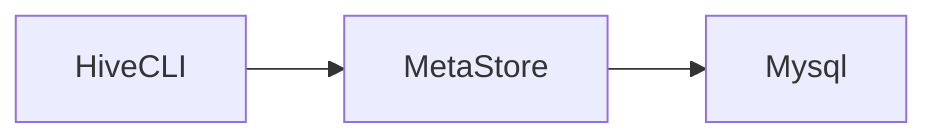

# Hive

> 一个数据仓库工具，用于查询和分析hdfs上的大规模数据。
>
> 提供了类似sql的方式操作hdfs上的数据，底层将sql转换为MR程序在hadoop上运行，同时也支持spark、tez的高性能内存计算框架。

## hive与mysql的区别

mysql是一个数据库，用于存储业务数据，有完整的事务支持，适合业务系统中的数据存储，支持crud。

而hive只是一个数据仓库工具，本身不存储任何数据，只是提供了简单的方式（sql），操作hdfs上的数据，hive不支持更新操作。

hive没有索引需要扫描所有数据，是秒级、分钟级、小时级甚至更长时间的响应，但是可以利用hadoop集群算力，适合大数据并行计算。

而mysql有索引，响应式毫秒级的响应，适合在线搜索（大数据实时搜索请使用类似es的搜索引擎）。

## 搭建

[hive官网下载链接](https://hive.apache.org/downloads.html)

以下演示使用`apache-hive-3.1.3`版本

hive依赖于hadoop环境，请在使用前启动hadoop hdfs集群（java环境就不多说了）。

### 配置文件

hive安装目录下的conf/hive-env.sh

```shell
export HADOOP_HOME=/opt/hadoop-3.3.3
export HIVE_CONF_DIR=/opt/apache-hive-3.1.3-bin/conf
export HIVE_AUX_JARS_PATH=/opt/apache-hive-3.1.3-bin/lib
```

hive-site.xml相关配置请看mysql元数据配置

### 元数据源

hive将sql解析为MR程序后运行，前提是需要知道hdfs上文件映射成数据库表的关系。

hive提供了metasotre server作为元数据源存储介质，将映射关系存储在元数据服务器上。


hive有两种元数据源，分别是本地derby数据库，与第三方`mysql`、`pgsql`等数据源。

开发期间为了方便可以使用`derby`本地数据库，只有在derby运行的服务器上才能访问元数据信息。

#### derby

初始化元数据信息`HIVE_HOME/bin/schematool -initSchema -dbType derby`

derby内嵌数据库会自动启动metastore，无需手动启动。（如果没有手动启动请使用hive目录下的`HIVE_HOME/bin/hive --service metastore`）

可以使用`jps`查看`RunJar`是否运行（不过`HIVE_HOME/bin/hive --service`启动的服务名称都是`RunJar`）

使用`HIVE_HOME/bin/hive`，使用`show databases;`查看是否成功。

#### mysql

在任意服务器上启动一个mysql（生产环境下当然是单独的mysql服务器），集群内能正常访问就行。

mysql相关配置

hive-site.xml

```xml
<?xml version="1.0"?>
<?xml-stylesheet type="text/xsl" href="configuration.xsl"?>
<configuration>
    <!-- jdbc 连接的 URL -->
    <property>
        <name>javax.jdo.option.ConnectionURL</name>
        <value>jdbc:mysql://domain:3336/hive?useSSL=false</value>
    </property>
    <!-- jdbc 连接的 Driver-->
    <property>
        <name>javax.jdo.option.ConnectionDriverName</name>
        <value>com.mysql.cj.jdbc.Driver</value> <!-- 注意这里用的是cj包下的启动，需要mysql8.0以上的驱动 -->
    </property>
    <!-- jdbc 连接的 username-->
    <property>
        <name>javax.jdo.option.ConnectionUserName</name>
        <value>root</value>
    </property>
    <!-- jdbc 连接的 password -->
    <property>
        <name>javax.jdo.option.ConnectionPassword</name>
        <value>tiger</value>
    </property>
    <!-- Hive 元数据存储版本的验证 -->
    <property>
        <name>hive.metastore.schema.verification</name>
        <value>false</value>
    </property>
    <!--元数据存储授权-->
    <property>
        <name>hive.metastore.event.db.notification.api.auth</name>
        <value>false</value>
    </property>
    <!-- Hive 默认在 HDFS 的工作目录 -->
<!--    <property>-->
<!--        <name>hive.metastore.warehouse.dir</name>-->
<!--        <value>/user/hive/warehouse</value>-->
<!--    </property>-->
        <!-- 指定存储元数据要连接的地址，用于其他hive连接metasotre -->
<!--    <property>-->
<!--        <name>hive.metastore.uris</name>-->
<!--        <value>thrift://node01:9083</value>-->
<!--    </property>-->
        <!-- 指定 hiveserver2 连接的 host -->
<!--    <property>-->
<!--        <name>hive.server2.thrift.bind.host</name>-->
<!--        <value>node01</value>-->
<!--    </property>-->
        <!-- 指定 hiveserver2 连接的端口号 -->
<!--    <property>-->
<!--        <name>hive.server2.thrift.port</name>-->
<!--        <value>10000</value>-->
<!--    </property>-->
</configuration>
```


配置完成后使用`HIVE_HOME/bin/schematool -initSchema -dbType mysql -verbose`初始化元数据信息。（新版本貌似初始化元数据信息后，就会自动启动metastore服务，通过`jps`查看有没有RunJar。如果没有通过`HIVE_HOME/bin/hive --service metastore`手动启动。）

如果启动后报错，找不到mysql驱动，去maven上下一个mysql驱动放到`HIVE_HOME/lib`下就行了。

## 客户端

### Hive CLI

> 第一代hive客户端




直接使用`HIVE_HOME/bin/hive`运行即可

### Beeline

> 第二代hvie客户端


中间多了一个hiveserver2，需要启动hiveserver2才能使用，通过hiveserver2访问metastore。

`HIVE_HOME/bin/hive --service hiveserver2`启动hiveserver2


客户端通过`HIVE_HOME/bin/beeline`启动

在客户端中使用`! connect jdbc:hive2://your_hiveserver2_host:10000`，连接hiveserver2。

连接后需要输入用户名，输入一个在hdfs中有数据权限的用户名即可，密码可以跳过直接回车。