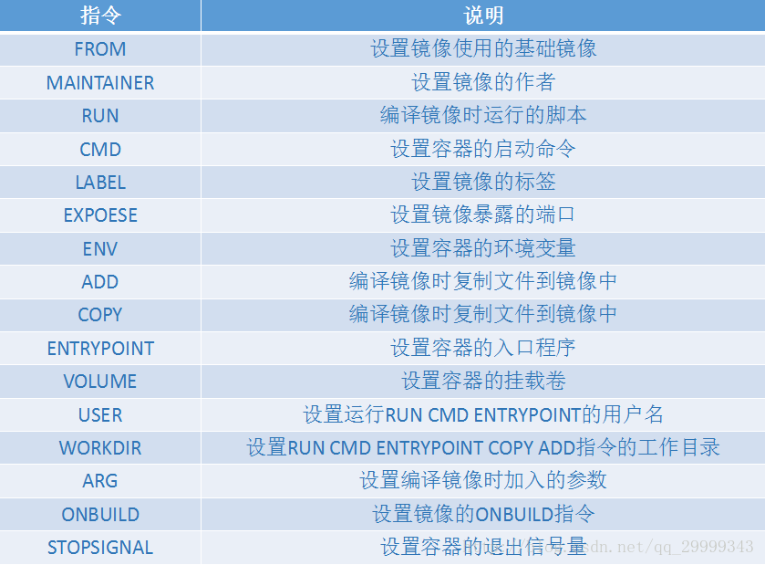

# Docker

> 一项应用容器技术, 相关只是请查阅资料

## 部署

centos下运行 `yum install docker-ce`即可安装最新版

## 命令

参考[官网](https://www.docker.com/)或[菜鸟教程](https://www.runoob.com/docker/docker-command-manual.html)

这里只列出常用命令

1. docker build 根据Dockerfile构建image
    - docker build . -t image_name:image_tag 根据当前目录下的Dockerfile构建名称为image_name, tag为image_tag的镜像
2. docker run 根据指定镜像运行容器
    - docker run image_name:image_tag 不加任何参数 只会创建容器不会运行
    - docker run -it image_name:image_tag 运行指定镜像, i表示以交互模式运行, t表示给容器分配一个伪终端, it通常一起使用
        - 若退出终端, 容器也会关闭
    - --rm 表示不保存容器资源, 容器关闭后自动清理容器内部的用户数据, 用于开发测试
    - -d 后台运行容器
    - --name 指定该容器的名称
    - docker run -it --rm image_name:image_tag /bin/bash 表示运行容器时, 会执行的命令, 会覆盖Dockerfile中的cmd
    - -P 启动一个容器,并将容器的80端口映射到主机随机端口。
    - -p 80:80 启动一个容器,并将容器的80端口映射到主机的80端口
3. docker ps
    - docker ps 显示正在运行的容器
    - docker ps -a 显示所有容器
4. docker rm 容器名称或容器id, 删除指定容器
5. docker rmi image_name:image_tag 删除指定镜像
6. docker start 容器名称或容器id 启动指定容器
7. docker stop 容器名称或容器id 关闭指定容器
8. docker stats 容器名称或容器id 显示容器状态
9. docker search 搜索镜像, 详细版本信息请直接访问dockerhub网站

## Dockerfile

