# AVLTree

> 这个树折腾了好多天, 基本都是平衡树的时候出错了

## AVLTree

### 原理

#### 二叉树节点

```java
private static final class Node<T> {
    T value;
    Node<T> left;
    Node<T> right;
    int height;

    public Node(T value) {
        this.value = value;
    }

    @Override
    public String toString() {
        return "Node{" +
            "value=" + value +
            ", height=" + height +
            '}';
    }
}
```

#### AVLTree类

我们只需要根节点属性和元素数量

```java
public class AVLTree<T extends Comparable<? super T>> implements Iterable<T> {

    private Node<T> root;

    private int size;
    
    // ......
}
```

#### 规则

AVLTree的节点需要满足以下规则:

1. 任意子树左右的高度差不大于1

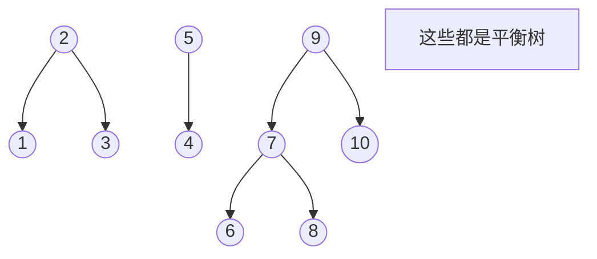

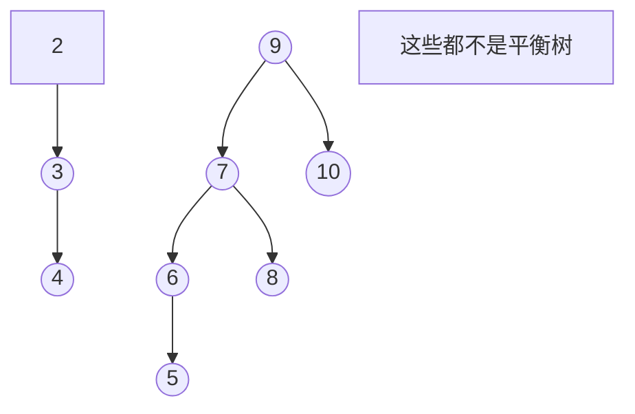

#### 旋转(平衡)

当树不平衡的时候, 分以下四种情况

1. 左子树不平衡

    1. 左子树的左子树不平衡
        - 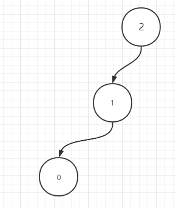
        - 平衡
            - 右旋: 将根节点移动到左子节点的右边, 同时左子节点右边移动到根节点左边
            - 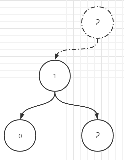

    2. 左子树的右子树不平衡
        - 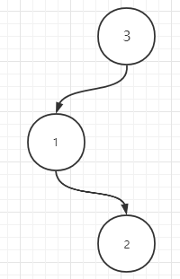
        - 平衡
            - 先将左子节点左旋, 在将根节点右旋
            - 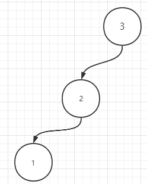
            - 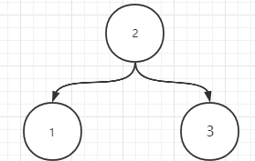

2. 右子树不平衡

    1. 右子树的右子树不平衡
        - 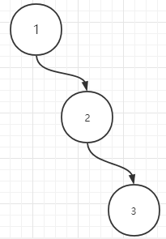
        - 平衡
            - 左旋: 将根节点移动到右子节点的左边, 同时左子节点的左边移动到根节点的右边
            - 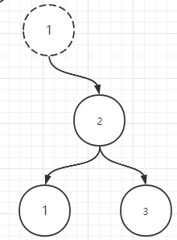
    2. 右子树的左子树不平衡
        - 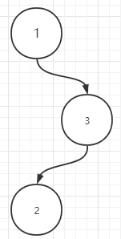
        - 平衡
            - 先将右子节点右旋, 再将根节点左旋
            - 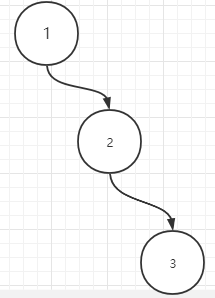
            - 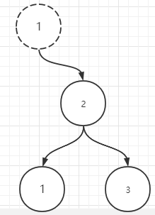

### 源码

```java
public class AVLTree<T extends Comparable<? super T>> implements Iterable<T> {

    private Node<T> root;

    private int size;

    public void add(T t) {
        root = add(root, t);
    }

    public void remove(T t) {
        root = remove(root, t);
    }

    /**
     * 删除给定节点上的值
     *
     * @param node 以node为根的子树
     * @param t    要删除的值
     * @return 删除后的新根节点
     */
    private Node<T> remove(Node<T> node, T t) {
        if (node == null) return null;

        final int cmp = t.compareTo(node.value);
        if (cmp < 0) {
            node.left = remove(node.left, t);
        } else if (cmp > 0) {
            node.right = remove(node.right, t);
        } else {
            if (node.right != null) { // 右边不为空, 右边一定有最小值, 找到后替换到当前位置
                node.value = findMin(node.right);
                node.right = remove(node.right, node.value);
            } else { // 只要右边是null的, 我们就之关心左边, 而左边只需要简单的替换即可, 在后面处理平衡
                node = node.left;
            }
            size--;
        }

        return rebalanced(node);
    }

    /**
     * 站到给定节点子树上最小的值
     *
     * @param node
     * @return 最小的值
     */
    private T findMin(Node<T> node) {
        assert node != null;
        while (node.left != null) {
            node = node.left;
        }
        return node.value;
    }

    /**
     * 在node为根的子树上添加一个值
     *
     * @param node 以node为根的子树
     * @param t    需要添加的值
     * @return 新的根节点
     */
    private Node<T> add(Node<T> node, T t) {
        if (node == null) { // 直接添加节点
            size++;
            return new Node<>(t);
        }

        final int cmp = t.compareTo(node.value);
        if (cmp < 0) {
            node.left = add(node.left, t);
        } else if (cmp > 0) {
            node.right = add(node.right, t);
        }

        // 添加节点后更新高度
        node.height = getHeight(node);

        // 平衡节点
        return rebalanced(node);
    }

    /**
     * 平衡以node为根的子树
     *
     * @param node node根节点
     * @return 平衡后新的根节点
     */
    private Node<T> rebalanced(Node<T> node) {
        // 获取平衡因子
        final int balanceFactor = getBalanceFactor(node);
        if (balanceFactor > 1) { // 左子树不平衡
            // 能进来就意味着 左子树不平衡 所以左子树一定不为null 不需要担心空指针
            if (node.left.left != null) { // LL
                return rightRotate(node);
            } else { // LR
                node.left = leftRotate(node.left);
                return rightRotate(node);
            }
        } else if (balanceFactor < -1) { // 右子树不平衡
            // 能进来就意味着 右子树不平衡 所以右子树一定不为null 不需要担心空指针
            if (node.right.right != null) { // RR
                return leftRotate(node);
            } else { // RL
                node.right = rightRotate(node.right);
                return leftRotate(node);
            }
        }
        return node;
    }

    /**
     * 左旋
     * <p>
     * A                         B
     * \                       / \
     * B         ===>        A   C
     * \
     * C
     *
     * @param node node
     * @return 旋转后的新根节点
     */
    private Node<T> leftRotate(Node<T> node) {
        var newNode = node.right;

        node.right = newNode.left;
        newNode.left = node;

        newNode.height = getHeight(newNode);
        node.height = getHeight(node);

        return newNode;
    }

    /**
     * 右旋
     * <p>
     * A                        B
     * /                        / \
     * B          ===>          C   A
     * /
     * C
     *
     * @param node node
     * @return 旋转后的新根节点
     */
    private Node<T> rightRotate(Node<T> node) {
        var newNode = node.left;

        node.left = newNode.right;
        newNode.right = node;

        newNode.height = getHeight(newNode);
        node.height = getHeight(node);

        return newNode;
    }

    /**
     * 获取给定节点的高度
     * 有点坑边界条件, 如果在节点为null时返回0和返回-1
     * 返回0时, 只有一个节点的时候高度为1
     * 返回-1时, 只有一个节点的时候高度为0
     *
     * @param node
     * @return
     */
    private int getHeight(Node<T> node) {
        if (node == null) return -1;

        return Math.max(getHeight(node.left), getHeight(node.right)) + 1;
    }

    /**
     * 获取指定节点平衡因子
     *
     * @param node node
     * @return node节点的平衡因子
     */
    private int getBalanceFactor(Node<T> node) {
        if (node == null) {
            return 0;
        }
        // 左树高度 - 右树高度 得出平衡因子
        // factor > 1表示左树不平衡
        // factor < -1表示右树不平衡
        return getHeight(node.left) - getHeight(node.right);
    }

    public int size() {
        return size;
    }

    private static final class Node<T> {
        T value;
        Node<T> left;
        Node<T> right;
        int height;

        public Node(T value) {
            this.value = value;
        }

        @Override
        public String toString() {
            return "Node{" +
                    "value=" + value +
                    ", height=" + height +
                    '}';
        }
    }

    @Override
    public Iterator<T> iterator() {
        return new AVLTreeIter<>(root);
    }

    private static final class AVLTreeIter<T> implements Iterator<T> {

        private Deque<Node<T>> deque = new ArrayDeque<>();

        public AVLTreeIter(Node<T> root) {
            while (root != null) {
                deque.push(root);
                root = root.left;
            }
        }

        @Override
        public boolean hasNext() {
            return !deque.isEmpty();
        }

        @Override
        public T next() {
            // 该节点已经是最左边的节点了, 左边为null
            final Node<T> node = deque.pop();
            var cur = node.right;

            while (cur != null) {
                deque.push(cur);
                cur = cur.left;
            }

            return node.value;
        }
    }

    static class Tests {
        public static void main(String[] args) {
            test();
        }

        public static void test() {
            final int ITER_COUNT = 5;
            for (int i = 0; i < ITER_COUNT; i++) {
                final AVLTree<Integer> tree = new AVLTree<>();
                final TreeSet<Integer> treeSet = new TreeSet<>();
                final Random r = new Random();
                final List<Integer> samples = Stream.generate(() -> r.nextInt(1000000))
                        .limit(10000).collect(Collectors.toList());
                samples.forEach(item -> {
                    tree.add(item);
                    treeSet.add(item);
                });
                // 遍历元素 是否一致
                for (Iterator<Integer> treeIt = tree.iterator(),
                     treeSetIt = treeSet.iterator(); treeIt.hasNext() || treeSetIt.hasNext(); ) {
                    if (!treeIt.next().equals(treeSetIt.next())) {
                        throw new VerifyError("failed");
                    }
                }
                // 删除元素 再遍历是否一直
                for (int j = 0; j < samples.size(); j++) {
                    tree.remove(j);
                    treeSet.remove(j);
                    for (Iterator<Integer> treeIt = tree.iterator(),
                         treeSetIt = treeSet.iterator(); treeIt.hasNext() || treeSetIt.hasNext(); ) {
                        if (!treeIt.next().equals(treeSetIt.next()) && tree.size() == treeSet.size()) {
                            throw new VerifyError("failed");
                        }
                    }
                }
            }

            System.out.println("success!");
        }

        public static void test_10demo() {
            final AVLTree<Integer> tree = new AVLTree<>();
            for (int i = 0; i <= 10; i++) {
                tree.add(i);
            }
            tree.forEach(item -> System.out.printf("%s ", item));
            System.out.println();
            for (int i = 0; i <= 10; i++) {
                tree.remove(i);
                tree.forEach(item -> System.out.printf("%s ", item));
                System.out.println();
            }
        }
    }
}
```

## AVLTreeMap

与AVLTree基本一致, 接口上略有区别, 列如map的put、remove方法需要返回之前的值, 接口上的区别导致了, 添加删除方式有所不同

### 源码

```java
public class AVLTreeMap<K extends Comparable<? super K>, V> implements Iterable<AVLTreeMap.Entry<K, V>> {

    private Entry<K, V> root;

    private int size;

    public int size() {
        return size;
    }

    public boolean isEmpty() {
        return root == null;
    }

    public boolean containsKey(Object key) {
        return getEntry(key) != null;
    }

    public boolean containsValue(Object value) {
        // 可以直接用iterator迭代寻找

        // 下面的循环是先找到第一个节点(根节点左边最小值), 然后不停的找后继节点(中序遍历的下一个节点)比对, 相当于在中序遍历, 与iterator没什么区别
        for (Entry<K, V> entry = findMin(root); entry != null; entry = successor(entry)) {
            if (Objects.equals(value, entry.value))
                return true;
        }
        return false;
    }

    private Entry<K, V> successor(Entry<K, V> entry) {
        if (entry == null) {
            return null;
        } else if (entry.right != null) { // 右边有节点, 那么后继节点肯定在右边的最左边
            var cur = entry.right;
            while (cur.left != null) {
                cur = cur.left;
            }
            return cur;
        } else {
            // 右边为null
            // 1.如果当前节点是父节点的左子节点, 那么父节点就是后继节点
            // 2.如果当前节点是父节点的右子节点, 那么需要一直向上找, 直到找到一个不是父节点的右子节点的值
            var p = entry.parent;
            var cur = entry;
            while (p != null && p.right == cur) {
                cur = p;
                p = p.parent;
            }
            return p;
        }
    }

    public V get(Object key) {
        final Entry<K, V> node = getEntry(key);
        return node != null ? node.value : null;
    }

    private Entry<K, V> getEntry(Object key) {
        var node = root;
        @SuppressWarnings("unchecked") final Comparable<? super K> k = (Comparable<? super K>) key;
        while (node != null) {
            int cmp = k.compareTo(node.key);
            if (cmp < 0) {
                node = node.left;
            } else if (cmp > 0) {
                node = node.right;
            } else {
                return node;
            }
        }
        return null;
    }

    public V put(K key, V value) {
        return put(key, value, root);
    }

    private V put(K key, V value, Entry<K, V> node) {
        if (node == null) {
            addEntryToEmptyMap(key, value);
            return null;
        }
        Entry<K, V> parent, n = node;
        int cmp;
        do {
            parent = n;
            cmp = key.compareTo(n.key);
            if (cmp < 0) {
                n = n.left;
            } else if (cmp > 0) {
                n = n.right;
            } else {
                V oldValue = n.value;
                n.value = value; // key重复时, 覆盖value
                return oldValue;
            }
        } while (n != null);
        // 能运行到这就说明key没重复, 我们需要插入到parent下面
        addEntry(key, value, parent, cmp < 0);
        return null;
    }

    private void addEntryToEmptyMap(K key, V value) {
        root = new Entry<>(key, value, null);
        size++;
    }

    /**
     * 添加节点
     *
     * @param key       key
     * @param value     value
     * @param parent    向谁下面加
     * @param addToLeft 是否插入到左边
     */
    private void addEntry(K key, V value, Entry<K, V> parent, boolean addToLeft) {
        var newEntry = new Entry<>(key, value, parent);
        if (addToLeft) {
            parent.left = newEntry;
        } else {
            parent.right = newEntry;
        }
        parent.height = getHeight(parent); // 感觉高度可能不会用到了
        newEntry.height = getHeight(newEntry);
        rebalanced(newEntry);
        size++;
    }

    private void rebalanced(Entry<K, V> node) {
        while (node != null) {
            final int balanceFactor = getBalanceFactor(node);
            if (balanceFactor > 1) { // 左树不平衡
                if (node.left.right != null) { // LR
                    rotateLeft(node.left);
                    rotateRight(node);
                } else { // LL
                    rotateRight(node);
                }
                // 下面的有问题, 需要判断LR在判断LL, ? 可能是规律, 需要先判断双旋情况
                /*if (node.left.left != null) { // LL
                    rotateRight(node);
                } else { // LR
                    rotateLeft(node.left);
                    rotateRight(node);
                }*/
            } else if (balanceFactor < -1) { // 右树不平衡
                if (node.right.right != null) { // RR
                    rotateLeft(node);
                } else { // RL
                    rotateRight(node.right);
                    rotateLeft(node);
                }
            }
            node = node.parent;
        }
    }

    /**
     * 左旋
     * A                             B
     * \                           / \
     * B            ===>         A   C
     * \
     * C
     *
     * @param node
     */
    private void rotateLeft(Entry<K, V> node) {
        if (node != null) {
            // 根节点的右边是新的根节点
            Entry<K, V> newEntry = node.right;
            node.right = newEntry.left;
            if (newEntry.left != null) {
                // 根节点的右子节点的左边现在移动到了根节点下面, 更新parent
                newEntry.left.parent = node;
            }
            // 新根节点替代了根节点, 更新parent
            newEntry.parent = node.parent;
            if (node.parent == null) {
                // parent为null 说明旋转的节点是根节点, 更新root
                root = newEntry;
            }
            // 判断根节点是根节点的父节点的左子树还是右子树, 更新父节点的指针
            else if (node.parent.left == node)
                node.parent.left = newEntry;
            else
                node.parent.right = newEntry;
            newEntry.left = node;
            // 根节点的父节点是新根节点, 更新
            node.parent = newEntry;
        }
    }

    /**
     * 右旋
     *
     * @param node
     */
    private void rotateRight(Entry<K, V> node) {
        if (node != null) {
            Entry<K, V> newEntry = node.left;
            node.left = newEntry.right;
            if (newEntry.right != null) newEntry.right.parent = node;
            newEntry.parent = node.parent;
            if (node.parent == null)
                root = newEntry;
            else if (node.parent.right == node)
                node.parent.right = newEntry;
            else node.parent.left = newEntry;
            newEntry.right = node;
            node.parent = newEntry;
        }
    }

    private int getHeight(Entry<K, V> node) {
        if (node == null) return -1;

        return Math.max(getHeight(node.left), getHeight(node.right)) + 1;
    }

    private int getBalanceFactor(Entry<K, V> node) {
        if (node == null) return 0;

        return getHeight(node.left) - getHeight(node.right);
    }

    public V remove(Object key) {
        Entry<K, V> entry = getEntry(key);
        if (entry == null) return null;

        // 删除指定节点
        deleteEntry(entry);
        return entry.value;
    }

    private void deleteEntry(Entry<K, V> entry) {
        size--;

        if (entry.right != null) { // 如果右边不为null, 那么右边一定需要找到后继替换当前节点
            final Entry<K, V> minEntry = findMin(entry.right);
            entry.key = minEntry.key;
            entry.value = minEntry.value;
            deleteEntry(minEntry);
        } else { // 如果右边为null, 只需要处理左边即可
            if (entry.parent != null) { // entry 不是根节点
                if (entry.parent.left == entry) {
                    entry.parent.left = entry.left;
                } else {
                    entry.parent.right = entry.left;
                }
            } else {
                root = null;
            }
        }

        rebalanced(entry);
    }

    private Entry<K, V> findMin(Entry<K, V> entry) {
        while (entry.left != null) {
            entry = entry.left;
        }
        return entry;
    }

    public void clear() {

    }

    public Set<K> keySet() {
        return null;
    }

    public Collection<V> values() {
        return null;
    }

    public Set<Map.Entry<K, V>> entrySet() {
        return null;
    }

    @Override
    public Iterator<Entry<K, V>> iterator() {
        return new AVLTreeIter<>(root);
    }

    private static final class AVLTreeIter<K, V> implements Iterator<Entry<K, V>> {

        private final Deque<Entry<K, V>> deque = new ArrayDeque<>();

        public AVLTreeIter(Entry<K, V> entry) {
            while (entry != null) {
                deque.push(entry);
                entry = entry.left;
            }
        }

        @Override
        public boolean hasNext() {
            return !deque.isEmpty();
        }

        @Override
        public Entry<K, V> next() {
            final Entry<K, V> entry = deque.pop();
            var cur = entry.right;
            while (cur != null) {
                deque.push(cur);
                cur = cur.left;
            }
            return entry;
        }
    }

    static final class Entry<K, V> {

        K key;
        V value;
        Entry<K, V> left;
        Entry<K, V> right;
        Entry<K, V> parent;
        int height;

        public Entry(K key, V value, Entry<K, V> parent) {
            this.key = key;
            this.value = value;
            this.parent = parent;
        }

        public K getKey() {
            return key;
        }

        public V getValue() {
            return value;
        }

        public V setValue(V value) {
            V oldValue = this.value;
            this.value = value;
            return oldValue;
        }

        @Override
        public String toString() {
            return "Entry{" +
                    "key=" + key +
                    ", value=" + value +
                    ", height=" + height +
                    '}';
        }
    }

    static class Tests {
        public static void main(String[] args) {
            test();
        }

        public static void test() {
            final int ITER_COUNT = 10;
            for (int i = 0; i < ITER_COUNT; i++) {
                final AVLTreeMap<Integer, Integer> tree = new AVLTreeMap<>();
                final TreeMap<Integer, Integer> treeMap = new TreeMap<>();
                final Random r = new Random();
                final List<Integer> samples = Stream.generate(() -> r.nextInt(100000))
                        .limit(10000).collect(Collectors.toList());
                samples.forEach(item -> {
//                    System.out.println(item);
                    tree.put(item, item);
                    treeMap.put(item, item);
                });
                // 遍历元素 是否一致
                Set<Map.Entry<Integer, Integer>> treeMapEntrySet = treeMap.entrySet();
                Iterator<Entry<Integer, Integer>> treeIt = tree.iterator();
                for (Map.Entry<Integer, Integer> treeMapEntry : treeMapEntrySet) {
                    final Entry<Integer, Integer> treeEntry = treeIt.next();
                    if (!(treeMapEntry.getKey().compareTo(treeEntry.getKey()) == 0)) throw new VerifyError("failed");
                }
                // 删除元素 再遍历是否一直
                for (int j = 0; j < samples.size(); j++) {
                    tree.remove(j);
                    treeMap.remove(j);
                    treeMapEntrySet = treeMap.entrySet();
                    treeIt = tree.iterator();
                    for (Map.Entry<Integer, Integer> treeMapEntry : treeMapEntrySet) {
                        final Entry<Integer, Integer> treeEntry = treeIt.next();
                        if (!(treeMapEntry.getKey().compareTo(treeEntry.getKey()) == 0) &&
                            tree.containsValue(j + 1) == treeMap.containsValue(j + 1))
                            throw new VerifyError("failed");
                    }
                }
            }

            System.out.println("success!");
        }

        public static void test_demo() {
            final AVLTreeMap<Integer, Object> tree = new AVLTreeMap<>();
            tree.put(1, 1);
            tree.put(8, 8);
            tree.put(5, 5);
            tree.put(8, 8);
            tree.put(1, 1);
            tree.put(1, 1);
            tree.put(8, 8);
            tree.put(0, 0);
            tree.put(8, 8);
            tree.put(5, 5);
            tree.put(1, 1);
            tree.put(0, 0);
            tree.put(2, 2);
            tree.put(1, 1);
            tree.put(3, 3);
            System.out.println("hello");
        }

        public static void test_10demo() {
            final AVLTreeMap<Integer, Integer> map = new AVLTreeMap<>();
            for (int i = 0; i <= 10; i++) {
                map.put(i, i);
            }
            for (int i = 0; i < 10; i++) {
                System.out.println(map.containsValue(i));
            }
            map.forEach(item -> {
                System.out.printf("%s ", item.getKey());
            });
            System.out.println();
            for (int i = 0; i <= 10; i++) {
                map.remove(i);
            }
        }
    }
}
```

