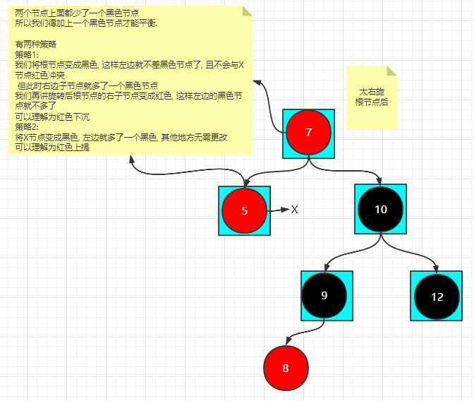

# RBTree

> 参考胡船长红黑树视频
>
> [B站数据结构课](https://www.bilibili.com/video/BV1Cq4y1A7wo?spm_id_from=333.999.0.0)

## 详解

**红黑树的规则**

1. 根节点是黑色
2. 节点非黑即红
3. 叶子结点都是黑色(叶子结点值得是NULL节点)
4. 不能有连续的红色几点, 即红色节点的直接子节点必须是黑色
5. 从根节点出发到所有叶子节点路径上的黑色节点数量相同

红黑树规则5, 使红黑树尽可能平衡削减树高, 插入一个黑色就会影响规则1, 所有我们默认插入红色节点, 然后单独解决颜色冲突

```cpp
// 颜色枚举
enum Color { RED = 0, BLACK, DOUBLE_BLACK };
```

```cpp
// 节点结构体
struct Node {
  // key值, 颜色
  int key, color;
  // 左右子节点值不指向NULL, 通过NIL节点表示NULL, 方便操作
  Node *left, *right;
};
```

```cpp
// 用来表示叶子节点的值 即NULL节点
Node _NIL = Node(), *NIL = &_NIL;

// 初始化NIL节点
__attribute__((constructor)) void initNIL() {
  _NIL.key = 0;
  // 叶子结点都是黑色
  _NIL.color = BLACK;
  _NIL.left = _NIL.right = NIL;
}
```

```cpp
// 新建节点代码
Node* newNode(int key) {
  Node* node = new Node();
  node->key = key;
  // 插入的节点都默认是红色, 插入黑色会导致黑色节点数量失衡违反规则5,
  // 我们主要依靠: 从根节点出发, 到所有叶子节点上的黑色节点数量相同来维持平衡
  node->color = RED;
  node->left = node->right = NIL;
  return node;
}
```

> `红色上提`表示将三角帽区域改成红黑黑(root left right)
>
> `红色下沉`表示将三角帽区域改成黑红红(root left right)

### 插入

默认插入的是红色节点

插入的红色节点不会导致黑色节点失衡, 但是可能违反规则4

因此我们插入主要解决的就是两个连续的红色节点的情况

**!!!重点: 插入站在祖父节点看**

**插入的时候 站在祖父节点看 根据叔父节点 调整父节点与根节点子树**

X为插入的节点

插入分为两种大情况

1. 叔父节点是红色
    - `红色上提`
2. 叔父节点是黑色
    1. 叔父节点是根节点的右子节点
        1. 根节点的左子节点的左子节点是红色
            - 站在根节点看是LL类型 大右旋根节点后调色
            - 调色方案: 改三角帽 红黑黑(`红色上提`) 黑红红(`红色下沉`)
        2. 根节点的左子节点的右子节点是红色
            - 站在根节点看是LR类型 先小左旋根节点的左子节点后调色 再大右旋根节点后调色
        3. 根节点的左子节点的左右子节点都是红色时, 视为情况2.1.1, 也就是LL类型
    2. 叔父节点是根节点的左子节点 反之

#### 情况1

**!!!插入站在祖父节点看**


11为插入的节点, 11与父节点12双红, 现在需要平衡

平衡方案:

`红色上提`, 即将根节点改为红色, 根节点的直接子节点改成黑色

不需要担心违反规则1, 插入后将根节点强制改成黑色即可


#### 情况2

叔父节点是黑色

##### 情况2.1

根节点的左子节点的左子节点是红色


我们将这种情况视为LL类型, 其中有蓝色框的节点表示确定性的节点

> 解释一下什么是确定性的节点
>
> 现在我们说的是根节点的left的left都是红色的情况, 所以根节点的left的left肯定是红色, 所以7, 5节点是确定性的红色
>
> 7节点是红色, 10节点就不应该是红色, 不能有两个红色的节点, 如果10是红色只可能之前的递归中平衡节点出现错误, 所以10是确定性的黑色
>
> 我们讨论的就是叔父节点是黑色的情况, 所以12为确定性黑色
>
> 其他的节点都是特例, 可能为其他颜色, 我们只能从确定性的节点分析出确定性的条件和平衡关系, 分析出如何平衡


平衡方案:

LL类型大右旋根节点即可





##### 情况2.2

根节点的左子节点的右子节点是红色

我们将这种情况视为LR类型, 其中有蓝色框的节点表示确定性的节点


按照LR类型的平衡方式, 先小左旋根节点的左子节点(即7这个节点), 然后大右旋根节点即可

将根节点的左子节点视为RR类型, 进行左旋


### 删除

> 删除的时候, 如果删除一个红色节点是没有影响的
>
> 但是如果删除黑色节点, 此时会违反规则5, 需要平衡

**删除的时候 站在父节点节点看 根据兄弟节点 调整兄弟节点子树**

情况1

兄弟节点是黑色且兄弟节点的左右子节点也是黑色


平衡方案:


#### 情况1

##### 情况1.1

兄弟节点是黑色, 且兄弟节点的右子节点是红色

将此情况视为RR类型, 大左旋39


##### 情况1.2

兄弟节点是黑色, 兄弟节点的右子节点不是红色, 且兄弟节点的左子节点是红色


#### 情况2

兄弟节点是红色


## 参考代码

```cpp
#include <bits/stdc++.h>

using namespace std;

/*
红黑树的规则
1. 根节点是黑色
2. 每个节点非黑即红
3. 叶子结点都是黑色(叶子结点值得是NULL节点)
4. 不能有两个连续的红色节点, 即红色节点的直接子节点必须是黑色
5. 从根节点出发到所有叶子节点路径上的黑色节点数量相同
*/

enum Color { RED = 0, BLACK, DOUBLE_BLACK };

struct Node {
  int key, color;
  Node *left, *right;
};

// 用来表示叶子节点的值 即NULL节点
Node _NIL = Node(), *NIL = &_NIL;

__attribute__((constructor)) void initNIL() {
  _NIL.key = 0;
  // 叶子结点都是黑色
  _NIL.color = BLACK;
  _NIL.left = _NIL.right = NIL;
}

Node* newNode(int key) {
  Node* node = new Node();
  node->key = key;
  // 插入的节点都默认是红色, 插入黑色会导致黑色节点数量失衡违反规则5,
  // 我们主要依靠: 从根节点出发, 到所有叶子节点上的黑色节点数量相同来维持平衡
  node->color = RED;
  node->left = node->right = NIL;
  return node;
}

void destroyNode(Node* root) {
  if (root == NIL || root == nullptr) return;
  destroyNode(root->left);
  destroyNode(root->right);
  delete root;
}

bool hasRedChild(Node* root) {
  return root->left->color == RED || root->right->color == RED;
}

Node* leftRotate(Node* root) {
  Node* r = root->right;
  root->right = r->left;
  r->left = root;
  return r;
}

Node* rightRotate(Node* root) {
  Node* l = root->left;
  root->left = l->right;
  l->right = root;
  return l;
}

Node* afterInsertFix(Node* root) {
  // 插入站在祖父节点位置看
  // 判断以root为根的子树是否失衡
  // 当前根节点是否有红色的子节点, 只有有红色节点才有可能失衡
  /*
  如果没有红色子节点就无需返回, 插入的时候失衡的情况是处理两个连续的红节点
  连红色子节点都没有就无需处理, 如果有就继续看孙子节点是否连续红色
  */
  if (!hasRedChild(root)) return root;
  // 有红色的子节点, 但是不一定冲突
  // 情况一: 父节点与叔叔节点都是红色
  // 注意我们是站在祖父节点上看, 左右子节点都是红色表示父节点与叔叔节点都是红色
  if (root->left->color == RED && root->right->color == RED) {
    // 父节点与叔叔节点都是红色还不一定失衡
    // 左右子节点都没有红色的子节点, 即没有红色的孙子节点, 无需平衡
    if (!hasRedChild(root->left) && !hasRedChild(root->right)) return root;
    // 红色上提 (这里必须使用红色上提, 这里要解决的就是黑红红情况)
    goto red_rise;
  }
  // 运行到这里说只有一个红色的子节点
  // 判断是L还是R类型的失衡
  if (root->left->color == RED) {
    // R类型失衡
    // 没有红色子节点就不会失衡, 即没有两个连着的红色节点
    if (!hasRedChild(root->left)) return root;
    // RL类型
    if (root->left->right->color == RED) {
      root->left = leftRotate(root->left);
    }
    root = rightRotate(root);
    goto red_rise;
  } else {
    // L类型失衡
    // 没有红色子节点就不会失衡, 即没有两个连着的红色节点
    if (!hasRedChild(root->right)) return root;
    // LR类型
    if (root->right->left->color == RED) {
      root->right = rightRotate(root->right);
    }
    root = leftRotate(root);
    goto red_rise;
  }
red_rise:
  // 红色下沉
  root->color = RED;
  root->left->color = root->right->color = BLACK;
  return root;
}

Node* _insert(Node* root, int key) {
  // 插入节点
  if (root == NIL) return newNode(key);
  // 树中已经有节点了
  if (root->key == key) return root;
  if (root->key > key)
    root->left = _insert(root->left, key);
  else
    root->right = _insert(root->right, key);
  return afterInsertFix(root);
}

Node* insert(Node* root, int key) {
  root = _insert(root, key);
  // 红黑树的根节点一定是黑色
  root->color = BLACK;
  return root;
}

Node* predecessor(Node* root) {
  Node* temp = root->left;
  while (temp->right != NIL) temp = temp->right;
  return temp;
}

bool hasDoubleBlackChild(Node* root) {
  return root->left->color == DOUBLE_BLACK ||
         root->right->color == DOUBLE_BLACK;
}

Node* afterEraseFix(Node* root) {
  // 删除站在父节点的角度看
  // 没有双重黑节点, 就不需要平衡
  if (!hasDoubleBlackChild(root)) return root;
  if (root->left->color == DOUBLE_BLACK) {
    // 左子树是双重黑
    // 情况一: 兄弟节点是红色
    if (root->right->color == RED) {
      // 左旋将右边的兄弟节点移动到根节点, 将新的根节点也就是兄弟节点改成黑色
      root->color = RED;
      root->right->color = BLACK;
      // 左旋兄弟节点
      root = leftRotate(root);
      // 现在新的左子节点是红色, 变成了在左子树中调平
      root->left = afterEraseFix(root->left);
      return root;
    }
    // 情况二: 兄弟节点是黑色且兄弟节点的子节点都是黑色
    if (!hasRedChild(root->right)) {
      // 双重黑上提到子树的根节点
      root->color += 1;
      // 将连个黑色子节点变成红色
      root->left->color -= 1;
      root->right->color -= 1;
      return root;
    }
    // 情况三: 兄弟节点只有一个红色的直接子节点
    // R类型
    // 下面这个if判断逻辑上是错误的
    // 兄弟节点的直接子节点都是红色的时候我们认为是RR类型
    // 而下面的if判断的是RL类型, 此时不能走RL
    // if (root->right->left->color == RED);
    if (root->right->right->color != RED) {
      // RL类型
      // 这个是新的根节点, 将新的根节点变成黑色
      root->right->left->color = BLACK;
      // 原来的根节点变成红色
      root->right->color = RED;
      root->right = rightRotate(root->right);
    }
    // RR类型
    // 将新的根节点颜色变成之前根节点的颜色
    root->right->color = root->color;
    // 将左子树双重黑减掉
    root->left->color -= 1;
    root = leftRotate(root);
    // 将旋转后的根节点的颜色变成黑色
    root->left->color = root->right->color = BLACK;
  } else {
    // 右子树是双重黑
    // 情况一: 兄弟节点是红色
    if (root->left->color == RED) {
      // 右旋将左边的兄弟节点移动到根节点, 将新的根节点也就是兄弟节点改成黑色
      root->color = RED;
      root->left->color = BLACK;
      // 左旋兄弟节点
      root = rightRotate(root);
      // 现在新的左子节点是红色, 变成了在左子树中调平
      root->right = afterEraseFix(root->right);
      return root;
    }
    // 情况二: 兄弟节点是黑色且兄弟节点的子节点都是黑色
    if (!hasRedChild(root->left)) {
      // 双重黑上提到子树的根节点
      root->color += 1;
      // 将连个黑色子节点变成红色
      root->left->color -= 1;
      root->right->color -= 1;
      return root;
    }
    // 情况三: 兄弟节点只有一个红色的直接子节点
    // L类型
    // 下面这个if判断逻辑上是错误的
    // 兄弟节点的直接子节点都是红色的时候我们认为是LL类型
    // 而下面的if判断的是LR类型, 此时不能走LR
    // if (root->left->right->color == RED);
    if (root->left->left->color != RED) {
      // LR类型
      // 这个是新的根节点, 将新的根节点变成黑色
      root->left->right->color = BLACK;
      // 原来的根节点变成红色
      root->left->color = RED;
      root->left = leftRotate(root->left);
    }
    // LL类型
    // 将新的根节点颜色变成之前根节点的颜色
    root->left->color = root->color;
    // 将右子树双重黑减掉
    root->right->color -= 1;
    root = rightRotate(root);
    // 将旋转后的根节点的颜色变成黑色
    root->left->color = root->right->color = BLACK;
  }
  return root;
}

Node* _erase(Node* root, int key) {
  if (root == NIL) return root;
  if (root->key < key) {
    root->right = _erase(root->right, key);
  } else if (root->key > key) {
    root->left = _erase(root->left, key);
  } else {
    // 找到要删除的节点了
    // 左右子节点只要有一个是NIL, 我们就返回另一个节点的值
    if (root->left == NIL || root->right == NIL) {
      // 获取除了NIL节点, 另一个子节点的值(另一个自己子节点也有可能是NIL)
      Node* temp = root->left == NIL ? root->right : root->left;
      // 如果度为0, 那么就会出现一个双重黑节点, 只不过是NIL但是不影响操作
      // 如果度为1, 子节点是红色, 那么就会变成黑色
      // 如果度为1, 子节点就黑色, 纳闷就会变成双重黑
      temp->color += root->color;
      // 删除root节点
      delete root;
      root = nullptr;
      // 直接返回另一个节点, 有父回溯来处理平衡
      return temp;
    } else {
      // 左右子节点都不为NIL, 找前驱或者后继替换值, 然后删除前驱或者后继节点
      Node* temp = predecessor(root);
      root->key = temp->key;
      root->left = _erase(root->left, temp->key);
    }
  }
  return afterEraseFix(root);
}

Node* erase(Node* root, int key) {
  root = _erase(root, key);
  root->color = BLACK;
  return root;
}

void output(Node* root) {
  if (root == NIL) return;
  cout << root->key << " ["
       << (root->left == NIL ? "NIL" : to_string(root->left->key)) << " "
       << (root->right == NIL ? "NIL" : to_string(root->right->key)) << "]"
       << " " << (root->color ? "BLACK" : "RED") << endl;
  output(root->left);
  output(root->right);
}

int main() {
  int op, val;
  Node* root = NIL;
  while (~scanf("%d%d", &op, &val)) {
    switch (op) {
      // 插入
      case 1:
        root = insert(root, val);
        break;
      // 删除
      case 2:
        root = erase(root, val);
        break;
    }
    output(root);
  }
  destroyNode(root);
  cout << "end" << endl;
  return 0;
}
```