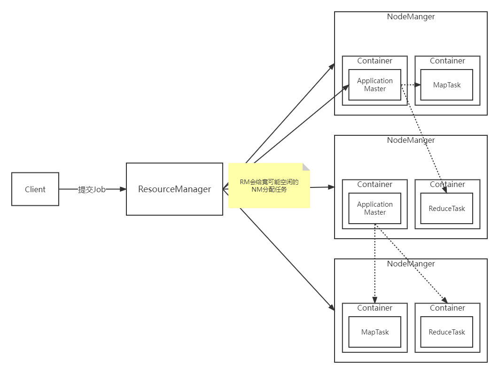
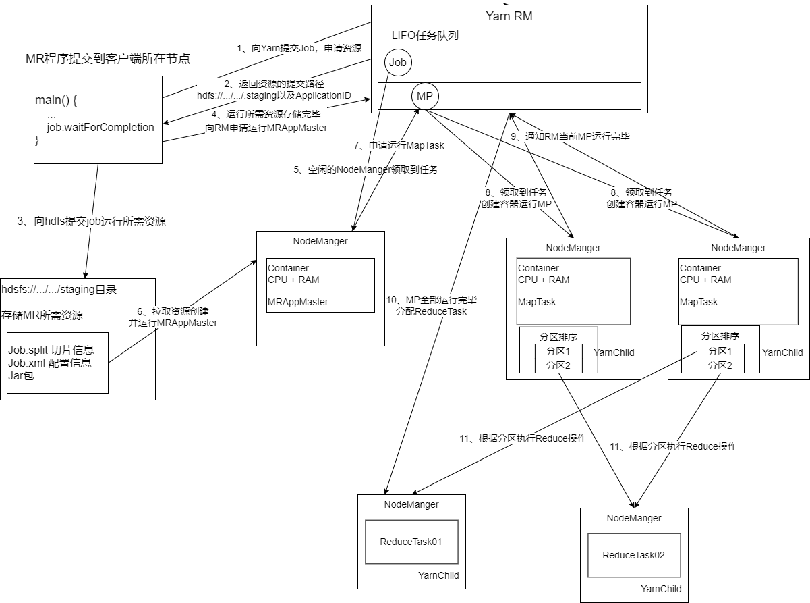
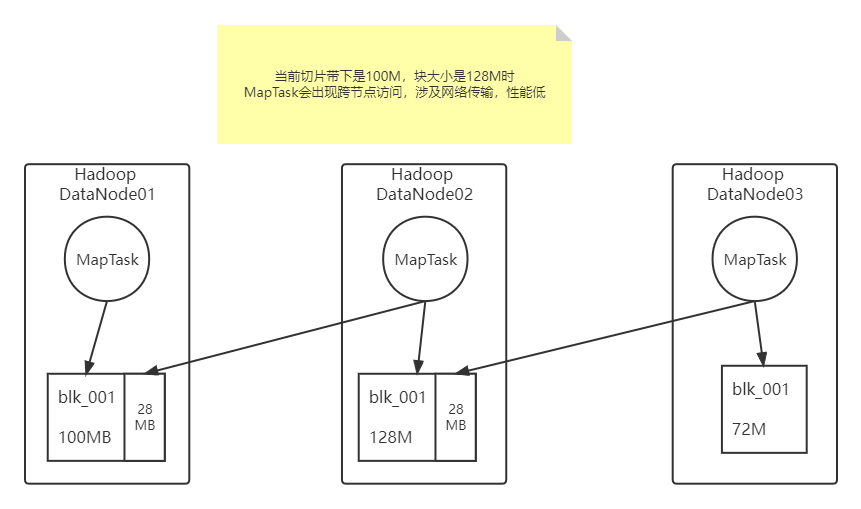

# Hadoop

> Hadoop是一个分布式系统基础架构。提供了HDFS分布式存储、MapReduce分布式计算、YARN分布式系统资源调度等功能。

## hadoop集群搭建

> 搭建这里坑很多，注意一下每个步骤都仔细一点就行。

首先记得配置静态IP和关闭防火墙，这个就不多解释了。

### 配置主机名

> 为每台服务器配置主机名，方便访问。
>
> 我的虚拟机网段是192.168.150.0，虚拟机网关是192.168.150.2。

这里演示三台服务器，三台主机的IP分别是`192.168.150.101`，`192.168.150.102`，`192.168.150.103`。

`vi /etc/hosts`更改hosts文件，加入以下内容：

注意hadoop不支持主机名包含空格、`.`、`_`

```
192.168.150.101 hadoop-1
192.168.150.102 hadoop-2
192.168.150.103 hadoop-3
```

配置完成后，使用`service network restart`重启网卡，没有该命令自己网上查询解决方案或者直接重启系统自动重启网卡。

使用`hostname`查看主机名是否配置成功。

### 配置ssh免密登录

> hadoop访问集群其他机器时需要使用

`ssh-keygen -t rsa`生成公钥私钥，默认会在`/root/.ssh`目录下生成`id_rsa`私钥与`id_rsa.pub`公钥。

公钥相当于锁，私钥就是钥匙。

`ssh-copy-id hostname`将公钥拷贝到其他需要登录服务器上即可。

在每台机器上配置免密登录

`ssh-keygen -t rsa`

`ssh-copy-id hadoop-1`

`ssh-copy-id hadoop-2`

`ssh-copy-id hadoop-3`

### 下载hadoop运行环境

hadoop官方下载链接https://hadoop.apache.org/releases.html

这里使用的是hadoop-3.3.3版本

hadoop是jvm平台软件，我们还需要安装jdk，这里使用[open-jdk-11](https://jdk.java.net/java-se-ri/11)

### 配置环境变量

向`/etc/profile`中追加：

```bash
export JAVA_HOME=/opt/jdk-11
export HADOOP_HOME=/opt/hadoop-3.3.3
export PATH=$PATH:$JAVA_HOME/bin:$HADOOP_HOME/bin:$HADOOP_HOME/sbin
```

`source /etc/profile`刷新环境变量

### Hadoop配置

> 配置很重要，hadoop启动报错多半是配置有问题。出现问题尝试查看hadoop日志获取相关信息。

* core-site.xml
    * hadoop核心配置
* hdfs-site.xml
    * hdfs配置
* mapred-site.xml
    * mapreduce配置
* yarn-site.xml
    * yarn资源调度配置
* wokers
    * hadoop集群主机名

#### core-site.xml

```xml
<?xml version="1.0" encoding="UTF-8"?>
<?xml-stylesheet type="text/xsl" href="configuration.xsl"?>
<!--
  Licensed under the Apache License, Version 2.0 (the "License");
  you may not use this file except in compliance with the License.
  You may obtain a copy of the License at

    http://www.apache.org/licenses/LICENSE-2.0

  Unless required by applicable law or agreed to in writing, software
  distributed under the License is distributed on an "AS IS" BASIS,
  WITHOUT WARRANTIES OR CONDITIONS OF ANY KIND, either express or implied.
  See the License for the specific language governing permissions and
  limitations under the License. See accompanying LICENSE file.
-->

<!-- Put site-specific property overrides in this file. -->

<configuration>
  <!-- 设置默认的文件系统，偶人hadoop支持file、HDFS、GFS以及aliyun、Amazone云文件系统 -->
  <property>
      <name>fs.defaultFS</name>
      <value>hdfs://hadoop-1:9000</value>
  </property>

  <!-- hadoop本地保存数据的路径 -->
  <property>
      <name>hadoop.tmp.dir</name>
      <value>/export/hadoop/data</value>
  </property>

  <!-- 设置HDFS web ui 用户身份 -->
  <property>
      <name>hadoop.http.staticuser.user</name>
      <value>root</value>
  </property>

  <!-- 整合hive用户代理设置 -->
  <property>
      <name>hadoop.proxyuser.root.hosts</name>
      <value>*</value>
  </property>

  <property>
      <name>hadoop.proxyuser.root.groups</name>
      <value>*</value>
  </property>

  <!-- 文件系统垃圾桶保存时间 -->
  <property>
      <name>fs.trash.interval</name>
      <value>1440</value>
  </property>
</configuration>
```

#### hdfs-site.xml

```xml
<?xml version="1.0" encoding="UTF-8"?>
<?xml-stylesheet type="text/xsl" href="configuration.xsl"?>
<!--
  Licensed under the Apache License, Version 2.0 (the "License");
  you may not use this file except in compliance with the License.
  You may obtain a copy of the License at

    http://www.apache.org/licenses/LICENSE-2.0

  Unless required by applicable law or agreed to in writing, software
  distributed under the License is distributed on an "AS IS" BASIS,
  WITHOUT WARRANTIES OR CONDITIONS OF ANY KIND, either express or implied.
  See the License for the specific language governing permissions and
  limitations under the License. See accompanying LICENSE file.
-->

<!-- Put site-specific property overrides in this file. -->

<configuration>
  <!-- 设置SNN辅助节点，运行机器信息 -->
  <property>
    <name>dfs.namenode.secondary.http-address</name>
    <value>hadoop-2:9868</value>
  </property>
</configuration>
```

#### mapred-site.xml

```xml
<?xml version="1.0"?>
<?xml-stylesheet type="text/xsl" href="configuration.xsl"?>
<!--
  Licensed under the Apache License, Version 2.0 (the "License");
  you may not use this file except in compliance with the License.
  You may obtain a copy of the License at

    http://www.apache.org/licenses/LICENSE-2.0

  Unless required by applicable law or agreed to in writing, software
  distributed under the License is distributed on an "AS IS" BASIS,
  WITHOUT WARRANTIES OR CONDITIONS OF ANY KIND, either express or implied.
  See the License for the specific language governing permissions and
  limitations under the License. See accompanying LICENSE file.
-->

<!-- Put site-specific property overrides in this file. -->

<configuration>
  <!-- 设置Mapreduce程序，运行模式，yarn集群模式、ocal本地模式 -->
  <property>
    <name>mapreduce.framework.name</name>
    <value>yarn</value>
  </property>

  <!-- MR程序历史服务地址 -->
  <property>
    <name>mapreduce.jobhistory.address</name>
    <value>hadoop-1:10020</value>
  </property>

  <!-- MR程序历史服务web地址 -->
  <property>
    <name>mapreduce.jobhistory.webapp.address</name>
    <value>hadoop-1:19888</value>
  </property>

  <property>
    <name>yarn.app.mapreduce.am.env</name>
    <value>HADOOP_MAPRED_HOME=${HADOOP_HOME}</value>
  </property>

  <property>
    <name>mapreduce.map.env</name>
    <value>HADOOP_MAPRED_HOME=${HADOOP_HOME}</value>
  </property>

  <property>
    <name>mapreduce.reduce.env</name>
    <value>HADOOP_MAPRED_HOME=${HADOOP_HOME}</value>
  </property>

</configuration>
```

#### yarn-site.xml

```xml
<?xml version="1.0"?>
<!--
  Licensed under the Apache License, Version 2.0 (the "License");
  you may not use this file except in compliance with the License.
  You may obtain a copy of the License at

    http://www.apache.org/licenses/LICENSE-2.0

  Unless required by applicable law or agreed to in writing, software
  distributed under the License is distributed on an "AS IS" BASIS,
  WITHOUT WARRANTIES OR CONDITIONS OF ANY KIND, either express or implied.
  See the License for the specific language governing permissions and
  limitations under the License. See accompanying LICENSE file.
-->
<configuration>

  <!-- Site specific YARN configuration properties -->
  <property>
    <name>yarn.resourcemanager.hostname</name>
    <value>hadoop-1</value>
  </property>

  <property>
    <name>yarn.nodemanager.aux-services</name>
    <value>mapreduce_shuffle</value>
  </property>

  <!-- 是否对容器实施物理内存限制 -->
  <property>
    <name>yarn.nodemanager.pmem-check-enabled</name>
    <value>false</value>
  </property>

  <!-- 是否对容器实施虚拟内存限制 -->
  <property>
    <name>yarn.nodemanager.vmem-check-enabled</name>
    <value>false</value>
  </property>

  <!-- 开启日志采集 -->
  <property>
    <name>yarn.log-aggregation-enable</name>
    <value>true</value>
  </property>

  <!-- 设置yarn历史服务器地址 -->
  <property>
    <name>yarn.log.server.url</name>
    <value>http://hadoop-1:19888/jobhistroy/logs</value>
  </property>

  <!-- 历史服务器保存时间，单位秒 -->
  <property>
    <name>yarn.log-aggregation.retain-seconds</name>
    <value>604800</value>
  </property>
</configuration>
```

#### wokers

```
hadoop-1
hadoop-2
hadoop-3
```

### 将环境分发到其他服务器

#### 拷贝hadoop与jdk

使用`scp`命令将hadoop与jdk拷贝到其他服务器。

-r 参数表示递归拷贝（拷贝文件夹）

`scp -r /opt/hadoop-3.3.3 root@hadoop-2:/opt/hadoop-3.3.3`

`scp -r /opt/jdk-11 root@hadoop-2:/opt/jdk-11`

`scp -r /opt/hadoop-3.3.3 root@hadoop-3:/opt/hadoop-3.3.3`

`scp -r /opt/jdk-11 root@hadoop-3:/opt/jdk-11`


可以使用`rsync`命令，rsync是做同步，相比scp在更改数据后拷贝性能更高，只会拷贝有变化的文件，同时还支持拷贝软连接等。

> 如果不需要复制文件元数据、软连接等，就不要用-a，拷贝文件夹用-r即可。
>
> 注意scp在拷贝文件夹时，永远都会在远程主机目录下拷贝同名目录
>
> 但是rsync在拷贝文件夹时，如果本地主机被拷贝的文件夹后面是以`/`结束，拷贝的将会是文件夹里的内容，如果需要拷贝整个文件夹目录的路径不要以`/`结束

- D参数选项
- -r 同步目录时要加上，类似cp时的-r选项
- -v 同步时显示一些信息，让我们知道同步的过程
- -l 保留软连接
    - 若是拷贝的原目录里面有一个软链接文件，那这个软链接文件指向到了另外一个目录下
    - 在加上-l，它会把软链接文件本身拷贝到目标目录里面去
- -L 加上该选项后，同步软链接时会把源文件给同步
- -p 保持文件的权限属性
- -o 保持文件的属主
- -g 保持文件的属组
- -D 保持设备文件信息

`rsync -av /opt/hadoop-3.3.3 root@hadoop-2:/opt/hadoop-3.3.3`

`rsync -av /opt/jdk-11 root@hadoop-2:/opt/jdk-11`

`rysnc -av /opt/hadoop-3.3.3 root@hadoop-3:/opt/hadoop-3.3.3`

`rsync -av /opt/jdk-11 root@hadoop-3:/opt/jdk-11`

#### 拷贝/etc/profile

`scp /etc/profile root@hadoop-2:/etc/profile`

`scp /etc/profile root@hadoop-3:/etc/profile`

拷贝完成后使用工具，将`source /etc/profile`分发到所有服务器，刷新环境变量。

#### 拷贝/etc/hosts

`scp /etc/hosts root@hadoop-2:/etc/hosts`

`scp /etc/hosts root@hadoop-3:/etc/hosts`

拷贝完成后使用工具，将`service network restart`分发到所有服务器，重启网卡。

### 初始化NameNode

在NameNode上（这个历史hadoop-1），执行`hadoop namenode -foramt`初始化。

**!!!一定要注意，初始化只能初始化一次**

**每次初始化会产生新的集群id，多次初始化会导致NameNode与DataNode的集群id不一致，需要删除所有机器的data和log目录，再次初始化才能正常运行**

### 启动hadoop

分别启动hdfs与yarn

脚本路径在hadoop目录下的sbin中

start-all.sh启动yarn与hdfs

### 启动MapReduce历史记录

`mapred --daemon start historyserver`

### 集群启动/停止方式总结

* hdfs与yarn全部启动
    * `start-all.sh` ``start-all.sh``
* hdfs与yarn单独启动
    * `start-dfs.sh` `stop-dfs.sh`
    * `start-yarn.sh` `stop-yarn.sh`
* 组件单独启动
    * `hdfs --daemon start/stop namenode/datanode/secondarynamenode`
    * `yarn --daemon start/stop resourcemanager/nodemanager`

## hadoop常用端口号

| Hadoop版本 | NameNode内部通信端口 | NameNode Web端口 | Yarn任务运行情况 | Mapreduce历史服务器端口 |
| ---------- | -------------------- | ---------------- | ---------------- | ----------------------- |
| hadoop3.x  | 8020/9000/9820       | 9870             | 8088             | 19888                   |
| hadoop2.x  | 8020/9000            | 50070            | 8088             | 19888                   |

## hadoop常用配置文件

| Hadoop版本 | 配置文件                                                     |
| ---------- | ------------------------------------------------------------ |
| hadoop3.x  | core-site.xml、hdfs-site.xml、yarn-site.xml、mapred-site.xml、wokers |
| hadoop2.x  | core-site.xml、hdfs-site.xml、yarn-site.xml、mapred-site.xml、slaves |

## Hadoop Shell

> hadoop控制台命令

### copyFromLocal

本地文件拷贝到hdfs

`hadoop fs -copyFromLocal 本地文件 hdfs路径`

### moveFromLocal

本地文件移动到hdfs

`hadoop fs -moveFromLocal 本地文件 hdfs路径`

### put

同copyFromLocal

`hadoop fs -copyFromLocal 本地文件 hdfs路径`

### appendToFile

将本地文件追加到hdfs的文件中

`hadoop fs -appendToFile 本地文件 hdfs路径`

### copyToLocal

将hdfs文件拷贝到本地，可拷贝文件夹

`hadoop fs -copyToLocal hdfs路径 本地文件`

### get

同copyToLocal

`hadoop fs -get hdfs路径 本地文件`

### setrep

设置hdfs的副本数量

`hadoop fs -setrep 副本数量 hdfs路径`

### 同linux用法的命令

1. ls
2. cat
3. chgrp、chmod、chown
4. mkdir
5. mv
6. cp
7. tail
8. rm
9. du

## JavaClient

客户端使用hdfs依赖与hadoop/bin目录下的脚本

在windwos上使用时，需要自己建立一个hadoop/bin目录将脚本拷贝到该目录下，并添加`HADOOP_HOME`与`HADOOP_HOME/bin`环境变量。

windows还需要下载一个winutils，在https://github.com/steveloughran/winutils下载发行版，解压到windows上的hadoop/bin目录下。

```xml
<?xml version="1.0" encoding="UTF-8"?>
<project xmlns="http://maven.apache.org/POM/4.0.0"
         xmlns:xsi="http://www.w3.org/2001/XMLSchema-instance"
         xsi:schemaLocation="http://maven.apache.org/POM/4.0.0 http://maven.apache.org/xsd/maven-4.0.0.xsd">
    <modelVersion>4.0.0</modelVersion>

    <groupId>my.lcw.hadoop.javaclient</groupId>
    <artifactId>hadoop_java_client</artifactId>
    <version>1.0-SNAPSHOT</version>

    <properties>
        <maven.compiler.source>11</maven.compiler.source>
        <maven.compiler.target>11</maven.compiler.target>
    </properties>

    <dependencies>
        <!-- https://mvnrepository.com/artifact/org.apache.hadoop/hadoop-client -->
        <dependency>
            <groupId>org.apache.hadoop</groupId>
            <artifactId>hadoop-client</artifactId>
            <version>3.3.3</version>
        </dependency>
        <!-- https://mvnrepository.com/artifact/org.junit.jupiter/junit-jupiter-api -->
        <dependency>
            <groupId>org.junit.jupiter</groupId>
            <artifactId>junit-jupiter-api</artifactId>
            <version>5.8.2</version>
            <scope>test</scope>
        </dependency>
        <!-- https://mvnrepository.com/artifact/org.slf4j/slf4j-reload4j -->
        <dependency>
            <groupId>org.slf4j</groupId>
            <artifactId>slf4j-reload4j</artifactId>
            <version>1.7.36</version>
            <scope>test</scope>
        </dependency>
    </dependencies>
</project>
```

如果需要看日志，在resource目录下配置log4j.properties

```properties
log4j.rootLogger=INFO, stdout
log4j.appender.stdout=org.apache.log4j.ConsoleAppender
log4j.appender.stdout.layout=org.apache.log4j.PatternLayout
log4j.appender.stdout.layout.ConversionPattern=%d %p [%c] - %m%n
log4j.appender.logfile=org.apache.log4j.FileAppender
log4j.appender.logfile.File=target/spring.log
log4j.appender.logfile.layout=org.apache.log4j.PatternLayout
log4j.appender.logfile.layout.ConversionPattern=%d %p [%c] - %m%n
```

```java
public class HdfsUtils {

    public static void hadoopFsContext(Consumer<FileSystem> hadoopFsRunner) {
        final URI uri = URI.create("hdfs://hadoop-1:9000");
        final Configuration config = new Configuration();
        /*
        可以再resource目录下配置hdfs-site.xml等配置文件，更改客户端默认配置，也可以在代码里配置config。
        优先级：代码配置 > 客户端resource目录下的配置 > hadoop服务器HADOOP_HOME/etc/hadoop下的配置 > hadoop默认配置
         */
        // config.set("dfs.replication", "1");
        String userName = "root";
        try (final FileSystem fs = FileSystem.get(uri, config, userName)) {
            hadoopFsRunner.accept(fs);
        } catch (IOException | InterruptedException e) {
            e.printStackTrace();
        }
    }
}
```

```java
public class HdfsClientTest {
    @Test
    public void testMkdir() {
        HdfsUtils.hadoopFsContext(fs -> {
            try {
                System.out.println(fs.mkdirs(new Path("/xiyou/huaguoshan")));
            } catch (IOException e) {
                e.printStackTrace();
            }
        });
    }

    @Test
    public void testPut() {
        HdfsUtils.hadoopFsContext(fs -> {
            try {
                // 第一个参数：是否删除源文件
                // 第二个参数：是否覆盖，值为false时，如果文件已存在会报错
                fs.copyFromLocalFile(false, true,
                        new Path(".\\src\\test\\java\\my\\lcw\\hadoop\\javaclient\\sunwukong.txt"),
                        new Path("/xiyou/huaguoshan"));
            } catch (IOException e) {
                e.printStackTrace();
            }
        });
    }

    @Test
    public void testGet() {
        HdfsUtils.hadoopFsContext(fs -> {
            try {
                // 第一个参数：是否删除源文件
                // 第二个参数：是否不使用crc文件校验，默认是false即开启校验
                fs.copyToLocalFile(false,
                        new Path("/xiyou/huaguoshan/"),
                        new Path("./huaguoshan"),
                        false);
            } catch (IOException e) {
                e.printStackTrace();
            }
        });
    }

    @Test
    public void testRm() {
        HdfsUtils.hadoopFsContext(fs -> {
            try {
                // 第一个参数：要删除的路径
                // 第二个参数：是否递归删除
                fs.delete(new Path("/itheima/install.sh"), false);
            } catch (IOException e) {
                e.printStackTrace();
            }
        });
    }

    @Test
    public void testMv() {
        HdfsUtils.hadoopFsContext(fs -> {
            try {
                // 更改文件名称同时支持移动文件
                fs.rename(new Path("/itheima/wordcount2"), new Path("/wordcount"));
            } catch (IOException e) {
                e.printStackTrace();
            }
        });
    }

    @Test
    public void testLs() {
        HdfsUtils.hadoopFsContext(fs -> {
            final RemoteIterator<LocatedFileStatus> it;
            try {
                it = fs.listFiles(new Path("/"), true);
                while (it.hasNext()) {
                    System.out.println("------------------------");
                    final LocatedFileStatus fileStatus = it.next();
                    System.out.println(fileStatus);
                    System.out.println(Arrays.toString(fileStatus.getBlockLocations()));
                }
            } catch (IOException e) {
                e.printStackTrace();
            }
        });
    }

    @Test
    public void testFileStatus() {
        HdfsUtils.hadoopFsContext(fs -> {
            try {
                final FileStatus[] fileStatuses = fs.listStatus(new Path("/"));
                System.out.println(Arrays.toString(fileStatuses));
            } catch (IOException e) {
                e.printStackTrace();
            }
        });
    }
}
```

## MapReduce

使用`hadoop jar $HADOOP_HOME/share/hadoop/mapreduce/hadoop-mapreduce-examples-3.3.3.jar pi 2 2`运行官方测试用例

常见的测试用例：

评估圆周率：`hadoop jar $HADOOP_HOME/share/hadoop/mapreduce/hadoop-mapreduce-examples-3.3.3.jar pi 2 2`

统计单词数量：`hadoop jar $HADOOP_HOME/share/hadoop/mapreduce/hadoop-mapreduce-examples-3.3.3.jar wordcount /word.txt /wordcount_output`注意后面的路径是hdfs的路径

### 使用Java编写自己的WordCount

#### windows环境安装

1. 在windows中新建一个`hadoop-3.3.3`，`$HADOOP_HOME/bin`下的文件拷贝到windows的hadoo文件的bin目录中，或者直接在下载一个hadoop，我只需要bin目录中提供的脚本。

2. 为windows上的`hadoop-3.3.3`创建环境变量，`HADOOP_HOME`，并将`%HADOOP_HOME%/bin`添加到PATH

3. windows还需要安装winutils，在github上搜索下载发行版，github地址：https://github.com/steveloughran/winutils

4. 将winutils也解压到windows的`$HADOOP_HOME/bin`
5. 并将winutils解压出来的`hadoop.dll`拷贝到系统盘的`Windows/System32`文件夹下

#### Java代码

> 编写Java代码注意导包，导入的类是hadoop相关包下。
>
> 导入org.apache.hadoop.mapreduce下的包，还一个org.apache.hadoop.mapred是老版本yarn还没有被分离出来时候的包。

```xml
<?xml version="1.0" encoding="UTF-8"?>
<project xmlns="http://maven.apache.org/POM/4.0.0"
         xmlns:xsi="http://www.w3.org/2001/XMLSchema-instance"
         xsi:schemaLocation="http://maven.apache.org/POM/4.0.0 http://maven.apache.org/xsd/maven-4.0.0.xsd">
    <modelVersion>4.0.0</modelVersion>

    <groupId>my.lcw.mapreduce.demos</groupId>
    <artifactId>mapreduce_demos</artifactId>
    <version>1.0-SNAPSHOT</version>

    <properties>
        <maven.compiler.source>11</maven.compiler.source>
        <maven.compiler.target>11</maven.compiler.target>
    </properties>

    <dependencies>
        <!-- https://mvnrepository.com/artifact/org.apache.hadoop/hadoop-client -->
        <dependency>
            <groupId>org.apache.hadoop</groupId>
            <artifactId>hadoop-client</artifactId>
            <version>3.3.3</version>
        </dependency>
        <!-- https://mvnrepository.com/artifact/org.junit.jupiter/junit-jupiter-api -->
        <dependency>
            <groupId>org.junit.jupiter</groupId>
            <artifactId>junit-jupiter-api</artifactId>
            <version>5.8.2</version>
            <scope>test</scope>
        </dependency>
        <!-- https://mvnrepository.com/artifact/org.slf4j/slf4j-reload4j -->
        <dependency>
            <groupId>org.slf4j</groupId>
            <artifactId>slf4j-reload4j</artifactId>
            <version>1.7.36</version>
            <scope>test</scope>
        </dependency>
    </dependencies>

    <build>
        <plugins>
            <plugin>
                <groupId>org.apache.maven.plugins</groupId>
                <artifactId>maven-assembly-plugin</artifactId>
                <version>3.3.0</version>
                <configuration>
                    <descriptorRefs>jar-with-dependencies</descriptorRefs>
                </configuration>
                <executions>
                    <execution>
                        <id>make-assembly</id>
                        <phase>package</phase>
                        <goals>
                            <goal>single</goal>
                        </goals>
                    </execution>
                </executions>
            </plugin>
        </plugins>
    </build>

</project>
```

```java
/**
 * @author liuchongwei
 * @email lcwliuchongwei@qq.com
 * @date 2022-06-04
 */
public class WordCountDriver {


    public static void main(String[] args) {

        if (args.length < 2) {
            System.err.println("mut has tow args: input output");
        }
        System.out.println(Arrays.toString(args));

        try {
            final Configuration config = new Configuration();
            final Job job = Job.getInstance(config);
            // 设置driver包路径
            job.setJarByClass(WordCountDriver.class);

            // 关联mapper和reducer
            job.setMapperClass(WordCountMapper.class);
            job.setReducerClass(WordCountReducer.class);

            // 设置map的kv类型
            job.setMapOutputKeyClass(Text.class);
            job.setMapOutputValueClass(IntWritable.class);

            // 设置最后返回的kv类型
            job.setOutputKeyClass(Text.class);
            job.setOutputValueClass(IntWritable.class);

            FileInputFormat.setInputPaths(job, new Path(args[0]));
            FileOutputFormat.setOutputPath(job, new Path(args[1]));

            final boolean result = job.waitForCompletion(true);
            System.exit(result ? 0 : 1);
        } catch (IOException | InterruptedException | ClassNotFoundException e) {
            e.printStackTrace();
        }

    }
}
```

```java
public class WordCountMapper extends Mapper<LongWritable, Text, Text, IntWritable> {

    /**
     * 输出的k-v对象，避免重复创建对象
     */
    private Text keyOut = new Text();
    private IntWritable valueOut = new IntWritable(1);

    @Override
    protected void map(LongWritable key, Text value,
                       Mapper<LongWritable, Text, Text, IntWritable>.Context context)
            throws IOException, InterruptedException {
        // hadoop会默认读取一行传输过来
        String content = value.toString();
        // 分割单词
        final String[] words = content.split(" ");
        for (String word : words) {
            keyOut.set(word);
            // 输出 单词-数量，数量默为1即出现一次
            context.write(keyOut, valueOut);
        }
    }
}

```

```java
public class WordCountReducer extends Reducer<Text, IntWritable, Text, IntWritable> {

    /**
     * 输出的k-v对象，避免重复创建对象
     */
    private IntWritable valueOut = new IntWritable();

    /**
     * reduce汇聚单词
     * @param key 单词
     * @param values 每行出现的数量
     * @param context 上下文对象
     */
    @Override
    protected void reduce(Text key, Iterable<IntWritable> values,
                          Reducer<Text, IntWritable, Text, IntWritable>.Context context)
            throws IOException, InterruptedException {
        // 单词出现的从数量
        int sum = 0;
        for (IntWritable value : values) {
            sum += value.get();
        }
        valueOut.set(sum);
        // 输出 单词-总数量
        context.write(key, valueOut);
    }
}
```

### Hadoop Streaming

> hadoop streaming非常适合纯文本的流式处理，并且通过stdin输入，stdout输出，可以跨语言进行MapReduce计算。
>
> HadoopStreaming能跨语言其实就是将k-v文本内容通过stdin输入，然后将stdout作为输出结果。

#### Python WordCount Demo

> 用Python编写的词频统计MapReduce程序
>
> 使用python脚本处理hadoop streaming时，注意hdfs会将脚本作为可执行文件，所以需要将脚本权限设置为可执行。
>
> 脚本不需要上传到hdfs，脚本开头必须指定#!/to/python_binary/path，且不支持#!/usr/bin/env python3的方式。
>
> 编写HadoopStreaming Python脚本时，注意报错信息可能是PipeMapRed.waitOutputThreads(): subprocess failed with code 1等，先判断代码是否有问题，再去网上查询错误码对应的错误，网上错误类型太多容易带偏。如果代码运行时map 100% reduce 100%正常显示，但是报错极大可能是代码有问题，优先检查代码。

MapReduce启动脚本

start.py

```python
import os

os.system("""hadoop jar $HADOOP_HOME/share/hadoop/tools/lib/hadoop-streaming-3.3.3.jar \
-mapper ./mapper.py \
-reducer ./reducer.py \
-file ./mapper.py \
-file ./reducer.py \
-input /itheima/word.txt \
-output /itheima/word_output""")
```

```python
import os
"""
-mapper与-reducer中可以直击使用命令的方式这样就不需要将脚本设置为可执行，也不需要在脚本上指定解释器，注意解释器路径需要决定路径，或者使用环境变量
"""
os.system("""hadoop jar $HADOOP_HOME/share/hadoop/tools/lib/hadoop-streaming-3.3.3.jar \
-mapper "$PYTHON_HOME/bin/python3 ./mapper.py" \
-reducer "$PYTHON_HOME/bin/python3 ./reducer.py" \
-file mapper.py \
-file reducer.py \
-input /itheima/word.txt \
-output /itheima/word_output""")
```

建议新版本使用下面的命令：

```python
os.system("""mapred streaming -files ./mapper.py,./reducer.py \
-mapper "$PYTHON_HOME/bin/python3 ./mapper.py" \
-reducer "$PYTHON_HOME/bin/python3 ./reducer.py" \
-input /itheima/word.txt \
-output /itheima/word_output""")
```

mapper.py

```python
#!/opt/python3/bin/python3
import sys


if __name__ == "__main__":
    # 遍历标准输入，默认一行的读取文件数据
    for line in sys.stdin:
        line = line.strip()
        words = line.split(" ")
        for word in words:
			# 使用stdout来输出内容，格式`k\tv`、`k v`都行
            print(f"{word} {1}")
```

reducer.py

```python
#!/opt/python3/bin/python3
import sys

if __name__ == "__main__":
    pre_key = None
    pre_val = 0
    for line in sys.stdin:
        line = line.strip()
        word, count = line.split(" ", 1)
        count = int(count)

        """
        hadoop streaming不会像java客户端一样自动groupby成key=[values]形式, 但是会自动排序如果有多个key的value会一连串发送过来
        我们只需要记录上次的key, 相同就累加即可
        """
        if pre_key == word:
            pre_val += 1
        else:
            # 有新的key直接输出即可，下次继续累加
            if pre_key:
                print(f"{pre_key} {pre_val}")
            pre_key = word
            pre_val = count
    # 最后一个key还没有输出
    if pre_key == word:
        print(f"{pre_key} {pre_val}")
```

### InputFormat

#### TextInputFotmat

hadoop mapreduce默认的格式化输入

一行一行的读取文件，key是每行开头的偏移量，value是一行的内容（包含换行符）

#### CombineTextInputFormat

用于处理大量小文件计算，hadoop会对每个文件进行逻辑分片，为每个分片开启一个MapTask去处理（默认块大小等于分片大小）。

这会导致开启大量MapTask，反而降低性能。

CombineTextInputFormat可以通过setMaxInputSplitSize方法，指定maxInputSplitSize，可以理解为手动设置了一个分片大小，超过这个大小才会走分片策略。

CombineTextInputFormat分片策略：

现在有四个小文件分别是`a.txt`、`b.txt`、`c.txt`、`d.txt`

| 文件名 | 文件大小（MB） |
| ------ | -------------- |
| a.txt  | 1.7            |
| b.txt  | 5.1            |
| c.txt  | 3.4            |
| d.txt  | 6.8            |

首先会经历虚拟存储（虚拟分片/预分片）过程

**小于maxInputSplitSize的文件不会被虚拟分片，大于maxInputSplitSize的分片如果小于2倍的maxInputSplitSize还是会被分成两片（文件大小除2）。**

下面以maxInputSplitSize为4MB举例

| 文件名  | 分片大小（MB） | 描述                                |
| ------- | -------------- | ----------------------------------- |
| a_1.txt | 1.7            | 1.7 < 4，划分为一块                 |
| b_1.txt | 2.55            |5.1 > 4，但是小于2 * 4， 划分为两块 |
| b_2.txt | 2.55            |5.1 > 4，但是小于2 * 4， 划分为两块 |
| c_1.txt | 3.4            | 3.4 < 4，划分为一块                 |
| d_1.txt | 3.4            | 6.8 > 4，但是小于2 * 4，划分为两块  |
| d_2.txt | 3.4            | 6.8 > 4，但是小于2 * 4，划分为两块  |

#### KeyValueInputFormat

根据指定的分隔符，将一行分割为k-v形式，就是帮你进行split操作（最大分割1次）

#### NLineInputFormat

一次读取多行进行处理，key是偏移量，value是多行内容

### Partition

> 默认的Partitioner是HashPartitioner按照`key的hash值 % numberReduceTask`
>
> 可以自定义Partition来实现自定义分区， 其实就是根据key的分组操作

**注意getPartition方法输出结果必须从0开始，以步长为1子自增**

1. 分区数 >= ReduceTask数量，会产生空的输出文件
2. 分区数 < ReduceTask数量，会报错
3. 当ReduceTask数量为1时，根本就不会走自定义的partition类，全部输出到一个文件中

#### Java Demo

```java
/**
 * 根据手机号归属地分区
 */
public class ProvincePartitioner extends Partitioner<Text, FlowBean> {
    @Override
    public int getPartition(Text text, FlowBean flowBean, int i) {
        final String phoneNum = text.toString();
        int partition = -1;
        switch (phoneNum.substring(0, 3)) {
            case "136":
                partition = 0;
                break;
            case "137":
                partition = 1;
                break;
            case "138":
                partition = 2;
                break;
            case "139":
                partition = 3;
                break;
            default:
                partition = 4;
                break;
        }
        return partition;
    }
}
```

```java
public class FlowPartitionDriver {
    public static void main(String[] args) throws IOException, InterruptedException, ClassNotFoundException {
        final Configuration config = new Configuration();
        final Job job = Job.getInstance(config);
        job.setJarByClass(FlowPartitionDriver.class);

        job.setMapOutputKeyClass(Text.class);
        job.setMapOutputValueClass(FlowBean.class);

        job.setMapperClass(FlowMapper.class);
        job.setReducerClass(FlowReducer.class);

        job.setOutputKeyClass(Text.class);
        job.setOutputValueClass(FlowBean.class);

        /*
        分区数 >= ReduceTask数量，会产生空的输出文件
        分区数 < ReduceTask数量，会报错
        当ReduceTask数量为1时，根本就不会走自定义的partition类，全部输出到一个文件中
         */
        job.setNumReduceTasks(5);
        job.setPartitionerClass(ProvincePartitioner.class);

        FileInputFormat.setInputPaths(job, new Path("./phone_data.txt"));
        FileOutputFormat.setOutputPath(job, new Path("./phone_output"));

        final boolean result = job.waitForCompletion(true);
        System.exit(result ? 0 : 1);
    }
}
```

#### HadoopStreaming Demo

> HadoopStreaming只适合处理文本内容，对于其他形式的文件以及自定义分区，实现起来不方便。
>
> 如果有自定义分区策略、处理其他形式文件等需求，还是使用Java开发更好。（赶紧Hive、Hbase、Spark、Flink上号）

运行时配置参数即可：

**注意-D参数必须在最前面**

* -partitioner org.apache.hadoop.mapred.lib.KeyFieldBasedPartitioner
    * 按指定分隔符，分割字符串（最多分割一次）后的数组contents，contents[0]-contents[1]以Key-Value形式输出。
* -D map.output.key.field.separator=\t
    * 指定分隔符为`\t`
* -D num.key.fields.for.partition=1
    * 指定分区字段索引（contents[1]）
* -D mapreduce.job.reduces=10
    * 设置ReduceTask数量

```python
import os

os.system("""mapred streaming \
-D map.output.key.field.separator=\t \
-D num.key.fields.for.partition=1 \
-D mapreduce.job.reduces=10 \
-files ./mapper.py,./reducer.py \
-mapper "$PYTHON_HOME/bin/python3 ./mapper.py" \
-reducer "$PYTHON_HOME/bin/python3 ./reducer.py" \
-input /itheima/phone_data.txt \
-output /itheima/phone_output \
-partitioner org.apache.hadoop.mapred.lib.KeyFieldBasedPartitioner
""")
```

### MapReduce自定义排序与分区

现在要按照省份划分电话号码，要将`136`、`137`、`138`、`139`开头的号码单独存放一个文件，其他存放在到另一个文件。

并且每个文件都要按照总流量降序，如果总流量相等则按照上行流量升序。

数据样本如下：

```
1	13736230513	192.196.100.1	www.atguigu.com	2481	24681	200
2	13846544121	192.196.100.2			264	0	200
3 	13956435636	192.196.100.3			132	1512	200
4 	13966251146	192.168.100.1			240	0	404
5 	18271575951	192.168.100.2	www.atguigu.com	1527	2106	200
6 	84188413	192.168.100.3	www.atguigu.com	4116	1432	200
7 	13590439668	192.168.100.4			1116	954	200
8 	15910133277	192.168.100.5	www.hao123.com	3156	2936	200
9 	13729199489	192.168.100.6			240	0	200
10 	13630577991	192.168.100.7	www.shouhu.com	6960	690	200
11 	15043685818	192.168.100.8	www.baidu.com	3659	3538	200
12 	15959002129	192.168.100.9	www.atguigu.com	1938	180	500
13 	13560439638	192.168.100.10			918	4938	200
14 	13470253144	192.168.100.11			180	180	200
15 	13682846555	192.168.100.12	www.qq.com	1938	2910	200
16 	13992314666	192.168.100.13	www.gaga.com	3008	3720	200
17 	13509468723	192.168.100.14	www.qinghua.com	7335	110349	404
18 	18390173782	192.168.100.15	www.sogou.com	9531	2412	200
19 	13975057813	192.168.100.16	www.baidu.com	11058	48243	200
20 	13768778790	192.168.100.17			120	120	200
21 	13568436656	192.168.100.18	www.alibaba.com	2481	24681	200
22 	13568436656	192.168.100.19			1116	954	200
```

#### 抽取信息

> 原数据是每个手机号的流量流水记录，现在需要根据手机号做groupby，求出总流水额

主方法

```java
public class FlowDriver {
    public static void main(String[] args) throws IOException, InterruptedException, ClassNotFoundException {
        /*if (args.length < 2) {
            throw new IllegalArgumentException("must has tow args: input output%n");
        }*/

        final Configuration config = new Configuration();
        final Job job = Job.getInstance(config);
        job.setJarByClass(FlowDriver.class);

        job.setMapOutputKeyClass(Text.class);
        job.setMapOutputValueClass(FlowBean.class);

        job.setMapperClass(FlowMapper.class);
        job.setReducerClass(FlowReducer.class);

        job.setOutputKeyClass(Text.class);
        job.setOutputValueClass(FlowBean.class);

        FileInputFormat.setInputPaths(job, new Path("./phone_data.txt"));
        FileOutputFormat.setOutputPath(job, new Path("./phone_output"));

        final boolean result = job.waitForCompletion(true);
        System.exit(result ? 0 : 1);
    }
}
```

序列化类

```java
@Data
@Accessors(chain = true)
public class FlowBean implements Writable, WritableComparable<FlowBean> {

    private long upFlow;

    private long downFlow;

    private long sumFlow;

    public FlowBean() {
    }

    @Override
    public void write(DataOutput out) throws IOException {
        out.writeLong(upFlow);
        out.writeLong(downFlow);
        out.writeLong(sumFlow);
    }

    @Override
    public void readFields(DataInput in) throws IOException {
        this.upFlow = in.readLong();
        this.downFlow = in.readLong();
        this.sumFlow = in.readLong();
    }

    @Override
    public String toString() {
        return String.format("%s\t%s\t%s", this.upFlow, this.downFlow, this.sumFlow);
    }

    // 在当前类作为Key的时候，hadoop会使用下面的方法排序
    @Override
    public int compareTo(FlowBean o) {

        return (int) (o.getSumFlow() == this.getSumFlow()
                        ? this.getUpFlow() - o.getUpFlow() : o.getSumFlow() - this.getSumFlow());
    }
}
```

mapper

```java
public class FlowMapper extends Mapper<LongWritable, Text, Text, FlowBean> {

    private final Text outKey = new Text();

    private final FlowBean flowBean = new FlowBean();

    @Override
    protected void map(LongWritable key, Text value,
                       Mapper<LongWritable, Text, Text, FlowBean>.Context context)
            throws IOException, InterruptedException {
        // 获取一行
        // 1   13736230513    192.196.100.1  www.atguigu.com    2481   24681  200
        final String line = value.toString();
        final String[] contents = line.split("\t");

        outKey.set(contents[1]);

        final int n = contents.length;
        final long upFlow = Long.parseLong(contents[n - 3]);
        final long downFlow = Long.parseLong(contents[n - 2]);
        flowBean.setUpFlow(upFlow)
                .setDownFlow(downFlow)
                .setSumFlow(upFlow + downFlow);

        context.write(outKey, flowBean);
    }
}
```

reducer

```java
public class FlowReducer extends Reducer<Text, FlowBean, Text, FlowBean> {

    private final Text outKey = new Text();

    private final FlowBean flowBean = new FlowBean();

    @Override
    protected void reduce(Text key, Iterable<FlowBean> values,
                          Reducer<Text, FlowBean, Text, FlowBean>.Context context)
            throws IOException, InterruptedException {
        long totalUp = 0, totalDown = 0, totalSum = 0;
        for (FlowBean value : values) {
            totalUp += value.getUpFlow();
            totalDown += value.getDownFlow();
        }
        totalSum = totalUp + totalDown;

        flowBean.setUpFlow(totalUp)
                .setDownFlow(totalDown)
                .setSumFlow(totalSum);

        outKey.set(key.getBytes());
        context.write(outKey, flowBean);
    }
}
```

最后抽取的数据如下：

电话号码	总上行流量	总下行流量	总流量

```
13470253144	180	180	360
13509468723	7335	110349	117684
13560439638	918	4938	5856
```

#### 在抽取出的信息上排序和分区

> 根据每条手机号总流水记录，按指定规则分区和排序

```java
public class FlowSortPartitionDriver {
    public static void main(String[] args) throws IOException, InterruptedException, ClassNotFoundException {
        final Configuration config = new Configuration();
        final Job job = Job.getInstance(config);
        job.setJarByClass(FlowSortPartitionDriver.class);

        job.setMapOutputKeyClass(FlowBean.class);
        job.setMapOutputValueClass(Text.class);

        job.setMapperClass(FlowSortMapper.class);
        job.setReducerClass(FlowSortReducer.class);

        job.setOutputKeyClass(Text.class);
        job.setOutputValueClass(FlowBean.class);

        job.setPartitionerClass(ProvincePartitioner2.class);
        job.setNumReduceTasks(5);

        FileInputFormat.setInputPaths(job, new Path("./phone_output/part-r-00000"));
        FileOutputFormat.setOutputPath(job, new Path("./phone_sort_cmp_output"));

        final boolean result = job.waitForCompletion(true);
        System.exit(result ? 0 : 1);
    }
}
```

序列化类

```java
@Data
@Accessors(chain = true)
public class FlowBean implements Writable, WritableComparable<FlowBean> {

    private long upFlow;

    private long downFlow;

    private long sumFlow;

    public FlowBean() {
    }

    @Override
    public void write(DataOutput out) throws IOException {
        out.writeLong(upFlow);
        out.writeLong(downFlow);
        out.writeLong(sumFlow);
    }

    @Override
    public void readFields(DataInput in) throws IOException {
        this.upFlow = in.readLong();
        this.downFlow = in.readLong();
        this.sumFlow = in.readLong();
    }

    @Override
    public String toString() {
        return String.format("%s\t%s\t%s", this.upFlow, this.downFlow, this.sumFlow);
    }

    // 在当前类作为Key的时候，hadoop会使用下面的方法排序
    @Override
    public int compareTo(FlowBean o) {

        return (int) (o.getSumFlow() == this.getSumFlow()
                        ? this.getUpFlow() - o.getUpFlow() : o.getSumFlow() - this.getSumFlow());
    }
}
```
分区类

```java
public class ProvincePartitioner2 extends Partitioner<FlowBean, Text> {

    @Override
    public int getPartition(FlowBean flowBean, Text text, int i) {
        final String phoneNum = text.toString();
        int partition;
        switch (phoneNum.substring(0, 3)) {
            case "136":
                partition = 0;
                break;
            case "137":
                partition = 1;
                break;
            case "138":
                partition = 2;
                break;
            case "139":
                partition = 3;
                break;
            default:
                partition = 4;
                break;
        }
        return partition;
    }
}
```

mapper

```java
/**
 * @author liuchongwei
 * @email lcwliuchongwei@qq.com
 * @date 2022-06-06
 * 将FlowBean作为key输出，hadoop根据key进行排序，由于FlowBean实现了WriteableComparable，会走自定义排序规则
 */
public class FlowSortMapper extends Mapper<LongWritable, Text, FlowBean, Text> {

    private final FlowBean outKey = new FlowBean();

    private final Text outVal = new Text();

    @Override
    protected void map(LongWritable key,
                       Text value,
                       Mapper<LongWritable, Text, FlowBean, Text>.Context context)
            throws IOException, InterruptedException {
        final String line = value.toString();
        final String[] contents = line.split("\t");
        System.out.println(contents.length + ", contents: " + Arrays.toString(contents));

        // 第一个位置就是手机号
        outVal.set(contents[0]);

        final long upFlow = Long.parseLong(contents[1]);
        final long downFlow = Long.parseLong(contents[2]);
        outKey.setUpFlow(upFlow);
        outKey.setDownFlow(downFlow);
        outKey.setSumFlow(upFlow + downFlow);

        context.write(outKey, outVal);
    }
}
```

reducer

```java
public class FlowSortReducer extends Reducer<FlowBean, Text, Text, FlowBean> {
    @Override
    protected void reduce(FlowBean key, Iterable<Text> values,
                          Reducer<FlowBean, Text, Text, FlowBean>.Context context)
            throws IOException, InterruptedException {
        // values是手机号，将当前分区内的手机号全部写入文件即可
        for (Text value : values) {
            context.write(value, key);
        }
    }
}
```

### Combiner

> 一般情况下ReducerTask的数量远x小于MapTask的数量，因此ReduceTask压力很大。
>
> 我们可以再MapTask map后，就将数据提前汇聚，然后再交由Reducer，减小ReduceTask压力。
>
> 例如：现在有10条id相同的记录（id, price），我们需要求price总和，完全可以再Map阶段先将数据汇总。
>
> Combiner其实就是Reducer，只不过Combiner实在Map运行后执行。
>
> 注意只有在Combiner不会影响最终结果的时候才能使用。列如求和操作现在MapTask然后在ReduceTask再执行，是不会有问题的。但是当进行平均值计算时就会出现问题（`((1 + 2) / 3) + ((3 + 4) / 2)  != (1 + 2 + 3 + 4) / 4`）

Combiner做的事与Reducer事实上是一致的，因此我们直接将Reducer类设置为Combiner即可。

还是单词词频统计的案例

```java
public class WordCountDriver {


    public static void main(String[] args) {

        try {
            final Configuration config = new Configuration();
            final Job job = Job.getInstance(config);
            // 设置driver包路径
            job.setJarByClass(WordCountDriver.class);

            // 关联mapper和reducer
            job.setMapperClass(WordCountMapper.class);
            job.setReducerClass(WordCountReducer.class);

            // 设置map的kv类型
            job.setMapOutputKeyClass(Text.class);
            job.setMapOutputValueClass(IntWritable.class);

            // 设置最后返回的kv类型
            job.setOutputKeyClass(Text.class);
            job.setOutputValueClass(IntWritable.class);

            // 这里将Combiner设置为Reducer即可
             job.setCombinerClass(WordCountReducer.class);

            FileInputFormat.setInputPaths(job, new Path("./word.txt"));
            FileOutputFormat.setOutputPath(job, new Path("./word_output"));

            final boolean result = job.waitForCompletion(true);
            System.exit(result ? 0 : 1);
        } catch (IOException | InterruptedException | ClassNotFoundException e) {
            e.printStackTrace();
        }

    }
}
```

### 自定义FileOutputFormat与RecordWriter

> OutputFormat作用于Reduce之后，持久化磁盘操作

数据模板：

```
http://www.baidu.com
http://www.google.com
http://cn.bing.com
http://www.atguigu.com
http://www.sohu.com
http://www.sina.com
http://www.sin2a.com
http://www.sin2desa.com
http://www.sindsafa.com
```

需要从上面的网站过滤出atguigu并输出到atguigu.log中，其他的网站输出到other.log

```java
public class GuiguLogDriver {
    public static void main(String[] args) throws IOException, InterruptedException, ClassNotFoundException {
        final Configuration config = new Configuration();
        final Job job = Job.getInstance(config);
        job.setJarByClass(GuiguLogDriver.class);

        job.setMapOutputKeyClass(Text.class);
        job.setMapOutputValueClass(NullWritable.class);

        job.setMapperClass(GuiguLogMapper.class);
        job.setReducerClass(GuiguLogReducer.class);

        job.setOutputKeyClass(Text.class);
        job.setOutputValueClass(NullWritable.class);

        // 设置自定义的OutputFormat类
        job.setOutputFormatClass(GuiguLogFileOutputFormat.class);

        FileInputFormat.setInputPaths(job, new Path("./log.txt"));
        // 仍然使用FileOutputFormat接口设置输出路径
        FileOutputFormat.setOutputPath(job, new Path("./atguigulog_output"));

        final boolean result = job.waitForCompletion(true);
        System.exit(result ? 0 : 1);
    }
}
```

mapper

```java
public class GuiguLogMapper extends Mapper<LongWritable, Text, Text, NullWritable> {
    @Override
    protected void map(LongWritable key, Text value,
                       Mapper<LongWritable, Text, Text, NullWritable>.Context context)
            throws IOException, InterruptedException {
        // mapper不需要做其他处理，在RecordWriter处理
        context.write(value, NullWritable.get());
    }
}
```

reducer

```java
public class GuiguLogReducer extends Reducer<Text, NullWritable, Text, NullWritable> {
    @Override
    protected void reduce(Text key, Iterable<NullWritable> values,
                          Reducer<Text, NullWritable, Text, NullWritable>.Context context)
            throws IOException, InterruptedException {
        // 网站可以重复，这里要循环写入
        for (NullWritable value : values) {
            context.write(key, NullWritable.get());
        }
    }
}
```

自定义RecordWriter输出文件

```java
public class GuiguLogRecordWriter extends RecordWriter<Text, NullWritable> {

    private FSDataOutputStream guigulogOutStream;

    private FSDataOutputStream otherlogOutStream;

    private static final String ATGUIGU_WEB_URL = "http://www.atguigu.com";

    public GuiguLogRecordWriter(TaskAttemptContext job) {
        try {
            final FileSystem fs = FileSystem.get(job.getConfiguration());
            guigulogOutStream = fs.create(new Path("./atguigulog_output/atguigu.log"));
            otherlogOutStream = fs.create(new Path("./atguigulog_output/other.log"));
        } catch (IOException e) {
            e.printStackTrace();
        }
    }

    @Override
    public void write(Text text, NullWritable nullWritable) throws IOException, InterruptedException {
        final String webPath = text.toString();
        // 是atguigu的日志就写入到指定atguigu.log中
        if (webPath.contains(ATGUIGU_WEB_URL)) {
            guigulogOutStream.writeBytes(webPath + "\n");
        } else {
            // 其他日志写入到other.log中
            otherlogOutStream.writeBytes(webPath + "\n");
        }
    }

    @Override
    public void close(TaskAttemptContext taskAttemptContext) throws IOException, InterruptedException {
        IOUtils.closeStream(guigulogOutStream);
        IOUtils.closeStream(otherlogOutStream);
    }
}
```

### MapReduce的Join操作

> MapReduce程序要做类似sql的join操作稍显麻烦
>
> sql自动帮我们连接了两张表的数据，而在MapReduce中我们需要存储两张表的数据，并通过Key分区连接字段

#### ReduceJoin

```java
public class TableDriver {
    public static void main(String[] args) throws IOException, InterruptedException, ClassNotFoundException {

        final Configuration config = new Configuration();
        final Job job = Job.getInstance(config);
        // 设置driver包路径
        job.setJarByClass(TableDriver.class);

        // 关联mapper和reducer
        job.setMapperClass(TableMapper.class);
        job.setReducerClass(TableReducer.class);

        // 设置map的kv类型
        job.setMapOutputKeyClass(Text.class);
        job.setMapOutputValueClass(TableBean.class);

        // 设置最后返回的kv类型
        job.setOutputKeyClass(TableBean.class);
        job.setOutputValueClass(NullWritable.class);

        FileInputFormat.setInputPaths(job,
                new Path("./inputtable/order.txt"),
                new Path("./inputtable/pd.txt"));
        FileOutputFormat.setOutputPath(job, new Path("./inputtable_output"));

        final boolean result = job.waitForCompletion(true);
        System.exit(result ? 0 : 1);
    }
}
```

存储两张表连接的数据

```java
@Data
public class TableBean implements Writable {

    /**
     * 订单id
     */
    private String id;

    /**
     * 商品id
     */
    private String pid;

    /**
     * 订单金额
     */
    private int amount;

    /**
     * 商品名称
     */
    private String pname;

    /**
     * 表名
     */
    private String tableName;

    public TableBean() {
    }

    @Override
    public void write(DataOutput out) throws IOException {
        out.writeUTF(id);
        out.writeUTF(pid);
        out.writeInt(amount);
        out.writeUTF(pname);
        out.writeUTF(tableName);
    }

    @Override
    public void readFields(DataInput in) throws IOException {
        this.id = in.readUTF();
        this.pid = in.readUTF();
        this.amount = in.readInt();
        this.pname = in.readUTF();
        this.tableName = in.readUTF();
    }

    @Override
    public String toString() {
        // 商品id    商品名称    订单金额
        return id + "\t" + pname + "\t" + amount;
    }
}
```

mapper

```java
public class TableMapper extends Mapper<LongWritable, Text, Text, TableBean> {

    private String fileName;

    private FileSplit fileSplit;

    /**
     * 商品id
     */
    private final Text outK = new Text();

    /**
     * 聚合订单与商品两张表的结果
     */
    private final TableBean outV = new TableBean();

    @Override
    protected void setup(Mapper<LongWritable, Text, Text, TableBean>.Context context) throws IOException, InterruptedException {
        // 通过FileSplit获取切片文件名
        // 每个文件（MapTask）都只需要获取一次文件名
        fileSplit = (FileSplit) context.getInputSplit();

        fileName = fileSplit.getPath().getName();
    }

    @Override
    protected void map(LongWritable key, Text value,
                       Mapper<LongWritable, Text, Text, TableBean>.Context context)
            throws IOException, InterruptedException {
        final String line = value.toString();
        if (fileName.contains("order")) {
            /*
            订单id   商品id   金额
            1001      01      1
             */
            final String[] lines = line.split("\t");
            outK.set(lines[1]);
            outV.setId(lines[0]);
            outV.setPid(lines[1]);
            outV.setAmount(Integer.parseInt(lines[2]));
            outV.setPname("");
            outV.setTableName("order");
        } else {
            final String[] lines = line.split("\t");
            /*
            商品id   商品名称
              01     小米
             */
            outK.set(lines[0]);
            outV.setId("");
            outV.setPid(lines[0]);
            outV.setAmount(0);
            outV.setPname(lines[1]);
            outV.setTableName("pd");
        }

        context.write(outK, outV);
    }
}
```

reducer

```java
public class TableReducer extends Reducer<Text, TableBean, TableBean, NullWritable> {
    @Override
    protected void reduce(Text key, Iterable<TableBean> values,
                          Reducer<Text, TableBean, TableBean, NullWritable>.Context context)
            throws IOException, InterruptedException {
        List<TableBean> orderTableBeans = new ArrayList<>();
        TableBean productTableBean = new TableBean();

        for (TableBean value : values) {
            // 是订单表的数据就添加到订单数据列表中
            if ("order".equals(value.getTableName())) {
                /*
                注意这里有坑
                hadoop mapreduce对迭代器进行了优化，每次迭代出来的是同一个对象，迭代只是更改了对象的值而已
                所以这里需要创建新的对象
                 */
                try {
                    final TableBean tempTableBean = new TableBean();
                    BeanUtils.copyProperties(tempTableBean, value);
                    orderTableBeans.add(tempTableBean);
                } catch (IllegalAccessException | InvocationTargetException e) {
                    e.printStackTrace();
                }
            } else {
                try {
                    BeanUtils.copyProperties(productTableBean, value);
                } catch (IllegalAccessException | InvocationTargetException e) {
                    e.printStackTrace();
                }
            }
        }

        for (TableBean orderTableBean : orderTableBeans) {
            // 给商品名称赋值
            orderTableBean.setPname(productTableBean.getPname());

            context.write(orderTableBean, NullWritable.get());
        }
    }
}
```

#### MapJoin解决小表+大表的数据倾斜问题

> MapJoin可以解决小表+大表的数据倾斜问题
>
> 本身ReduceTask就要少于MapTask，如果现在有一个很大的文件和一个很小的文件，我们使用ReduceJoin，会导致ReduceTask压力过大。
>
> 可以在map阶段join利用多个MapTask提升性能，思路就是利用hadoop mapreduce提供了分布式缓存，先将小表的数据缓存，然后再map中做连表操作。
>
> ！！！下面的代码在我的windows上报了NativeIO错误，但是代码真的找不出什么问题了（hadoop.dll库和环境变量都没问题）

```java
public class TableMapJoinDriver {
    public static void main(String[] args) throws IOException, InterruptedException, ClassNotFoundException, URISyntaxException {

        final Configuration config = new Configuration();
        final Job job = Job.getInstance(config);
        // 设置driver包路径
        job.setJarByClass(TableMapJoinDriver.class);

        // 关联mapper和reducer
        job.setMapperClass(TableJoinMapper.class);

        // 设置map的kv类型
        job.setMapOutputKeyClass(Text.class);
        job.setMapOutputValueClass(NullWritable.class);

        // 设置最后返回的kv类型
        job.setOutputKeyClass(Text.class);
        job.setOutputValueClass(NullWritable.class);

        // 利用分布式缓存，将商品表缓存起来，map阶段也可以读取使用
//        job.addCacheFile(URI.create("./inputtable/pd.txt"));
        job.addCacheFile(
                new URI("file:/D:/study/java/hadoop/mapreduce_demos/inputtable/pd.txt")
        );
        // 现在计算只在map阶段，不需要进行reduce操作
        job.setNumReduceTasks(0);

        FileInputFormat.setInputPaths(job,
                new Path("./inputtable/order.txt"));
        FileOutputFormat.setOutputPath(job, new Path("./inputtable_mapjoin_output"));

        final boolean result = job.waitForCompletion(true);
        System.exit(result ? 0 : 1);
    }
}
```

```java
public class TableJoinMapper extends Mapper<LongWritable, Text, Text, NullWritable> {

    /**
     * 商品表映射
     * 商品id - 商品名称
     */
    private final Map<String, String> productMap = new HashMap<>();

    private final Text outK = new Text();

    @Override
    protected void setup(Mapper<LongWritable, Text, Text, NullWritable>.Context context) throws IOException, InterruptedException {
        // 获取缓存里的商品表文件
        final URI[] uri = context.getCacheFiles();
        final FileSystem fs = FileSystem.get(context.getConfiguration());
        FSDataInputStream productOutputStream = null;
        try {
            productOutputStream = fs.open(new Path(uri[0]));

            final BufferedReader br = new BufferedReader(new InputStreamReader(productOutputStream));
            String line;
            while (StringUtils.isNoneEmpty(line = br.readLine())) {
                // 商品id    商品名
                final String[] contents = line.split("\t");

                productMap.put(contents[0], contents[1]);
            }
        } finally {
            IOUtils.closeStream(productOutputStream);
        }
    }

    @Override
    protected void map(LongWritable key, Text value,
                       Mapper<LongWritable, Text, Text, NullWritable>.Context context)
            throws IOException, InterruptedException {
        final String line = value.toString();
        // 订单id    商品id    金额
        final String[] contents = line.split("\t");

        String orderId = contents[0];
        String pid = contents[1];
        long amount = Long.parseLong(contents[2]);

        outK.set(String.format("%s\t%s\t%s", orderId, productMap.get(pid), amount));
        context.write(outK, NullWritable.get());
    }
}
```

### 数据压缩

#### 压缩算法选择

##### Gzip

压缩率还行，压缩速度一般

##### Bzip2

压缩率很高，压缩速度极慢

##### Lzo

压缩率与压缩速度比较快，两者兼顾，

支持切片需要创建索引，不是hadoop默认支持的加压缩方式

##### Snappy

压缩率不高，但是压缩速度极快。

不支持切片

#### 配置文件

在core-site.xml中配置

开启map输出压缩：`mapreduce.map.output.compress=true`

指定map输出解压缩器的完全限定名：`mapreduce.map.output.compress.codec=org.apache.hadoop.io.compress.Bzip2`

开启reduce输出压缩：`mapreduce.output.fileoutputformat.compress=true`

指定reduce输出解压缩器的完全限定名：`mapreduce.output.fileoutputformat.compress.codec=org.apache.hadoop.io.compress.Bzip2`

#### 代码配置

```java
public class WebLogDriver {
    public static void main(String[] args) throws IOException, InterruptedException, ClassNotFoundException, URISyntaxException {

        final Configuration config = new Configuration();

        // 配置数据压缩
        config.set(Job.MAP_OUTPUT_COMPRESS, "true");
        // 使用类配置（也可以像上面一样，只不过配置的时候需要输入解码类的完全限定名）
        // 配置map输出压缩（Reduce拉取Map数据时需要解压）
        config.setClass(Job.MAP_OUTPUT_COMPRESS_CODEC, BZip2Codec.class, CompressionCodec.class);

        final Job job = Job.getInstance(config);

        // 设置driver包路径
        job.setJarByClass(WebLogDriver.class);

        // 关联mapper和reducer
        job.setMapperClass(WebLogMapper.class);

        // 设置map的kv类型
        job.setMapOutputKeyClass(Text.class);
        job.setMapOutputValueClass(NullWritable.class);

        // 设置最后返回的kv类型
        job.setOutputKeyClass(Text.class);
        job.setOutputValueClass(NullWritable.class);

        // 只需要在map阶段做数据过滤
        job.setNumReduceTasks(0);

        FileInputFormat.setInputPaths(job,
                new Path("./web.log"));
        FileOutputFormat.setOutputPath(job, new Path("./weblog_output"));

        // 开启reduce压缩
        FileOutputFormat.setCompressOutput(job, true);
        FileOutputFormat.setOutputCompressorClass(job, BZip2Codec.class);

        final boolean result = job.waitForCompletion(true);
        System.exit(result ? 0 : 1);
    }
}
```

## 如何查看Hadoop所有配置项

> 直接解压hadoop的jar包，在resource目录下有所有默认配置文件（配置文件中有对所有配置的描述）

## Yarn

> yarn负责为分布式系统提供资源调度。
>
> Yarn 是一个资源调度平台，负责为运算程序提供服务器运算资源，相当于一个分布式的操作系统平台，而MapReduce等运算程序则相当于运行于操作系统之上的应用程序。

### Yarn基础架构

> yarn由ResourceManager、NodeManager、ApplicationMaster和Container

* ResourceManger（RM）
    * yarn的主节点，负责整个集群任务调度，任何时刻运行MapTask都需要向RM申请
    * 处理客户端申请资源的请求
    * 启动和监控ApplicationMaster
* NodeManager（NM）
    * 管理单节点上的资源
    * 处理来自ApplicationMaster与RM的命令
* ApplicationMaster
    * NM中的程序，真正为当前节点申请与分配资源的程序
    * 监控与容错
* Container
    * 与docker容器概念类似，负责管理当前节点的CPU、磁盘、内存、网络等，同样是NM中的程序
    * 容器也是yarn资源调度的最小单位



yarn工作简述：

1. ResourceManager负责集群的资源调度，任何MapReduce程序想要运行都需要向ResourceManager申请资源。
2. 资源申请成功后会向ResourceManager的队列加入一个任务，NodeManger空闲时会主动拉取Job来执行。
3. 拉取Job后NodeManger也需要向ResrouceManger申请资源启动容器运行，每个容器对应一个MapTask程序，容器不一定在同一台机器上。

### Yarn工作机制

1. MapReduce程序提交到客户端所在的节点
2. YarnRunner向RM申请资源
3. RM将程序所需的资源路径返回给YarnRunner
4. 程序提交所需资源到HDFS上（包含jar包、xml配置文件、split切片信息）
5. 资源文件提交完成后，申请运行MapReduceApplicationMaster
6. RM根据Job创建一个任务并加入队列中
7. 空闲的NM领取到任务
8. NM开启Container，产生MRAppMaster
9. Container从HDFS上拷贝计算所需要的资源到本地
10. 当前节点的MRAppMaster向RM申请运行MapTask资源
11. RM将运行MapTask的任务分配给多个NM，NM获取任务并创建容器
12. 各个领取任务的NM开始执行MapTask进行分区排序
13. MRAppMaster等待所有MapTask运行完毕后，向RM申请运行ReduceTask
14. 程序运行完毕后，MR向RM申请注销自己，释放资源



### Job提交流程

1. 作业提交
    1. Client 调用 job.waitForCompletion 方法，向整个集群提交 MapReduce 作业。
    2. Client 向 RM 申请一个作业 id。
    3. RM 给 Client 返回该 job 资源的提交路径和作业 id。
    4. Client 提交 jar 包、切片信息和配置文件到指定的资源提交路径。
    5. Client 提交完资源后，向 RM 申请运行 MrAppMaster。
2. 作业初始化
    1. 当 RM 收到 Client 的请求后，将该 job 添加到容量调度器中。
    2. 某一个空闲的 NM 领取到该 Job。
    3. 该 NM 创建 Container，并产生 MRAppmaster。
    4. 下载 Client 提交的资源到本地。
3. 任务分配
    1. MrAppMaster 向 RM 申请运行多个 MapTask 任务资源。
    2. RM 将运行 MapTask 任务分配给另外两个 NodeManager，另两个 NodeManager分别领取任务并创建容器。
4. 任务运行
    1. MR 向两个接收到任务的 NodeManager 发送程序启动脚本，这两个NodeManager 分别启动 MapTask，MapTask 对数据分区排序。
    2. MrAppMaster等待所有MapTask运行完毕后，向RM申请容器，运行ReduceTask。
    3. ReduceTask 向 MapTask 获取相应分区的数据。
    4. 程序运行完毕后，MR 会向 RM 申请注销自己。
5. 进度和状态更新
    1. YARN 中的任务将其进度和状态(包括 counter)返回给应用管理器, 客户端每秒(通过 mapreduce.client.progressmonitor.pollinterval 设置)向应用管理器请求进度更新, 展示给用户。
6. 作业完成
    1. 除了向应用管理器请求作业进度外, 客户端每 5 秒都会通过调用 waitForCompletion()来 检查作业是否完成。时间间隔可以通过mapreduce.client.completion.pollinterval 来设置。作业 完成之后, 应用管理器和 Container 会清理工作状态。作业的信息会被作业历史服务器存储以备之后用户核查。

### Yarn调度器简笔

#### FIFO调度器

先进先出队列，开中基本不使用了。

不支持多队列，只有一个队列，无法满足高并发。

#### 容量调度器与公平调度器

1. 两个调度器都支持多队列
2. 都可以为每个队列分配资源占比（默认指的是内存，CDH的支持CPU+MEM）、容器的最大最小资源占用、队列的最大最小资源占用等。
3. 多个队列之间可以互相借用资源（类似WorkStealing）。
4. 容量调度器是Apache Yarn的默认调度器。
5. 多队列的好处：业务解耦、降低风险（防止任务超时）、降级处理。
6. 两个调度器的特点
    1. 相同点：支持多队列，多个队列之间可以互相借用资源，支持多用户。
    2. 不同点：容量调度器优先满足先来的任务（时间维度优先），而公平调度器保证每个队列中的任务绝对公平（例如队列A占用40%的资源，现在有四个任务执行，每个任务持有10%的资源）。
7. 生产环境的选择
    1. 中小型公司，并发量不高可以选用容量调度器即默认调度器。
    2. 有高并发需求，使用公平调度器。

### Yarn常用命令与配置

> 请参考atguigu笔记

## 面试题

### 为什么块大小不能设置太小也不能设置太大

- 如果块太小，会导致文件被分成大量的块，极大增加寻址时间。
- 如果块太大会影响磁盘传输时间
- 块大小由存储介质的IO速度决定

一般中小型公司使用的都是128m，大公司才会使用256m


注意大量小文件不适合使用MapReduce存储（可以尝试使用CombineTextInputFormat解决）。

寻址时间为传输时间的1% 时，则为最佳状态。

### HDFS写入流程


1. hadoop会先向NameNode请求上传文件
2. NameNode判断文件是否可以创建，这里会涉及权限检查、目录检查
3. NameNode响应可以创建文件，客户端请求上传一个数据块
4. NameNode选择节点，在有三个副本时，默认在当前机器上保存一份，然后其他机架保存一份，第三份副本保存第二份副本的另一个节点，这里还会考虑到负载均衡。
5. NameNode选择完节点后，返回节点信息。
6. 客户端获取节点信息，向一个节点（DataNode01）上传文件
7. DataNode01不是阻塞上传，上传的过程中会将文件加载到数据中并行传输给其他节点，最后返回一次响应给上一个节点直到客户端

#### 节点距离计算

节点距离计算：两个几点在公共祖先的距离。

* 互联网0
    * 机房1（集群1）
        * 机架1
            * 节点1
            * 节点2
        * 机架2
            * 节点1
            * 节点2
    * 机房2（集群2）
        * 机架1
            * 节点1
            * 节点2
            * 节点3
        * 机架2
            * 节点1
            * 节点2

节点0-1-1-1与节点0-1-1-2的距离为2， 两个人分别到同一个机架，然后再到对方。

节点0-1-1-1与节点0-1-2-2的距离为4， 两个人分别到机架，再到同一个机房，再到另一个机架，再到对方节点。

节点0-1-2-2与节点0-2-1-3

### HDFS读取流程


读取流程相比写入会简单一些

1. 想NameNode请求下载文件
2. NameNode判断是否可以读取，涉及权限判断、文件是否存在等
3. 允许读取，返回元数据（存储在哪些节点上）
4. 根据节点距离与负载均衡，选择最近且负载均衡的节点下载文件，文件分块存储在多个节点上就会与多个节点建立传输通道下载文件

### NameNode工作机制

首先思考NameNode将数据存储到哪里？

| 存储方式                            | 优点                                   | 缺点     |
| ----------------------------------- | -------------------------------------- | -------- |
| 内存                                | 高性能                                 | 可靠性差 |
| 硬盘                                | 可靠性高                               | 性能低   |
| 硬盘 + 内存（通过特殊日志方式实现） | 兼顾性能与可靠性（类似Redis的RDB+AOF） | 更加复杂 |

hdfs使用fsimage存储数据，使用edits存储追加操作，定时将edits文件中的操作，同步到fsimage中即可。

服务器启动时会将fsimage与edits加载到内存中，服务器关闭时就会将edits同步到fsimage中，辅助节点会定时将edits同步到fsimage中。

详细流程：

1. 服务器启动将fsimage与edits加载到内存中
2. 客户端进行crud
3. 记录操作日志到edits中，当前的操作的文件一般以`edits_inprogress_001`方式命名。（有点类似于redis的aof）
4. 辅助节点默认一个小时，将edits数据同步到fsimage。如果edits数据满了（默认记录达到100w次），也会触发同步操作。
5. 当辅助节点请求合并（该操作被称为CheckPoint），NameNode同意后，滚动正在写入的edits。`edits_inprogress_001`变成`edits_001`，并生成新的`edits_inprogress_002`，新的操作会记录在`edits_inprogress_002`中
6. 辅助节点会拉取NameNode中的fsimage与edits，将NameNode与edits加载到内存
7. 辅助节点合并edits与fsimage，生成新的`fsimage.checkpoint`
8. 辅助节点将新的`fsimage.checkpoint`拷贝到NameNode，并重命名为fsimage


Fsimage、Edits、seen_txid、VERSION等文件存储在数据目录中

#### Fsimage

> Fsimage是HDFS文件系统元数据信息的一个**永久性检查点**，包含HDFS文件系统的所有目录和文件inode的序列化信息

Fsimage在NameNode与SecondaryNameNode都有可能有

使用`hdfs oiv -p 文件类型 -i 镜像文件 -o 转换后输出文件名`将Fsimage转换成指定格式。

`hdfs oiv -p XML -i fsimage_0000000000000001390 -o /root/fsimage.xml`生成XML

#### Edits

> Edits存放HDFS文件系统的所有的更新操作信息（类似Redis的AOF），HDFS文件系统的写入操作都会先存储在Edits中

使用`hdfs oev -p 文件类型 -i 镜像文件 -o 转换后输出文件名`将edits转换成指定格式。

#### seen_txid

> 该文件保存的是一个数字，值得是最后一个（即inprogress的edits）edits_的数字

#### VERSION

> 记录了集群ID、创建时间、命名空间等

#### 配置CheckPoint相关配置

在hdfs-site.xml中配置

```xml
<!-- SecondaryNameNode CheckPoint（合并edits与fsimage）的时间，默认3600s即1h -->
<property>
    <name>dfs.namenode.checkpoint.period</name>
    <value>3600</value>
</property>

<!-- edits文件记录的最大操作次数，默认100w -->
<property>
    <name>dfs.namenode.checkpoint.txns</name>
    <value>1000000</value>
</property>

<!-- 检查edits文件记录操作次数的时间间隔，默认1min -->
<property>
	<name>dfs.namenode.checkpoint.check.period</name>
    <value>60s</value>
</property>
```

### DataNode工作机制

1. DataNode启动后就会向NameNode注册，同时向NameNode上传数据块的元数据信息。
2. DataNode默认莓果6h就会再想NameNode上报数据块的元数据信息
3. 为了防止DataNode出现故障，影响可用性，DataNode默认每3秒会向NameNode发送心跳
4. NameNode超过10min + 30s没有接受到DataNode的心跳后，会将DataNode剔除，认为该节点不可用，直到DataNode再次上线发送心跳

#### DataNode相关配置

生产环境下，根据机器配置，如果容易损上报信息间隔可以考虑配置低一些

```xml
<!-- DataNode向NameNode上报数据块元数据信息的时间间隔，默认6h -->
<property>
    <name>dfs.blockreport.intervalMsec</name>
    <value>21600000</value>
    <description>Determines block reporting interval in milliseconds.</description>
</property>

<!-- DataNode扫描自己节点信息列表，确保数据块没有问题，默认6h -->
<property>
    <name>dfs.datanode.directoryscan.interval</name>
    <value>21600s</value>
	<description>Interval in seconds for Datanode to scan data directories and reconcile the difference between blocks in memory and on
the disk.
Support multiple time unit suffix(case insensitive), as described
in dfs.heartbeat.interval.
    </description>
</property>
```

#### DataNode数据校验

DataNode在读取数据块时，会使用文件信息摘要算法，hadoop使用的是crc校验算法，对文件进行摘要后，客户端根据crc文件进行校验即可。

#### DataNode心跳配置

> TimeOut = 2 * dfs.namenode.heartbeat.recheck-interval + 10 * dfs.heartbeat.interval。 
>
> 而默认的dfs.namenode.heartbeat.recheck-interval 大小为5分钟，dfs.heartbeat.interval默认为3秒

```xml
<!-- NameNode心跳检测时间，默认5分钟检查一次，依照上面的公式判断节点是否存活 -->
<property>
    <name>dfs.namenode.heartbeat.recheck-interval</name>
    <value>300000</value>
</property>

<!-- DataNode向NameNode发送心跳的时间间隔，默认3秒 -->
<property>
    <name>dfs.heartbeat.interval</name>
    <value>3</value>
</property>
```

### 切片与MapTask

hadoop会为MapReduce程序分配多个MapTask运行分布在不同机器上运行。

Hadoop yarn会为**每个切片分配一个MapTask**进行计算。

为什么要切片，注意**块是存储的基本单位**，而**切片是yarn为MapTask资源调度的基本单位**。

> 思考：1G 的数据，启动 8 个 MapTask，可以提高集群的并发处理能力。那么 1K 的数 据，也启动 8 个 MapTask，会提高集群性能吗？MapTask 并行任务是否越多越好呢？哪些因 素影响了 MapTask 并行度？


* 数据块：Block 是 HDFS 物理上把数据分成一块一块。数据块是 HDFS 存储数据单位。 

* 数据切片：数据切片只是在逻辑上对输入进行分片，并不会在磁盘上将其切分成片进行 存储。数据切片是 MapReduce 程序计算输入数据的单位，一个切片会对应启动一个 MapTask。


一个Job的MapTask数量由客户端提交Job时的切片数量决定：

* 为了防止跨机器访问数据，切片大小默认与块大小相同。
    * 如果块大小是128M，但是切片大小是100M就会设计跨节点数据访问了，影响性能。

* hadoop为每一个切片创建一个MapTask运行
* hadoop会单独为每一个文件进行分片，而不是数据整体。




#### FileInputFormat切片源码

> 切片是逻辑切片，并不是物理切片，用来进行MapTask的资源调度

1. 开始遍历处理（规划切片）目录下的每一个文件
2. 遍历每个文件
    - 计算文件大小
    - 通过computeSplitSize函数计算切片大小，默认切片大小等于块大小
    - 开始切片，每次切片都会判断剩下的是否>切片大小的1.1倍，只有大于才会切片
    - getSplits方法返回的List\<InputSplit\>中InputSplit只包含分片的元数据信息

```java
/*
计算分片大小，minSize默认为1，maxSize默认为long的最大值，因此默认切片大小就是块大小
*/
protected long computeSplitSize(long blockSize, long minSize, long maxSize) {
    return Math.max(minSize, Math.min(maxSize, blockSize));
}
```

```java
/*
计算分片
默认使用computeSplitSize方法计算切片大小，默认切片大小与块大小一样。
*/
public List<InputSplit> getSplits(JobContext job) throws IOException {
    StopWatch sw = (new StopWatch()).start();
    // maxSize与minSize用于计算切片大小
    long minSize = Math.max(this.getFormatMinSplitSize(), getMinSplitSize(job));
    long maxSize = getMaxSplitSize(job);
    List<InputSplit> splits = new ArrayList();
    List<FileStatus> files = this.listStatus(job);
    boolean ignoreDirs = !getInputDirRecursive(job) && job.getConfiguration().getBoolean("mapreduce.input.fileinputformat.input.dir.nonrecursive.ignore.subdirs", false);
    Iterator var10 = files.iterator();

    while(true) {
        while(true) {
            while(true) {
                FileStatus file;
                do {
                    if (!var10.hasNext()) {
                        job.getConfiguration().setLong("mapreduce.input.fileinputformat.numinputfiles", (long)files.size());
                        sw.stop();
                        if (LOG.isDebugEnabled()) {
                            LOG.debug("Total # of splits generated by getSplits: " + splits.size() + ", TimeTaken: " + sw.now(TimeUnit.MILLISECONDS));
                        }

                        return splits;
                    }

                    file = (FileStatus)var10.next();
                  // 过滤文件夹，只遍历文件。
                } while(ignoreDirs && file.isDirectory());

                Path path = file.getPath();
                long length = file.getLen();
                if (length != 0L) {
                    BlockLocation[] blkLocations;
                    if (file instanceof LocatedFileStatus) {
                        blkLocations = ((LocatedFileStatus)file).getBlockLocations();
                    } else {
                        FileSystem fs = path.getFileSystem(job.getConfiguration());
                        blkLocations = fs.getFileBlockLocations(file, 0L, length);
                    }

                    if (this.isSplitable(job, path)) {
                        long blockSize = file.getBlockSize();
                        long splitSize = this.computeSplitSize(blockSize, minSize, maxSize);

                        long bytesRemaining;
                        int blkIndex;
                        // 这里是计算切片数量的关键代码
                        // 考虑到如果切片大小是128M，但是文件有128.1M，如果分成片计算就有些浪费性能了
                        // 因此这里计算的是当实际文件大小 < 切片大小的1.1倍时不会分片
                        for(bytesRemaining = length; (double)bytesRemaining / (double)splitSize > 1.1D; bytesRemaining -= splitSize) {
                            blkIndex = this.getBlockIndex(blkLocations, length - bytesRemaining);
                            splits.add(this.makeSplit(path, length - bytesRemaining, splitSize, blkLocations[blkIndex].getHosts(), blkLocations[blkIndex].getCachedHosts()));
                        }

                        if (bytesRemaining != 0L) {
                            blkIndex = this.getBlockIndex(blkLocations, length - bytesRemaining);
                            splits.add(this.makeSplit(path, length - bytesRemaining, bytesRemaining, blkLocations[blkIndex].getHosts(), blkLocations[blkIndex].getCachedHosts()));
                        }
                    } else {
                        if (LOG.isDebugEnabled() && length > Math.min(file.getBlockSize(), minSize)) {
                            LOG.debug("File is not splittable so no parallelization is possible: " + file.getPath());
                        }

                        splits.add(this.makeSplit(path, 0L, length, blkLocations[0].getHosts(), blkLocations[0].getCachedHosts()));
                    }
                } else {
                    splits.add(this.makeSplit(path, 0L, length, new String[0]));
                }
            }
        }
    }
}
```

### MapReduce工作机制

1. 客户端提交Job给yarn
2. yarn对数据文件进行逻辑切片，**为每个切片分配MapTask**
3. 每个MapTask通过FileInputFormat返回的RecotdReader读取hdfs集群中的当前MapTask逻辑分片的数据
4. 调用map方法处理数据
    - map方法处理完数据后，还可以指定Combiner，在map端先对当前MapTask分区内数据进行reduce操作（减小ReduceTask压力）。
5. **Shuffle过程**
    1. Map阶段
        - Shuffle过程中会有一个**环形缓冲区**，默认100M，数据会先写入缓冲区中（写入内存提升性能）。
            - shuffle过程可以分为：排序（sort）、溢写（spill）、合并（merge）。
            - 为什么称为环形缓冲区？
                - 因为一边写入数据，另一边记录数据的元数据信息，两者不是分开存储。
            - **缓冲区中不仅存放数据，还会存放数据的元数据信息（包含数据在缓冲区中的索引等）**
            - 缓冲区中会进行快速排序，**排序不会更改数据在缓冲区中的位置**，只会**更改元数据中的索引（减少移动数据的损耗）**。
            - **当缓冲区占用>=80%时或者MapTask处理完毕，开始溢写，将内存中的数据写入磁盘**
                - **溢写过程中会进行分区与快速排序（对key快排）**
    2. Reduce阶段
        - **Reducer根据自己的分区**，**主动**去各个MapTask机器上，**拉取**对应分区的数据并合并
            1. Reducer只会拉取同一个分区数据，数据可能在不同的MapTask、不同的机器上
        - **当Reducer拉取数据时会进行归并排序**保证分区内数据有序，拉取到的是每个MapTask分区内局部有序的数据，对一个局部有序的数组当然使用归并排序。
            - 为什么要保证整个分区内数据有序？
                - 因为后面进行reduce是key对应vlaues多个数据，需要按照key做聚合操作。如果不排序就要遍历数组找到每个key的对应的数据，当数据有序时，直接遍历一连串相同的key就行了（key不同的时候，开始聚合下一个可以）。
    3. 归并排序后整个分区内的数据就合并了。
6. Shuffle结束执行reduce处理数据，并通过FileOutputFormat输出文件。

// TODO 画图

### 如何决定ReduceTask并行度

> ReduceTask的并行度同样影响计算性能
>
> 默认只有一个ReduceTask需要汇聚所有数据，当数据量很大时容易出现性能瓶颈，因此不建议做全排序这种操作，尽可能的分区处理数据。

1. ReduceTask=0，表示没有Reduce阶段，输出文件个数和Map个数一致。

2. ReduceTask默认值就是1，所以输出文件个数为一个。

3. 如果数据分布不均匀，就有可能在Reduce阶段产生数据倾斜。

4. ReduceTask数量并不是任意设置，还要考虑业务逻辑需求，有些情况下，需要计算全 局汇总结果，就只能有1个ReduceTask。

5. 具体多少个ReduceTask，需要根据集群性能而定。

6. 如果分区数不是1，但是ReduceTask为1，是否执行分区过程。答案是：不执行分区过 程。因为在MapTask的源码中，执行分区的前提是先判断ReduceNum个数是否大于1。不大于1 肯定不执行。

### MapTask & ReduceTask源码流程

#### MapTask

1. map调用写入方法`context.write(outKey, outVal);`

2. ```java
    // MapTask#write(K key, V value)
    @Override
    public void write(K key, V value) throws IOException, InterruptedException {
        // 收集数据，collect这里就会进行shuffle操作
        collector.collect(key, value,
                          // 获取分区器，如果没有指定分区器，默认使用HashPartitioner，key.hashCode() % numberReduceTask
                          partitioner.getPartition(key, value, partitions));
    }
    ```

3. ```java
    // MapTask#closeclose(TaskAttemptContext context)
    @Override
    public void close(TaskAttemptContext context
                      ) throws IOException,InterruptedException {
      try {
        // 当缓冲区达到80%或者MapTask数据处理完成，调用flush开始溢写
        collector.flush();
      } catch (ClassNotFoundException cnf) {
        throw new IOException("can't find class ", cnf);
      }
      collector.close();
    }
    ```

4. ```java
   // MapTask中的flush方法，会调用MapTask#MapOutputBuffer#sortAndSpill进行排序和溢写
   private void sortAndSpill() throws IOException, ClassNotFoundException,
                                          InterruptedException {
   		// 省略...
           // 进行快速排序
           sorter.sort(MapOutputBuffer.this, mstart, mend, reporter);
           // 省略...
   }
   ```
   
5. MapTask中的flush方法执行完sortAndSpill后，mergeParts合并文件。

#### ReduceTask

> 懒得看了，copy一下

1. ```java
    // ReduceTask#run(JobConf job, final TaskUmbilicalProtocol umbilical)
    public void run(JobConf job, final TaskUmbilicalProtocol umbilical)
        throws IOException, InterruptedException, ClassNotFoundException {
        job.setBoolean(JobContext.SKIP_RECORDS, isSkipping());
    
        // 如果是Reduce就会走copy sort reduce三个阶段
        if (isMapOrReduce()) {
          copyPhase = getProgress().addPhase("copy");
          sortPhase  = getProgress().addPhase("sort");
          reducePhase = getProgress().addPhase("reduce");
        }
        // 省略...
    }
    ```

2. ```
    initialize() // reduceTask333 行,进入
    init(shuffleContext); // reduceTask375 行,走到这需要先给下面的打断点
     totalMaps = job.getNumMapTasks(); // ShuffleSchedulerImpl 第 120 行，提前打断点
     merger = createMergeManager(context); //合并方法，Shuffle 第 80 行
    // MergeManagerImpl 第 232 235 行，提前打断点
    this.inMemoryMerger = createInMemoryMerger(); //内存合并
    this.onDiskMerger = new OnDiskMerger(this); //磁盘合并
    rIter = shuffleConsumerPlugin.run();
    eventFetcher.start(); //开始抓取数据，Shuffle 第 107 行，提前打断点
    eventFetcher.shutDown(); //抓取结束，Shuffle 第 141 行，提前打断点
    copyPhase.complete(); //copy 阶段完成，Shuffle 第 151 行
    taskStatus.setPhase(TaskStatus.Phase.SORT); //开始排序阶段，Shuffle 第 152 行
    sortPhase.complete(); //排序阶段完成，即将进入 reduce 阶段 reduceTask382 行
    reduce(); //reduce 阶段调用的就是我们自定义的 reduce 方法，会被调用多次
    cleanup(context); //reduce 完成之前，会最后调用一次 Reducer 里面的 cleanup 方法
    ```
