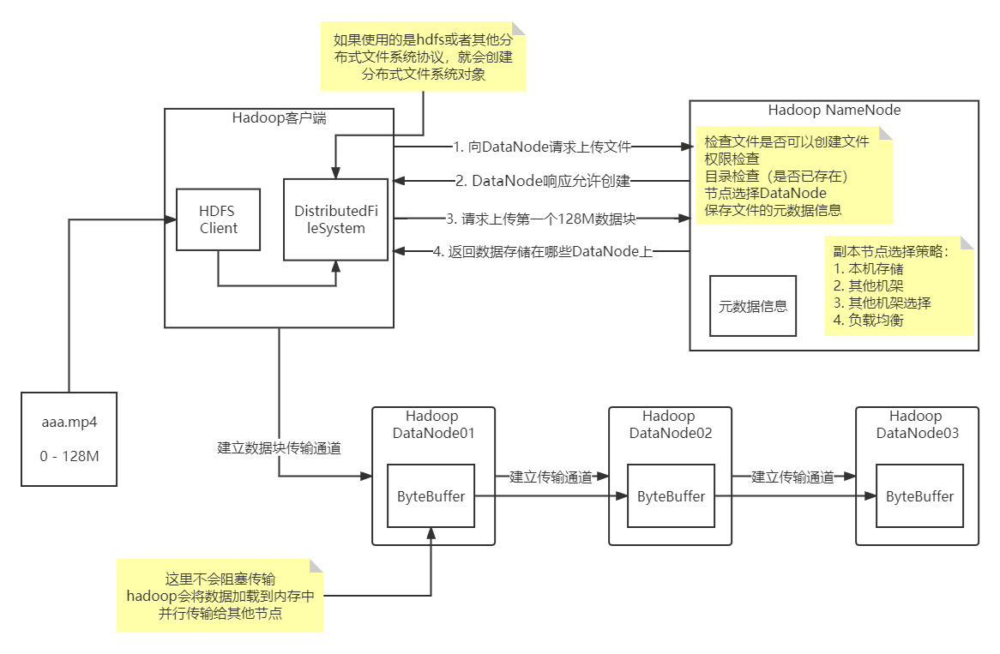
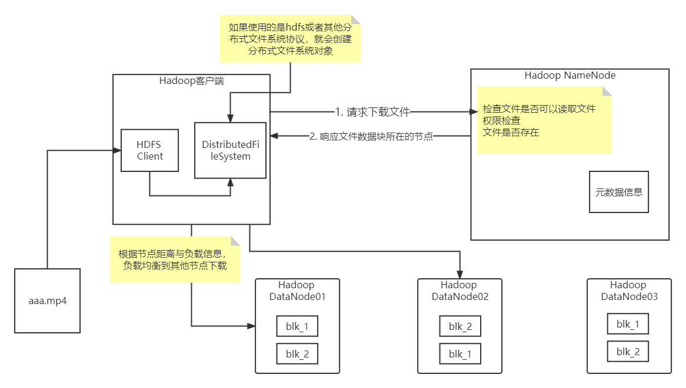

# Hadoop

> Hadoop是一个分布式系统基础架构。提供了HDFS分布式存储、MapReduce分布式计算、YARN分布式系统资源调度等功能。

## hadoop集群搭建

> 搭建这里坑很多，注意一下每个步骤都仔细一点就行。

首先记得配置静态IP和关闭防火墙，这个就不多解释了。

### 配置主机名

> 为每台服务器配置主机名，方便访问。
>
> 我的虚拟机网段是192.168.150.0，虚拟机网关是192.168.150.2。

这里演示三台服务器，三台主机的IP分别是`192.168.150.101`，`192.168.150.102`，`192.168.150.103`。

`vi /etc/hosts`更改hosts文件，加入以下内容：

注意hadoop不支持主机名包含空格、`.`、`_`

```
192.168.150.101 hadoop-1
192.168.150.102 hadoop-2
192.168.150.103 hadoop-3
```

配置完成后，使用`service network restart`重启网卡，没有该命令自己网上查询解决方案或者直接重启系统自动重启网卡。

使用`hostname`查看主机名是否配置成功。

### 配置ssh免密登录

> hadoop访问集群其他机器时需要使用

`ssh-keygen -t rsa`生成公钥私钥，默认会在`/root/.ssh`目录下生成`id_rsa`私钥与`id_rsa.pub`公钥。

公钥相当于锁，私钥就是钥匙。

`ssh-copy-id hostname`将公钥拷贝到其他需要登录服务器上即可。

在每台机器上配置免密登录

`ssh-keygen -t rsa`

`ssh-copy-id hadoop-1`

`ssh-copy-id hadoop-2`

`ssh-copy-id hadoop-3`

### 下载hadoop运行环境

hadoop官方下载链接https://hadoop.apache.org/releases.html

这里使用的是hadoop-3.3.3版本

hadoop是jvm平台软件，我们还需要安装jdk，这里使用[open-jdk-11](https://jdk.java.net/java-se-ri/11)

### 配置环境变量

向`/etc/profile`中追加：

```bash
export JAVA_HOME=/opt/jdk-11
export HADOOP_HOME=/opt/hadoop-3.3.3
export PATH=$PATH:$JAVA_HOME/bin:$HADOOP_HOME/bin:$HADOOP_HOME/sbin
```

`source /etc/profile`刷新环境变量

### Hadoop配置

> 配置很重要，hadoop启动报错多半是配置有问题。出现问题尝试查看hadoop日志获取相关信息。

* core-site.xml
    * hadoop核心配置
* hdfs-site.xml
    * hdfs配置
* mapred-site.xml
    * mapreduce配置
* yarn-site.xml
    * yarn资源调度配置
* wokers
    * hadoop集群主机名

#### core-site.xml

```xml
<?xml version="1.0" encoding="UTF-8"?>
<?xml-stylesheet type="text/xsl" href="configuration.xsl"?>
<!--
  Licensed under the Apache License, Version 2.0 (the "License");
  you may not use this file except in compliance with the License.
  You may obtain a copy of the License at

    http://www.apache.org/licenses/LICENSE-2.0

  Unless required by applicable law or agreed to in writing, software
  distributed under the License is distributed on an "AS IS" BASIS,
  WITHOUT WARRANTIES OR CONDITIONS OF ANY KIND, either express or implied.
  See the License for the specific language governing permissions and
  limitations under the License. See accompanying LICENSE file.
-->

<!-- Put site-specific property overrides in this file. -->

<configuration>
  <!-- 设置默认的文件系统，偶人hadoop支持file、HDFS、GFS以及aliyun、Amazone云文件系统 -->
  <property>
      <name>fs.defaultFS</name>
      <value>hdfs://hadoop-1:9000</value>
  </property>

  <!-- hadoop本地保存数据的路径 -->
  <property>
      <name>hadoop.tmp.dir</name>
      <value>/export/hadoop/data</value>
  </property>

  <!-- 设置HDFS web ui 用户身份 -->
  <property>
      <name>hadoop.http.staticuser.user</name>
      <value>root</value>
  </property>

  <!-- 整合hive用户代理设置 -->
  <property>
      <name>hadoop.proxyuser.root.hosts</name>
      <value>*</value>
  </property>

  <property>
      <name>hadoop.proxyuser.root.groups</name>
      <value>*</value>
  </property>

  <!-- 文件系统垃圾桶保存时间 -->
  <property>
      <name>fs.trash.interval</name>
      <value>1440</value>
  </property>
</configuration>
```

#### hdfs-site.xml

```xml
<?xml version="1.0" encoding="UTF-8"?>
<?xml-stylesheet type="text/xsl" href="configuration.xsl"?>
<!--
  Licensed under the Apache License, Version 2.0 (the "License");
  you may not use this file except in compliance with the License.
  You may obtain a copy of the License at

    http://www.apache.org/licenses/LICENSE-2.0

  Unless required by applicable law or agreed to in writing, software
  distributed under the License is distributed on an "AS IS" BASIS,
  WITHOUT WARRANTIES OR CONDITIONS OF ANY KIND, either express or implied.
  See the License for the specific language governing permissions and
  limitations under the License. See accompanying LICENSE file.
-->

<!-- Put site-specific property overrides in this file. -->

<configuration>
  <!-- 设置SNN辅助节点，运行机器信息 -->
  <property>
    <name>dfs.namenode.secondary.http-address</name>
    <value>hadoop-2:9868</value>
  </property>
</configuration>
```

#### mapred-site.xml

```xml
<?xml version="1.0"?>
<?xml-stylesheet type="text/xsl" href="configuration.xsl"?>
<!--
  Licensed under the Apache License, Version 2.0 (the "License");
  you may not use this file except in compliance with the License.
  You may obtain a copy of the License at

    http://www.apache.org/licenses/LICENSE-2.0

  Unless required by applicable law or agreed to in writing, software
  distributed under the License is distributed on an "AS IS" BASIS,
  WITHOUT WARRANTIES OR CONDITIONS OF ANY KIND, either express or implied.
  See the License for the specific language governing permissions and
  limitations under the License. See accompanying LICENSE file.
-->

<!-- Put site-specific property overrides in this file. -->

<configuration>
  <!-- 设置Mapreduce程序，运行模式，yarn集群模式、ocal本地模式 -->
  <property>
    <name>mapreduce.framework.name</name>
    <value>yarn</value>
  </property>

  <!-- MR程序历史服务地址 -->
  <property>
    <name>mapreduce.jobhistory.address</name>
    <value>hadoop-1:10020</value>
  </property>

  <!-- MR程序历史服务web地址 -->
  <property>
    <name>mapreduce.jobhistory.webapp.address</name>
    <value>hadoop-1:19888</value>
  </property>

  <property>
    <name>yarn.app.mapreduce.am.env</name>
    <value>HADOOP_MAPRED_HOME=${HADOOP_HOME}</value>
  </property>

  <property>
    <name>mapreduce.map.env</name>
    <value>HADOOP_MAPRED_HOME=${HADOOP_HOME}</value>
  </property>

  <property>
    <name>mapreduce.reduce.env</name>
    <value>HADOOP_MAPRED_HOME=${HADOOP_HOME}</value>
  </property>

</configuration>
```

#### yarn-site.xml

```xml
<?xml version="1.0"?>
<!--
  Licensed under the Apache License, Version 2.0 (the "License");
  you may not use this file except in compliance with the License.
  You may obtain a copy of the License at

    http://www.apache.org/licenses/LICENSE-2.0

  Unless required by applicable law or agreed to in writing, software
  distributed under the License is distributed on an "AS IS" BASIS,
  WITHOUT WARRANTIES OR CONDITIONS OF ANY KIND, either express or implied.
  See the License for the specific language governing permissions and
  limitations under the License. See accompanying LICENSE file.
-->
<configuration>

  <!-- Site specific YARN configuration properties -->
  <property>
    <name>yarn.resourcemanager.hostname</name>
    <value>hadoop-1</value>
  </property>

  <property>
    <name>yarn.nodemanager.aux-services</name>
    <value>mapreduce_shuffle</value>
  </property>

  <!-- 是否对容器实施物理内存限制 -->
  <property>
    <name>yarn.nodemanager.pmem-check-enabled</name>
    <value>false</value>
  </property>

  <!-- 是否对容器实施虚拟内存限制 -->
  <property>
    <name>yarn.nodemanager.vmem-check-enabled</name>
    <value>false</value>
  </property>

  <!-- 开启日志采集 -->
  <property>
    <name>yarn.log-aggregation-enable</name>
    <value>true</value>
  </property>

  <!-- 设置yarn历史服务器地址 -->
  <property>
    <name>yarn.log.server.url</name>
    <value>http://hadoop-1:19888/jobhistroy/logs</value>
  </property>

  <!-- 历史服务器保存时间，单位秒 -->
  <property>
    <name>yarn.log-aggregation.retain-seconds</name>
    <value>604800</value>
  </property>
</configuration>
```

#### wokers

```
hadoop-1
hadoop-2
hadoop-3
```

### 将环境分发到其他服务器

#### 拷贝hadoop与jdk

使用`scp`命令将hadoop与jdk拷贝到其他服务器。

-r 参数表示递归拷贝（拷贝文件夹）

`scp -r /opt/hadoop-3.3.3 root@hadoop-2:/opt/hadoop-3.3.3`

`scp -r /opt/jdk-11 root@hadoop-2:/opt/jdk-11`

`scp -r /opt/hadoop-3.3.3 root@hadoop-3:/opt/hadoop-3.3.3`

`scp -r /opt/jdk-11 root@hadoop-3:/opt/jdk-11`


可以使用`rsync`命令，rsync是做同步，相比scp在更改数据后拷贝性能更高，只会拷贝有变化的文件，同时还支持拷贝软连接等。

> 如果不需要复制文件元数据、软连接等，就不要用-a，拷贝文件夹用-r即可。
>
> 注意scp在拷贝文件夹时，永远都会在远程主机目录下拷贝同名目录
>
> 但是rsync在拷贝文件夹时，如果本地主机被拷贝的文件夹后面是以`/`结束，拷贝的将会是文件夹里的内容，如果需要拷贝整个文件夹目录的路径不要以`/`结束

- D参数选项
- -r 同步目录时要加上，类似cp时的-r选项
- -v 同步时显示一些信息，让我们知道同步的过程
- -l 保留软连接
    - 若是拷贝的原目录里面有一个软链接文件，那这个软链接文件指向到了另外一个目录下
    - 在加上-l，它会把软链接文件本身拷贝到目标目录里面去
- -L 加上该选项后，同步软链接时会把源文件给同步
- -p 保持文件的权限属性
- -o 保持文件的属主
- -g 保持文件的属组
- -D 保持设备文件信息

`rsync -av /opt/hadoop-3.3.3 root@hadoop-2:/opt/hadoop-3.3.3`

`rsync -av /opt/jdk-11 root@hadoop-2:/opt/jdk-11`

`rysnc -av /opt/hadoop-3.3.3 root@hadoop-3:/opt/hadoop-3.3.3`

`rsync -av /opt/jdk-11 root@hadoop-3:/opt/jdk-11`

#### 拷贝/etc/profile

`scp /etc/profile root@hadoop-2:/etc/profile`

`scp /etc/profile root@hadoop-3:/etc/profile`

拷贝完成后使用工具，将`source /etc/profile`分发到所有服务器，刷新环境变量。

#### 拷贝/etc/hosts

`scp /etc/hosts root@hadoop-2:/etc/hosts`

`scp /etc/hosts root@hadoop-3:/etc/hosts`

拷贝完成后使用工具，将`service network restart`分发到所有服务器，重启网卡。

### 初始化NameNode

在NameNode上（这个历史hadoop-1），执行`hadoop namenode -foramt`初始化。

**!!!一定要注意，初始化只能初始化一次**

**每次初始化会产生新的集群id，多次初始化会导致NameNode与DataNode的集群id不一致，需要删除所有机器的data和log目录，再次初始化才能正常运行**

### 启动hadoop

分别启动hdfs与yarn

脚本路径在hadoop目录下的sbin中

start-all.sh启动yarn与hdfs

### 启动MapReduce历史记录

`mapred --daemon start historyserver`

### 集群启动/停止方式总结

* hdfs与yarn全部启动
    * `start-all.sh` ``start-all.sh``
* hdfs与yarn单独启动
    * `start-dfs.sh` `stop-dfs.sh`
    * `start-yarn.sh` `stop-yarn.sh`
* 组件单独启动
    * `hdfs --daemon start/stop namenode/datanode/secondarynamenode`
    * `yarn --daemon start/stop resourcemanager/nodemanager`

## hadoop常用端口号

| Hadoop版本 | NameNode内部通信端口 | NameNode Web端口 | Yarn任务运行情况 | Mapreduce历史服务器端口 |
| ---------- | -------------------- | ---------------- | ---------------- | ----------------------- |
| hadoop3.x  | 8020/9000/9820       | 9870             | 8088             | 19888                   |
| hadoop2.x  | 8020/9000            | 50070            | 8088             | 19888                   |

## hadoop常用配置文件

| Hadoop版本 | 配置文件                                                     |
| ---------- | ------------------------------------------------------------ |
| hadoop3.x  | core-site.xml、hdfs-site.xml、yarn-site.xml、mapred-site.xml、wokers |
| hadoop2.x  | core-site.xml、hdfs-site.xml、yarn-site.xml、mapred-site.xml、slaves |

## Hadoop Shell

> hadoop控制台命令

### copyFromLocal

本地文件拷贝到hdfs

`hadoop fs -copyFromLocal 本地文件 hdfs路径`

### moveFromLocal

本地文件移动到hdfs

`hadoop fs -moveFromLocal 本地文件 hdfs路径`

### put

同copyFromLocal

`hadoop fs -copyFromLocal 本地文件 hdfs路径`

### appendToFile

将本地文件追加到hdfs的文件中

`hadoop fs -appendToFile 本地文件 hdfs路径`

### copyToLocal

将hdfs文件拷贝到本地，可拷贝文件夹

`hadoop fs -copyToLocal hdfs路径 本地文件`

### get

同copyToLocal

`hadoop fs -get hdfs路径 本地文件`

### setrep

设置hdfs的副本数量

`hadoop fs -setrep 副本数量 hdfs路径`

### 同linux用法的命令

1. ls
2. cat
3. chgrp、chmod、chown
4. mkdir
5. mv
6. cp
7. tail
8. rm
9. du

## JavaClient

客户端使用hdfs依赖与hadoop/bin目录下的脚本

在windwos上使用时，需要自己建立一个hadoop/bin目录将脚本拷贝到该目录下，并添加`HADOOP_HOME`与`HADOOP_HOME/bin`环境变量。

windows还需要下载一个winutils，在https://github.com/steveloughran/winutils下载发行版，解压到windows上的hadoop/bin目录下。

```xml
<?xml version="1.0" encoding="UTF-8"?>
<project xmlns="http://maven.apache.org/POM/4.0.0"
         xmlns:xsi="http://www.w3.org/2001/XMLSchema-instance"
         xsi:schemaLocation="http://maven.apache.org/POM/4.0.0 http://maven.apache.org/xsd/maven-4.0.0.xsd">
    <modelVersion>4.0.0</modelVersion>

    <groupId>my.lcw.hadoop.javaclient</groupId>
    <artifactId>hadoop_java_client</artifactId>
    <version>1.0-SNAPSHOT</version>

    <properties>
        <maven.compiler.source>11</maven.compiler.source>
        <maven.compiler.target>11</maven.compiler.target>
    </properties>

    <dependencies>
        <!-- https://mvnrepository.com/artifact/org.apache.hadoop/hadoop-client -->
        <dependency>
            <groupId>org.apache.hadoop</groupId>
            <artifactId>hadoop-client</artifactId>
            <version>3.3.3</version>
        </dependency>
        <!-- https://mvnrepository.com/artifact/org.junit.jupiter/junit-jupiter-api -->
        <dependency>
            <groupId>org.junit.jupiter</groupId>
            <artifactId>junit-jupiter-api</artifactId>
            <version>5.8.2</version>
            <scope>test</scope>
        </dependency>
        <!-- https://mvnrepository.com/artifact/org.slf4j/slf4j-reload4j -->
        <dependency>
            <groupId>org.slf4j</groupId>
            <artifactId>slf4j-reload4j</artifactId>
            <version>1.7.36</version>
            <scope>test</scope>
        </dependency>
    </dependencies>
</project>
```

如果需要看日志，在resource目录下配置log4j.properties

```properties
log4j.rootLogger=INFO, stdout
log4j.appender.stdout=org.apache.log4j.ConsoleAppender
log4j.appender.stdout.layout=org.apache.log4j.PatternLayout
log4j.appender.stdout.layout.ConversionPattern=%d %p [%c] - %m%n
log4j.appender.logfile=org.apache.log4j.FileAppender
log4j.appender.logfile.File=target/spring.log
log4j.appender.logfile.layout=org.apache.log4j.PatternLayout
log4j.appender.logfile.layout.ConversionPattern=%d %p [%c] - %m%n
```

```java
public class HdfsUtils {

    public static void hadoopFsContext(Consumer<FileSystem> hadoopFsRunner) {
        final URI uri = URI.create("hdfs://hadoop-1:9000");
        final Configuration config = new Configuration();
        /*
        可以再resource目录下配置hdfs-site.xml等配置文件，更改客户端默认配置，也可以在代码里配置config。
        优先级：代码配置 > 客户端resource目录下的配置 > hadoop服务器HADOOP_HOME/etc/hadoop下的配置 > hadoop默认配置
         */
        // config.set("dfs.replication", "1");
        String userName = "root";
        try (final FileSystem fs = FileSystem.get(uri, config, userName)) {
            hadoopFsRunner.accept(fs);
        } catch (IOException | InterruptedException e) {
            e.printStackTrace();
        }
    }
}
```

```java
public class HdfsClientTest {
    @Test
    public void testMkdir() {
        HdfsUtils.hadoopFsContext(fs -> {
            try {
                System.out.println(fs.mkdirs(new Path("/xiyou/huaguoshan")));
            } catch (IOException e) {
                e.printStackTrace();
            }
        });
    }

    @Test
    public void testPut() {
        HdfsUtils.hadoopFsContext(fs -> {
            try {
                // 第一个参数：是否删除源文件
                // 第二个参数：是否覆盖，值为false时，如果文件已存在会报错
                fs.copyFromLocalFile(false, true,
                        new Path(".\\src\\test\\java\\my\\lcw\\hadoop\\javaclient\\sunwukong.txt"),
                        new Path("/xiyou/huaguoshan"));
            } catch (IOException e) {
                e.printStackTrace();
            }
        });
    }

    @Test
    public void testGet() {
        HdfsUtils.hadoopFsContext(fs -> {
            try {
                // 第一个参数：是否删除源文件
                // 第二个参数：是否不使用crc文件校验，默认是false即开启校验
                fs.copyToLocalFile(false,
                        new Path("/xiyou/huaguoshan/"),
                        new Path("./huaguoshan"),
                        false);
            } catch (IOException e) {
                e.printStackTrace();
            }
        });
    }

    @Test
    public void testRm() {
        HdfsUtils.hadoopFsContext(fs -> {
            try {
                // 第一个参数：要删除的路径
                // 第二个参数：是否递归删除
                fs.delete(new Path("/itheima/install.sh"), false);
            } catch (IOException e) {
                e.printStackTrace();
            }
        });
    }

    @Test
    public void testMv() {
        HdfsUtils.hadoopFsContext(fs -> {
            try {
                // 更改文件名称同时支持移动文件
                fs.rename(new Path("/itheima/wordcount2"), new Path("/wordcount"));
            } catch (IOException e) {
                e.printStackTrace();
            }
        });
    }

    @Test
    public void testLs() {
        HdfsUtils.hadoopFsContext(fs -> {
            final RemoteIterator<LocatedFileStatus> it;
            try {
                it = fs.listFiles(new Path("/"), true);
                while (it.hasNext()) {
                    System.out.println("------------------------");
                    final LocatedFileStatus fileStatus = it.next();
                    System.out.println(fileStatus);
                    System.out.println(Arrays.toString(fileStatus.getBlockLocations()));
                }
            } catch (IOException e) {
                e.printStackTrace();
            }
        });
    }

    @Test
    public void testFileStatus() {
        HdfsUtils.hadoopFsContext(fs -> {
            try {
                final FileStatus[] fileStatuses = fs.listStatus(new Path("/"));
                System.out.println(Arrays.toString(fileStatuses));
            } catch (IOException e) {
                e.printStackTrace();
            }
        });
    }
}
```

## MapReduce

使用`hadoop jar $HADOOP_HOME/share/hadoop/mapreduce/hadoop-mapreduce-examples-3.3.3.jar pi 2 2`运行官方测试用例

常见的测试用例：

评估圆周率：`hadoop jar $HADOOP_HOME/share/hadoop/mapreduce/hadoop-mapreduce-examples-3.3.3.jar pi 2 2`

统计单词数量：`hadoop jar $HADOOP_HOME/share/hadoop/mapreduce/hadoop-mapreduce-examples-3.3.3.jar wordcount /word.txt /wordcount_output`注意后面的路径是hdfs的路径

### 使用Java编写自己的WordCount

#### windows环境安装

1. 在windows中新建一个`hadoop-3.3.3`，`$HADOOP_HOME/bin`下的文件拷贝到windows的hadoo文件的bin目录中，或者直接在下载一个hadoop，我只需要bin目录中提供的脚本。

2. 为windows上的`hadoop-3.3.3`创建环境变量，`HADOOP_HOME`，并将`%HADOOP_HOME%/bin`添加到PATH

3. windows还需要安装winutils，在github上搜索下载发行版，github地址：https://github.com/steveloughran/winutils

4. 将winutils也解压到windows的`$HADOOP_HOME/bin`
5. 并将winutils解压出来的`hadoop.dll`拷贝到系统盘的`Windows/System32`文件夹下

#### Java代码

> 编写Java代码注意导包，导入的类是hadoop相关包下。
>
> 导入org.apache.hadoop.mapreduce下的包，还一个org.apache.hadoop.mapred是老版本yarn还没有被分离出来时候的包。

```xml
<?xml version="1.0" encoding="UTF-8"?>
<project xmlns="http://maven.apache.org/POM/4.0.0"
         xmlns:xsi="http://www.w3.org/2001/XMLSchema-instance"
         xsi:schemaLocation="http://maven.apache.org/POM/4.0.0 http://maven.apache.org/xsd/maven-4.0.0.xsd">
    <modelVersion>4.0.0</modelVersion>

    <groupId>my.lcw.mapreduce.demos</groupId>
    <artifactId>mapreduce_demos</artifactId>
    <version>1.0-SNAPSHOT</version>

    <properties>
        <maven.compiler.source>11</maven.compiler.source>
        <maven.compiler.target>11</maven.compiler.target>
    </properties>

    <dependencies>
        <!-- https://mvnrepository.com/artifact/org.apache.hadoop/hadoop-client -->
        <dependency>
            <groupId>org.apache.hadoop</groupId>
            <artifactId>hadoop-client</artifactId>
            <version>3.3.3</version>
        </dependency>
        <!-- https://mvnrepository.com/artifact/org.junit.jupiter/junit-jupiter-api -->
        <dependency>
            <groupId>org.junit.jupiter</groupId>
            <artifactId>junit-jupiter-api</artifactId>
            <version>5.8.2</version>
            <scope>test</scope>
        </dependency>
        <!-- https://mvnrepository.com/artifact/org.slf4j/slf4j-reload4j -->
        <dependency>
            <groupId>org.slf4j</groupId>
            <artifactId>slf4j-reload4j</artifactId>
            <version>1.7.36</version>
            <scope>test</scope>
        </dependency>
    </dependencies>

    <build>
        <plugins>
            <plugin>
                <groupId>org.apache.maven.plugins</groupId>
                <artifactId>maven-assembly-plugin</artifactId>
                <version>3.3.0</version>
                <configuration>
                    <descriptorRefs>jar-with-dependencies</descriptorRefs>
                </configuration>
                <executions>
                    <execution>
                        <id>make-assembly</id>
                        <phase>package</phase>
                        <goals>
                            <goal>single</goal>
                        </goals>
                    </execution>
                </executions>
            </plugin>
        </plugins>
    </build>

</project>
```

```java
/**
 * @author liuchongwei
 * @email lcwliuchongwei@qq.com
 * @date 2022-06-04
 */
public class WordCountDriver {


    public static void main(String[] args) {

        if (args.length < 2) {
            System.err.println("mut has tow args: input output");
        }
        System.out.println(Arrays.toString(args));

        try {
            final Configuration config = new Configuration();
            final Job job = Job.getInstance(config);
            // 设置driver包路径
            job.setJarByClass(WordCountDriver.class);

            // 关联mapper和reducer
            job.setMapperClass(WordCountMapper.class);
            job.setReducerClass(WordCountReducer.class);

            // 设置map的kv类型
            job.setMapOutputKeyClass(Text.class);
            job.setMapOutputValueClass(IntWritable.class);

            // 设置最后返回的kv类型
            job.setOutputKeyClass(Text.class);
            job.setOutputValueClass(IntWritable.class);

            FileInputFormat.setInputPaths(job, new Path(args[0]));
            FileOutputFormat.setOutputPath(job, new Path(args[1]));

            final boolean result = job.waitForCompletion(true);
            System.exit(result ? 0 : 1);
        } catch (IOException | InterruptedException | ClassNotFoundException e) {
            e.printStackTrace();
        }

    }
}
```

```java
public class WordCountMapper extends Mapper<LongWritable, Text, Text, IntWritable> {

    /**
     * 输出的k-v对象，避免重复创建对象
     */
    private Text keyOut = new Text();
    private IntWritable valueOut = new IntWritable(1);

    @Override
    protected void map(LongWritable key, Text value,
                       Mapper<LongWritable, Text, Text, IntWritable>.Context context)
            throws IOException, InterruptedException {
        // hadoop会默认读取一行传输过来
        String content = value.toString();
        // 分割单词
        final String[] words = content.split(" ");
        for (String word : words) {
            keyOut.set(word);
            // 输出 单词-数量，数量默为1即出现一次
            context.write(keyOut, valueOut);
        }
    }
}

```

```java
public class WordCountReducer extends Reducer<Text, IntWritable, Text, IntWritable> {

    /**
     * 输出的k-v对象，避免重复创建对象
     */
    private IntWritable valueOut = new IntWritable();

    /**
     * reduce汇聚单词
     * @param key 单词
     * @param values 每行出现的数量
     * @param context 上下文对象
     */
    @Override
    protected void reduce(Text key, Iterable<IntWritable> values,
                          Reducer<Text, IntWritable, Text, IntWritable>.Context context)
            throws IOException, InterruptedException {
        // 单词出现的从数量
        int sum = 0;
        for (IntWritable value : values) {
            sum += value.get();
        }
        valueOut.set(sum);
        // 输出 单词-总数量
        context.write(key, valueOut);
    }
}
```

### Hadoop Streaming

> hadoop streaming非常适合纯文本的流式处理，并且通过stdin输入，stdout输出，可以跨语言进行MapReduce计算。
>
> HadoopStreaming能跨语言其实就是将k-v文本内容通过stdin输入，然后将stdout作为输出结果。

#### Python WordCount Demo

> 用Python编写的词频统计MapReduce程序
>
> 使用python脚本处理hadoop streaming时，注意hdfs会将脚本作为可执行文件，所以需要将脚本权限设置为可执行。
>
> 脚本不需要上传到hdfs，脚本开头必须指定#!/to/python_binary/path，且不支持#!/usr/bin/env python3的方式。
>
> 编写HadoopStreaming Python脚本时，注意报错信息可能是PipeMapRed.waitOutputThreads(): subprocess failed with code 1等，先判断代码是否有问题，再去网上查询错误码对应的错误，网上错误类型太多容易带偏。如果代码运行时map 100% reduce 100%正常显示，但是报错极大可能是代码有问题，优先检查代码。

MapReduce启动脚本

start.py

```python
import os

os.system("""hadoop jar $HADOOP_HOME/share/hadoop/tools/lib/hadoop-streaming-3.3.3.jar \
-mapper ./mapper.py \
-reducer ./reducer.py \
-file ./mapper.py \
-file ./reducer.py \
-input /itheima/word.txt \
-output /itheima/word_output""")
```

```python
import os
"""
-mapper与-reducer中可以直击使用命令的方式这样就不需要将脚本设置为可执行，也不需要在脚本上指定解释器，注意解释器路径需要决定路径，或者使用环境变量
"""
os.system("""hadoop jar $HADOOP_HOME/share/hadoop/tools/lib/hadoop-streaming-3.3.3.jar \
-mapper "$PYTHON_HOME/bin/python3 ./mapper.py" \
-reducer "$PYTHON_HOME/bin/python3 ./reducer.py" \
-file mapper.py \
-file reducer.py \
-input /itheima/word.txt \
-output /itheima/word_output""")
```

建议新版本使用下面的命令：

```python
os.system("""mapred streaming -files ./mapper.py,./reducer.py \
-mapper "$PYTHON_HOME/bin/python3 ./mapper.py" \
-reducer "$PYTHON_HOME/bin/python3 ./reducer.py" \
-input /itheima/word.txt \
-output /itheima/word_output""")
```

mapper.py

```python
#!/opt/python3/bin/python3
import sys


if __name__ == "__main__":
    # 遍历标准输入，默认一行的读取文件数据
    for line in sys.stdin:
        line = line.strip()
        words = line.split(" ")
        for word in words:
			# 使用stdout来输出内容，格式`k\tv`、`k v`都行
            print(f"{word} {1}")
```

reducer.py

```python
#!/opt/python3/bin/python3
import sys

if __name__ == "__main__":
    pre_key = None
    pre_val = 0
    for line in sys.stdin:
        line = line.strip()
        word, count = line.split(" ", 1)
        count = int(count)

        """
        hadoop streaming不会像java客户端一样自动groupby成key=[values]形式, 但是会自动排序如果有多个key的value会一连串发送过来
        我们只需要记录上次的key, 相同就累加即可
        """
        if pre_key == word:
            pre_val += 1
        else:
            # 有新的key直接输出即可，下次继续累加
            if pre_key:
                print(f"{pre_key} {pre_val}")
            pre_key = word
            pre_val = count
    # 最后一个key还没有输出
    if pre_key == word:
        print(f"{pre_key} {pre_val}")
```

## 面试题

### 为什么块大小能设置太小也不能设置太大

- 如果块太小，会导致文件被分成大量的块，极大增加寻址时间。
- 如果块太大会影响磁盘传输时间
- 块大小由存储介质的IO速度决定

一般中小型公司使用的都是128m，大公司才会使用256m


注意大量小文件不适合使用MapReduce存储

寻址时间为传输时间的1% 时，则为最佳状态。因此，传输时间 =10ms/0.01=1000ms=1s。

### HDFS写入流程



1. hadoop会先向NameNode请求上传文件
2. NameNode判断文件是否可以创建，这里会涉及权限检查、目录检查
3. NameNode响应可以创建文件，客户端请求上传一个数据块
4. NameNode选择节点，在有三个副本时，默认在当前机器上保存一份，然后其他机架保存一份，第三份副本保存第二份副本的另一个节点，这里还会考虑到负载均衡。
5. NameNode选择完节点后，返回节点信息。
6. 客户端获取节点信息，向一个节点（DataNode01）上传文件
7. DataNode01不是阻塞上传，上传的过程中会将文件加载到数据中并行传输给其他节点，最后返回一次响应给上一个节点直到客户端

#### 节点距离计算

节点距离计算：两个几点在公共祖先的距离。

* 互联网0
    * 机房1（集群1）
        * 机架1
            * 节点1
            * 节点2
        * 机架2
            * 节点1
            * 节点2
    * 机房2（集群2）
        * 机架1
            * 节点1
            * 节点2
            * 节点3
        * 机架2
            * 节点1
            * 节点2

节点0-1-1-1与节点0-1-1-2的距离为2， 两个人分别到同一个机架，然后再到对方。

节点0-1-1-1与节点0-1-2-2的距离为4， 两个人分别到机架，再到同一个机房，再到另一个机架，再到对方节点。

节点0-1-2-2与节点0-2-1-3

### HDFS读取流程



读取流程相比写入会简单一些

1. 想NameNode请求下载文件
2. NameNode判断是否可以读取，涉及权限判断、文件是否存在等
3. 允许读取，返回元数据（存储在哪些节点上）
4. 根据节点距离与负载均衡，选择最近且负载均衡的节点下载文件，文件分块存储在多个节点上就会与多个节点建立传输通道下载文件

### NameNode工作机制

首先思考NameNode将数据存储到哪里？

| 存储方式                            | 优点                                   | 缺点     |
| ----------------------------------- | -------------------------------------- | -------- |
| 内存                                | 高性能                                 | 可靠性差 |
| 硬盘                                | 可靠性高                               | 性能低   |
| 硬盘 + 内存（通过特殊日志方式实现） | 兼顾性能与可靠性（类似Redis的RDB+AOF） | 更加复杂 |

hdfs使用fsimage存储数据，使用edits存储追加操作，定时将edits文件中的操作，同步到fsimage中即可。

服务器启动时会将fsimage与edits加载到内存中，服务器关闭时就会将edits同步到fsimage中，辅助节点会定时将edits同步到fsimage中。

详细流程：

1. 服务器启动将fsimage与edits加载到内存中
2. 客户端进行crud
3. 记录操作日志到edits中，当前的操作的文件一般以`edits_inprogress_001`方式命名。（有点类似于redis的aof）
4. 辅助节点默认一个小时，将edits数据同步到fsimage。如果edits数据满了（默认记录达到100w次），也会触发同步操作。
5. 当辅助节点请求合并（该操作被称为CheckPoint），NameNode同意后，滚动正在写入的edits。`edits_inprogress_001`变成`edits_001`，并生成新的`edits_inprogress_002`，新的操作会记录在`edits_inprogress_002`中
6. 辅助节点会拉取NameNode中的fsimage与edits，将NameNode与edits加载到内存
7. 辅助节点合并edits与fsimage，生成新的`fsimage.checkpoint`
8. 辅助节点将新的`fsimage.checkpoint`拷贝到NameNode，并重命名为fsimage


Fsimage、Edits、seen_txid、VERSION等文件存储在数据目录中

#### Fsimage

> Fsimage是HDFS文件系统元数据信息的一个**永久性检查点**，包含HDFS文件系统的所有目录和文件inode的序列化信息

Fsimage在NameNode与SecondaryNameNode都有可能有

使用`hdfs oiv -p 文件类型 -i 镜像文件 -o 转换后输出文件名`将Fsimage转换成指定格式。

`hdfs oiv -p XML -i fsimage_0000000000000001390 -o /root/fsimage.xml`生成XML

#### Edits

> Edits存放HDFS文件系统的所有的更新操作信息（类似Redis的AOF），HDFS文件系统的写入操作都会先存储在Edits中

使用`hdfs oev -p 文件类型 -i 镜像文件 -o 转换后输出文件名`将edits转换成指定格式。

#### seen_txid

> 该文件保存的是一个数字，值得是最后一个（即inprogress的edits）edits_的数字

#### VERSION

> 记录了集群ID、创建时间、命名空间等

#### 配置CheckPoint相关配置

在hdfs-site.xml中配置

```xml
<!-- SecondaryNameNode CheckPoint（合并edits与fsimage）的时间，默认3600s即1h -->
<property>
    <name>dfs.namenode.checkpoint.period</name>
    <value>3600</value>
</property>

<!-- edits文件记录的最大操作次数，默认100w -->
<property>
    <name>dfs.namenode.checkpoint.txns</name>
    <value>1000000</value>
</property>

<!-- 检查edits文件记录操作次数的时间间隔，默认1min -->
<property>
	<name>dfs.namenode.checkpoint.check.period</name>
    <value>60s</value>
</property>
```

### DataNode工作机制

1. DataNode启动后就会向NameNode注册，同时向NameNode上传数据块的元数据信息。
2. DataNode默认莓果6h就会再想NameNode上报数据块的元数据信息
3. 为了防止DataNode出现故障，影响可用性，DataNode默认每3秒会向NameNode发送心跳
4. NameNode超过10min + 30s没有接受到DataNode的心跳后，会将DataNode剔除，认为该节点不可用，直到DataNode再次上线发送心跳

#### DataNode相关配置

生产环境下，根据机器配置，如果容易损上报信息间隔可以考虑配置低一些

```xml
<!-- DataNode向NameNode上报数据块元数据信息的时间间隔，默认6h -->
<property>
    <name>dfs.blockreport.intervalMsec</name>
    <value>21600000</value>
    <description>Determines block reporting interval in milliseconds.</description>
</property>

<!-- DataNode扫描自己节点信息列表，确保数据块没有问题，默认6h -->
<property>
    <name>dfs.datanode.directoryscan.interval</name>
    <value>21600s</value>
	<description>Interval in seconds for Datanode to scan data directories and reconcile the difference between blocks in memory and on
the disk.
Support multiple time unit suffix(case insensitive), as described
in dfs.heartbeat.interval.
    </description>
</property>
```

#### DataNode数据校验

DataNode在读取数据块时，会使用文件信息摘要算法，hadoop使用的是crc校验算法，对文件进行摘要后，客户端根据crc文件进行校验即可。

#### DataNode心跳配置

> TimeOut = 2 * dfs.namenode.heartbeat.recheck-interval + 10 * dfs.heartbeat.interval。 
>
> 而默认的dfs.namenode.heartbeat.recheck-interval 大小为5分钟，dfs.heartbeat.interval默认为3秒

```xml
<!-- NameNode心跳检测时间，默认5分钟检查一次，依照上面的公式判断节点是否存活 -->
<property>
    <name>dfs.namenode.heartbeat.recheck-interval</name>
    <value>300000</value>
</property>

<!-- DataNode向NameNode发送心跳的时间间隔，默认3秒 -->
<property>
    <name>dfs.heartbeat.interval</name>
    <value>3</value>
</property>
```

### 切片与MapTask

hadoop会为MapReduce程序分配多个MapTask运行分布在不同机器上运行。

Hadoop会为每个切片分配一个MapTask进行计算。

> 思考：1G 的数据，启动 8 个 MapTask，可以提高集群的并发处理能力。那么 1K 的数 据，也启动 8 个 MapTask，会提高集群性能吗？MapTask 并行任务是否越多越好呢？哪些因 素影响了 MapTask 并行度？


* 数据块：Block 是 HDFS 物理上把数据分成一块一块。数据块是 HDFS 存储数据单位。 

* 数据切片：数据切片只是在逻辑上对输入进行分片，并不会在磁盘上将其切分成片进行 存储。数据切片是 MapReduce 程序计算输入数据的单位，一个切片会对应启动一个 MapTask。


一个Job的MapTask数量由客户端提交Job时的切片数量决定：

* 为了防止跨机器访问数据，切片大小默认与块大小相同，
* hadoop为每一个切片创建一个MapTask运行
* hadoop会单独为每一个文件进行分片，而不是数据整体。


#### FileInputFormat分片源码

1. 开始遍历处理（规划切片）目录下的每一个文件
2. 遍历一个文件
    - 计算文件大小
    - 通过computeSplitSize函数计算分片大小，默认切片大小等于块大小
    - 开始切片，每次切片都会判断剩下的是否>切片大小的1.1倍，只有大于才会切片。
    - getSplits方法返回的List\<InputSplit\>中InputSplit只包含分片的元数据信息，真正的切片操作由yarn进行分片，并开启MapTask进行计算。

```java
/*
计算分片大小，minSize默认为1，maxSize默认为long的最大值，因此默认切片大小就是块大小
*/
protected long computeSplitSize(long blockSize, long minSize, long maxSize) {
    return Math.max(minSize, Math.min(maxSize, blockSize));
}
```

```java
/*
计算分片
默认使用computeSplitSize方法计算切片大小，默认切片大小与块大小一样。
*/
public List<InputSplit> getSplits(JobContext job) throws IOException {
    StopWatch sw = (new StopWatch()).start();
    // maxSize与minSize用于计算切片大小
    long minSize = Math.max(this.getFormatMinSplitSize(), getMinSplitSize(job));
    long maxSize = getMaxSplitSize(job);
    List<InputSplit> splits = new ArrayList();
    List<FileStatus> files = this.listStatus(job);
    boolean ignoreDirs = !getInputDirRecursive(job) && job.getConfiguration().getBoolean("mapreduce.input.fileinputformat.input.dir.nonrecursive.ignore.subdirs", false);
    Iterator var10 = files.iterator();

    while(true) {
        while(true) {
            while(true) {
                FileStatus file;
                do {
                    if (!var10.hasNext()) {
                        job.getConfiguration().setLong("mapreduce.input.fileinputformat.numinputfiles", (long)files.size());
                        sw.stop();
                        if (LOG.isDebugEnabled()) {
                            LOG.debug("Total # of splits generated by getSplits: " + splits.size() + ", TimeTaken: " + sw.now(TimeUnit.MILLISECONDS));
                        }

                        return splits;
                    }

                    file = (FileStatus)var10.next();
                  // 过滤文件夹，只遍历文件。
                } while(ignoreDirs && file.isDirectory());

                Path path = file.getPath();
                long length = file.getLen();
                if (length != 0L) {
                    BlockLocation[] blkLocations;
                    if (file instanceof LocatedFileStatus) {
                        blkLocations = ((LocatedFileStatus)file).getBlockLocations();
                    } else {
                        FileSystem fs = path.getFileSystem(job.getConfiguration());
                        blkLocations = fs.getFileBlockLocations(file, 0L, length);
                    }

                    if (this.isSplitable(job, path)) {
                        long blockSize = file.getBlockSize();
                        long splitSize = this.computeSplitSize(blockSize, minSize, maxSize);

                        long bytesRemaining;
                        int blkIndex;
                        // 这里是计算切片数量的关键代码
                        // 考虑到如果切片大小是128M，但是文件有128.1M，如果分成片计算就有些浪费性能了
                        // 因此这里计算的是当实际文件大小 < 切片大小的1.1倍时不会分片
                        for(bytesRemaining = length; (double)bytesRemaining / (double)splitSize > 1.1D; bytesRemaining -= splitSize) {
                            blkIndex = this.getBlockIndex(blkLocations, length - bytesRemaining);
                            splits.add(this.makeSplit(path, length - bytesRemaining, splitSize, blkLocations[blkIndex].getHosts(), blkLocations[blkIndex].getCachedHosts()));
                        }

                        if (bytesRemaining != 0L) {
                            blkIndex = this.getBlockIndex(blkLocations, length - bytesRemaining);
                            splits.add(this.makeSplit(path, length - bytesRemaining, bytesRemaining, blkLocations[blkIndex].getHosts(), blkLocations[blkIndex].getCachedHosts()));
                        }
                    } else {
                        if (LOG.isDebugEnabled() && length > Math.min(file.getBlockSize(), minSize)) {
                            LOG.debug("File is not splittable so no parallelization is possible: " + file.getPath());
                        }

                        splits.add(this.makeSplit(path, 0L, length, blkLocations[0].getHosts(), blkLocations[0].getCachedHosts()));
                    }
                } else {
                    splits.add(this.makeSplit(path, 0L, length, new String[0]));
                }
            }
        }
    }
}
```

