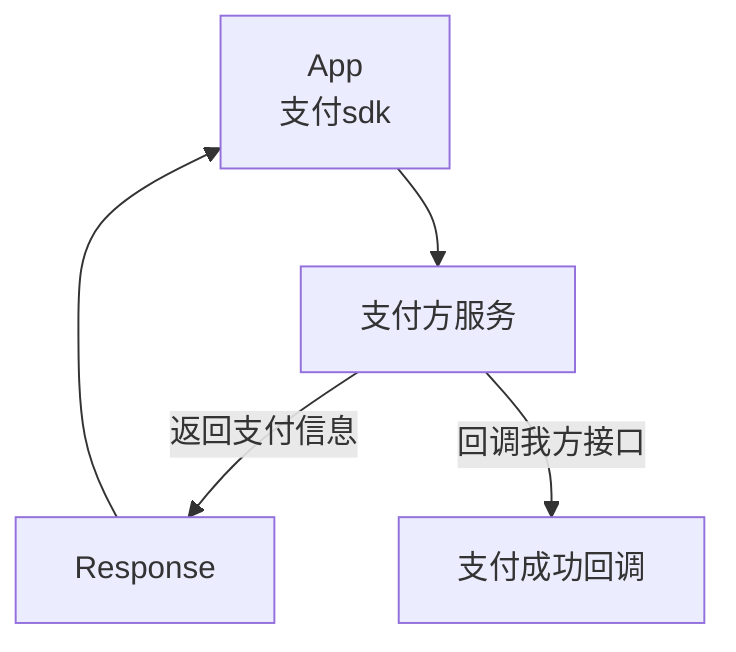
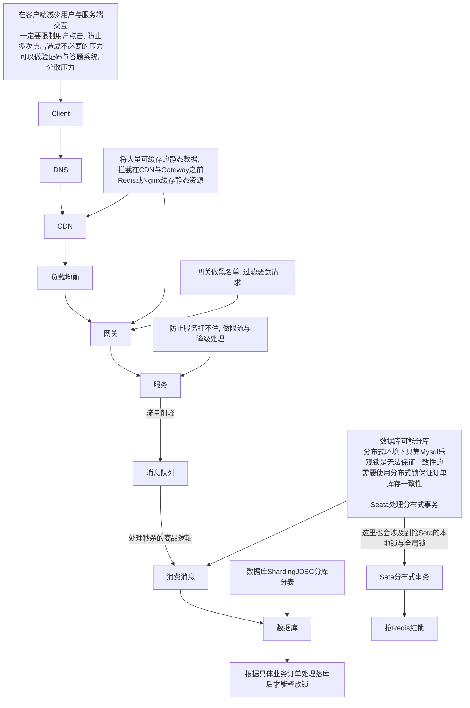

# 秒杀专题

## 什么是秒杀

短时间（瞬时），大量请求，买一个（数量少）商品。

解决：高并发（读，写）

## 秒杀系统目标

稳：高可用，系统稳定的提供服务。

准：超卖。数据一致性问题。

快：高性能。（优化的点）

# 架构原则

## 较少用户和服务端的交互

数据要少：请求参数和相应参数要少，降低对网络带宽的占用，降低对cpu的消耗，对IO数据库。（非必要的信息不要来回传）。

请求数要少：合并请求。

路径要短：每个节点可靠性：99%，5个节点：95%。

依赖要少：花里胡哨的减少。优先级高的展示，低的去掉。

不要单点：保证高可用：负载均衡，水平扩展，（设置k8s 动态扩展 replicates :3）

## 动静数据分离

数据区分：url，用户，浏览的时间，地域，cookie（缓存信息）-》静态数据。cdn，负载均衡。

url1（商品详情），url1：详情 （json）   。

放到离用户最近的地方。cdn。（浏览器缓存，服务器缓存guava cache, map，redis，文件缓存等）

根据不同的用户类型做缓存。

## 热点数据

本来 卖衣服秒杀，系统都为衣服服务，结果热点数据水果

### 识别热点

监控，追踪。用户访问，添加购物车，下单，统计分析（经验，BI）。

发现热点数据：分析日志，添加 队列，系统订阅。

## 订单状态

有三种订单状态 下单-支付中-已支付

有了支付中状态就好处理了，若果支付直接回滚返回支付失败信息。

如果第三方服务没有回调，可以通过sdk主动询问支付信息进行处理。

# 流程图

