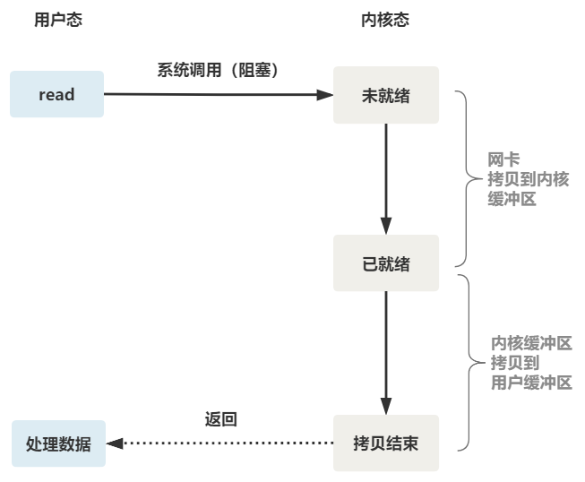

# 高性能IO之IO多路复用

> 一下系统调用全部以linux为例

## 阻塞IO

```java
public class BioServerDemo {
    public static void main(String[] args) throws IOException {
        final ServerSocket server = new ServerSocket();
        server.bind(new InetSocketAddress("0.0.0.0", 8000));
        while (true) {
            try (final Socket sock = server.accept();) {
                System.out.printf("%s connect to %s%n", sock.getRemoteSocketAddress(), server.getInetAddress());

                final InputStream in = sock.getInputStream();
                final OutputStream out = sock.getOutputStream();

                byte[] buf = new byte[4096];
                int len;
                while ((len = in.read(buf)) != -1) {
                    System.out.printf("%s", new String(buf, 0, len));
                    out.write(buf);
                    out.flush();
                }
            }
        }
    }
}
```

上面代码是典型的阻塞IO即BIO

这段代码会像下图这样运行

<video src="从IO多路复用到Netty.assets/bio.mp4"></video>


read函数底层会这样运行

<video src="从IO多路复用到Netty.assets/bio_kernel_user_gif.mp4"></video>

等待文件描述符就绪的过程是阻塞的, 并且会发生两次拷贝

1. 从网卡拷贝到内核缓冲区
2. 从内核缓冲区拷贝到用户缓冲区


阻塞IO下的read流程如下图所示



如果这个连接的客户端一直不发数据，那么服务端线程将会一直阻塞在read函数上不返回，也无法接受其他客户端连接。


为了解决read函数阻塞的问题，我们可以开启多个线程来处理这些阻塞调用。

```java
public class BioMultiThreadServerDemo {
    public static void main(String[] args) throws IOException {
        final ServerSocket server = new ServerSocket();
        server.bind(new InetSocketAddress("0.0.0.0", 8000));
        while (true) {
            // 开启一个线程处理新连接
            new Thread(() -> {
                try (final Socket sock = server.accept();) {
                    System.out.printf("%s connect to %s%n", sock.getRemoteSocketAddress(), server.getInetAddress());

                    final InputStream in = sock.getInputStream();
                    final OutputStream out = sock.getOutputStream();

                    byte[] buf = new byte[4096];
                    int len;
                    while ((len = in.read(buf)) != -1) {
                        System.out.printf("%s", new String(buf, 0, len));
                        out.write(buf);
                        out.flush();
                    }
                } catch (IOException e) {
                    e.printStackTrace();
                }
            }).start();
        }
    }
}
```

此时IO操作仍然是阻塞的，只不过通过多线程, 让主线程没有阻塞在read调用上，从而可以接受更多连接。

并且开启线程的代价是相对高昂的，面对C10K/C100K甚至更多连接时，开启大量线程会因大量的线程上下文切换，导致性能下降。

## 非阻塞IO

操作系统为我们系统了一个非阻塞的read函数

```java
// 非阻塞IO + fds 实现IO多路复用
public class NioNonblockingDemo {
    public static void main(String[] args) {
        try (final ServerSocketChannel serverChannel = ServerSocketChannel.open();) {
            serverChannel.bind(new InetSocketAddress("0.0.0.0", 8000));
            // 设置非阻塞
            serverChannel.configureBlocking(false);

            List<SocketChannel> connections = new ArrayList<>();
            final ByteBuffer buf = ByteBuffer.allocateDirect(4096);

            // 不使用select poll epoll等, 单线程同步非阻塞循环处理连接
            for (; ; ) {
                final SocketChannel sock = serverChannel.accept();
                if (sock != null) {
                    // 客户端非阻塞
                    // 客户端的非阻塞读取, 在数据到达网卡由网卡拷贝到内核缓冲区后, 有数据可以读取, 再将数据读取到用户缓冲区中
                    
                    // 非阻塞写入, 指的是如果内核缓冲区空间足够, 就全部写入, 如果不够, 有多少写多少, 返回写入的字节数
                    // 需要重复写入, 直到全部写入成功, 防止数据丢失

                    // sock.configureBlocking(false);
                    // 由于连接时非阻塞的, 我们可以将其加入connections中, 后续read有数据时, 统一处理
                    connections.add(sock);
                    System.out.printf("%s connecting%n", sock.getRemoteAddress());
                }
                final Iterator<SocketChannel> it = connections.iterator();

                // 遍历所有连接
                while (it.hasNext()) {
                    final SocketChannel conn = it.next();
                    try {
                        for (; ; ) {
                            // 由于是非阻塞, 此时read可能返回0, 表示没有数据可以读取
                            final int readN = conn.read(buf);
                            if (readN > 0) {
                                buf.flip();
                                final byte[] bytes = new byte[readN];
                                buf.get(bytes);
                                System.out.printf("%s receive msg: %s%n",
                                        conn.getRemoteAddress(), new String(bytes, StandardCharsets.US_ASCII));
                                buf.compact();
                            } else if (readN == 0) {
                                break;
                            } else {
                                // 返回-1表示客户端已经断开, 或出现错误
                                conn.close();
                                it.remove();
                                break;
                            }
                        }
                    } catch (IOException e) {
                        e.printStackTrace();
                        conn.close();
                        it.remove();
                    }
                }
            }
        } catch (IOException e) {
            e.printStackTrace();
        }
    }
}
```

有了非阻塞IO操作，就只需要用户线程循环调用read，直到有数据，再开始处理业务。

<video src="从IO多路复用到Netty.assets/nonblocking_read.mp4"></video>


上面的代码很像IO多路复用，事实上说他是一种IO多路复用也没错（我说的，至少思路类似）。

这里我们注意到一个细节。

非阻塞的 read，指的是在数据到达前，即数据还未到达网卡，或者到达网卡但还没有拷贝到内核缓冲区之前，这个阶段是非阻塞的。

当数据已到达内核缓冲区，此时调用 read 函数仍然是阻塞的，需要等待数据从内核缓冲区拷贝到用户缓冲区，才能返回。


线程在读取文件时不再阻塞, 线程循环, 观察是否读取完毕, 发现读取完毕后进行处理

- 优点
    - 同步非阻塞 NIO
    - 非阻塞IO, 可以竟可能的利用CPU资源, 不会因IO阻塞浪费CPU资源
- 缺点
    - 循环观察发生在用户空间，循环read，会导致频繁的内核态与用户态上下文切换，性能低。


整个非阻塞read流程如下


## IO多路复用

> C语言Demo可以自行查询（网上有很多案例），也可以参考我的[epoll demo程序](https://gitee.com/lcw_qaq/epoll_project)

尽管非阻塞IO看似还不错，但是我们仍需要记录所有fd, 并遍历他们不停的调用read。

此时性能仍然不高，每次遍历遇到read返回-1时仍然是一次浪费资源的系统调用，相当于我们每时每刻都在进行内核态和用户态的切换。

此时我们有需要求助操作系统，操作系统提供了一种内核级的IO多路复用方案，不需要我们自己去编写IO多路复用逻辑。

### select

select 是操作系统提供的系统调用函数，通过它，我们可以把一个文件描述符的数组发给操作系统， **让操作系统内核去遍历，确定哪个文件描述符可以读写， 然后告诉我们去处理**，减少了系统调用导致的上下文切换。

<video src="从IO多路复用到Netty.assets/select.mp4"></video>

select函数签名

```c
// nfds: 监控的文件描述符集里最大文件描述符加1
// readfds: 监控有读数据到达文件描述符集合，传入传出参数
// writefds: 监控写数据到达文件描述符集合，传入传出参数
// exceptfds: 监控异常发生达文件描述符集合, 传入传出参数
// timeout: 定时阻塞监控时间，3种情况
//  1.NULL，永远等下去
//  2.设置timeval，等待固定时间
//  3.设置timeval里时间均为0，检查描述字后立即返回，轮询
int select(
    int nfds,
    fd_set *readfds,
    fd_set *writefds,
    fd_set *exceptfds,
    struct timeval *timeout);
```


读取文件的操作由select来完成, 遍历所有fd, 看那个能够进行IO, 然后进行处理

- 优点
    - select多路复用。
    - 一个线程监视，多个scoket的IO请求。
    - 不需要在创建N个线程处理。
- 缺点
    - select最多只允许监控1024个fd。
    - 有IO事件发生了，但是不知道是哪个fd，所以每次都需要遍历所有fd，线性查找，效率低。


select整体流程


<span id="select_trait">select的特点</span>

1. select 调用需要传入 fd 数组，**需要拷贝一份到内核**，高并发场景下这样的拷贝消耗的资源是惊人的。（可优化为不复制）
2. select 在内核层仍然是通过遍历的方式检查文件描述符的就绪状态，是个同步过程**，只不过无系统调用切换上下文的开销**。（内核层可优化为异步事件通知）
3. **select 仅仅返回可读文件描述符的个数，具体哪个可读还是要用户自己遍历**。（可优化为只返回给用户就绪的文件描述符，无需用户做无效的遍历）
4. 传入的文件描述符的数量有1024的限制

事实上将上面可以优化的地方全部优化后，就得到了epoll。

### poll

poll 也是操作系统提供的系统调用函数。

```c
int poll(struct pollfd *fds, nfds_tnfds, int timeout);

struct pollfd {
  intfd; /*文件描述符*/
  shortevents; /*监控的事件*/
  shortrevents; /*监控事件中满足条件返回的事件*/
};
```

它和 select 的主要区别就是，**去掉了select 只能监听 1024 个文件描述符的限制，因为是它是基于链表来存储的。**


poll, 本质上和select是一样的, 区别就是poll使用的是链表存储fd, 没有监视数量限制。

- 优点
    - 同select。
    - 没有连接数即监视fd数量上的限制，底层使用链表存储。
    - select 和 poll 只触发了一次系统调用，由内核来完成遍历。
- 缺点
    - 同样select一样需要轮询fd，线性查找，效率低。
    - 水平触发，收到了fd消息后，若没有被处理（只要还有数据就会通知），下次还会报告该fd。

### epoll

epoll是IO多路复用的终极解决方案

还记得上面说的 select 的三个优化点么？[回顾select特点](#select_trait)

epoll 主要就是针对这三点进行了改进。

1. 内核中保存一份文件描述符集合，无需用户每次都重新传入，只需告诉内核修改的部分即可。
2. 内核不再通过轮询的方式找到就绪的文件描述符，而是通过异步 IO 事件唤醒。
3. 内核仅会将有 IO 事件的文件描述符返回给用户，用户也无需遍历整个文件描述符集合。


具体，操作系统提供了这三个函数。

第一步，创建一个 epoll 句柄

```c
int epoll_create(int size);
```

第二步，向内核添加、修改或删除要监控的文件描述符。

```c
int epoll_ctl(
    int epfd, int op, int fd, struct epoll_event *event);
```

第三步，类似发起了 select() 调用

```c
int epoll_wait(
    int epfd, struct epoll_event *events, int max events, int timeout);
```

使用起来，其内部原理就像如下一般丝滑。

<video src="从IO多路复用到Netty.assets/epoll.mp4"></video>


epoll, 使用事件处理模型, 不同于轮询, 只会通知发生了IO事件的fd, 实际上是事件驱动的, 相当于复杂度降到了O(1)

* 优点

    * epoll没有并发限制，连接数与内存大小以及系统配置有关。
    * 不需要轮询，只需要处理触发事件的fd，通过事件回调处理（底层是通过网卡中断来实现事件通知）。

    * 有两种触发模式

        - EPOLLLT
            - 默认模式，只要fd还有数据可以读，每次epoll_wait，都会返回fd的读取事件，提醒用户去操作。
            - 这种模式不容易出错，使用简单，只有fd上数据被读取完后才继续通知。

        - EPOLLET
            - 边缘触发模式，只会提示一次，直到再有数据流入之前都不会再提示。因此无论fd中是否还有数据可读，请一次把buffer读光。
                - 在EPOLLLT模式中，如果系统中有我们不关心的fd，每次epoll_wait都触发，大大降低检索fd的性能。而在EPOLLET模式下，当被监控的fd上发生IO事件时，再去通知程序读写，系统中不会充满我们不关心的就绪fd。

    * epoll只会关心活跃的连接和连接数无关，提升检索连接性能，性能远高于select、poll。

    * IO使用mmap
        - 跨过了用户态缓存，减少数据从用户态到内核态的拷贝次数，提高文件读写效率。
            - mmap做了哪些事情？（注意有说法mmap跨过了内核的page cache，实际上并没有，详细参考《深入理解Linux内核（第三版）》中文译本654页有明确说明。Direct IO是明确跨过了内核page cache的。）
                - 建立进程虚拟地址空间与文件内容空间之间的映射。
                - 而后第一次读写mmap映射的内存时，由于页表并未与物理内存映射，触发缺页异常。
                    - 缺页异常程序先根据要访问的偏移和大小从page cache中查询是否有该文件的缓存，如果找到就更新进程页表指向page cache那段物理内存。
                - 没找到就将文件从磁盘加载到内核page cache，然后再令进程的mmap虚拟地址的页表指向这段page cache中文件部分的物理内存。
                    - 所以内核会把文件读到page cache中。
                    - 也只有这样，其它进程打开的文件会和mmap打开的文件读写结果保持一致。

## 同步与异步IO的本质区别

我们常说的同步与异步IO有下面三种

1. 同步阻塞
    - 处理完IO事件后才会继续运行。
2. 同步非阻塞
    - 系统提供了非阻塞API，调用非阻塞的操作时，如果没有可以读写的区别，直接返回错误码，线程继续运行，直到有数据才阻塞处理。
    - 如果有IO事件，**由网卡与OS通过中断来通知**有IO事件，**读写由当前线程阻塞完成**。
3. 异步非阻塞
    - linux上的AIO仍然没有流行起来（2022/07 现在已经有了io_uring，优秀异步API），windows提供了IOCP是真正的异步IO。
    - 异步IO也是**由网卡与OS通过中断来通知**有IO事件到来，但是**读写操作是由内核完成**，我们直接读取Buffer中的数据即可。

## 总结

引用自（Copy  (〃'▽'〃)）：https://zhuanlan.zhihu.com/p/477835108

大白话总结一下。

一切的开始，都起源于这个 read 函数是操作系统提供的，而且是阻塞的，我们叫它 **阻塞 IO**。

为了破这个局，程序员在用户态通过多线程来防止主线程卡死。

后来操作系统发现这个需求比较大，于是在操作系统层面提供了非阻塞的 read 函数，这样程序员就可以在一个线程内完成多个文件描述符的读取，这就是 **非阻塞 IO**。

但多个文件描述符的读取就需要遍历，当高并发场景越来越多时，用户态遍历的文件描述符也越来越多，相当于在 while 循环里进行了越来越多的系统调用。

后来操作系统又发现这个场景需求量较大，于是又在操作系统层面提供了这样的遍历文件描述符的机制，这就是 **IO 多路复用**。

多路复用有三个函数，最开始是 select，然后又发明了 poll 解决了 select 文件描述符的限制，然后又发明了 epoll 解决 select 的三个不足。

------

所以，IO 模型的演进，其**实就是时代的变化，倒逼着操作系统将更多的功能加到自己的内核而已**。

如果你建立了这样的思维，很容易发现网上的一些错误。

比如好多文章说，多路复用之所以效率高，是因为用一个线程就可以监控多个文件描述符。

这显然是知其然而不知其所以然，多路复用产生的效果，**完全可以由用户态去遍历文件描述符并调用其非阻塞的 read 函数实现。**而多路复用快的原因在于，操作系统提供了这样的系统调用，**使得原来的 while 循环里多次系统调用，变成了一次系统调用 + 内核层遍历这些文件描述符。**

## 补充

C语言epoll接口，可以参考我的[epoll demo程序](https://gitee.com/lcw_qaq/epoll_project)，也可以自行搜索（网上有很多）。

有关ZeroCopy的资料可以参考：

https://zhuanlan.zhihu.com/p/380875334

https://zhuanlan.zhihu.com/p/379897292

https://zhuanlan.zhihu.com/p/381788230

https://strikefreedom.top/archives/linux-io-and-zero-copy

## 参考资料

https://zhuanlan.zhihu.com/p/477835108