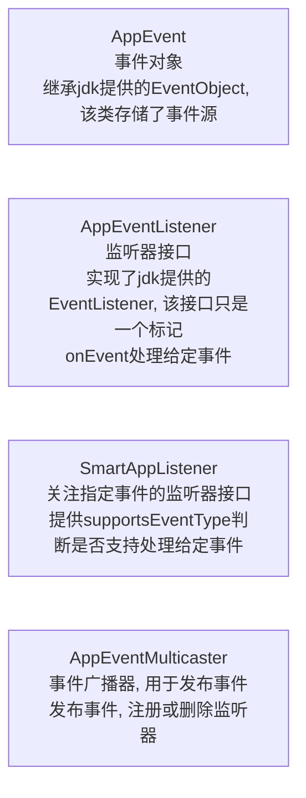

# 观察者模式与事件驱动模型

## 观察者模式

说起事件驱动, 不得不提及观察者模式了

简单的观察模式实现

```java
class Demo {
    public static void main(String[] args) {
        final Server server = new Server();
        server.addObserver(new StartupObserver());
        server.run();
    }
    interface Observable {
        void addObserver(Observer observer);
        void removeObserver(Observer observer);
        void notifyObservers(Observable observable, Object... args);
    }

    interface Observer {
        void update(Observable observable, Object... args);
    }

    static class StartupObserver implements Observer {
        @Override
        public void update(Observable observable, Object... args) {
            System.out.println("服务器启动, 启动时间戳: " + args[0]);
        }
    }

    static class Server implements Observable {
        private Set<Observer> observers = new LinkedHashSet<>();

        public void run() {
            notifyObservers(this, System.currentTimeMillis());
            System.out.println("server run");
        }

        @Override
        public void addObserver(Observer observer) {
            observers.add(observer);
        }

        @Override
        public void removeObserver(Observer observer) {
            observers.remove(observer);
        }

        @Override
        public void notifyObservers(Observable observable, Object... args) {
            observers.forEach(observer -> observer.update(observable, args));
        }
    }
}
```

## 事件驱动模型

事件驱动模型与观察者模式最大的区别, 就在于事件驱动模型以事件为中心触发监听器执行, 且监听可以关注指定事件

这里借鉴了spring的事件驱动模型

简单事件驱动模型实现



### 基本接口

```java
package com.lcw.eventtest;

import java.util.EventObject;

/**
 * @author liuchongwei
 * @email lcwliuchongwei@qq.com
 * @date 2022-02-27
 * 应用程序事件抽象类
 */
public abstract class AppEvent extends EventObject {

    private static final long serialVersionUID = -8490882963906279681L;
    private final long timestamp;

    public AppEvent(Object source) {
        super(source);
        this.timestamp = System.currentTimeMillis();
    }

    public long getTimestamp() {
        return timestamp;
    }
}
```

```java
package com.lcw.eventtest;

import java.util.EventListener;

/**
 * @author liuchongwei
 * @email lcwliuchongwei@qq.com
 * @date 2022-02-27
 * 应用程序事件监听器接口
 */
public interface AppEventListener<E extends AppEvent> extends EventListener {
    /**
     * 处理某个事件
     * @param event 事件对象
     */
    void onEvent(E event);
}
```

```java
package com.lcw.eventtest;

/**
 * @author liuchongwei
 * @email lcwliuchongwei@qq.com
 * @date 2022-02-27
 * 只对关注指定事件的监听器
 */
public interface SmartAppListener extends AppEventListener<AppEvent> {
    boolean supportsEventType(Class<? extends AppEvent> eventType);
}
```

```java
package com.lcw.eventtest;

/**
 * @author liuchongwei
 * @email lcwliuchongwei@qq.com
 * @date 2022-02-27
 * 应用程序事件广播器
 * 可以广播指定事件到关注该事件的监听器
 */
public interface AppEventMulticaster {
    void registerAppEventListener(AppEventListener<?> listener);

    void removeAppEventListener(AppEventListener<?> listener);

    void multicasterEvent(AppEvent event);
}
```

### 具体实现

#### 自定义事件

```java
package com.lcw.impl.event;

import com.lcw.eventtest.AppEvent;

/**
 * @author liuchongwei
 * @email lcwliuchongwei@qq.com
 * @date 2022-02-27
 * 应用程序启动事件
 */
@SuppressWarnings("serial")
public class StartupAppEvent extends AppEvent {
    public StartupAppEvent(Object source) {
        super(source);
    }
}
```

```java
package com.lcw.impl.event;

import com.lcw.eventtest.AppEvent;

/**
 * @author liuchongwei
 * @email lcwliuchongwei@qq.com
 * @date 2022-02-27
 * 单击事件
 */
@SuppressWarnings("serial")
public class ClickAppEvent extends AppEvent {
    public ClickAppEvent(Object source) {
        super(source);
    }
}
```

```java
package com.lcw.impl.event;

import com.lcw.eventtest.AppEvent;

/**
 * @author liuchongwei
 * @email lcwliuchongwei@qq.com
 * @date 2022-02-27
 */
@SuppressWarnings("serial")
public class DoubleClickAppEvent extends AppEvent {
    public DoubleClickAppEvent(Object source) {
        super(source);
    }
}
```

#### 自定义监听器

```java
package com.lcw.impl.listener;

import com.lcw.eventtest.AppEvent;
import com.lcw.eventtest.SmartAppListener;
import com.lcw.impl.event.StartupAppEvent;

/**
 * @author liuchongwei
 * @email lcwliuchongwei@qq.com
 * @date 2022-02-27
 * 应用程序启动事件监听器
 */
public class AppStartupEventListener implements SmartAppListener {
    @Override
    public void onEvent(AppEvent event) {
        System.out.println("应用程序启动, 当前时间戳: " + event.getTimestamp());
    }

    @Override
    public boolean supportsEventType(Class<? extends AppEvent> eventType) {
        return eventType == StartupAppEvent.class;
    }
}
```

```java
package com.lcw.impl.listener;

import com.lcw.eventtest.AppEvent;
import com.lcw.eventtest.SmartAppListener;
import com.lcw.impl.event.ClickAppEvent;
import com.lcw.impl.event.DoubleClickAppEvent;

/**
 * @author liuchongwei
 * @email lcwliuchongwei@qq.com
 * @date 2022-02-27
 * 处理所有点击事件
 */
public class ClickedEventAppListener implements SmartAppListener {
    @Override
    public void onEvent(AppEvent event) {
        if (event instanceof ClickAppEvent) {
            System.out.println("触发单击事件, 现在时间戳: " + event.getTimestamp());
        } else if (event instanceof DoubleClickAppEvent) {
            System.out.println("触发双击事件, 现在时间戳: " + event.getTimestamp());
        }
    }

    @Override
    public boolean supportsEventType(Class<? extends AppEvent> eventType) {
        return eventType == ClickAppEvent.class || eventType == DoubleClickAppEvent.class;
    }
}
```

#### 自定义事件广播器

```java
package com.lcw.impl.multicaster;

import com.lcw.eventtest.AppEvent;
import com.lcw.eventtest.AppEventListener;
import com.lcw.eventtest.AppEventMulticaster;
import com.lcw.eventtest.SmartAppListener;

import java.util.LinkedHashSet;
import java.util.Set;
import java.util.stream.Collectors;

/**
 * @author liuchongwei
 * @email lcwliuchongwei@qq.com
 * @date 2022-02-27
 * 事件广播器的简单实现
 */
public class SimpleAppMulticaster implements AppEventMulticaster {

    Set<AppEventListener<?>> appEventListeners = new LinkedHashSet<>();

    @Override
    public void registerAppEventListener(AppEventListener<?> listener) {
        appEventListeners.add(listener);
    }

    @Override
    public void removeAppEventListener(AppEventListener<?> listener) {
        appEventListeners.remove(listener);
    }

    @Override
    public void multicasterEvent(AppEvent event) {
        getAppEventListeners(event.getClass()).forEach(appEventListener -> {
            invokeAppEventListener(appEventListener, event);
        });
    }

    @SuppressWarnings({"unchecked", "rawtypes"})
    public void invokeAppEventListener(AppEventListener appEventListener, AppEvent event) {
        appEventListener.onEvent(event);
    }

    /**
     * 根据指定事件获取, 对应的监听器
     */
    private Set<AppEventListener<?>> getAppEventListeners(Class<? extends AppEvent> eventType) {
        return appEventListeners.stream()
                .filter(appEventListener -> {
                    if (appEventListener instanceof SmartAppListener) {
                        final SmartAppListener smartAppListener = (SmartAppListener) appEventListener;
                        return smartAppListener.supportsEventType(eventType);
                    } else {
                        return true;
                    }
                }).collect(Collectors.toSet());
    }
}
```
